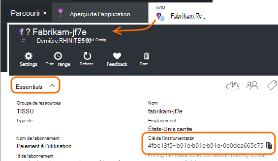

<properties 
    pageTitle="Surveiller un site SharePoint avec les perspectives de l’Application" 
    description="Démarrer le contrôle d’une nouvelle application avec une nouvelle clé d’instrumentation" 
    services="application-insights" 
    documentationCenter=""
    authors="alancameronwills" 
    manager="douge"/>

<tags 
    ms.service="application-insights" 
    ms.workload="tbd" 
    ms.tgt_pltfrm="ibiza" 
    ms.devlang="na" 
    ms.topic="article" 
    ms.date="03/24/2016" 
    ms.author="awills"/>

# <a name="monitor-a-sharepoint-site-with-application-insights"></a>Surveiller un site SharePoint avec les perspectives de l’Application


Idées d’Application Visual Studio surveille la disponibilité, de performances et de l’utilisation de vos applications. Ici, vous allez apprendre comment configurer pour un site SharePoint.


## <a name="create-an-application-insights-resource"></a>Créer une ressource d’informations d’Application


Dans le [portail Azure](https://portal.azure.com), créez une nouvelle ressource de perspectives de l’Application. Choisissez le type d’application ASP.NET.


La lame qui s’ouvre est l’endroit où vous pouvez afficher les données d’utilisation et de performances sur votre application. Pour revenir à cette prochaine que connexion sur Azure, vous devriez trouver une mosaïque pour lui sur l’écran de démarrage. Ou bien cliquez sur Parcourir pour le rechercher.
    


## <a name="add-our-script-to-your-web-pages"></a>Ajouter notre script à vos pages web

Dans démarrage rapide, obtenez le script pour les pages web :


Insérer le script juste avant la &lt;/tête&gt; balise de chaque page que vous souhaitez effectuer le suivi. Si votre site possède une page maître, vous pouvez y placez le script. Par exemple, dans un projet ASP.NET MVC, vous devez placer dans View\Shared\_Layout.cshtml

Le script contient la clé d’instrumentation qui dirige la télémétrie à votre ressource de perspectives de l’Application.

### <a name="add-the-code-to-your-site-pages"></a>Ajoutez le code pour les pages de votre site

#### <a name="on-the-master-page"></a>Sur la page maître

Si vous pouvez modifier la page maître du site, qui fournira la surveillance pour toutes les pages du site.

Consultez la page maître et modifier à l’aide de SharePoint Designer ou un autre éditeur.


Ajoutez le code juste avant que la </head> balises. 


#### <a name="or-on-individual-pages"></a>Ou sur des pages individuelles

Pour surveiller un ensemble limité de pages, ajoutez le script séparément à chaque page. 

Insérer un composant WebPart et incorporer l’extrait de code qu’il contient.


## <a name="view-data-about-your-app"></a>Afficher les données sur votre application

Permet de redéployer votre application.

Revenir à lame de votre application dans [Azure portal](https://portal.azure.com).

Les premiers événements apparaîtront dans la recherche. 


Si vous attendez plus de données, cliquez sur Actualiser après quelques secondes.

À partir de la blade de vue d’ensemble, cliquez sur **analytique de l’utilisation** voir aux graphiques des utilisateurs, des sessions et des affichages de page :


Cliquez sur n’importe quel graphique pour voir plus de détails - par exemple les affichages de Page :


Ou des utilisateurs :


## <a name="capturing-user-id"></a>Capture des Id d’utilisateur


L’extrait de code de page web standard ne capture pas l’id d’utilisateur à partir de SharePoint, mais vous pouvez le faire avec une légère modification.


1. Copiez la clé d’instrumentation de votre application à partir des liste déroulante dans les perspectives de l’Application d’Essentials. 


    

2. Remplacez 'XXXX' par la clé de l’instrumentation dans l’extrait de code ci-dessous. 
3. Incorporer le script dans votre application SharePoint au lieu de l’extrait de code que vous obtenez à partir du portail.


```


<SharePoint:ScriptLink ID="ScriptLink1" name="SP.js" runat="server" localizable="false" loadafterui="true" /> 
<SharePoint:ScriptLink ID="ScriptLink2" name="SP.UserProfiles.js" runat="server" localizable="false" loadafterui="true" /> 
  
<script type="text/javascript"> 
var personProperties; 
  
// Ensure that the SP.UserProfiles.js file is loaded before the custom code runs. 
SP.SOD.executeOrDelayUntilScriptLoaded(getUserProperties, 'SP.UserProfiles.js'); 
  
function getUserProperties() { 
    // Get the current client context and PeopleManager instance. 
    var clientContext = new SP.ClientContext.get_current(); 
    var peopleManager = new SP.UserProfiles.PeopleManager(clientContext); 
     
    // Get user properties for the target user. 
    // To get the PersonProperties object for the current user, use the 
    // getMyProperties method. 
    
    personProperties = peopleManager.getMyProperties(); 
  
    // Load the PersonProperties object and send the request. 
    clientContext.load(personProperties); 
    clientContext.executeQueryAsync(onRequestSuccess, onRequestFail); 
} 
     
// This function runs if the executeQueryAsync call succeeds. 
function onRequestSuccess() { 
var appInsights=window.appInsights||function(config){
function s(config){t[config]=function(){var i=arguments;t.queue.push(function(){t[config].apply(t,i)})}}var t={config:config},r=document,f=window,e="script",o=r.createElement(e),i,u;for(o.src=config.url||"//az416426.vo.msecnd.net/scripts/a/ai.0.js",r.getElementsByTagName(e)[0].parentNode.appendChild(o),t.cookie=r.cookie,t.queue=[],i=["Event","Exception","Metric","PageView","Trace"];i.length;)s("track"+i.pop());return config.disableExceptionTracking||(i="onerror",s("_"+i),u=f[i],f[i]=function(config,r,f,e,o){var s=u&&u(config,r,f,e,o);return s!==!0&&t["_"+i](config,r,f,e,o),s}),t
    }({
        instrumentationKey:"XXXX"
    });
    window.appInsights=appInsights;
    appInsights.trackPageView(document.title,window.location.href, {User: personProperties.get_displayName()});
} 
  
// This function runs if the executeQueryAsync call fails. 
function onRequestFail(sender, args) { 
} 
</script> 


```


## <a name="next-steps"></a>Étapes suivantes

* [Les tests web](app-insights-monitor-web-app-availability.md) pour surveiller la disponibilité de votre site.

* [Idées d’application](app-insights-overview.md) pour les autres types d’application.


<!--Link references-->


 