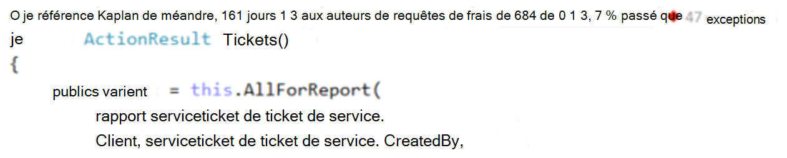
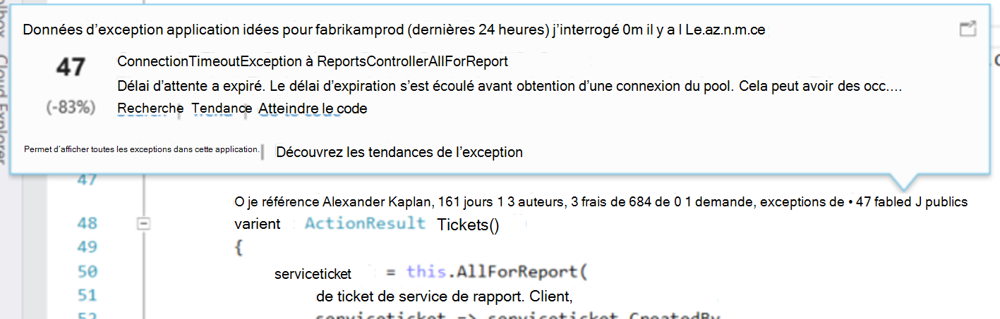
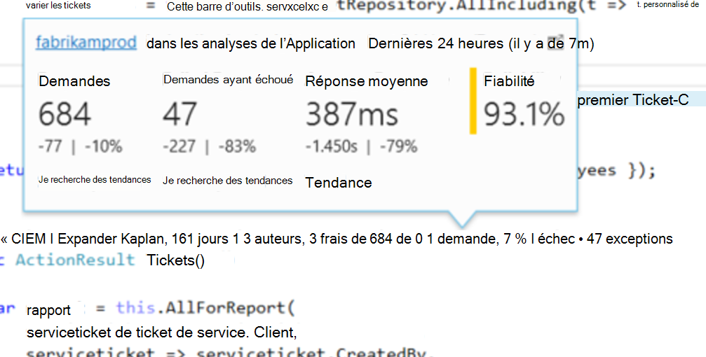
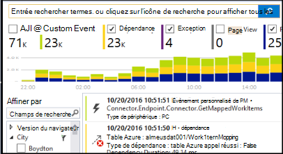

<properties 
    pageTitle="TELEMETRIE de perspectives d’application dans Visual Studio CodeLens | Microsoft Azure" 
    description="Accéder rapidement à votre télémétrie de demande et de l’exception de perspectives d’Application avec CodeLens dans Visual Studio." 
    services="application-insights" 
    documentationCenter=".net"
    authors="numberbycolors" 
    manager="douge"/>

<tags 
    ms.service="application-insights" 
    ms.workload="tbd" 
    ms.tgt_pltfrm="ibiza" 
    ms.devlang="na" 
    ms.topic="get-started-article" 
    ms.date="08/30/2016" 
    ms.author="daviste"/>
    
# TELEMETRIE de perspectives d’application dans Visual Studio CodeLens

Les méthodes dans le code de votre application web peuvent être annotées avec télémétrie sur les exceptions d’exécution et temps de réponse de la demande. Si vous installez [Visual Studio perspectives d’Application](app-insights-overview.md) dans votre application, la télémétrie s’affiche dans Visual Studio [CodeLens](https://msdn.microsoft.com/library/dn269218.aspx) - les notes en haut de chaque fonction dans laquelle vous avez l’habitude de voir des informations utiles telles que le nombre de chiffres de la fonction sont référencées ou de la dernière personne qui l’a modifiée.

> [AZURE.NOTE] Idées d’application de CodeLens est disponible dans Visual Studio 3 de mise à jour de 2015 et ultérieures ou avec la dernière version de [l’extension des outils de développement Analytique](https://visualstudiogallery.msdn.microsoft.com/82367b81-3f97-4de1-bbf1-eaf52ddc635a). CodeLens est disponible dans les éditions professionnelle et entreprise de Visual Studio.

## Où trouver les données de l’aperçu de l’Application

Recherchez la télémétrie d’idées d’Application dans les indicateurs de CodeLens des méthodes de requête publiques de votre application web. Indicateurs de CodeLens sont affichées au-dessus de méthode et d’autres déclarations dans le code C# et Visual Basic. Si les données de l’Application aperçu ne seront disponibles pour une méthode, vous verrez des indicateurs pour les demandes et les exceptions telles que « 100 demandes, Échec de 1 % » ou « 10 exceptions ». Cliquez sur un indicateur CodeLens pour plus de détails. 

> [AZURE.TIP] Demandent d’idées d’application et les indicateurs d’exception peuvent prendre quelques secondes supplémentaires pour charger après apparaissent d’autres indicateurs de CodeLens.

## Exceptions dans CodeLens

L’indicateur CodeLens exception indique le nombre d’exceptions qui se sont produites dans les dernières 24 heures, à partir du 15 qui se produisent fréquemment des exceptions dans votre application pendant cette période, lors du traitement de la demande pris en charge par la méthode.

Pour plus d’informations, cliquez sur l’indicateur de CodeLens d’exceptions :

* Le pourcentage de modification dans le nombre d’exceptions des dernières 24 heures par rapport aux 24 heures précédentes
* Choisissez **Atteindre le code** pour accéder au code source pour la fonction de levée de l’exception
* Cliquez sur **Rechercher** pour rechercher toutes les instances de cette exception qui sont sont produites dans les dernières 24 heures
* Choisissez de **tendance** pour afficher une visualisation de tendance pour les occurrences de cette exception dans les dernières 24 heures
* Choisissez **d’Afficher toutes les exceptions dans cette application** pour interroger toutes les exceptions qui sont sont produites dans les dernières 24 heures
* Choisissez les **tendances d’exception Explorer** pour afficher une visualisation des tendances pour toutes les exceptions qui se sont produites dans les dernières 24 heures. 

> [AZURE.TIP] Si vous voyez « 0 exceptions » dans CodeLens, mais vous savez il doit y avoir des exceptions, vérifiez que la ressource de perspectives de l’Application adéquate est sélectionnée dans CodeLens. Pour sélectionner une autre ressource, avec le bouton droit sur votre projet dans l’Explorateur de solutions et choisissez **perspectives d’Application > choisir une Source de télémétrie**. CodeLens ne s’affiche que pour les 15 la plupart des exceptions fréquentes dans votre application dans les dernières 24 heures, par conséquent, si une exception se produit plus fréquemment le 16 ou moins, vous verrez « exceptions 0 ». Les exceptions à partir de vues d’ASP.NET peut ne pas apparaissent sur les méthodes de contrôleur qui a généré ces vues.

> [AZURE.TIP] Si vous voyez « ? exceptions » dans CodeLens, vous devez associer votre compte Azure avec Visual Studio ou vos informations d’identification de compte Azure a peut-être expiré. Dans les deux cas, cliquez sur « ? exceptions » et cliquez sur **Ajouter un compte...** pour entrer vos informations d’identification.

## Demandes de CodeLens

La demande CodeLens indicateur affiche le nombre de requêtes HTTP qui été pris en charge par une méthode dans les dernières 24 heures, ainsi que le pourcentage de ces demandes qui ont échoué.

Pour plus de détails, cliquez sur les demandes CodeLens indicateur :

* Les modifications absolue et le pourcentage en nombre de demandes, demandes ayant échoué et les temps de réponse moyens sur les dernières 24 heures par rapport aux 24 heures précédentes
* La fiabilité de la méthode, calculée comme un pourcentage de demandes sans erreur dans les dernières 24 heures
* Choisissez une **recherche** pour des demandes ou des demandes qui ont échoué pour interroger toutes les requêtes (échecs) qui s’est produite dans les dernières 24 heures
* Choisissez la **tendance** pour afficher une visualisation des tendances pour les demandes, les demandes qui ont échoué ou temps de réponse moyen dans les dernières 24 heures.
* Choisissez le nom de la ressource de l’Application Aperçu dans le coin supérieur gauche de la vue de détails CodeLens pour modifier la ressource est la source de données de CodeLens.

## Étapes suivantes

||
|---|---
|**[Utilisation des perspectives d’Application dans Visual Studio](app-insights-visual-studio.md)** Recherche de télémétrie, afficher des données dans CodeLens et configurer les perspectives de l’Application. Dans Visual Studio. |
|**[Ajoutez davantage de données](app-insights-asp-net-more.md)** Surveiller l’utilisation, disponibilité, dépendances, exceptions. Intégrer des traces à partir des frameworks de journalisation. Écrire la télémétrie personnalisé. | 
|**[Utilisez le portail d’idées d’Application](app-insights-dashboards.md)** Exporter des tableaux de bord, des outils de diagnostics et d’analyse puissants, alertes, un mappage direct de dépendance de votre application et télémétrie. |
