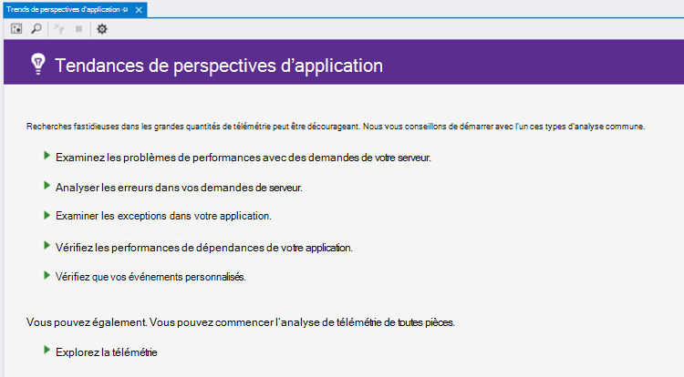
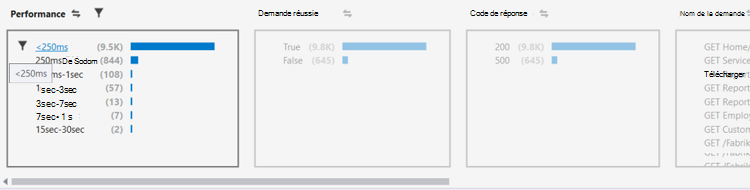
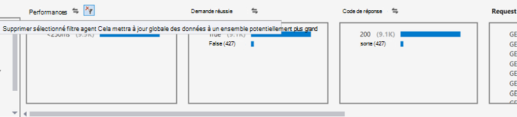
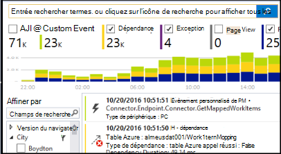

<properties 
    pageTitle="Analyse des tendances dans Visual Studio | Microsoft Azure" 
    description="Analyser, visualiser et Explorer les tendances dans votre télémétrie d’idées d’Application dans Visual Studio." 
    services="application-insights" 
    documentationCenter=".net"
    authors="numberbycolors" 
    manager="douge"/>

<tags 
    ms.service="application-insights" 
    ms.workload="tbd" 
    ms.tgt_pltfrm="ibiza" 
    ms.devlang="na" 
    ms.topic="get-started-article" 
    ms.date="10/25/2016" 
    ms.author="daviste"/>
    
# Analyse des tendances dans Visual Studio

L’outil Application idées tendances visualise comment les événements de télémesure important de votre application changent avec le temps, pour vous aider à identifier rapidement les problèmes et les anomalies. En liant les informations de diagnostic plus détaillées, des tendances peuvent vous aider à améliorer les performances de votre application, détecter les causes des exceptions et découvrir des idées à partir de vos événements personnalisés.

> [AZURE.NOTE] Tendances de perspectives d’application est disponible dans Visual Studio 3 de mise à jour de 2015 et ultérieures ou avec la version de [l’extension des outils de développement Analytique](https://visualstudiogallery.msdn.microsoft.com/82367b81-3f97-4de1-bbf1-eaf52ddc635a) 5.209 et versions ultérieure.

## Application ouverte, analyses des tendances

Pour ouvrir la fenêtre de l’Application, analyses des tendances :

* À partir du bouton de barre d’outils Aperçu de l’Application, cliquez sur **Explorer les tendances de télémétrie**, ou
* Dans le menu contextuel du projet, choisissez **perspectives d’Application > Découvrez les tendances de télémétrie**, ou
* Dans la barre de menus de Visual Studio, choisissez **Affichage > autres fenêtres > tendances de perspectives d’Application**.

Vous pouvez voir une invite de commandes pour sélectionner une ressource. Cliquez sur **Sélectionnez une ressource**, un abonnement Azure vous connecter, puis cliquez sur une ressource d’informations d’Application à partir de la liste pour laquelle vous souhaitez analyser des tendances de télémétrie.

## Choisissez une analyse des tendances

Mise en route en sélectionnant une des cinq analyses trend commune, chaque analyse les données des dernières 24 heures :

* **Examiner les problèmes de performances avec vos demandes de serveur** - demandes faites à votre service, regroupés par temps de réponse
* **Analyser les erreurs dans vos demandes de serveur** - demandes faites à votre service, regroupés par code de réponse HTTP
* **Examiner les exceptions dans votre application** - toutes les Exceptions de votre service, regroupés par type d’exception
* **Vérifier les performances de dépendances de votre application** - Services appelés par votre service, regroupées par temps de réponse
* **Inspecter vos événements personnalisés** - événements personnalisés que vous avez défini pour votre service, regroupés par type d’événement.

Ces analyses prédéfinis sont disponibles à partir du bouton **Afficher les types courants d’analyse de télémétrie** dans le coin supérieur gauche de la fenêtre des tendances.

## Visualiser les tendances dans votre application

Tendances de perspectives d’application crée une visualisation de série heure de télémétrie de votre application. Chaque visualisation de série heure affiche un seul type de télémétrie, regroupé par une propriété de ce type de télémétrie, sur une plage de temps. Par exemple, vous pouvez souhaiter afficher des demandes de serveur, regroupés par le pays d’origine, sur les dernières 24 heures. Dans cet exemple, chaque bulle sur la visualisation que représenterait un nombre de requêtes du serveur pour certains pays pendant une heure.

Pour ajuster les types de télémétrie vous permet d’afficher, utilisez les contrôles en haut de la fenêtre. Tout d’abord, choisissez les types de télémétrie qui vous intéressent :

* **Type de télémétrie** - demandes de serveur, des exceptions, des depdendencies ou des événements personnalisés
* **Plage de temps** - n’importe où dans les 30 dernières minutes au cours des 3 derniers jours
* **Regrouper par** - Exception type, identification du problème, pays/région et bien plus encore.

Puis, cliquez sur **Analyser de télémétrie** pour exécuter la requête.

Pour naviguer entre les bulles dans la visualisation :

* Cliquez sur pour sélectionner une bulle, ce qui met à jour des filtres au bas de la fenêtre, synthèse uniquement les événements qui se sont produites pendant une période de temps spécifique
* Double-cliquez sur une bulle pour accéder à l’outil de recherche et de voir tous les événements individuels de télémétrie qui s’est produite au cours de cette période
* CTRL-clic sur une bulle pour la désactiver dans la visualisation.

> [AZURE.TIP] Les tendances et la recherche des outils fonctionnent ensemble pour vous aider à identifier les causes de problèmes dans votre service parmi des milliers d’événements de télémétrie. Par exemple, si un après-midi, vos clients Notez votre application est moins sensible, démarrer avec les tendances. Analyser les demandes faites à votre service via plusieurs heures passées, regroupées par temps de réponse. Voir s’il existe un cluster anormalement élevé de demandes lentes. Puis double-cliquez sur cette bulle pour accéder à l’outil de recherche, filtré à ces événements de demande. À partir de la recherche, vous pouvez explorer le contenu de ces demandes et naviguer vers le code impliqués résoudre le problème.

## Filtre

Découvrez les tendances plus spécifiques avec les contrôles de filtre au bas de la fenêtre. Pour appliquer un filtre, cliquez sur son nom. Vous pouvez rapidement basculer entre différents filtres pour déterminer les tendances qui peuvent être masquage dans une dimension particulière de votre télémétrie. Si vous appliquez un filtre dans une seule dimension, comme le Type d’Exception, filtres d’autres dimensions restent interactifs, même si elles apparaissent grisées. Aux Nations unies-appliquer un filtre, cliquez à nouveau dessus. CTRL-clic pour sélectionner plusieurs filtres dans la même dimension.

Que se passe-t-il si vous souhaitez appliquer plusieurs filtres ? 

1. Appliquer le premier filtre. 
2. Cliquez sur le bouton **appliquer des filtres sélectionnés et requête à nouveau** par le nom de la dimension de votre premier filtre. Ce nouveau interroge votre télémétrie pour que les événements qui correspondent au filtre de premier. 
3. Appliquer un deuxième filtre. 
4. Répétez le processus pour trouver les tendances dans des sous-ensembles spécifiques de votre télémétrie. Par exemple, les demandes de serveur nommé « Chez/Index » _et_ qui provient de l’Allemagne _et_ qui a reçu un code de 500 réponse. 

Aux Nations unies-appliquer l’un de ces filtres, cliquez sur le bouton **Supprimer les filtres sélectionnés et requête à nouveau** pour la dimension.

## Rechercher des anomalies

L’outil de tendances peut mettre en surbrillance les bulles d’événements anormaux par rapport aux autres bulles de la même série de temps. Dans la liste déroulante Type d’affichage, cliquez sur **nombre de temps compartiment (anomalies de mise en surbrillance)** ou **pourcentages de temps compartiment (anomalies de mise en surbrillance)**. Les bulles rouges sont anormaux. Anomalies sont définies sous forme de bulles avec un nombre/pourcentage supérieure à 2,1 fois l’écart type des nombres/pourcentages qui s’est produite dans le passé deux périodes (48 heures si vous visualisez les dernières 24 heures, etc..).

> [AZURE.TIP] Mise en évidence des anomalies est particulièrement utile pour la recherche de valeurs aberrantes dans les séries temporelles de petites bulles qui peuvent sinon être de taille similaire.  

## Étapes suivantes

||
|---|---
|**[Utilisation des perspectives d’Application dans Visual Studio](app-insights-visual-studio.md)** Recherche de télémétrie, afficher des données dans CodeLens et configurer les perspectives de l’Application. Dans Visual Studio. |
|**[Ajoutez davantage de données](app-insights-asp-net-more.md)** Surveiller l’utilisation, disponibilité, dépendances, exceptions. Intégrer des traces à partir des frameworks de journalisation. Écrire la télémétrie personnalisé. | 
|**[Utilisez le portail d’idées d’Application](app-insights-dashboards.md)** Exporter des tableaux de bord, des outils de diagnostics et d’analyse puissants, alertes, un mappage direct de dépendance de votre application et télémétrie. |
