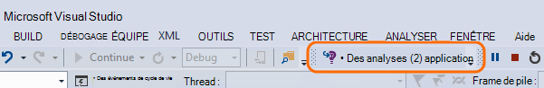
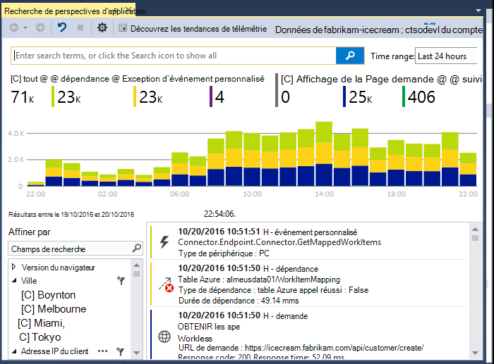
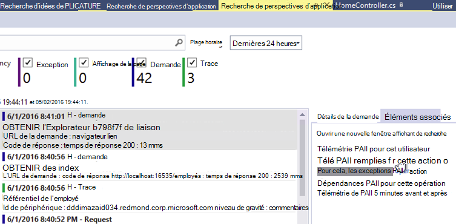
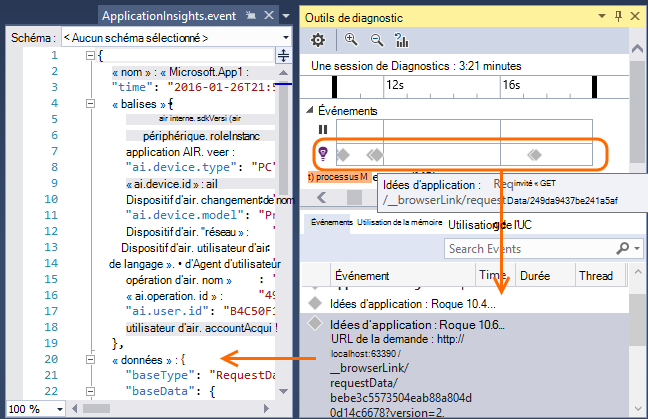
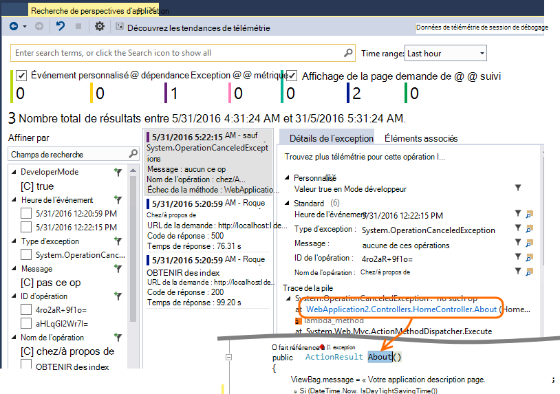
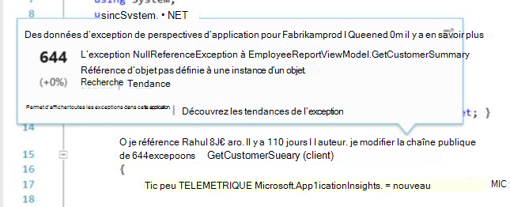
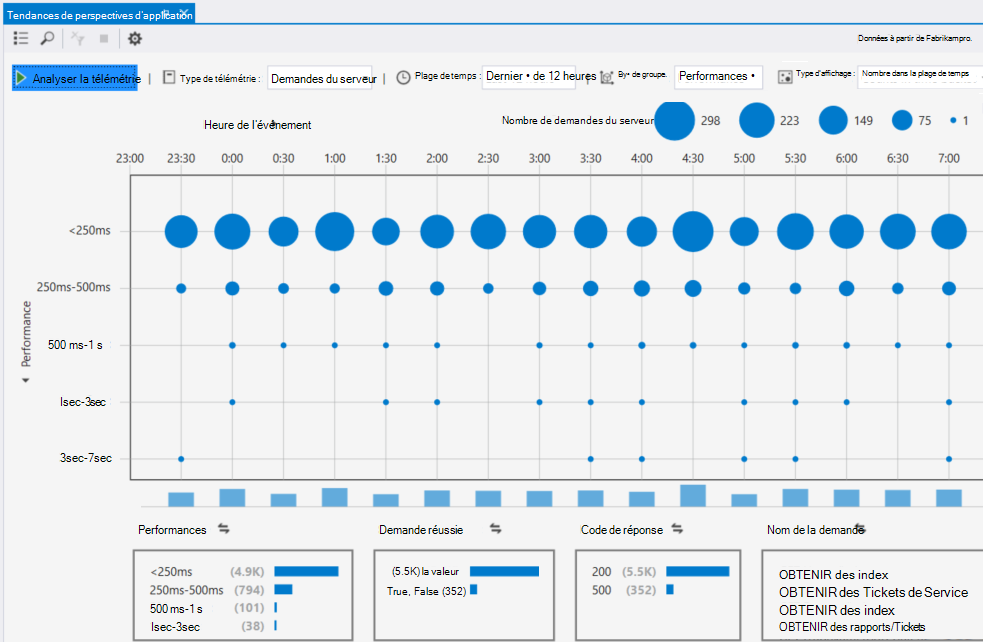

<properties 
    pageTitle="Utilisation de perspectives d’Application dans Visual Studio" 
    description="Analyse des performances et diagnostic pendant le débogage et en production." 
    services="application-insights" 
    documentationCenter=".net"
    authors="alancameronwills" 
    manager="douge"/>

<tags 
    ms.service="application-insights" 
    ms.workload="tbd" 
    ms.tgt_pltfrm="ibiza" 
    ms.devlang="na" 
    ms.topic="get-started-article" 
    ms.date="06/21/2016" 
    ms.author="awills"/>

# Utilisation des perspectives d’Application dans Visual Studio

Dans Visual Studio (2015 et ultérieures), vous pouvez analyser les performances et diagnostiquer les problèmes de déboguer et de production, à l’aide des données télémétriques fournies par les [Perspectives d’Application Visual Studio](app-insights-overview.md).

Si vous n’avez pas encore [d’Idées d’Application installés dans votre application](app-insights-asp-net.md), faire cela maintenant.

## Déboguer votre projet.

Exécutez votre application en appuyant sur F5 et faites un essai : ouvrir les différentes pages pour générer certains télémétrie.

Dans Visual Studio, vous verrez un décompte des événements qui ont été enregistrés.

Cliquez sur ce bouton pour ouvrir la recherche de diagnostic. 

## Recherche de diagnostic

La fenêtre de recherche affiche les événements qui ont été consignés. (Si vous connecté à Azure lorsque vous paramétrez des perspectives de l’Application, vous serez en mesure de rechercher les mêmes événements dans le portail.)

La recherche en texte libre fonctionne sur tous les champs dans les événements. Par exemple, recherchez la partie de l’URL d’une page ; ou la valeur d’une propriété telle que de la ville du client ; ou des mots spécifiques dans un journal de suivi.

Cliquez sur n’importe quel événement pour afficher ses propriétés détaillées.

Vous pouvez également ouvrir l’onglet éléments associés pour diagnostiquer les exceptions ou les demandes ayant échoué.

## Concentrateur de Diagnostics

Le concentrateur de Diagnostics (dans Visual Studio 2015 ou version ultérieure) affiche la télémétrie serveur perspectives d’Application lorsqu’elles sont générées. Cela fonctionne même si vous avez choisi uniquement pour installer le Kit de développement, sans le connecter à une ressource dans le portail Azure.

## Exceptions

Si vous avez [configuré à la surveillance des exceptions](app-insights-asp-net-exceptions.md), les rapports d’exception s’affichera dans la fenêtre de recherche. 

Cliquez sur une exception afin d’obtenir une trace de la pile. Si le code de l’application est ouvert dans Visual Studio, vous pouvez cliquer sur par le biais de la trace de la pile à la ligne appropriée dans le code.

En outre, dans la ligne de Code objectif au-dessus de chaque méthode, vous verrez un décompte des exceptions consignées par les perspectives d’Application dans les 24 heures passées.

## Analyse locale

(À partir de Visual Studio 2015 mise à jour 2) Si vous n’avez pas configuré le SDK pour envoyer de télémétrie sur le portail de perspectives de l’Application (de sorte qu’il n’y a aucune clé de l’instrumentation dans ApplicationInsights.config) la fenêtre diagnostics affiche télémétrie à partir de votre session de débogage plus tard. 

Cela est souhaitable si vous avez déjà publié une version antérieure de votre application. Vous ne voulez pas la télémétrie dans vos sessions de débogage à être mélangées avec la télémétrie sur le portail d’idées d’Application à partir de l’application publiée.

Il est également utile si vous avez quelques [télémétrie personnalisé](app-insights-api-custom-events-metrics.md) que vous souhaitez déboguer avant l’envoi de télémétrie pour le portail.

* *Tout d’abord, j’ai configuré entièrement perspectives d’Application pour envoyer de télémétrie pour le portail. Mais maintenant je souhaite voir la télémétrie uniquement dans Visual Studio.*

 * Dans les paramètres de la fenêtre de recherche, il existe une option de recherche des diagnostics local même si votre application envoie de télémétrie pour le portail.
 * Pour arrêter la télémétrie envoyée au portail, commentez la ligne `<instrumentationkey>...` de ApplicationInsights.config. Lorsque vous êtes prêt à envoyer à nouveau de télémétrie au portail, ne commentez pas.

## Tendances

Tendances est un outil permettant de visualiser le comportement de votre application dans le temps. 

Cliquez sur **Découvrez les tendances de télémétrie** à partir de la fenêtre de recherche de perspectives d’Application ou le bouton de barre d’outils d’aperçu de l’Application. Choisissez l’une des cinq requêtes communes pour commencer. Vous pouvez analyser des datasets différents en fonction des types de télémétrie, les plages de temps et d’autres propriétés. 

Pour rechercher les anomalies dans vos données, choisissez une des options des anomalies dans la liste déroulante « Type de vue ». Les options de filtrage au bas de la fenêtre facilitent le rapproche des sous-ensembles spécifiques de votre télémétrie.

[En savoir plus sur les tendances](app-insights-visual-studio-trends.md).

## Quel est l’avenir ?

||
|---|---
|**[Ajoutez davantage de données](app-insights-asp-net-more.md)** Surveiller l’utilisation, disponibilité, dépendances, exceptions. Intégrer des traces à partir des frameworks de journalisation. Écrire la télémétrie personnalisé. | 
|**[Utilisez le portail d’idées d’Application](app-insights-dashboards.md)** Exporter des tableaux de bord, des outils de diagnostics et d’analyse puissants, alertes, un mappage direct de dépendance de votre application et télémétrie. |

 
