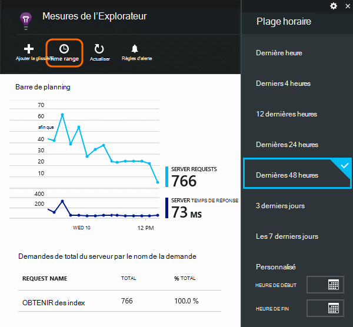
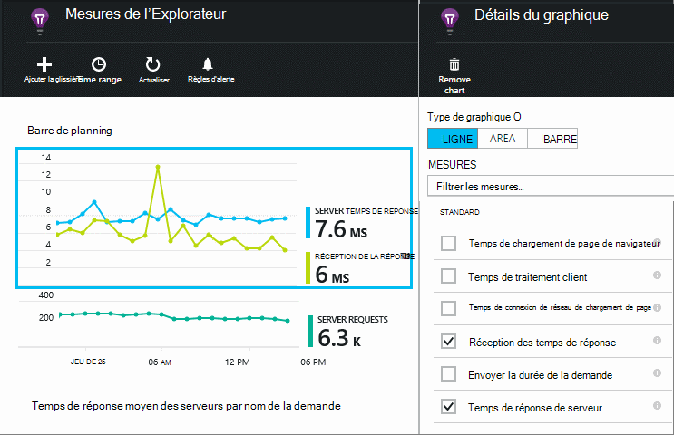
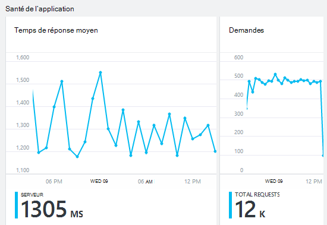
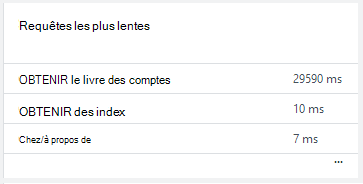
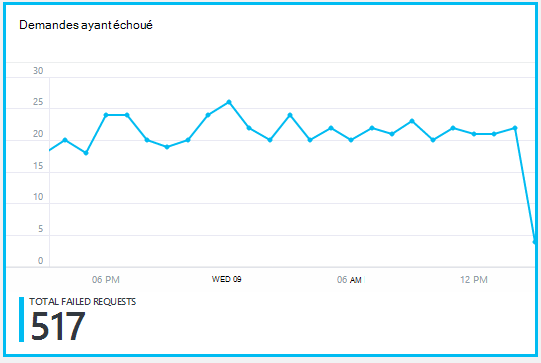
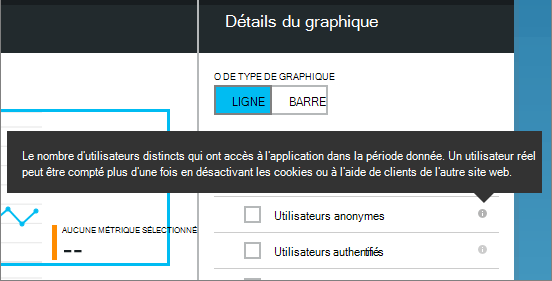
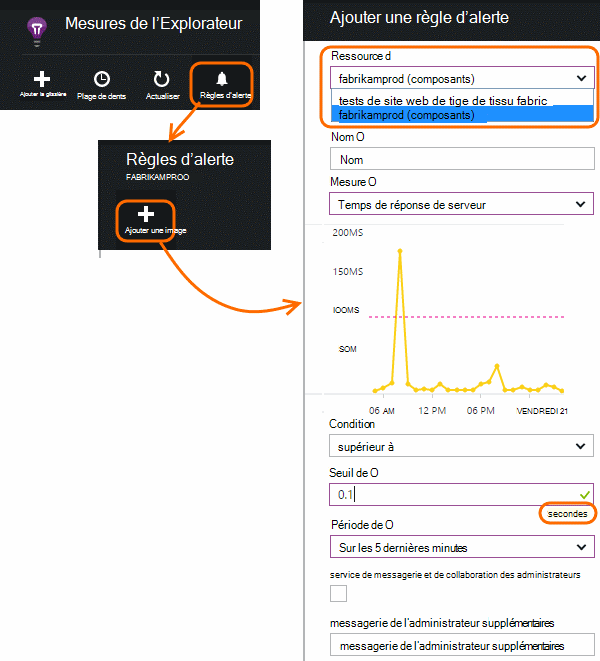

<properties 
    pageTitle="Surveiller la santé de votre application et de l’utilisation avec les perspectives de l’Application" 
    description="Mise en route avec les perspectives de l’Application. Analyser l’utilisation, la disponibilité et les performances de vos locaux ou les applications Microsoft Azure." 
    services="application-insights" 
    documentationCenter=""
    authors="alancameronwills" 
    manager="douge"/>

<tags 
    ms.service="application-insights" 
    ms.workload="tbd" 
    ms.tgt_pltfrm="ibiza" 
    ms.devlang="na" 
    ms.topic="article" 
    ms.date="11/25/2015" 
    ms.author="awills"/>
 
# Analyseur de performances dans les applications web

*Idées d’application est en mode Aperçu.*

Assurez-vous que votre application fonctionne correctement et découvrez rapidement les défaillances. [Idées d’application] [ start] va vous indiquer sur tous les problèmes de performances et les exceptions et vous aider à trouver et à diagnostiquer les causes.

Idées d’application peuvent surveiller des applications web Java et de ASP.NET et les services, les services WCF. Ils peuvent être hébergé sur site, sur les machines virtuelles, ou en tant que sites Web de Microsoft Azure. 

Côté client, les perspectives d’Application peut prendre télémétrie à partir des pages web et d’une grande variété de périphériques, y compris d’iOS, Android et Windows applications Store.

## Configurer l’analyse des performances

Si vous n’avez pas encore ajouté perspectives d’Application à votre projet (autrement dit, si elle n’a pas ApplicationInsights.config), choisissez l’une des manières suivantes pour commencer :

* [Applications web ASP.NET](app-insights-asp-net.md)
 * [Ajouter la surveillance des exceptions](app-insights-asp-net-exceptions.md)
 * [Ajouter la surveillance des dépendances](app-insights-monitor-performance-live-website-now.md)
* [Applications web J2EE](app-insights-java-get-started.md)
 * [Ajouter la surveillance des dépendances](app-insights-java-agent.md)

## Exploration des mesures de performances

Dans [le portail Azure](https://portal.azure.com), accédez à la ressource de perspectives de l’Application que vous définissez pour votre application. La lame de vue d’ensemble affiche les données de performances de base :

Cliquez sur n’importe quel graphique afficher plus de détails et pour afficher des résultats pour une période plus longue. Par exemple, cliquez sur la mosaïque de requêtes, puis sélectionnez une plage de temps :

Cliquez sur un graphique pour choisir les mesures qu’il affiche, ou ajouter un nouveau graphique et sélectionnez ses paramètres :

> [AZURE.NOTE] **Désélectionner toutes les mesures** pour voir la sélection complète qui est disponible. Les mesures se répartissent en groupes ; Lorsqu’un membre d’un groupe est sélectionné, seuls les autres membres de ce groupe s’affichent.

## Quelles en sont les conséquences ? Carreaux de performance et des rapports

Il existe une variété de métriques de performances que vous pouvez obtenir. Commençons par celles qui s’affichent par défaut sur la lame de l’application.

### Demandes

Le nombre de demandes HTTP reçues dans une période spécifiée. Faites la comparaison avec les résultats d’autres rapports pour voir comment votre application se comporte comme la charge varie.

Requêtes HTTP comprennent toutes les requêtes GET ou POST des pages, des données et des images.

Cliquez sur le carré pour obtenir le nombre d’URL spécifiques.

### Temps de réponse moyen

Mesure le temps entre une demande web entrant dans votre application et la réponse qui est renvoyée.

Les points indiquent un déplacement moyen. S’il existe un grand nombre de demandes, il existe peut-être certains qui s’écartent de la moyenne sans un pic évidente ou plonger dans le graphique.

Recherchez des pics inhabituels. En règle générale, prévoyez des temps de réponse d’augmenter avec une hausse des demandes. Si l’augmentation est disproportionnée, votre application peut être atteint une limite de ressource processeur ou la capacité d’un service, qu'il utilise.

Cliquez sur la vignette pour obtenir les heures pour des URL spécifiques.

### Requêtes les plus lentes

Affiche les requêtes qui peut être nécessaire de réglage des performances.

### Demandes ayant échoué

Nombre de demandes qui a levé une exception non interceptée.

Cliquez sur la mosaïque pour afficher les détails des erreurs spécifiques et sélectionner une demande pour afficher ses détails. 

Qu’un échantillon représentatif d’échecs est conservé pour les inspections.

### Autres mesures

Pour voir les autres mesures que vous pouvez afficher et cliquez sur un graphique, puis désélectionnez toutes les mesures pour voir la version complète disponible. Pour voir la définition de chaque mesure, cliquez sur (i).

Sélection de toute mesure de désactiver ceux qui ne peuvent pas apparaître dans le même graphique.

## Définir des alertes

Pour être averti par courrier électronique les valeurs inhabituelles de toute mesure, ajouter une alerte. Vous pouvez choisir d’envoyer l’e-mail aux administrateurs de compte, ou pour les adresses de messagerie spécifiques.

Définissez la ressource avant les autres propriétés. Ne choisissez pas les ressources de webtest si vous voulez définir des alertes sur les mesures de performances ou d’utilisation.

Veillez à noter les unités dans lequel vous êtes invité à entrer la valeur de seuil.

*Je ne vois pas le bouton Ajouter une alerte.* -Est-ce un groupe compte auquel vous avez accès en lecture seule ? Vérifiez avec l’administrateur de compte.

## Diagnostic des problèmes

Voici quelques conseils pour la recherche et le diagnostic des problèmes de performances :

* Paramétrer des [tests web] [ availability] pour être alerté si votre site web tombe en panne ou qu’il répond de manière incorrecte ou lentement. 
* Comparer avec d’autres mesures pour voir si les échecs ou les délais de réponse sont associés pour charger le compteur de demande.
* [Insérer et rechercher les instructions trace] [ diagnostic] dans votre code pour aider à cerner les problèmes.

## Étapes suivantes

[Tests Web] [ availability] -demandes web envoyées à votre application à des intervalles réguliers de partout dans le monde.

[Capturer et rechercher des suivis de diagnostic] [ diagnostic] - insérer des appels trace et passer en revue les résultats afin d’identifier les problèmes.

[Suivi de l’utilisation] [ usage] -Découvrez comment les personnes utilisent votre application.

[Résolution des problèmes de] [ qna] - et Q & r

## Vidéo

[AZURE.VIDEO performance-monitoring-application-insights]

<!--Link references-->

[availability]: app-insights-monitor-web-app-availability.md
[diagnostic]: app-insights-diagnostic-search.md
[greenbrown]: app-insights-asp-net.md
[qna]: app-insights-troubleshoot-faq.md
[redfield]: app-insights-monitor-performance-live-website-now.md
[start]: app-insights-overview.md
[usage]: app-insights-web-track-usage.md

 
