<properties 
    pageTitle="Analyse de l’utilisation pour les applications web avec les informations d’Application" 
    description="Vue d’ensemble d’analytique de l’utilisation d’applications web avec les informations d’Application" 
    services="application-insights" 
    documentationCenter=""
    authors="alancameronwills" 
    manager="douge"/>

<tags 
    ms.service="application-insights" 
    ms.workload="tbd" 
    ms.tgt_pltfrm="ibiza" 
    ms.devlang="na" 
    ms.topic="article" 
    ms.date="06/12/2016" 
    ms.author="awills"/>
 
# <a name="usage-analysis-for-web-applications-with-application-insights"></a>Analyse de l’utilisation pour les applications web avec les informations d’Application

Connaître la manière dont les personnes utilisent votre application vous permet de concentrer votre travail de développement sur les scénarios qui sont plus importants et intégrer les objectifs qu’ils trouveront plus facile ou plus difficile à obtenir. 

Idées d’Application Visual Studio fournit deux niveaux de suivi de l’utilisation :

* **Afficher les données utilisateur, de session et de page** - fourni en standard.  
* **Télémétrie de personnalisé** - vous [d’écrire du code] [ api] effectuer le suivi de vos utilisateurs grâce à l’expérience utilisateur de votre application. 

## <a name="setting-up"></a>Configuration de

Ouvrez une ressource d’idées d’Application dans [Azure Portal](https://portal.azure.com), cliquez sur le graphique de chargements de page navigateur vide et suivez les instructions d’installation.

[Pour en savoir plus](app-insights-javascript.md) 


## <a name="how-popular-is-my-web-application"></a>La cote de popularité est mon application web ?

Connectez-vous au [portail Azure][portal], accédez à votre ressource d’application et sur l’utilisation de :

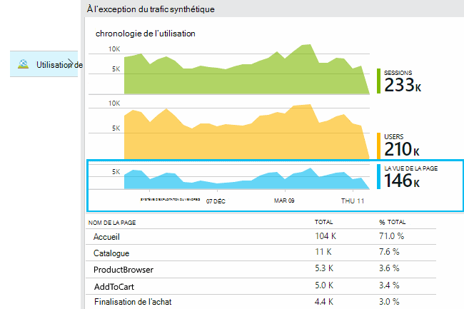

* **Utilisateurs :** Le nombre d’utilisateurs actifs distincts sur la plage de temps du graphique. 
* **Sessions :** Le nombre de sessions actives
* **Affichages de page** Compte le nombre d’appels à trackPageView(), généralement appelée qu’une seule fois dans chaque page web.

Cliquez sur un des graphiques pour afficher plus de détails. Notez que vous pouvez modifier la plage de temps des graphiques.

### <a name="where-do-my-users-live"></a>Résident des utilisateurs

À partir de la blade d’utilisation, cliquez sur le graphique d’utilisateurs pour afficher plus de détails :

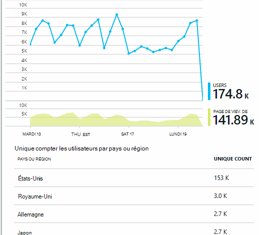
 
### <a name="what-browsers-or-operating-systems-do-they-use"></a>Les navigateurs ou les systèmes d’exploitation utilisent-ils ?

Données de groupe (segment) par une propriété de navigateur, système d’exploitation ou de la ville :

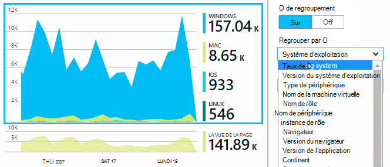


## <a name="sessions"></a>Sessions

La session est un concept fondamental dans l’Application aperçu, qui s’efforce d’associer chaque événement de télémétrie - tels que les demandes, de visites, des exceptions, ou les événements personnalisés que vous codez vous-même - à une session utilisateur spécifique. 

Informations de contexte riche sont collectées sur chaque session, telles que les caractéristiques du périphérique, géo emplacement, système d’exploitation et ainsi de suite.

Si vous instrumentez le client et le serveur ([ASP.NET] [ greenbrown] ou [J2EE][java]), les kits de développement logiciel propagera l’id de session entre le client et le serveur, afin que les événements sur les deux côtés peuvent être mis en corrélation.

Lors de [diagnostic des problèmes de][diagnostic], vous pouvez trouver tous les télémétrie liée à la session dans laquelle un problème s’est produit, y compris toutes les requêtes et tous les événements, les exceptions ou les traces qui ont été consignés.

Sessions fournissent une bonne mesure de la popularité des contextes de périphérique, système d’exploitation ou emplacement. Par exemple, en affichant le nombre de sessions regroupés par périphérique, vous obtenez un inventaire plus précis de la fréquence à laquelle ce périphérique est utilisé avec votre application, que par comptage des affichages de page. Il s’agit d’une entrée utile pour trier les problèmes spécifiques au périphérique.


#### <a name="whats-a-session"></a>Ce qu’est une session ?

Une session représente une rencontre unique entre l’utilisateur et de l’application. Dans sa forme la plus simple, la session commence par un utilisateur lance l’application et se termine lorsque l’utilisateur quitte l’application. Pour les applications web, par défaut, la session se termine après 30 minutes d’inactivité ou après 24 heures d’activité. 

Vous pouvez modifier ces valeurs par défaut en modifiant l’extrait de code :

    <script type="text/javascript">
        var appInsights= ... { ... }({
            instrumentationKey: "...",
            sessionRenewalMs: 3600000,
            sessionExpirationMs: 172800000
        });

* `sessionRenewalMs`: La durée, en millisecondes, à l’expiration de la session en cas d’inactivité de l’utilisateur. Par défaut : 30 minutes.
* `sessionExpirationMs`: La longueur maximale d’une session, en millisecondes. Si l’utilisateur reste active après cette heure, compte pour une autre session. Par défaut : 24 heures.

**Durée de la session** est une [mesure de le] [ metrics] qui enregistre l’intervalle de temps entre les éléments de télémétrie premier et le dernier de la session. (Il n’inclut pas le délai d’expiration).

**Nombre de sessions** dans un intervalle donné est défini comme le nombre de sessions uniques avec une activité au cours de cet intervalle. Lorsque vous examinez une plage de temps, tels que le nombre de sessions de tous les jours de la semaine passée, cela équivaut généralement au nombre total de sessions. 

Toutefois, lorsque vous explorez des périodes plus courtes, tels que le grain de toutes les heures, une longue session de plusieurs heures est comptée pour chaque heure dans lequel la session a été active. 

## <a name="users-and-user-counts"></a>Les utilisateurs et les comptes d’utilisateur


Chaque session de l’utilisateur est associée à un id utilisateur unique. 

Par défaut, l’utilisateur est identifié en plaçant un cookie. Un utilisateur qui utilise plusieurs navigateurs ou périphériques à compter plus d’une fois. (Mais voir [utilisateurs authentifiés](#authenticated-users))


La métrique du **nombre d’utilisateurs** dans un intervalle donné est définie comme le nombre d’utilisateurs uniques avec les activités enregistrées au cours de cet intervalle. En conséquence, les utilisateurs avec des sessions de longue durée peuvent être pris en compte plusieurs fois, lorsque vous définissez une plage de temps pour que le grain est moins d’une heure ou pour.

**Nouveaux utilisateurs** compte les utilisateurs dont les sessions premier avec l’application s’est produite au cours de cet intervalle. Si la méthode par défaut de comptage par les utilisateurs par les cookies est utilisée, puis il inclura également les utilisateurs qui ont désactivé leurs cookies, ou qui utilisent un nouveau périphérique ou un navigateur pour accéder à votre application pour la première fois.
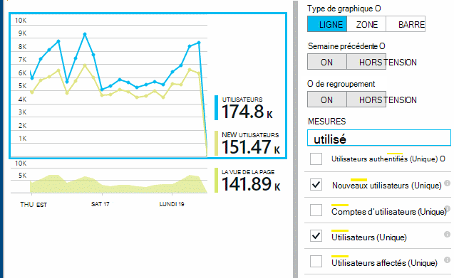

### <a name="authenticated-users"></a>Utilisateurs authentifiés

Si votre application web permet aux utilisateurs de se connecter, vous pouvez obtenir un inventaire plus précis en fournissant des perspectives d’Application avec un identificateur d’utilisateur unique. Il ne doit pas être leur nom, ou le même id que vous utilisez dans votre application. Dès que votre application a identifié l’utilisateur, utilisez ce code :


*JavaScript sur le client*

      appInsights.setAuthenticatedUserContext(userId);

Si votre application regroupe les comptes utilisateurs, vous pouvez également passer un identificateur pour le compte. 

      appInsights.setAuthenticatedUserContext(userId, accountId);

L’ID d’utilisateur et de compte ne doivent pas contenir espaces ni les caractères`,;=|`


Dans l' [Explorateur de mesures](app-insights-metrics-explorer.md), vous pouvez créer un plan de **comptes**et **d’Utilisateurs authentifiés** . 

## <a name="synthetic-traffic"></a>Trafic synthétique

Le trafic synthétique inclut les requêtes de tests de charge et de disponibilité, des robots d’indexation et des autres agents. 

Application tente de perspectives s’efforce de déterminer automatiquement et classer le trafic synthétique et marquer de manière appropriée. Dans la plupart des cas, le trafic synthétique n’appelle pas le SDK JavaScript, afin que cette activité est exclue d’utilisateur et le comptage de la session. 

Toutefois, pour les perspectives de l’Application [des tests web][availability], l’id d’utilisateur est définie automatiquement en fonction des emplacement de POP et id de session est définie en fonction de l’id de série de tests. Par défaut, rapports, synthétique trafic est filtré par défaut, ce qui exclut les utilisateurs et les sessions. Toutefois, lorsque le trafic synthétique est inclus, il peut provoquer une légère augmentation dans l’ensemble des utilisateurs et des nombres de la session.
 
## <a name="page-usage"></a>Utilisation de la page

Cliquez sur le graphique de vues de page pour obtenir une version plus agrandi avec une répartition de vos pages les plus populaires :


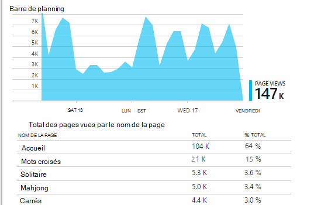
 
L’exemple ci-dessus est à partir d’un site Web de jeux. À partir de celui-ci nous pouvons voir instantanément :

* L’utilisation n’a pas amélioré la semaine dernière. Peut-être nous devons penser à propos de l’optimisation des moteurs de recherche ?
* Moins de personnes de voient les pages de jeux à la page d’accueil. Pourquoi notre page d’accueil n’attirer les personnes à jouer à des jeux ?
* « Mots croisés » est le jeu les plus populaires. Nous devons donner la priorité à il des améliorations et de nouvelles idées.

## <a name="custom-tracking"></a>Suivi personnalisé

Supposons qu’au lieu d’implémenter chaque jeu dans une page web distincte, vous décidez de refactoriser les dans la même application de page unique, la plupart des fonctionnalités codée Javascript dans la page web. Cela permet à l’utilisateur de basculer rapidement d’un jeu et un autre ou même plusieurs jeux sur une seule page. 

Mais vous voulez quand même les perspectives d’Application pour enregistrer le nombre de fois où chaque jeu est ouvert dans exactement de la même manière que lorsqu’ils se trouvaient sur des pages web distinctes. C’est très simple : simplement insérer un appel au module de télémétrie dans JavaScript souhaité pour l’enregistrement d’une « page » a ouvert :

    appInsights.trackPageView(game.Name);

## <a name="custom-events"></a>Événements personnalisés

Écrire la télémétrie personnalisé pour enregistrer des événements spécifiques. En particulier dans une seule page d’application, vous souhaiterez connaître la fréquence à laquelle l’utilisateur effectue des actions particulières ou atteint certains objectifs : 

    appInsights.trackEvent("GameEnd");

Par exemple, pour ouvrir une session en cliquant sur un lien :

    <a href="target.htm" onclick="appInsights.trackEvent('linkClick');return true;">my link</a>


## <a name="view-counts-of-custom-events"></a>Comptes d’affichages des événements personnalisés

Ouvrez l’Explorateur de métriques et ajouter un graphique pour afficher les événements. Par nom de segment :

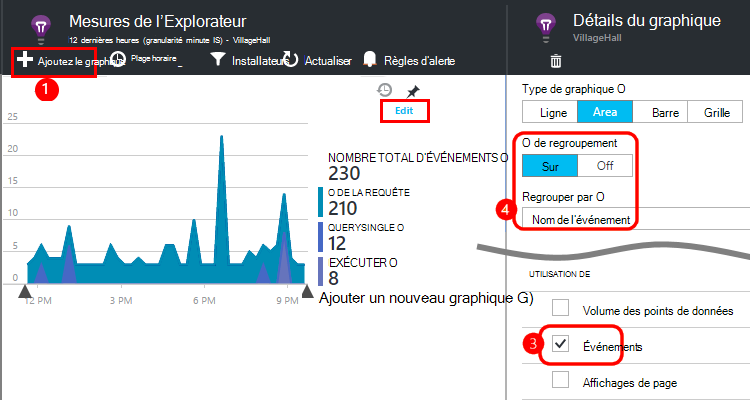


## <a name="drill-into-specific-events"></a>Explorez des événements spécifiques

Pour obtenir une meilleure compréhension de comment une session type passe, vous pouvez souhaiter vous concentrer sur une session utilisateur spécifique qui contient un type particulier d’événement. 

Dans cet exemple, nous avons codé un événement personnalisé « NoGame » qui est appelée si l’utilisateur se déconnecte sans réellement démarrer un jeu. Pourquoi un utilisateur pour cela ? Peut-être que si nous plonger dans certaines occurrences spécifiques, nous verrons un indice. 

Les événements personnalisés provenant de l’application sont répertoriés par nom sur la lame de présentation :


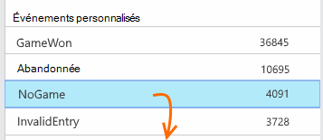
 
Cliquez sur par le biais de l’événement d’intérêt et sélectionnez une occurrence spécifique récente :


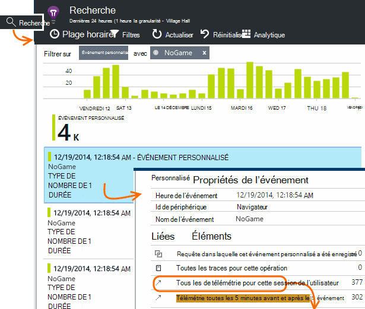
 
Examinons tous la télémétrie pour la session dans laquelle cet événement particulier de NoGame s’est produite. 


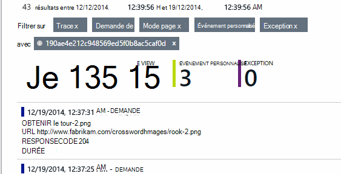
 
Il n’y avait aucuns exceptions, afin que l’utilisateur n’a pas été empêché de lecture par un échec.
 
Nous pouvons filtrer tous les types de télémétrie, à l’exception des affichages de page pour cette session :


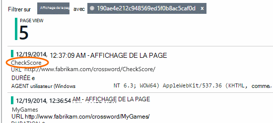
 
Et maintenant nous pouvons voir que cet utilisateur connecté simplement à vérifier les derniers résultats. Peut-être que nous devrions envisager de développer un récit utilisateur qui le rend plus facile à faire. (Et il nous faut implémenter un événement personnalisé pour le rapport lorsque ce scénario spécifique se produit.)

## <a name="filter-search-and-segment-your-data-with-properties"></a>Filtrer, rechercher et segmenter vos données avec des propriétés
Vous pouvez joindre des balises arbitraires et des valeurs numériques pour les événements.
 

*JavaScript sur le client*

```JavaScript

    appInsights.trackEvent("WinGame",
        // String properties:
        {Game: currentGame.name, Difficulty: currentGame.difficulty},
        // Numeric measurements:
        {Score: currentGame.score, Opponents: currentGame.opponentCount}
    );
```

*C# au niveau serveur*

```C#

    // Set up some properties:
    var properties = new Dictionary <string, string> 
        {{"game", currentGame.Name}, {"difficulty", currentGame.Difficulty}};
    var measurements = new Dictionary <string, double>
        {{"Score", currentGame.Score}, {"Opponents", currentGame.OpponentCount}};

    // Send the event:
    telemetry.TrackEvent("WinGame", properties, measurements);
```

*VB au niveau serveur*

```VB

    ' Set up some properties:
    Dim properties = New Dictionary (Of String, String)
    properties.Add("game", currentGame.Name)
    properties.Add("difficulty", currentGame.Difficulty)

    Dim measurements = New Dictionary (Of String, Double)
    measurements.Add("Score", currentGame.Score)
    measurements.Add("Opponents", currentGame.OpponentCount)

    ' Send the event:
    telemetry.TrackEvent("WinGame", properties, measurements)
```

Attacher des propriétés à des vues de page de la même manière :

*JavaScript sur le client*

```JS

    appInsights.trackPageView("Win", 
        url,
        {Game: currentGame.Name}, 
        {Score: currentGame.Score});
```

Dans Diagnostic recherche, afficher les propriétés en cliquant à une occurrence d’un événement.


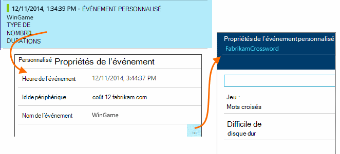
 
Pour voir des occurrences d’événement avec une valeur de propriété particulière, utilisez le champ de recherche.


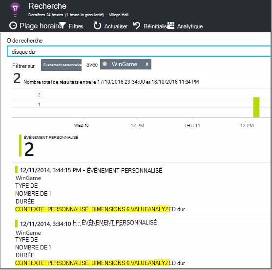


## <a name="a--b-testing"></a>A | Test de B

Si vous ne connaissez pas le type variant d’une fonctionnalité sera plus efficace, relâchez les deux, rendre chaque accessibles aux différents utilisateurs. Mesurer le succès de chaque et déplacez-le vers une version unifiée.

Cette technique, vous attacher des balises distinctes pour tous les télémétrie envoyé par chaque version de votre application. Vous pouvez faire qui en définissant des propriétés dans la TelemetryContext active. Ces propriétés par défaut sont ajoutées à chaque message de télémétrie que l’application envoie - non seulement vos messages personnalisés, mais la télémétrie standard ainsi. 

Dans le portail d’informations d’Application, vous allez alors pouvoir pour filtrer et grouper (segment) vos données dans les balises, afin de comparer les différentes versions.

*C# au niveau serveur*

```C#

    using Microsoft.ApplicationInsights.DataContracts;

    var context = new TelemetryContext();
    context.Properties["Game"] = currentGame.Name;
    var telemetry = new TelemetryClient(context);
    // Now all telemetry will automatically be sent with the context property:
    telemetry.TrackEvent("WinGame");
```

*VB au niveau serveur*

```VB

    Dim context = New TelemetryContext
    context.Properties("Game") = currentGame.Name
    Dim telemetry = New TelemetryClient(context)
    ' Now all telemetry will automatically be sent with the context property:
    telemetry.TrackEvent("WinGame")
```

Télémétrie individuel peut substituer les valeurs par défaut.

Vous pouvez configurer un initialiseur universel afin que tous les TelemetryClients de nouveau utiliser automatiquement votre contexte.

```C#


    // Telemetry initializer class
    public class MyTelemetryInitializer : ITelemetryInitializer
    {
        public void Initialize (ITelemetry telemetry)
        {
            telemetry.Properties["AppVersion"] = "v2.1";
        }
    }
```

Dans l’initialiseur app comme Global.asax.cs :

```C#

    protected void Application_Start()
    {
        // ...
        TelemetryConfiguration.Active.TelemetryInitializers
        .Add(new MyTelemetryInitializer());
    }
```


## <a name="build---measure---learn"></a>Build - mesure - en savoir plus

Lorsque vous utilisez analytique, il devient partie intégrante de votre cycle de développement, pas simplement quelque chose que vous pensez environ pour aider à résoudre des problèmes. Voici quelques conseils :

* Déterminer les mesures clés de votre application. Voulez-vous que les utilisateurs autant que possible, ou si vous préférez un petit ensemble d’utilisateurs très heureux ? Vous souhaitez optimiser les visites ou des ventes ?
* Plan de mesure de chaque article. Lorsque vous esquissez un nouveau récit utilisateur ou une fonction ou plan de mettre à jour une réfléchissez toujours à propos de comment vous allez mesurer la réussite de la modification. Avant de coder démarre, demander « les conséquences cela aura-t-il sur nos unités de mesure, si cela fonctionne ? Devons nous suivre tous les nouveaux événements ? »
Et bien sûr, lorsque la fonction est en ligne, veillez à vous regardez l’analytique et d’agir sur les résultats. 
* Autres mesures concernent les mesures clés. Par exemple, si vous ajoutez une fonctionnalité de « favoris », vous souhaitez connaître la fréquence à laquelle les utilisateurs ajoutent des Favoris. Mais il est sans doute plus intéressant de connaître la fréquence à laquelle ils reviennent à leurs favoris. Et, plus important encore, les clients qui utilisent des Favoris finalement achètent-ils votre produit ?
* Canaries test. Définissez un commutateur de fonctionnalité qui permet d’afficher une nouvelle fonctionnalité uniquement à certains utilisateurs. Idées d’Application permet de voir si la nouvelle fonctionnalité est utilisée dans la façon dont vous envisagées. Effectuer des ajustements, puis relâchez-la pour un public plus large.
* Communiquer avec vos utilisateurs ! Analytique n’est pas suffisante en soi, mais complémentaires pour maintenir une relation clientèle de qualité.


## <a name="references"></a>Références

* [À l’aide de l’API - vue d’ensemble][api]
* [Référence de l’API JavaScript](https://github.com/Microsoft/ApplicationInsights-JS/blob/master/API-reference.md)

## <a name="video"></a>Vidéo

> [AZURE.VIDEO usage-monitoring-application-insights]


<!--Link references-->

[api]: app-insights-api-custom-events-metrics.md
[availability]: app-insights-monitor-web-app-availability.md
[client]: app-insights-javascript.md
[diagnostic]: app-insights-diagnostic-search.md
[greenbrown]: app-insights-asp-net.md
[java]: app-insights-java-get-started.md
[metrics]: app-insights-metrics-explorer.md
[portal]: http://portal.azure.com/
[windows]: app-insights-windows-get-started.md

 
