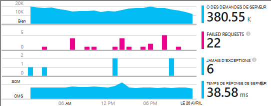
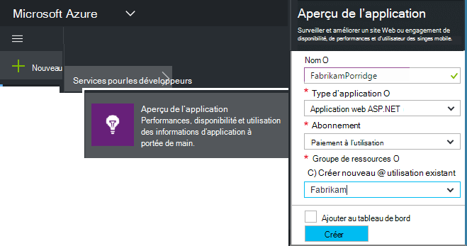
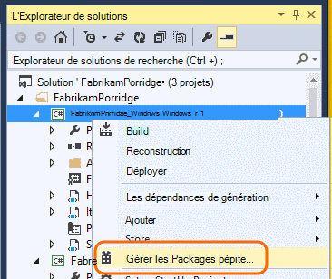
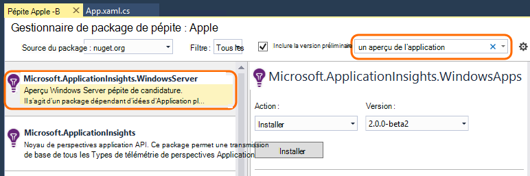
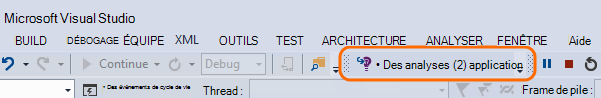
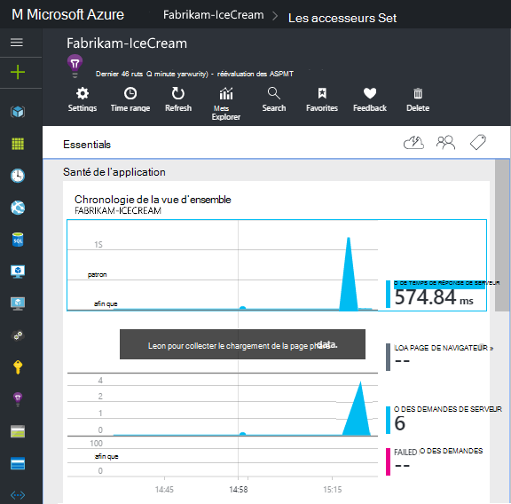
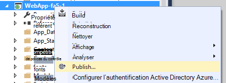

<properties
    pageTitle="Application perspectives pour les services Windows et les rôles de travail | Microsoft Azure"
    description="Ajouter manuellement le Kit de développement de perspectives Application pour analyser les performances, la disponibilité et l’utilisation de votre application ASP.NET."
    services="application-insights"
    documentationCenter=".net"
    authors="alancameronwills"
    manager="douge"/>

<tags
    ms.service="application-insights"
    ms.workload="tbd"
    ms.tgt_pltfrm="ibiza"
    ms.devlang="na"
    ms.topic="get-started-article"
    ms.date="08/30/2016"
    ms.author="awills"/>

# Configurer manuellement les informations d’Application pour les applications ASP.NET 4

*Idées d’application est en mode Aperçu.*

[AZURE.INCLUDE [app-insights-selector-get-started](../../includes/app-insights-selector-get-started.md)]

Vous pouvez configurer manuellement les [Perspectives d’Application Visual Studio](app-insights-overview.md) pour analyser les services Windows, les rôles de travail et d’autres applications ASP.NET. Pour les applications web, configuration manuelle est une alternative à la [configuration automatique](app-insights-asp-net.md) proposées par Visual Studio.

Idées d’application vous permet de diagnostiquer les problèmes et de surveiller les performances et l’utilisation dans vos applications en ligne.

#### Avant de commencer

Tu as besoin de :

* Un abonnement à [Microsoft Azure](http://azure.com). Si votre équipe ou votre organisation possède un abonnement Azure, le propriétaire peut vous ajouter, à l’aide de votre [compte Microsoft](http://live.com).
* Visual Studio 2013 ou une version ultérieure.

## 1. création d’une ressource d’informations d’Application

Connectez-vous au [portail Azure](https://portal.azure.com/)et créer une nouvelle ressource de perspectives de l’Application. Choisissez le type d’application ASP.NET.

Une [ressource](app-insights-resources-roles-access-control.md) dans Azure est une instance d’un service. Cette ressource est où données télémétriques fournies par votre application seront analysées et présentés.

Le choix du type d’application définit le contenu par défaut des propriétés et des lames de la ressource est visible dans [l’Explorateur de mesures](app-insights-metrics-explorer.md).

#### Copiez la clé d’Instrumentation

La clé identifie la ressource, et vous allez l’installer rapidement dans le Kit de développement logiciel pour diriger les données à la ressource.

Les étapes que vous venez de faire pour créer une nouvelle ressource sont un bon moyen de commencer à surveiller n’importe quelle application. Maintenant vous pouvez envoyer des données à celle-ci.

## 2. Installez le Kit de développement de votre application

Installation et configuration du Kit de développement de perspectives Application varient selon la plate-forme sur laquelle vous travaillez. Pour les applications ASP.NET, il est facile.

1. Dans Visual Studio, modifier les packages NuGet de votre projet d’application web.

    

2. Installer les aperçus d’Application SDK pour les applications Web.

    

    *Puis-je utiliser des autres packages ?*

    Oui. Choisir l’API de base (Microsoft.ApplicationInsights) si vous souhaitez uniquement utiliser l’API pour envoyer vos propres télémétrie. Le package Windows Server inclut automatiquement un certain nombre d’autres packages de collecte des compteurs de performances et de la surveillance des dépendances ainsi que l’API de base. 

#### Mise à niveau vers les versions ultérieures du Kit de développement logiciel

Nous libérer une nouvelle version du Kit de développement de temps en temps.

Pour mettre à niveau vers une [nouvelle version du Kit de développement](https://github.com/Microsoft/ApplicationInsights-dotnet-server/releases/), ouvrez à nouveau le Gestionnaire de package NuGet et filtre sur les packages installés. Sélectionnez **Microsoft.ApplicationInsights.Web** et cliquez sur **mettre à niveau**.

Si vous avez apporté des personnalisations à ApplicationInsights.config, enregistrer une copie avant de mettre à niveau et ensuite de fusionner vos modifications dans la nouvelle version.

## 3. envoi de télémétrie

**Si vous avez installé uniquement le package API de base :**

* Valeur de la clé de l’instrumentation dans le code, par exemple `main()`: 

    `TelemetryConfiguration.Active.InstrumentationKey = "`*votre clé*`";` 

* [Écrire votre propre à l’aide de l’API de télémétrie](app-insights-api-custom-events-metrics.md#ikey).

**Si vous avez installé d’autres packages de perspectives de l’Application,** si vous préférez, vous pouvez utiliser le fichier .config pour définir la clé de l’instrumentation :

* Modifier la ApplicationInsights.config (qui a été ajouté par l’installation NuGet). Insérez cette juste avant la balise de fermeture :

    `<InstrumentationKey>`*la clé d’instrumentation que vous avez copié*`</InstrumentationKey>`

* Assurez-vous que les propriétés de ApplicationInsights.config dans l’Explorateur de solutions sont définies **Build Action = teneur, Copy to Output Directory = copier**.

## Exécutez votre projet.

Utilisez **F5** pour exécuter votre application et l’essayer : ouvrir les différentes pages pour générer certains télémétrie.

Dans Visual Studio, vous verrez un décompte des événements qui ont été envoyés.

## Afficher votre télémétrie

Retourner au [portail Azure](https://portal.azure.com/) et accédez à votre ressource de perspectives de l’Application.

Rechercher des données dans les graphiques de la vue d’ensemble. Dans un premier temps, vous ne voyez qu’un ou deux points. Par exemple :

Cliquez sur n’importe quel graphique pour afficher des mesures plus détaillées. [Pour en savoir plus sur les mesures.](app-insights-web-monitor-performance.md)

#### Aucune donnée ?

* Utilisez l’application, ouvrez les différentes pages afin qu’il génère certains télémétrie.
* Ouvrez la fenêtre de [recherche](app-insights-diagnostic-search.md) , pour consulter des événements particuliers. Parfois il faut événements un peu longtemps pour obtenir via le pipeline de mesures.
* Attendez quelques secondes et cliquez sur **Actualiser**. Graphiques eux-mêmes actualiser périodiquement, mais vous pouvez actualiser manuellement si vous vous attendez des données s’affiche.
* Consultez [résolution des problèmes](app-insights-troubleshoot-faq.md).

## Publier votre application

Maintenant déployer votre application sur votre serveur ou sur Azure et regarder les données s’accumulent.

Lors de l’exécution en mode débogage, télémétrie est expédiée via le pipeline, afin que les données figurant dans les secondes qui doit s’afficher. Lorsque vous déployez votre application dans la configuration Release, les données s’accumulent plus lentement.

#### Pas de données une fois que vous publiez sur le serveur ?

Ouvrir ces ports pour le trafic sortant dans le pare-feu de votre serveur :

+ `dc.services.visualstudio.com:443`
+ `f5.services.visualstudio.com:443`

#### Problèmes sur votre serveur de builds ?

Consultez [cet article de résolution des problèmes](app-insights-asp-net-troubleshoot-no-data.md#NuGetBuild).

> [AZURE.NOTE]Si votre application génère un grand nombre de télémétrie (et vous utilisez la 2.0.0-beta3 de version du Kit de développement ASP.NET ou une version ultérieure), le module d’échantillonnage adapté réduit automatiquement le volume qui est envoyé sur le portail en envoyant uniquement une fraction représentative des événements. Toutefois, les événements liés à la même demande va être activés ou désactivées en tant que groupe, afin que vous pouvez naviguer entre les événements associés. 
> [Obtenir des informations sur le prélèvement](app-insights-sampling.md).

## Étapes suivantes

* [Ajouter plus de télémétrie](app-insights-asp-net-more.md) pour obtenir la vue de 360 degrés de votre application.

