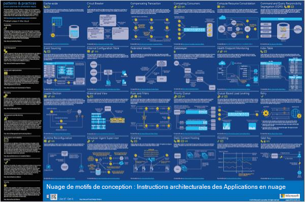

<properties 
    pageTitle="Architecture de l’application sur Microsoft Azure | Microsoft Azure" 
    description="Présentation de l’architecture qui couvre les modèles de design communs" 
    services="" 
    documentationCenter="" 
    authors="Rboucher" 
    manager="jwhit" 
    editor="mattshel"/>

<tags 
    ms.service="multiple" 
    ms.workload="na" 
    ms.tgt_pltfrm="na" 
    ms.devlang="na" 
    ms.topic="article" 
    ms.date="09/13/2016" 
    ms.author="robb"/>

#Architecture de l’application sur Microsoft Azure
Ressources pour la création d’applications qui utilisent Microsoft Azure. Cela inclut des outils pour vous aider à dessiner des diagrammes pour décrire visuellement les systèmes logiciels. 

##Affiche les modèles de conception

Modèles et méthodes Microsoft a publié le livre [Les modèles de conception de nuage](http://msdn.microsoft.com/library/dn568099.aspx) qui est disponible sur MSDN et dans le téléchargement du fichier PDF. Il existe également un poster de grand format disponible qui répertorie tous les modèles. 

##Cours de certification Microsoft architecture

Microsoft a créé un cours d’architecture prise en charge de Microsoft examen de certification 70-534. Il est [disponible gratuitement sur EDX.ORG](https://www.edx.org/course/architecting-microsoft-azure-solutions-microsoft-dev205x).  Il utilise le [Modèle de Visio plan 3D](#3d-blueprint-visio-template). 

##Solutions Microsoft

Microsoft publie un ensemble niveau élevé [des architectures de solution](http://aka.ms/azblueprints) montrant comment créer des types spécifiques de systèmes à l’aide des produits Microsoft. 

Auparavant, Microsoft a publié un ensemble de projets présentant des exemples d’architecture. Ceux ont été remplacées par les architectures de solution mentionnés précédemment, et le lien plan a été redirigé pour pointer vers les. Si vous avez besoin d’accès aux documents projets précédents pour une raison quelconque, veuillez envoyer un e-mail [CnESymbols@microsoft.com](mailto:CnESymbols@microsoft.com) avec votre demande.   

Les plans et schémas des architectures de solution utilisent des parties du [nuage et définir des symboles d’entreprise](#Drawing-symbol-and-icon-sets).   

##Modèle de plan Visio 3D

Les versions 3D des [Projets d’Architecture de Microsoft](http://aka.ms/azblueprints) maintenant défunt ont été créées initialement dans un outil non Microsoft. Un modèle de Visio 2013 (et versions ultérieur) expédiées le 5 août 2015 dans le cadre d’un [cours de certification Microsoft Architecture distribuée sur EDX.ORG](#microsoft-architecture-certification-course).

Le modèle est également disponible en dehors du cours. 

- [Afficher la vidéo de formation](http://aka.ms/3dBlueprintTemplateVideo) premier afin de savoir ce qu’il peut faire   
- Téléchargez le [Microsoft 3d modèle Visio de plan](http://aka.ms/3DBlueprintTemplate)
- Télécharger [nuage et les symboles de l’entreprise](#drawing-symbol-and-icon-sets) à utiliser avec le modèle 3D. 

Envoyez-nous un e-mail à [CnESymbols@microsoft.com](mailto:CnESymbols@microsoft.com) pour des questions spécifiques sans réponse par les supports de formation ou d’envoyer des commentaires. Le modèle n’est plus en cours de développement actif, mais il est toujours utile et pertinent, car il peut utiliser n’importe quel format PNG ou [nuage et les symboles de l’entreprise](#drawing-symbol-and-icon-sets), qui sont mis à jour.  

##Ensembles de symboles et de l’icône du dessin 

[Afficher les symboles vidéo de formation et Visio](http://aka.ms/CnESymbolsVideo) , puis [Télécharger le nuage et la valeur de symbole de l’entreprise](http://aka.ms/CnESymbols) afin de créer des documents techniques qui décrivent Azure, Windows Server, SQL Server et bien plus encore. Vous pouvez utiliser les symboles dans les diagrammes d’architecture, supports de formation, des présentations, les feuilles de données, infographics, livres blancs et documentation de partie même 3e si le livre apprend à utiliser les produits Microsoft. Toutefois, ils ne sont pas conçus pour une utilisation dans les interfaces utilisateur.

Les symboles CnE sont au format Visio, SVG et PNG. Pour obtenir des instructions supplémentaires sur la façon d’utiliser facilement utilisent les symboles dans PowerPoint sont inclus dans le jeu. 

Le jeu de symboles expédie tous les trimestres et est mis à jour pour que les nouveaux services sont libérées. 

Symboles supplémentaires pour Microsoft Office et les technologies associées sont disponibles dans [Microsoft Office Visio de gabarit](http://www.microsoft.com/en-us/download/details.aspx?id=35772), même si elles ne sont pas optimisés pour les schémas d’architecture comme le jeu CnE.   

**Commentaires :** Si vous avez utilisé les symboles CnE, remplir 5 question courte [enquête](http://aka.ms/azuresymbolssurveyv2) ou envoyez-nous un e-mail à [CnESymbols@microsoft.com](mailto:CnESymbols@microsoft.com) de problèmes et de questions spécifiques. Nous aimerions savoir ce que vous pensez, y compris les évaluations positives pour savoir de continuer à investir du temps dans les. 

##Architecture Infographics

Microsoft publie plusieurs architecture liés affiches/infographics. Ils incluent la [Création réelle nuage d’Applications](https://azure.microsoft.com/documentation/infographics/building-real-world-cloud-apps/) et [mise à l’échelle avec les Services Cloud](https://azure.microsoft.com/documentation/infographics/cloud-services/) . 

