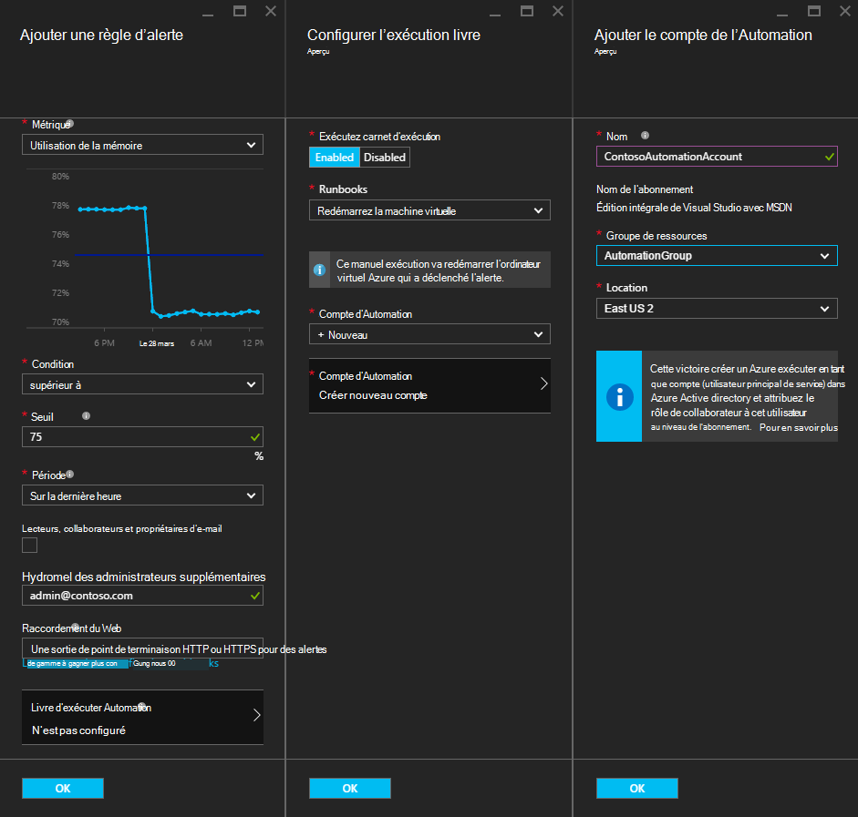
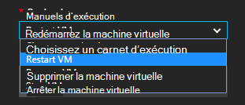
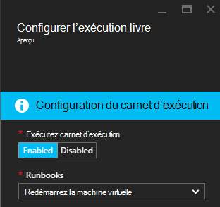
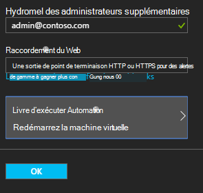

<properties
    pageTitle=" Résoudre les alertes Azure VM de procédures opérationnelles d’automatisation | Microsoft Azure"
    description="Cet article explique comment intégrer les alertes Azure Virtual Machine avec les procédures opérationnelles d’Azure Automation et résoudre automatiquement les problèmes"
    services="automation"
    documentationCenter=""
    authors="mgoedtel"
    manager="jwhit"
    editor="tysonn" />    
<tags
    ms.service="automation"
    ms.devlang="na"
    ms.topic="article"
    ms.tgt_pltfrm="na"
    ms.workload="infrastructure-services"
    ms.date="06/14/2016"
    ms.author="csand;magoedte" />

# <a name="azure-automation-scenario---remediate-azure-vm-alerts"></a>Scénario d’automatisation de Azure - mettre à jour les alertes Azure VM

Azure Automation et les ordinateurs virtuels Azure ont publié une nouvelle fonctionnalité qui vous permet de configurer les alertes de la Machine virtuelle (VM) pour exécuter des procédures opérationnelles d’Automation. Cette nouvelle fonctionnalité vous permet d’effectuer automatiquement la conversion standard en réponse à des alertes de machine virtuelle, comme le redémarrage ou l’arrêt de la machine virtuelle.

Précédemment, lors de la création d’une règle d’alerte de machine virtuelle vous pouviez [spécifier un webhook de l’Automation](https://azure.microsoft.com/blog/using-azure-automation-to-take-actions-on-azure-alerts/) pour une procédure opérationnelle afin d’exécuter la procédure opérationnelle à chaque déclenchement de l’alerte. Toutefois, cela vous permet de faire le travail de création de la procédure opérationnelle, création de la webhook pour la procédure opérationnelle, puis la copie et collage de le webhook lors de la création de la règle d’alerte requis. Avec cette nouvelle version, le processus est beaucoup plus facile car vous pouvez choisir une procédure opérationnelle à partir d’une liste lors de la création de la règle d’alerte, et vous pouvez choisir un compte d’Automation qui va exécuter la procédure opérationnelle ou facilement créer un compte.

Dans cet article, nous va vous montrer combien il est facile de définir une alerte d’Azure VM et configurer une procédure d’automatisation opérationnelle à exécuter lorsque l’alerte se déclenche. Exemples de scénarios incluent le redémarrage d’un ordinateur virtuel lors de l’utilisation de la mémoire dépasse un seuil en raison d’une application sur l’ordinateur virtuel avec une fuite de mémoire ou d’arrêter un ordinateur virtuel lorsque le temps utilisateur processeur a été inférieure à 1 % de la dernière heure et n’est pas en cours d’utilisation. Nous expliquerons également comment la création automatique d’un service principal dans votre compte d’automatisation simplifie l’utilisation des procédures opérationnelles dans Azure alerte mise à jour.

## <a name="create-an-alert-on-a-vm"></a>Créer une alerte sur un ordinateur virtuel

Effectuez les étapes suivantes pour configurer une alerte pour lancer une procédure opérationnelle lorsque son seuil a été atteint.

>[AZURE.NOTE] Avec cette version, nous ne prennent en charge prise en charge et les machines virtuelles de V2 pour classique de qu'ordinateurs virtuels seront bientôt ajoutés.  

1. Connectez-vous au portail Azure et cliquez sur des **Machines virtuelles**.  
2. Sélectionnez un de vos ordinateurs virtuels.  La lame de tableau de bord de machine virtuelle s’affiche et la lame de **paramètres** à sa droite.  
3. À partir de la blade de **paramètres** , sous la section surveillance, sélectionnez **règles d’alerte**.
4. Sur la lame de **règles d’alerte** , cliquez sur **Ajouter une alerte**.

Cela ouvre la lame **Ajouter une règle d’alerte** , qui permet de configurer les conditions de l’alerte et le choix entre un ou plusieurs des options suivantes : envoyer un e-mail à une personne, un webhook permet de transférer l’alerte vers un autre système, ou exécuter une procédure d’automatisation opérationnelle lors de tentative de réponse à la résolution des problèmes.

## <a name="configure-a-runbook"></a>Configurer une procédure opérationnelle

Pour configurer une procédure opérationnelle à exécuter lorsque le seuil d’alerte VM est remplie, sélectionnez **Procédure opérationnelle d’Automation**. De la lame de **procédure opérationnelle de configurer** , vous pouvez sélectionner la procédure opérationnelle à exécuter et le compte de l’Automation pour exécuter la procédure opérationnelle.



>[AZURE.NOTE] Pour cette version, vous pouvez choisir à partir de trois procédures opérationnelles fournie par le service, redémarrez la machine virtuelle, arrêter la machine virtuelle ou supprimer la machine virtuelle (à supprimer).  Permet de sélectionner d’autres procédures opérationnelles ou l’un de vos propres procédures opérationnelles sera disponible dans une version future.



Une fois que vous sélectionnez parmi les trois procédures opérationnelles disponibles, la liste déroulante **compte d’Automation** apparaît, et vous pouvez sélectionner un compte d’automation que la procédure opérationnelle s’exécute en tant que. Procédures opérationnelles doivent s’exécuter dans le contexte d’un [compte d’Automation](automation-security-overview.md) qui se trouve dans votre abonnement Azure. Vous pouvez sélectionner un compte d’Automation que vous avez déjà créé, ou vous pouvez avoir un nouveau compte d’Automation créé pour vous.

Les procédures opérationnelles sont fournis s’authentifier sur Azure à l’aide d’une entité de sécurité du service. Si vous choisissez d’exécuter la procédure opérationnelle dans un de vos comptes d’Automation existants, nous avons crée automatiquement le service principal pour vous. Si vous choisissez de créer un nouveau compte d’Automation, puis nous crée automatiquement le compte et l’entité du service. Dans les deux cas, deux actifs également créera dans le compte de l’automatisation – un actif de certificat nommé **AzureRunAsCertificate** et un actif de connexion nommé **AzureRunAsConnection**. Les procédures opérationnelles utilise **AzureRunAsConnection** pour authentifier avec Azure pour effectuer l’action de gestion par rapport à la machine virtuelle.

>[AZURE.NOTE] L’entité du service est créée dans le cadre de l’abonnement et le rôle de collaborateur est assignée. Ce rôle est nécessaire pour le compte dispose de l’autorisation d’exécuter les procédures opérationnelles d’Automation pour gérer les ordinateurs virtuels d’Azure.  La création d’un compte de la FSA et/ou le service principal est un événement unique. Une fois qu’ils sont créés, vous pouvez utiliser ce compte pour exécuter les procédures opérationnelles d’autres alertes Azure VM.

Lorsque vous cliquez sur **OK** l’alerte est configurée et si vous avez sélectionné l’option créer un nouveau compte d’Automation, il est créé avec le service principal.  Cette opération peut prendre quelques secondes.  



Une fois la configuration terminée, vous verrez le nom de la procédure opérationnelle apparaissent dans la blade **d’Ajouter une règle d’alerte** .



Cliquez sur **OK** dans **Ajouter une règle d’alerte** de lame et la règle d’alerte sera créés et activer si l’ordinateur virtuel est en cours d’exécution.

### <a name="enable-or-disable-a-runbook"></a>Activer ou désactiver une procédure opérationnelle

Si vous avez une procédure opérationnelle configuré pour une alerte, vous pouvez le désactiver sans supprimer la configuration de procédure opérationnelle. Cela vous permet de conserver l’alerte en cours d’exécution et peut-être tester certaines des règles d’alerte et alors réactiver ultérieurement la procédure opérationnelle.

## <a name="create-a-runbook-that-works-with-an-azure-alert"></a>Créer une procédure opérationnelle qui fonctionne avec une alerte Azure

Lorsque vous choisissez une procédure opérationnelle dans le cadre d’une règle d’alerte Azure, la procédure opérationnelle doit contenir logique pour gérer les données d’alerte qui lui sont passées.  Lorsqu’une procédure opérationnelle est configuré dans une règle d’alerte, un webhook est créé pour la procédure opérationnelle ; Ce webhook est ensuite utilisé pour démarrer la procédure opérationnelle à chaque déclenchement de l’alerte.  L’appel réel au début de la procédure opérationnelle est une demande HTTP POST vers l’URL webhook. Le corps de la demande POST contient un objet JSON-formatée qui contient les propriétés utiles relatives à l’alerte.  Comme vous pouvez le voir ci-dessous, les données d’alerte contient des détails tels que le subscriptionID, resourceGroupName, resourceName et du type de ressource.

### <a name="example-of-alert-data"></a>Exemple de données d’alerte
```
{
    "WebhookName": "AzureAlertTest",
    "RequestBody": "{
    \"status\":\"Activated\",
    \"context\": {
        \"id\":\"/subscriptions/<subscriptionId>/resourceGroups/MyResourceGroup/providers/microsoft.insights/alertrules/AlertTest\",
        \"name\":\"AlertTest\",
        \"description\":\"\",
        \"condition\": {
            \"metricName\":\"CPU percentage guest OS\",
            \"metricUnit\":\"Percent\",
            \"metricValue\":\"4.26337916666667\",
            \"threshold\":\"1\",
            \"windowSize\":\"60\",
            \"timeAggregation\":\"Average\",
            \"operator\":\"GreaterThan\"},
        \"subscriptionId\":\<subscriptionID> \",
        \"resourceGroupName\":\"TestResourceGroup\",
        \"timestamp\":\"2016-04-24T23:19:50.1440170Z\",
        \"resourceName\":\"TestVM\",
        \"resourceType\":\"microsoft.compute/virtualmachines\",
        \"resourceRegion\":\"westus\",
        \"resourceId\":\"/subscriptions/<subscriptionId>/resourceGroups/TestResourceGroup/providers/Microsoft.Compute/virtualMachines/TestVM\",
        \"portalLink\":\"https://portal.azure.com/#resource/subscriptions/<subscriptionId>/resourceGroups/TestResourceGroup/providers/Microsoft.Compute/virtualMachines/TestVM\"
        },
    \"properties\":{}
    }",
    "RequestHeader": {
        "Connection": "Keep-Alive",
        "Host": "<webhookURL>"
    }
}
```

Lorsque le service de webhook de Automation reçoit HTTP POST, il extrait les données d’alerte et passe à la procédure opérationnelle dans le paramètre d’entrée de procédure opérationnelle de WebhookData.  Voici un exemple de procédure opérationnelle qui montre comment utiliser le paramètre WebhookData et extraire les données d’alerte et l’utiliser pour gérer la ressource Azure qui a déclenché l’alerte.

### <a name="example-runbook"></a>Procédure opérationnelle d’exemple

```
#  This runbook will restart an ARM (V2) VM in response to an Azure VM alert.

[OutputType("PSAzureOperationResponse")]

param ( [object] $WebhookData )

if ($WebhookData)
{
    # Get the data object from WebhookData
    $WebhookBody = (ConvertFrom-Json -InputObject $WebhookData.RequestBody)

    # Assure that the alert status is 'Activated' (alert condition went from false to true)
    # and not 'Resolved' (alert condition went from true to false)
    if ($WebhookBody.status -eq "Activated")
    {
        # Get the info needed to identify the VM
        $AlertContext = [object] $WebhookBody.context
        $ResourceName = $AlertContext.resourceName
        $ResourceType = $AlertContext.resourceType
        $ResourceGroupName = $AlertContext.resourceGroupName
        $SubId = $AlertContext.subscriptionId

        # Assure that this is the expected resource type
        Write-Verbose "ResourceType: $ResourceType"
        if ($ResourceType -eq "microsoft.compute/virtualmachines")
        {
            # This is an ARM (V2) VM

            # Authenticate to Azure with service principal and certificate
            $ConnectionAssetName = "AzureRunAsConnection"
            $Conn = Get-AutomationConnection -Name $ConnectionAssetName
            if ($Conn -eq $null) {
                throw "Could not retrieve connection asset: $ConnectionAssetName. Check that this asset exists in the Automation account."
            }
            Add-AzureRMAccount -ServicePrincipal -Tenant $Conn.TenantID -ApplicationId $Conn.ApplicationID -CertificateThumbprint $Conn.CertificateThumbprint | Write-Verbose
            Set-AzureRmContext -SubscriptionId $SubId -ErrorAction Stop | Write-Verbose

            # Restart the VM
            Restart-AzureRmVM -Name $ResourceName -ResourceGroupName $ResourceGroupName
        } else {
            Write-Error "$ResourceType is not a supported resource type for this runbook."
        }
    } else {
        # The alert status was not 'Activated' so no action taken
        Write-Verbose ("No action taken. Alert status: " + $WebhookBody.status)
    }
} else {
    Write-Error "This runbook is meant to be started from an Azure alert only."
}
```

## <a name="summary"></a>Résumé

Lorsque vous configurez une alerte sur un ordinateur virtuel d’Azure, vous avez maintenant la possibilité de configurer facilement une procédure opérationnelle d’automatisation pour effectuer automatiquement des mesures correctives lorsque l’alerte se déclenche. Pour cette version, vous pouvez choisir à partir de procédures opérationnelles à redémarrer, arrêter ou supprimer un ordinateur virtuel en fonction de votre scénario d’alerte. C’est que le début de l’activation des scénarios où vous contrôlez les actions (notification, dépannage, mise à jour) qui va être effectuées automatiquement lorsqu’une alerte se déclenche.

## <a name="next-steps"></a>Étapes suivantes

- Pour vous familiariser avec les procédures opérationnelles de graphiques, voir [Ma première procédure de opérationnelle graphique](automation-first-runbook-graphical.md)
- Pour vous familiariser avec les procédures opérationnelles de flux de travail de PowerShell, voir [Ma première procédure de flux de travail de PowerShell opérationnelle](automation-first-runbook-textual.md)
- Pour plus d’informations sur les types de procédure opérationnelle, leurs avantages et leurs limites, consultez [types de procédure opérationnelle Azure Automation](automation-runbook-types.md)
