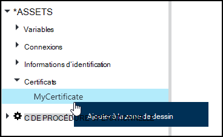
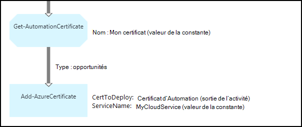

<properties 
   pageTitle="Certificats actifs dans Azure automatisation | Microsoft Azure"
   description="Les certificats peuvent être stockés en toute sécurité dans Azure Automation afin qu’ils sont accessibles par les procédures opérationnelles ou de configurations de DSC pour s’authentifier auprès d’Azure et des ressources de tiers.  Cet article explique les détails des certificats et comment les utiliser lors de la création de texte et de graphiques."
   services="automation"
   documentationCenter=""
   authors="mgoedtel"
   manager="stevenka"
   editor="tysonn" />
<tags 
   ms.service="automation"
   ms.devlang="na"
   ms.topic="article"
   ms.tgt_pltfrm="na"
   ms.workload="infrastructure-services"
   ms.date="02/23/2016"
   ms.author="magoedte;bwren" />

# Actifs de certificat dans Azure Automation

Les certificats peuvent être stockés en toute sécurité dans Azure Automation afin d’être accessible par les procédures opérationnelles ou de configurations de DSC à l’aide de l’activité de **Get-AutomationCertificate** . Cela vous permet de créer des procédures opérationnelles et des configurations de DSC qui utilisent des certificats pour l’authentification ou les ajoute aux ressources Azure ou tiers.

>[AZURE.NOTE] Sécurisation des ressources dans Azure Automation incluent les informations d’identification, des certificats, des connexions et des variables cryptés. Ces actifs sont chiffrées et stockées dans l’automatisation d’Azure à l’aide d’une clé unique qui est générée pour chaque compte d’automation. Cette clé est cryptée par un certificat-maître et stockée dans Azure Automation. Avant de stocker un actif sécurisé, la clé pour le compte de l’automatisation est décryptée à l’aide du certificat master et ensuite utilisée pour crypter l’actif.

## Applets de commande Windows PowerShell

Les applets de commande dans le tableau suivant sont utilisées pour créer et gérer les ressources de certificat automation avec Windows PowerShell. Ils sont fournis dans le cadre du [module PowerShell de Azure](../powershell-install-configure.md) qui est disponible pour une utilisation dans des procédures opérationnelles d’Automation et des configurations de DSC.

|Applets de commande|Description|
|:---|:---|
|[Get-AzureAutomationCertificate](http://msdn.microsoft.com/library/dn913765.aspx)|Récupère les informations sur un certificat. Vous ne pouvez récupérer que le certificat lui-même à partir de l’activité de Get-AutomationCertificate.|
|[Nouvelle-AzureAutomationCertificate](http://msdn.microsoft.com/library/dn913764.aspx)|Importe un certificat dans Azure Automation.|
|[Supprimer - AzureAutomationCertificate](http://msdn.microsoft.com/library/dn913773.aspx)|Supprime un certificat Azure Automation.|
|[Set - AzureAutomationCertificate](http://msdn.microsoft.com/library/dn913763.aspx)|Définit les propriétés d’un certificat existant, y compris le téléchargement du fichier de certificat et le mot de passe pour un fichier .pfx.|

## Activités d’accéder aux certificats

Les activités dans le tableau suivant sont utilisées pour accéder aux certificats dans une procédure opérationnelle ou une configuration de DSC.

|Activités|Description|
|:---|:---|
|Get-AutomationCertificate|Obtient un certificat à utiliser dans une procédure opérationnelle ou une configuration de DSC.|

>[AZURE.NOTE] Vous devez éviter d’utiliser des variables dans le paramètre – Name de Get-AutomationCertificate dans la mesure où cela peut compliquer la découverte des dépendances entre les procédures opérationnelles ou de configurations de DSC et les certificats actifs au moment du design.

## Création d’un nouveau certificat

Lorsque vous créez un nouveau certificat, vous téléchargez un fichier .cer ou .pfx à l’Automation d’Azure. Si vous sélectionnez le certificat exportable, vous pouvez également le transférer du magasin de certificats Azure Automation. S’il n’est pas exportable, puis il peut uniquement être utilisé pour la signature de la procédure opérationnelle ou la configuration de DSC.

### Pour créer un nouveau certificat avec le portail classique Azure

1. À partir de votre compte d’automation, cliquez sur **ressources** en haut de la fenêtre.
1. En bas de la fenêtre, cliquez sur **Ajouter un paramètre**.
1. Cliquez sur **Ajouter des informations d’identification**.
2. Dans la liste déroulante **Type d’identification** , sélectionnez le **certificat**.
3. Tapez un nom pour le certificat dans la zone **nom** , puis cliquez sur la flèche vers la droite.
4. Rechercher un fichier .cer ou .pfx.  Si vous sélectionnez un fichier .pfx, indiquez un mot de passe et si elle doit être autorisé à être exportés.
1. Cliquez sur la case à cocher pour enregistrer la nouvelle immobilisation de certificat et de télécharger le fichier de certificat.

### Pour créer un nouveau certificat avec le portail Azure

1. À partir de votre compte d’automation, cliquez sur la partie de **ressources** pour ouvrir la blade **d’actifs** .
1. Cliquez sur la partie de **certificats** pour ouvrir la lame de **certificats** .
1. Cliquez sur **Ajouter un certificat** au sommet de la lame.
2. Dans la zone **nom** , tapez un nom pour le certificat.
2. Sous Cliquez sur **Sélectionner un fichier de** **téléchargement d’un fichier de certificat** pour rechercher un fichier .cer ou .pfx.  Si vous sélectionnez un fichier .pfx, indiquez un mot de passe et si elle doit être autorisé à être exportés.
1. Cliquez sur **créer** pour enregistrer la nouvelle immobilisation de certificat.

### Pour créer un nouveau certificat avec Windows PowerShell

Les exemples de commandes suivants montrent comment créer un nouveau certificat de l’automatisation et la marque exportable. Cette opération importe un fichier .pfx existant.

    $certName = 'MyCertificate'
    $certPath = '.\MyCert.pfx'
    $certPwd = ConvertTo-SecureString -String 'P@$$w0rd' -AsPlainText -Force
    
    New-AzureAutomationCertificate -AutomationAccountName "MyAutomationAccount" -Name $certName -Path $certPath –Password $certPwd -Exportable

## À l’aide d’un certificat

Vous devez utiliser l’activité de **Get-AutomationCertificate** d’utiliser un certificat. Vous ne pouvez pas utiliser l’applet de commande [Get-AzureAutomationCertificate](http://msdn.microsoft.com/library/dn913765.aspx) dans la mesure où il renvoie des informations sur l’immobilisation de certificat mais pas le certificat lui-même.

### Exemple de procédure opérationnelle textuelle

L’exemple de code suivant montre comment ajouter un certificat à un service en nuage dans une procédure opérationnelle. Dans cet exemple, le mot de passe est récupéré à partir d’une variable automation crypté.

    $serviceName = 'MyCloudService'
    $cert = Get-AutomationCertificate -Name 'MyCertificate'
    $certPwd = Get-AutomationVariable –Name 'MyCertPassword'
    Add-AzureCertificate -ServiceName $serviceName -CertToDeploy $cert

### Exemple de procédure opérationnelle graphique

Vous ajoutez un **Get-AutomationCertificate** pour une procédure opérationnelle graphique en cliquant sur le certificat dans le volet Bibliothèque de l’éditeur graphique et en sélectionnant **Ajouter à la zone de dessin**.

L’image suivante montre un exemple d’utilisation d’un certificat dans une procédure opérationnelle graphique.  Voici le même exemple ci-dessus pour ajouter un certificat à un service de nuage à partir d’une procédure opérationnelle textuelle.  

Cet exemple utilise le paramètre **UseConnectionObject** de l’activité **d’Envoi-TwilioSMS** qui utilise un objet de connexion pour l’authentification auprès du service.  Un [lien de pipeline](automation-graphical-authoring-intro.md#links-and-workflow) doit être utilisé ici, dans la mesure où un lien de séquence renvoie une collection contenant un seul objet dont le paramètre de connexion n’est pas attendu.

## Voir aussi

- [Liens de programmation graphique](automation-graphical-authoring-intro.md#links-and-workflow) 
