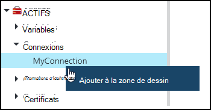
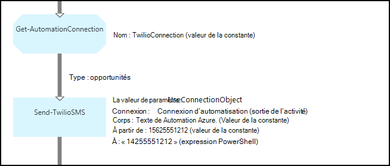
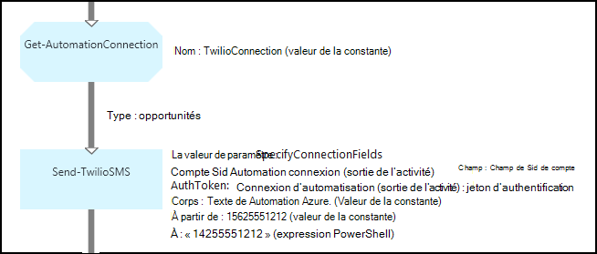

<properties 
   pageTitle="Les ressources de connexion dans Azure Automation | Microsoft Azure"
   description="Les ressources de connexion dans Azure Automation contient les informations requises pour se connecter à une application ou un service externe à partir d’une procédure opérationnelle ou la configuration de DSC. Cet article explique les détails des connexions et comment les utiliser lors de la création de texte et de graphiques."
   services="automation"
   documentationCenter=""
   authors="bwren"
   manager="stevenka"
   editor="tysonn" />
<tags 
   ms.service="automation"
   ms.devlang="na"
   ms.topic="article"
   ms.tgt_pltfrm="na"
   ms.workload="infrastructure-services"
   ms.date="01/27/2016"
   ms.author="bwren" />

# Ressources de connexion dans Azure Automation

Un élément de connexion d’Automation contient les informations requises pour se connecter à une application ou un service externe à partir d’une procédure opérationnelle ou la configuration de DSC. Cela peut inclure des informations requises pour l’authentification par exemple un nom d’utilisateur et le mot de passe en plus des informations de connexion comme une URL ou un port. La valeur d’une connexion consiste à maintenir toutes les propriétés pour la connexion à une application particulière dans un actif plutôt que de créer plusieurs variables. L’utilisateur peut modifier les valeurs pour une connexion à un seul endroit et vous pouvez passer le nom d’une connexion à une procédure opérationnelle ou la configuration de DSC dans un seul paramètre. Les propriétés d’une connexion sont accessibles dans la configuration de DSC avec l’activité de **Get-AutomationConnection** ou de procédure opérationnelle.

Lorsque vous créez une connexion, vous devez spécifier un *type de connexion*. Le type de connexion est un modèle qui définit un ensemble de propriétés. La connexion définit des valeurs pour chaque propriété définie dans le type de connexion. Types de connexion sont ajoutées à l’Automation d’Azure dans les modules d’intégration ou créées avec l' [API d’automatisation d’Azure](http://msdn.microsoft.com/library/azure/mt163818.aspx). Les types de connexion uniquement sont disponibles lorsque vous créez une connexion sont ceux qui sont installés dans votre compte d’Automation.

>[AZURE.NOTE] Sécurisation des ressources dans Azure Automation incluent les informations d’identification, des certificats, des connexions et des variables cryptés. Ces actifs sont chiffrées et stockées dans l’automatisation d’Azure à l’aide d’une clé unique qui est générée pour chaque compte d’automation. Cette clé est cryptée par un certificat-maître et stockée dans Azure Automation. Avant de stocker un actif sécurisé, la clé pour le compte de l’automatisation est décryptée à l’aide du certificat master et ensuite utilisée pour crypter l’actif.

## Applets de commande Windows PowerShell

Les applets de commande dans le tableau suivant sont utilisées pour créer et gérer les connexions d’Automation avec Windows PowerShell. Ils sont fournis dans le cadre du [module PowerShell de Azure](../powershell-install-configure.md) qui est disponible pour une utilisation dans des procédures opérationnelles d’Automation et des configurations de DSC.

|Applet de commande|Description|
|:---|:---|
|[Get-AzureAutomationConnection](http://msdn.microsoft.com/library/dn921828.aspx)|Récupère une connexion. Inclut une table de hachage avec les valeurs des champs de la de la connexion.|
|[Nouvelle-AzureAutomationConnection](http://msdn.microsoft.com/library/dn921825.aspx)|Crée une nouvelle connexion.|
|[Supprimer-AzureAutomationConnection](http://msdn.microsoft.com/library/dn921827.aspx)|Supprimer une connexion existante.|
|[Ensemble-AzureAutomationConnectionFieldValue](http://msdn.microsoft.com/library/dn921826.aspx)|Définit la valeur d’un champ particulier d’une connexion existante.|

## Activités

Les activités dans le tableau suivant sont utilisées pour accéder aux connexions dans une procédure opérationnelle ou une configuration de DSC.

|Activités|Description|
|---|---|
|Get-AutomationConnection|Obtient une connexion à utiliser. Renvoie une table de hachage avec les propriétés de la connexion.|

>[AZURE.NOTE] Vous devez éviter d’utiliser des variables dans le paramètre – Name **Get-AutomationConnection** dans la mesure où cela risque de compliquer la découverte des dépendances entre les procédures opérationnelles ou des configurations de DSC et des ressources de connexion au moment du design.

## Création d’une nouvelle connexion

### Pour créer une nouvelle connexion avec le portail classique Azure

1. À partir de votre compte d’automation, cliquez sur **ressources** en haut de la fenêtre.
1. En bas de la fenêtre, cliquez sur **Ajouter un paramètre**.
1. Cliquez sur **Ajouter une connexion**.
2. Dans la liste déroulante **Type de connexion** , sélectionnez le type de connexion que vous souhaitez créer.  L’Assistant présente les propriétés pour ce type particulier.
1. Terminez l’Assistant et cliquez sur la case à cocher pour enregistrer la nouvelle connexion.

### Pour créer une nouvelle connexion avec le portail Azure

1. À partir de votre compte d’automation, cliquez sur la partie de **ressources** pour ouvrir la blade **d’actifs** .
1. Cliquez sur la partie **connexions** pour ouvrir la lame de **connexions** .
1. Cliquez sur **Ajouter une connexion** dans la partie supérieure de la lame.
2. Dans la liste déroulante **Type** , sélectionnez le type de connexion que vous souhaitez créer. L’écran présente les propriétés pour ce type particulier.
1. Remplissez le formulaire et cliquez sur **créer** pour enregistrer la nouvelle connexion.

### Pour créer une nouvelle connexion avec Windows PowerShell

Créer une nouvelle connexion avec Windows PowerShell à l’aide de l’applet de commande [New-AzureAutomationConnection](http://msdn.microsoft.com/library/dn921825.aspx) . Cette applet de commande a un paramètre nommé **ConnectionFieldValues** qui attend une [table de hachage](http://technet.microsoft.com/library/hh847780.aspx) définissant des valeurs pour chacune des propriétés définies par le type de connexion.

Les exemples de commandes suivants créent une nouvelle connexion pour [Twilio](http://www.twilio.com) , qui est un service de téléphonie qui vous permet d’envoyer et de recevoir des messages texte.  Un exemple de module d’intégration qui inclut un type de connexion Twilio est disponible dans le [Centre de scripts](http://gallery.technet.microsoft.com/scriptcenter/Twilio-PowerShell-Module-8a8bfef8).  Ce type de connexion définit des propriétés pour le SID du compte et le jeton d’autorisation, qui sont nécessaires pour valider votre compte lors de la connexion à Twilio.  Vous devez [télécharger ce module](http://gallery.technet.microsoft.com/scriptcenter/Twilio-PowerShell-Module-8a8bfef8) et l’installer dans votre compte d’automation pour cet exemple de code fonctionner.

    $AccountSid = "DAf5fed830c6f8fac3235c5b9d58ed7ac5"
    $AuthToken  = "17d4dadfce74153d5853725143c52fd1"
    $FieldValues = @{"AccountSid" = $AccountSid;"AuthToken"=$AuthToken}

    New-AzureAutomationConnection -AutomationAccountName "MyAutomationAccount" -Name "TwilioConnection" -ConnectionTypeName "Twilio" -ConnectionFieldValues $FieldValues

## À l’aide d’une connexion dans une procédure opérationnelle ou la configuration de DSC

Vous récupérez une connexion dans une configuration de DSC avec l’applet de commande **Get-AutomationConnection** ou de procédure opérationnelle.  Cette activité extrait les valeurs des champs différents de la connexion et les retourne sous la forme d’une [table de hachage](http://go.microsoft.com/fwlink/?LinkID=324844) qui peut ensuite être utilisé avec les commandes appropriées dans la configuration de la DSC ou de procédure opérationnelle.

### Exemple de procédure opérationnelle textuelle
Les exemples de commandes suivants montrent comment utiliser la connexion Twilio dans l’exemple précédent pour envoyer un message texte à partir d’une procédure opérationnelle.  L’activité d’envoi-TwilioSMS utilisée ici a deux jeux de paramètres que chacun utiliser une autre méthode d’authentification pour le service Twilio.  L’une utilise un objet de connexion et un autre utilise des paramètres individuels pour le SID de compte et le jeton d’autorisation.  Les deux méthodes sont illustrées dans cet exemple.

    $Con = Get-AutomationConnection -Name "TwilioConnection"
    $NumTo = "14255551212"
    $NumFrom = "15625551212"
    $Body = "Text from Azure Automation."

    #Send text with connection object.
    Send-TwilioSMS -Connection $Con -From $NumFrom -To $NumTo -Body $Body

    #Send text with connection properties.
    Send-TwilioSMS -AccountSid $Con.AccountSid -AuthToken $Con.AuthToken -From $NumFrom -To $NumTo -Body $Body

### Exemples de procédure opérationnelle graphique

Vous ajoutez une activité **Get-AutomationConnection** à une procédure opérationnelle graphique en cliquant sur la connexion dans le volet Bibliothèque de l’éditeur de graphique et en sélectionnant **Ajouter à la zone de dessin**.

L’image suivante montre un exemple d’utilisation d’une connexion dans une procédure opérationnelle graphique.  Il s’agit de l’exemple indiqué ci-dessus pour l’envoi d’un message texte à l’aide de Twilio à partir d’une procédure opérationnelle textuelle.  Cet exemple utilise le paramètre **UseConnectionObject** de l’activité **d’Envoi-TwilioSMS** qui utilise un objet de connexion pour l’authentification auprès du service.  Un [lien de pipeline](automation-graphical-authoring-intro.md#links-and-workflow) est utilisée ici car le paramètre de connexion s’attend à un objet unique.

La raison pour laquelle une expression est utilisée pour la valeur de paramètre **pour** au lieu d’une valeur de constante de PowerShell est que ce paramètre attend une valeur de type chaîne tableau afin que vous pouvez envoyer à plusieurs numéros de.  Une expression de PowerShell vous permet de fournir une valeur unique ou un tableau.

L’image ci-dessous illustre le même exemple comme ci-dessus, mais utilise le paramètre **SpecifyConnectionFields** défini qui attend les paramètres AccountSid et du jeton d’authentification pour être spécifié individuellement et non à l’aide d’un objet de connexion pour l’authentification.  Dans ce cas, les champs de la connexion sont spécifiés et non l’objet lui-même.  

## Articles connexes

- [Liens de programmation graphique](automation-graphical-authoring-intro.md#links-and-workflow)
 
