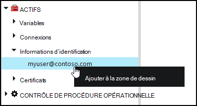
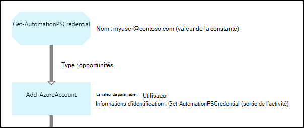

<properties 
   pageTitle="Informations d’identification d’actifs dans Azure automatisation | Microsoft Azure"
   description="Ressources d’informations d’identification dans Azure Automation contiennent des informations d’identification de sécurité qui peuvent être utilisées pour s’authentifier auprès de ressources accédés par la procédure opérationnelle ou configuration de DSC. Cet article décrit comment créer des ressources d’informations d’identification et les utiliser dans une procédure opérationnelle ou une configuration de DSC."
   services="automation"
   documentationCenter=""
   authors="mgoedtel"
   manager="jwhit"
   editor="tysonn" />
<tags 
   ms.service="automation"
   ms.devlang="na"
   ms.topic="article"
   ms.tgt_pltfrm="na"
   ms.workload="infrastructure-services"
   ms.date="06/09/2016"
   ms.author="bwren" />

# Ressources d’informations d’identification dans Azure Automation

Une ressource d’informations d’identification de Automation conserve un objet [PSCredential](http://msdn.microsoft.com/library/system.management.automation.pscredential) qui contient les informations d’identification de sécurité tel qu’un nom d’utilisateur et le mot de passe. Configurations des procédures opérationnelles et DSC peuvent utiliser les applets de commande qui accepte un objet PSCredential pour l’authentification, ou ils peuvent extraire le nom d’utilisateur et le mot de passe de l’objet PSCredential pour fournir à une application ou un service nécessitant une authentification. Les propriétés d’identification sont stockées de manière sécurisée dans Azure Automation et sont accessibles dans la configuration de DSC avec l’activité de [Get-AutomationPSCredential](http://msdn.microsoft.com/library/system.management.automation.pscredential.aspx) ou de procédure opérationnelle.

>[AZURE.NOTE] Sécurisation des ressources dans Azure Automation incluent les informations d’identification, des certificats, des connexions et des variables cryptés. Ces actifs sont chiffrées et stockées dans l’automatisation d’Azure à l’aide d’une clé unique qui est générée pour chaque compte d’automation. Cette clé est cryptée par un certificat-maître et stockée dans Azure Automation. Avant de stocker un actif sécurisé, la clé pour le compte de l’automatisation est décryptée à l’aide du certificat master et ensuite utilisée pour crypter l’actif. 

## Les applets de commande Windows PowerShell

Les applets de commande dans le tableau suivant sont utilisées pour créer et gérer des ressources d’informations d’identification d’automation avec Windows PowerShell.  Ils sont fournis dans le cadre du [module PowerShell de Azure](../powershell-install-configure.md) qui est disponible pour une utilisation dans des procédures opérationnelles d’Automation et des configurations de DSC.

|Applets de commande|Description|
|:---|:---|
|[Get-AzureAutomationCredential](http://msdn.microsoft.com/library/dn913781.aspx)|Récupère les informations sur une ressource d’informations d’identification. Vous ne pouvez récupérer que les informations d’identification lui-même à partir de l’activité de **Get-AutomationPSCredential** .|
|[Nouvelle-AzureAutomationCredential](http://msdn.microsoft.com/library/azure/jj554330.aspx)|Crée une nouvelle information d’identification d’Automation.|
|[Supprimer - AzureAutomationCredential](http://msdn.microsoft.com/library/azure/jj554330.aspx)|Supprime les informations d’identification d’Automation.|
|[Set - AzureAutomationCredential](http://msdn.microsoft.com/library/azure/jj554330.aspx)|Définit les propriétés d’une information d’identification existante de Automation.|

## Activités de procédure opérationnelle

Les activités dans le tableau suivant sont utilisées pour accéder aux informations d’identification dans une procédure opérationnelle et configurations de DSC.

|Activités|Description|
|:---|:---|
|Get-AutomationPSCredential|Obtient les informations d’identification à utiliser dans une procédure opérationnelle ou la configuration de DSC. Renvoie un objet [System.Management.Automation.PSCredential](http://msdn.microsoft.com/library/system.management.automation.pscredential) .|

>[AZURE.NOTE] Vous devez éviter d’utiliser des variables dans le paramètre – Name de Get-AutomationPSCredential, car cela peut compliquer la découverte des dépendances entre les procédures opérationnelles ou de configurations de DSC et actifs des informations d’identification au moment du design.

## Création d’une nouvelle immobilisation de d’informations d’identification

### Pour créer une nouvelle immobilisation de d’informations d’identification avec le portail classique Azure

1. À partir de votre compte d’automation, cliquez sur **ressources** en haut de la fenêtre.
1. En bas de la fenêtre, cliquez sur **Ajouter un paramètre**.
1. Cliquez sur **Ajouter des informations d’identification**.
2. Dans la liste déroulante **Type d’identification** , sélectionnez les **Informations d’identification de PowerShell**.
1. Terminez l’Assistant et cliquez sur la case à cocher pour enregistrer les nouvelles informations d’identification.

### Pour créer une nouvelle immobilisation de d’informations d’identification avec le portail Azure

1. À partir de votre compte d’automation, cliquez sur la partie de **ressources** pour ouvrir la blade **d’actifs** .
1. Cliquez sur la partie des **informations d’identification** pour ouvrir la blade **d’informations d’identification** .
1. Cliquez sur **Ajouter une information d’identification** dans la partie supérieure de la lame.
1. Remplissez le formulaire et cliquez sur **créer** pour enregistrer les nouvelles informations d’identification.

### Pour créer une nouvelle immobilisation de d’informations d’identification avec Windows PowerShell

Les exemples de commandes suivants montrent comment créer une nouvelle référence d’automation. Un objet PSCredential est d’abord créé avec le nom et le mot de passe et est ensuite utilisé pour créer la ressource d’informations d’identification. Sinon, vous pouvez utiliser l’applet de commande **Get-Credential** pour être invité à taper un nom et un mot de passe.

    $user = "MyDomain\MyUser"
    $pw = ConvertTo-SecureString "PassWord!" -AsPlainText -Force
    $cred = New-Object –TypeName System.Management.Automation.PSCredential –ArgumentList $user, $pw
    New-AzureAutomationCredential -AutomationAccountName "MyAutomationAccount" -Name "MyCredential" -Value $cred

## À l’aide des informations d’identification de PowerShell

Vous récupérez une ressource d’informations d’identification dans une procédure opérationnelle ou une configuration DSC avec l’activité de **Get-AutomationPSCredential** . Retourne un [objet de PSCredential](http://msdn.microsoft.com/library/system.management.automation.pscredential.aspx) que vous pouvez utiliser avec une activité ou une applet de commande qui requiert un paramètre PSCredential. Vous pouvez également récupérer les propriétés de l’objet d’informations d’identification à utiliser individuellement. L’objet possède une propriété pour le nom d’utilisateur et le mot de passe sécurisé, ou vous pouvez utiliser la méthode **GetNetworkCredential** pour renvoyer un objet [NetworkCredential](http://msdn.microsoft.com/library/system.net.networkcredential.aspx) qui fournira une version sécurisée du mot de passe.

### Exemple de procédure opérationnelle textuelle

Les exemples de commandes suivants illustrent l’utilisation des informations d’identification de PowerShell dans une procédure opérationnelle. Dans cet exemple, les informations d’identification sont récupérée et son nom d’utilisateur et le mot de passe affectés à des variables.

    $myCredential = Get-AutomationPSCredential -Name 'MyCredential'
    $userName = $myCredential.UserName
    $securePassword = $myCredential.Password
    $password = $myCredential.GetNetworkCredential().Password

### Exemple de procédure opérationnelle graphique

Vous ajoutez une activité **Get-AutomationPSCredential** pour une procédure opérationnelle graphique en cliquant sur les informations d’identification dans le volet Bibliothèque de l’éditeur graphique et en sélectionnant **Ajouter à la zone de dessin**.

L’image suivante montre un exemple d’utilisation des informations d’identification dans une procédure opérationnelle graphique.  Dans ce cas, il est utilisé pour l’authentification d’une procédure opérationnelle aux ressources Azure comme décrit dans les [Authentifier les procédures opérationnelles avec un compte d’utilisateur d’AD Azure](automation-sec-configure-aduser-account.md).  La première activité récupère les informations d’identification qui a accès à l’abonnement Azure.  L’activité de **AzureAccount-ajouter** utilise ensuite ces informations d’identification pour fournir une authentification pour toutes les activités qui viennent après lui.  Un [lien de pipeline](automation-graphical-authoring-intro.md#links-and-workflow) est ici car **Get-AutomationPSCredential** s’attend à un objet unique.  

## À l’aide d’informations d’identification de PowerShell dans DSC
Tandis que les configurations de DSC dans Azure Automation peuvent faire référence à des ressources d’informations d’identification à l’aide de **Get-AutomationPSCredential**, les ressources d’informations d’identification peuvent également transmises via des paramètres, si vous le souhaitez. Pour plus d’informations, consultez [configurations de compilation dans Azure Automation DSC](automation-dsc-compile.md#credential-assets).

## Étapes suivantes

- Pour en savoir plus sur les liens lors de la création de graphiques, voir les [liens lors de la création de graphiques](automation-graphical-authoring-intro.md#links-and-workflow)
- Pour comprendre les différentes méthodes d’authentification avec l’Automation, consultez [Sécurité d’Automation Azure](automation-security-overview.md)
- Pour vous familiariser avec les procédures opérationnelles de graphiques, voir [Ma première procédure de opérationnelle graphique](automation-first-runbook-graphical.md)
- Pour vous familiariser avec les procédures opérationnelles de flux de travail de PowerShell, voir [Ma première procédure de flux de travail de PowerShell opérationnelle](automation-first-runbook-textual.md) 

 
