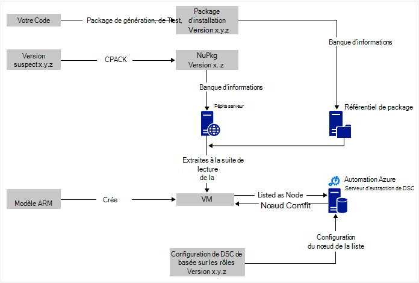
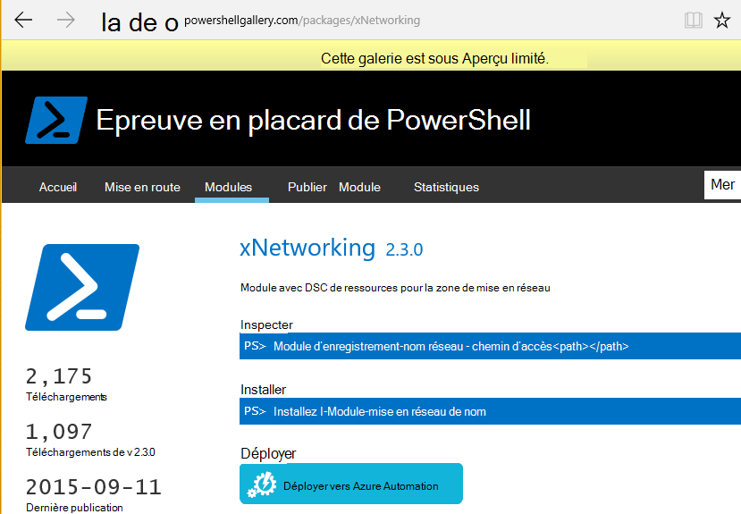

<properties
   pageTitle="Déploiement continue d’Automation Azure DSC avec Chocolatey | Microsoft Azure"
   description="DevOps déploiement continu à l’aide d’Azure Automation DSC et le Gestionnaire de package de Chocolatey.  Exemple avec JSON ARM complet et source de PowerShell."
   services="automation"
   documentationCenter=""
   authors="sebastus"
   manager="stevenka"
   editor=""/>

<tags
   ms.service="automation"
   ms.devlang="na"
   ms.topic="article"
   ms.tgt_pltfrm="vm-windows"
   ms.workload="na"
   ms.date="08/08/2016"
   ms.author="golive"/>

# Exemple d’utilisation : Le déploiement continu à des Machines virtuelles à l’aide de Automation DSC et Chocolatey

Dans un monde DevOps, il existe de nombreux outils pour aider à différents points dans le pipeline de l’intégration continue.  État de Azure Automation Desired Configuration (DSC) est un nouvel ajout DevOps équipes peuvent utiliser les options de.  Cet article décrit la configuration d’un déploiement continu (CD) d’un ordinateur Windows.  Vous pouvez facilement étendre la technique pour inclure des ordinateurs Windows autant que nécessaire dans le rôle (par exemple, un site web) et à partir de là, ainsi que des rôles supplémentaires.

## À un niveau élevé

Il est un peu passe ici, mais heureusement il peut être scindé en deux processus principales : 

  - Écriture de code test, puis création et publication des packages d’installation pour les versions principales et secondaires du système. 
  - Création et gestion des ordinateurs virtuels qui va installer et exécuter le code dans les packages.  

Une fois ces deux principaux processus sont en place, il s’agit d’une étape courte pour mettre à jour automatiquement le package en cours d’exécution sur n’importe quel ordinateur virtuel particulier comme de nouvelles versions sont créées et déployées.

## Vue d’ensemble du composant

Responsables du lot comme [apt-get](https://en.wikipedia.org/wiki/Advanced_Packaging_Tool) sont assez bien connu dans le monde Linux, mais pas trop dans le monde de Windows.  [Chocolatey](https://chocolatey.org/) est une telle chose et de Scott Hanselman [blog](http://www.hanselman.com/blog/IsTheWindowsUserReadyForAptget.aspx) sur le sujet est une excellente introduction.  En bref, Chocolatey vous permet d’installer à partir d’un référentiel central des packages dans un système Windows à l’aide de la ligne de commande.  Vous pouvez créer et gérer votre propre référentiel et Chocolatey pouvez installer les packages à partir de n’importe quel nombre de référentiels que vous désignez.

Configuration d’état souhaité (DSC) ([vue d’ensemble](https://technet.microsoft.com/library/dn249912.aspx)) est un outil de PowerShell qui vous permet de déclarer la configuration que vous souhaitez pour une machine.  Par exemple, vous pouvez dire, « souhaitée Chocolatey installé, je veux que IIS est installé, je veux que le port 80 est ouvert, désiré 1.0.0 installé version de mon site Web. »  La DSC Local Configuration Manager (LCM) implémente cette configuration. Un serveur d’extraction de DSC contient un référentiel des configurations pour vos ordinateurs. Le LCM sur chaque machine archive périodiquement pour voir si sa configuration correspond à la configuration stockée. Il peut indiquer un état ou tenter de remettre la machine en alignement avec la configuration stockée. Vous pouvez modifier la configuration stockée sur le serveur de collecte pour provoquer un ordinateur ou un ensemble d’ordinateurs à se mettre en adéquation avec la configuration a changé.

Automation Azure est un service géré dans Microsoft Azure qui vous permet d’automatiser de nombreuses tâches à l’aide de procédures opérationnelles, nœuds, informations d’identification, des ressources telles que les planifications et les variables globales. Azure Automation DSC étend cette capacité d’automatisation pour intégrer des outils de PowerShell DSC.  Voici une excellente [vue d’ensemble](automation-dsc-overview.md).

Une ressource de DSC est un module de code qui présente des fonctionnalités spécifiques, telles que la gestion réseau, Active Directory ou SQL Server.  La ressource de DSC Chocolatey sait comment accéder à un serveur NuGet (entre autres), télécharger les packages, installer des packages et ainsi de suite.  Il existe de nombreuses autres ressources DSC dans la [Galerie de PowerShell](http://www.powershellgallery.com/packages?q=dsc+resources&prerelease=&sortOrder=package-title).  Ces modules sont installés dans Azure DSC extraire serveur Automation (par vous) afin qu’elles puissent être utilisées par vos configurations.

Modèles ARM assurent une méthode déclarative de génération de votre infrastructure - éléments tels que les réseaux, sous-réseaux, sécurité du réseau et le routage, chargement équilibreurs, cartes réseau, VM et ainsi de suite.  Voici un [article](../resource-manager-deployment-model.md) qui compare le modèle de déploiement ARM (déclaratif) avec la gestion des services Azure (ASM ou classique) le modèle de déploiement (impératif).  Et un autre [article](../virtual-machines/virtual-machines-windows-compare-deployment-models.md) sur les fournisseurs de ressources de base, stockage et réseau.

Une des principales caractéristiques d’un modèle ARM sont sa capacité à installer une extension de la machine virtuelle dans la machine virtuelle, tel qu’il est mis en service.  Une extension de la machine virtuelle présente des fonctionnalités spécifiques telles que l’exécution d’un script personnalisé, l’installation d’un logiciel antivirus ou l’exécution d’un script de configuration DSC.  Il existe de nombreux autres types d’extensions de la machine virtuelle.

## Aller-retour rapide autour du diagramme

Partant du haut, vous écrivez votre code, générer, tester, puis créez un package d’installation.  Chocolatey peut gérer différents types de packages d’installation, tel que MSI, MSU, ZIP.  Et vous avez toute la puissance de PowerShell pour effectuer l’installation si les fonctionnalités natives du Chocolatey ne sont pas tout à fait à elle.  Placer le package dans un endroit accessible à un référentiel de package.  Utilisation de cet exemple utilise un dossier public dans un compte de stockage blob Azure, mais elle peut être de n’importe où.  Chocolatey fonctionne en mode natif avec NuGet serveurs et quelques autres pour la gestion des métadonnées du lot.  [Cet article](https://github.com/chocolatey/choco/wiki/How-To-Host-Feed) décrit les options.  Cet exemple montre comment l’utilisation utilise NuGet.  Un Nuspec est métadonnées sur vos packages.  Nuspec est « compilé » dans NuPkg et stocké dans un serveur NuGet.  Lorsque votre configuration nécessite un package par nom et fait référence à un serveur NuGet, la ressource DSC Chocolatey (sur la machine virtuelle) extrait le package et l’installe pour vous.  Vous pouvez également demander une version spécifique d’un package.

Dans la partie inférieure gauche de l’image, il existe un modèle Azure Resource Manager (ARM).  Dans cet exemple de l’utilisation, l’extension de la machine virtuelle inscrit l’ordinateur virtuel avec le serveur de collecte Azure Automation DSC (c'est-à-dire un serveur extraction) sous la forme d’un nœud.  La configuration est stockée dans le serveur de collecte.  En fait, il trouve deux fois : une fois en tant que texte brut et une fois compilé sous la forme d’un fichier MOF (pour ceux qui connaissent des éléments.)  Dans le portail, la structure MOF est une configuration « nœud » (et non simplement « configuration »).  Il est l’objet qui est associé à un nœud pour le nœud saura sa configuration.  Détails ci-dessous montrent comment affecter la configuration de nœud pour le nœud.

Vraisemblablement, vous faites déjà le bit en haut, ou la majeure partie.  Création de nuspec, la compilation et la stocker dans un serveur NuGet sont une petite chose.  Et vous gérez déjà des ordinateurs virtuels.  Étape suivante au déploiement continue nécessite la configuration du serveur d’extraction (une fois), inscrire vos nœuds avec lui (une fois), création et stocker la configuration il (initialement).  Actualiser ensuite lorsque les packages sont mis à niveau et déployées dans le référentiel, la Configuration et la Configuration du nœud dans le serveur d’extraction (répétition si nécessaire).

Si vous ne commencez pas avec un modèle d’ARM, qui est également OK.  Il existe des applets de commande PowerShell conçu pour vous aider à enregistrer vos ordinateurs virtuels avec le serveur extrait et tout le reste. Pour plus d’informations, consultez cet article : [machines d’intégration pour la gestion par Azure Automation DSC](automation-dsc-onboarding.md)

## Étape 1 : Configuration du compte de serveur et de l’automatisation des extraits

Sur une ligne de commande (Add-AzureRmAccount) PowerShell authentifié : (peut prendre quelques minutes pendant que le serveur d’extraction est configuré)

    New-AzureRmResourceGroup –Name MY-AUTOMATION-RG –Location MY-RG-LOCATION-IN-QUOTES
    New-AzureRmAutomationAccount –ResourceGroupName MY-AUTOMATION-RG –Location MY-RG-LOCATION-IN-QUOTES –Name MY-AUTOMATION-ACCOUNT 

Vous pouvez placer votre compte automation dans une des régions suivantes (également appelé emplacement) : américains Extrême-Orient 2, Sud, nous Gov Virginia, Europe de l’ouest, Asie du Sud-est, Japon Moyen-Orient, Central de l’Inde et sud-est de l’Australie.

## Étape 2 : Ajustements d’extension machine virtuelle au modèle ARM

Détails de la machine virtuelle d’enregistrement (à l’aide de l’extension de la machine virtuelle de PowerShell DSC) fourni dans ce [Modèle de démarrage rapide d’Azure](https://github.com/Azure/azure-quickstart-templates/tree/master/dsc-extension-azure-automation-pullserver).  Cette étape enregistre votre nouvel ordinateur virtuel avec le serveur d’extraction de la liste de nœuds de DSC.  Partie de l’enregistrement consiste à spécifier la configuration du nœud à appliquer au nœud.  Cette configuration de nœud n’existe encore sur le serveur de collecte, afin qu’il soit OK étape 4 est où cela pour la première fois.  Mais ici à l’étape 2 vous devez avoir décidé le nom du nœud et le nom de la configuration.  Dans cet exemple de l’utilisation, le nœud est 'isvbox', et la configuration est 'ISVBoxConfig'.  Le nom de configuration de nœud (à préciser dans DeploymentTemplate.json) est « ISVBoxConfig.isvbox ».  

## Étape 3 : Ajout de ressources de DSC requis sur le serveur de collecte

La galerie de PowerShell est instrumentée pour installer les ressources DSC dans votre compte Azure Automation.  Accédez à la ressource que vous souhaitez et cliquez sur le bouton « Déployer pour Azure Automation ».

Une autre technique récemment ajoutée sur le portail Azure vous permet à tirer de nouveaux modules ou de mettre à jour les modules existants. Cliquez sur la ressource du compte de l’automatisation, la mosaïque actifs et, enfin, la mosaïque de Modules.  L’icône de parcourir la galerie vous permet de voir la liste des modules dans la galerie, explorez en détail et enfin importer dans votre compte d’Automation. Il s’agit d’un excellent moyen de vos modules de mise à jour de temps en temps. Et bien, la fonctionnalité d’importation vérifie des dépendances avec d’autres modules pour garantir la que valeur nothing est désynchronisé.

Ou, l’approche manuelle.  La structure de dossiers d’un Module d’intégration pour un ordinateur de Windows PowerShell est un peu différente de la structure de dossier attendue par l’automatisation Azure.  Cela nécessite une légère modification de votre part.  Il n’est pas difficile, mais il est exécuté une seule fois par ressource (sauf si vous souhaitez mettre à niveau dans un avenir.)  Pour plus d’informations sur la création de Modules d’intégration PowerShell, consultez cet article : [Création de Modules d’intégration pour l’Automation d’Azure](https://azure.microsoft.com/blog/authoring-integration-modules-for-azure-automation/)

-   Installez le module dont vous avez besoin sur votre station de travail, comme suit :
    -   Installation de [Windows Management Framework, v5](http://aka.ms/wmf5latest) (ne pas nécessaire pour Windows 10)
    -   `Install-Module –Name MODULE-NAME`< — extrait le module à partir de la galerie de PowerShell 
-   Copiez le dossier du module à partir de `c:\Program Files\WindowsPowerShell\Modules\MODULE-NAME` dans un dossier Temp. 
-   Supprimez les exemples et la documentation dans le dossier principal 
-   Compressez le dossier principal, nommer le fichier ZIP exactement le même que le dossier 
-   Placez le fichier ZIP dans un emplacement HTTP accessible, tels que le stockage blob dans un compte de stockage Azure.
-   Exécutez cette PowerShell :

        New-AzureRmAutomationModule `
            -ResourceGroupName MY-AUTOMATION-RG -AutomationAccountName MY-AUTOMATION-ACCOUNT `
            -Name MODULE-NAME –ContentLink "https://STORAGE-URI/CONTAINERNAME/MODULE-NAME.zip"
        

L’exemple inclus effectue ces étapes pour cChoco et xNetworking. Consultez les [Notes](#notes) pour un traitement spécial pour cChoco.

## Étape 4 : Ajout de la configuration de nœud pour le serveur de collecte

Il n’y a rien de spécial sur la première fois que vous importez votre configuration dans le serveur de collecte et de la compilation.  Tous les importer/les compilations suivantes de la même configuration exactement la même apparence.  Chaque fois vous mettre à jour votre package et que vous devez envoyer à la production vous procédez à cette étape après avoir vérifié que le fichier de configuration est correct, y compris la nouvelle version de votre package.  Voici le fichier de configuration et de PowerShell :

ISVBoxConfig.ps1 :

    Configuration ISVBoxConfig 
    { 
        Import-DscResource -ModuleName cChoco 
        Import-DscResource -ModuleName xNetworking
    
        Node "isvbox" {   
    
            cChocoInstaller installChoco 
            { 
                InstallDir = "C:\choco" 
            }
    
            WindowsFeature installIIS 
            { 
                Ensure="Present" 
                Name="Web-Server" 
            }
    
            xFirewall WebFirewallRule 
            { 
                Direction = "Inbound" 
                Name = "Web-Server-TCP-In" 
                DisplayName = "Web Server (TCP-In)" 
                Description = "IIS allow incoming web site traffic." 
                DisplayGroup = "IIS Incoming Traffic" 
                State = "Enabled" 
                Access = "Allow" 
                Protocol = "TCP" 
                LocalPort = "80" 
                Ensure = "Present" 
            }
    
            cChocoPackageInstaller trivialWeb 
            {            
                Name = "trivialweb" 
                Version = "1.0.0" 
                Source = “MY-NUGET-V2-SERVER-ADDRESS” 
                DependsOn = "[cChocoInstaller]installChoco", 
                "[WindowsFeature]installIIS" 
            } 
        }    
    }

Nouveau-ConfigurationScript.ps1 :

    Import-AzureRmAutomationDscConfiguration ` 
        -ResourceGroupName MY-AUTOMATION-RG –AutomationAccountName MY-AUTOMATION-ACCOUNT ` 
        -SourcePath C:\temp\AzureAutomationDsc\ISVBoxConfig.ps1 ` 
        -Published –Force
    
    $jobData = Start-AzureRmAutomationDscCompilationJob ` 
        -ResourceGroupName MY-AUTOMATION-RG –AutomationAccountName MY-AUTOMATION-ACCOUNT ` 
        -ConfigurationName ISVBoxConfig 
    
    $compilationJobId = $jobData.Id
    
    Get-AzureRmAutomationDscCompilationJob ` 
        -ResourceGroupName MY-AUTOMATION-RG –AutomationAccountName MY-AUTOMATION-ACCOUNT ` 
        -Id $compilationJobId

Le résultat de ces étapes dans une nouvelle configuration de nœud nommé « ISVBoxConfig.isvbox », qui est placé sur le serveur de collecte.  Le nom de configuration du nœud est construit comme « configurationName.nodeName ».

## Étape 5 : Création et la gestion des métadonnées du lot

Pour chaque package que vous placez dans le référentiel de package, vous avez besoin d’un nuspec qui le décrit.  Ce nuspec doit être compilé et stocké dans votre serveur NuGet. Ce processus est décrit [ici](http://docs.nuget.org/create/creating-and-publishing-a-package).  Vous pouvez utiliser MyGet.org comme un serveur NuGet.  Ils vendent ce service, mais ont un starter SKU qui est libre.  Sur NuGet.org, vous trouverez des instructions sur l’installation de votre propre serveur NuGet pour vos packages privés.

## Étape 6 : Tout relier

Chaque fois qu’une version passe QA et est approuvée pour le déploiement, le package est créé, nuspec et nupkg mis à jour et déployés sur le serveur NuGet.  En outre, la configuration (étape 4 ci-dessus) doit être mis à jour pour s’accorder avec le nouveau numéro de version.  Il doit être envoyé au serveur collecteur et compilé.  À ce stade, c’est aux ordinateurs virtuels qui dépendent de cette configuration pour extraire la mise à jour et les installer.  Chacune de ces mises à jour sont simples - seulement une ou deux lignes de PowerShell.  Dans le cas de Visual Studio Team Services, certaines d'entre elles sont encapsulées dans les tâches de génération peuvent être chaînés dans une build.  Cet [article](https://www.visualstudio.com/en-us/docs/alm-devops-feature-index#continuous-delivery) fournit plus de détails.  Cette [mis en pension de GitHub](https://github.com/Microsoft/vso-agent-tasks) décrit en détail les différentes tâches de génération disponibles.

## Notes

Cet exemple de l’utilisation démarre avec un ordinateur virtuel à partir d’une image de Windows Server 2012 R2 générique à partir de la galerie d’Azure.  Vous pouvez démarrer à partir de n’importe quelle image stockée et ensuite affiner à partir de là, avec la configuration de DSC.  Toutefois, il est beaucoup plus difficile à mettre à jour dynamiquement la configuration à l’aide de DSC de modification de configuration qui est intégrée dans une image.

Vous n’êtes pas obligé d’utiliser un modèle ARM et l’extension de la machine virtuelle pour utiliser cette technique avec vos ordinateurs virtuels.  Et vos ordinateurs virtuels n’ont sur Azure sous gestion de CD.  Tout ce qui est nécessaire est que Chocolatey soit installé et le LCM est configuré sur l’ordinateur virtuel afin qu’il sache où le serveur extrait est.  

Bien sûr, lorsque vous mettez à jour un package sur un ordinateur virtuel qui est en production, vous devez prendre cet ordinateur virtuel de rotation pendant l’installation de la mise à jour.  Comment cela varie considérablement.  Par exemple, avec une machine virtuelle derrière un équilibreur de charge Azure, vous pouvez ajouter une sonde de personnalisé.  Lors de la mise à jour de la machine virtuelle, ont l’extrémité de la sonde à retourner un 400.  L’affinage nécessaire pour forcer cette modification peut être à l’intérieur de votre configuration, que vous pouvez l’affinage pour qu’il retourne un 200 une fois la mise à jour est terminée.

Source complète de cet exemple de l’utilisation est dans [ce projet de Visual Studio](https://github.com/sebastus/ARM/tree/master/CDIaaSVM) sur GitHub.

##Articles connexes##

- [Vue d’ensemble de Automation azure DSC] (automation-dsc-overview.md)
- [Azure Automation DSC applets de commande] (https://msdn.microsoft.com/library/mt244122.aspx)
- [Intégration de machines pour la gestion par Azure Automation DSC] (automation-dsc-onboarding.md)
