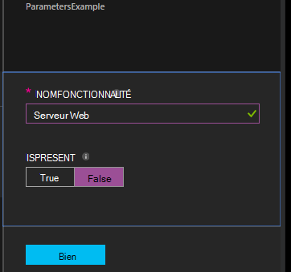

<properties 
   pageTitle="Compilation des configurations dans Azure Automation DSC | Microsoft Azure" 
   description="Vue d’ensemble des deux façons de compiler les configurations de la Configuration souhaitée de l’état (DSC) : dans le portail Azure et avec Windows PowerShell. " 
   services="automation" 
   documentationCenter="na" 
   authors="coreyp-at-msft" 
   manager="stevenka" 
   editor="tysonn"/>

<tags
   ms.service="automation"
   ms.devlang="na"
   ms.topic="article"
   ms.tgt_pltfrm="powershell"
   ms.workload="na" 
   ms.date="01/25/2016"
   ms.author="coreyp"/>
   
#Compilation des configurations dans Azure Automation DSC#

Vous pouvez compiler les configurations de Configuration souhaité de l’état (DSC) de deux manières différentes avec Azure Automation : dans le portail Azure et avec Windows PowerShell. Le tableau suivant vous aidera à déterminer quand utiliser la méthode basée sur les caractéristiques de chaque : 

###Portail d’aperçu Azure###
- Méthode la plus simple avec une interface utilisateur interactive
- Formulaire pour fournir des valeurs de paramètre simple
- Suivre facilement l’état de la tâche
- Accès authentifié avec Azure d’ouverture de session

###Windows PowerShell###
- Appeler à partir de la ligne de commande avec les applets de commande Windows PowerShell
- Peut être inclus dans la solution automatisée avec plusieurs étapes
- Fournir des valeurs de paramètre simples et complexes
- Suivre l’état de la tâche
- Client doit prendre en charge les applets de commande PowerShell
- ConfigurationData de passe
- Compiler les configurations qui utilisent des informations d’identification

Une fois que vous avez choisi une méthode de compilation, vous pouvez suivre les procédures ci-dessous pour lancer la compilation.

##Compilation d’une Configuration de DSC avec le portail Azure##

1.  À partir de votre compte d’automation, cliquez sur **Configurations**.
2.  Cliquez sur une configuration pour ouvrir sa carte.
3.  Cliquez sur **compiler**.
4.  Si la configuration n’a aucun paramètre, le système vous demandera de confirmer si vous souhaitez compiler. Si la configuration possède des paramètres, la lame de **Compiler la Configuration** s’ouvre pour vous permettre de valeurs de paramètre. Reportez-vous à la section <a href="#basic-parameters">**Paramètres de base**</a> ci-dessous pour plus de détails sur les paramètres.
5.  La **Travail de Compilation de** lame est ouvert afin que vous pouvez suivre le statut de la tâche de la compilation et les configurations de nœud (documents de configuration MOF) il dû être placés sur le serveur d’extraire des DSC Azure l’Automation.

##Compilation d’une Configuration de DSC avec Windows PowerShell##

Vous pouvez utiliser [`Start-AzureRmAutomationDscCompilationJob`](https://msdn.microsoft.com/library/mt244118.aspx) pour lancer la compilation avec Windows PowerShell. L’exemple de code suivant commence la compilation d’une configuration de DSC appelée **SampleConfig**.

    Start-AzureRmAutomationDscCompilationJob -ResourceGroupName "MyResourceGroup" -AutomationAccountName "MyAutomationAccount" -ConfigurationName "SampleConfig" 
 
`Start-AzureRmAutomationDscCompilationJob`Retourne un objet de travail de compilation que vous pouvez utiliser pour effectuer le suivi de son état. Vous pouvez ensuite utiliser cet objet de tâche de compilation avec [`Get-AzureRmAutomationDscCompilationJob`](https://msdn.microsoft.com/library/mt244120.aspx) pour déterminer l’état de la tâche de compilation, et [`Get-AzureRmAutomationDscCompilationJobOutput`](https://msdn.microsoft.com/library/mt244103.aspx) pour afficher ses flux (de sortie). L’exemple de code suivant démarre la compilation de la configuration de **SampleConfig** , attend jusqu'à ce qu’il a terminé, puis affiche ses flux.
    
    $CompilationJob = Start-AzureRmAutomationDscCompilationJob -ResourceGroupName "MyResourceGroup" -AutomationAccountName "MyAutomationAccount" -ConfigurationName "SampleConfig"
    
    while($CompilationJob.EndTime –eq $null -and $CompilationJob.Exception –eq $null)           
    {
        $CompilationJob = $CompilationJob | Get-AzureRmAutomationDscCompilationJob
        Start-Sleep -Seconds 3
    }
    
    $CompilationJob | Get-AzureRmAutomationDscCompilationJobOutput –Stream Any 

##Paramètres de base##

Déclaration de paramètre dans les configurations de DSC, y compris les types de paramètres et propriétés, fonctionne de la même que dans les procédures opérationnelles d’Automation d’Azure. Consultez le [début d’une procédure opérationnelle dans Azure Automation](automation-starting-a-runbook.md) pour en savoir plus sur les paramètres de procédure opérationnelle.

L’exemple suivant utilise deux paramètres appelés **NomFonctionnalité** et **IsPresent**, pour déterminer les valeurs des propriétés dans la configuration du nœud **ParametersExample.sample** , générés pendant la compilation.

    Configuration ParametersExample
    {
        param(
            [Parameter(Mandatory=$true)]
    
            [string] $FeatureName,
    
            [Parameter(Mandatory=$true)]
            [boolean] $IsPresent
        )
    
        $EnsureString = "Present"
        if($IsPresent -eq $false)
        {
            $EnsureString = "Absent"
        }
    
        Node "sample"
        {
            WindowsFeature ($FeatureName + "Feature")
            {
                Ensure = $EnsureString
                Name = $FeatureName
            }
        }
    }

Vous pouvez compiler DSC les Configurations qui utilisent les paramètres de base dans le portail Azure Automation DSC ou avec Azure PowerShell :

###Portail###

Dans le portail, vous pouvez entrer des valeurs de paramètre après avoir cliqué sur **compiler**.

###PowerShell###

PowerShell nécessite des paramètres dans une [table de hachage](http://technet.microsoft.com/library/hh847780.aspx) dans lequel la clé correspond au nom de paramètre et la valeur est égale à la valeur du paramètre.

    $Parameters = @{
            "FeatureName" = "Web-Server"
            "IsPresent" = $False
    }
    
    
    Start-AzureRmAutomationDscCompilationJob -ResourceGroupName "MyResourceGroup" -AutomationAccountName "MyAutomationAccount" -ConfigurationName "ParametersExample" -Parameters $Parameters 
    

Pour plus d’informations sur le passage de PSCredentials en tant que paramètres, consultez <a href="#credential-assets">**Les ressources d’informations d’identification**</a> ci-dessous.

##ConfigurationData##

**ConfigurationData** vous permet de séparer la configuration structurelle d’une configuration spécifique de l’environnement lors de l’utilisation de PowerShell DSC. Consultez [séparation « Quoi » de « Where » dans PowerShell DSC](http://blogs.msdn.com/b/powershell/archive/2014/01/09/continuous-deployment-using-dsc-with-minimal-change.aspx) pour en savoir plus sur **ConfigurationData**.

>[AZURE.NOTE] Vous pouvez utiliser **ConfigurationData** lors de la compilation dans Azure DSC de Automation à l’aide de PowerShell d’Azure, mais pas dans le portail Azure.

L’exemple de configuration DSC suivant utilise **ConfigurationData** via les mots clés **$ConfigurationData** et **$AllNodes** . Vous aurez également besoin du [module de **xWebAdministration** ](https://www.powershellgallery.com/packages/xWebAdministration/) pour cet exemple :

     Configuration ConfigurationDataSample
     {
        Import-DscResource -ModuleName xWebAdministration -Name MSFT_xWebsite
    
        Write-Verbose $ConfigurationData.NonNodeData.SomeMessage 
    
        Node $AllNodes.Where{$_.Role -eq "WebServer"}.NodeName
        {
            xWebsite Site
            {
                Name = $Node.SiteName
                PhysicalPath = $Node.SiteContents
                Ensure   = "Present"
            }
        }
    }

Vous pouvez compiler la configuration DSC ci-dessus avec PowerShell. La ci-dessous PowerShell ajoute deux configurations de nœud au serveur extraction de DSC Automation d’Azure : **ConfigurationDataSample.MyVM1** et **ConfigurationDataSample.MyVM3**:

    $ConfigData = @{
        AllNodes = @(
            @{
                NodeName = "MyVM1"
                Role = "WebServer"
            },
            @{
                NodeName = "MyVM2"
                Role = "SQLServer"
            },
            @{
                NodeName = "MyVM3"
                Role = "WebServer"
    
            }
    
        )
    
        NonNodeData = @{
            SomeMessage = "I love Azure Automation DSC!"
    
        }
    
    } 
    
    Start-AzureRmAutomationDscCompilationJob -ResourceGroupName "MyResourceGroup" -AutomationAccountName "MyAutomationAccount" -ConfigurationName "ConfigurationDataSample" -ConfigurationData $ConfigData

##Actifs##

Les références de ressources sont les mêmes dans les procédures opérationnelles et des configurations d’Azure Automation DSC. Pour plus d’informations, consultez :

- [Certificats](automation-certificates.md)
- [Connexions](automation-connections.md)
- [Informations d’identification](automation-credentials.md)
- [Variables](automation-variables.md)

###Ressources d’informations d’identification###
Tandis que les configurations de DSC dans Azure Automation peuvent faire référence à des ressources d’informations d’identification à l’aide de **Get-AzureRmAutomationCredential**, les ressources d’informations d’identification peuvent également transmises via des paramètres, si vous le souhaitez. Si une configuration prend un paramètre de type de **PSCredential** , vous devez passer le nom de chaîne d’une ressource d’informations d’identification de Azure Automation comme valeur de ce paramètre, plutôt que sur un objet PSCredential. Dans les coulisses, l’actif d’informations d’identification Azure Automation portant le même nom est récupérée et passé à la configuration.

Conserver les informations d’identification sécurisées dans les configurations de nœud (documents de configuration MOF) requiert crypter les informations d’identification dans le fichier MOF de configuration nœud. Automation Azure prend une étape supplémentaire et crypte la totalité du fichier MOF. Toutefois, actuellement vous devez indiquer à PowerShell DSC qu'il est OK, informations d’identification pour être envoyées en texte brut lors de la génération de MOF de configuration nœud, car PowerShell DSC ne sait pas que Azure Automation va chiffrer l’intégralité du fichier MOF après sa génération via un travail de compilation.

Vous pouvez indiquer PowerShell DSC qu’il est OK, informations d’identification pour être envoyées en texte brut dans la configuration de nœuds générés MOF à l’aide de <a href="#configurationdata">**ConfigurationData**</a>. Vous devez passer `PSDscAllowPlainTextPassword = $true` via la **ConfigurationData** pour le nom de chaque nœud du bloc qui s’affiche dans la configuration de DSC et utilise les informations d’identification.

L’exemple suivant montre une configuration de DSC qui utilise une ressource d’informations d’identification de Automation.

    Configuration CredentialSample
    {
       $Cred = Get-AzureRmAutomationCredential -Name "SomeCredentialAsset"
    
        Node $AllNodes.NodeName
        { 
            File ExampleFile
            { 
                SourcePath = "\\Server\share\path\file.ext" 
                DestinationPath = "C:\destinationPath" 
                Credential = $Cred 
            }
        }
    }

Vous pouvez compiler la configuration DSC ci-dessus avec PowerShell. La ci-dessous PowerShell ajoute deux configurations de nœud au serveur extraction de DSC Automation d’Azure : **CredentialSample.MyVM1** et **CredentialSample.MyVM2**.

    $ConfigData = @{
        AllNodes = @(
            @{
                NodeName = "*"
                PSDscAllowPlainTextPassword = $True
            },
            @{
                NodeName = "MyVM1"
            },
            @{
                NodeName = "MyVM2"
            }
        )
    }
    
    Start-AzureRmAutomationDscCompilationJob -ResourceGroupName "MyResourceGroup" -AutomationAccountName "MyAutomationAccount" -ConfigurationName "CredentialSample" -ConfigurationData $ConfigData
