<properties
   pageTitle="Mise en route avec Azure Automation DSC"
   description="Explications et des exemples de tâches les plus courantes dans le module Azure Automation souhaité état Configuration (DSC)"
   services="automation" 
   documentationCenter="na" 
   authors="eslesar" 
   manager="dongill" 
   editor="tysonn"/>

<tags
   ms.service="automation"
   ms.devlang="na"
   ms.topic="article"
   ms.tgt_pltfrm="powershell"
   ms.workload="na" 
   ms.date="06/06/2016"
   ms.author="magoedte;eslesar"/>
   

# <a name="getting-started-with-azure-automation-dsc"></a>Mise en route avec Azure Automation DSC

Cette rubrique explique comment effectuer les tâches les plus courantes avec Azure Automation souhaité état Configuration (DSC), comme la création, l’importation et configurations, intégration des ordinateurs à gérer, de compilation et affichage de rapports. Pour une vue d’ensemble des nouveautés Azure Automation DSC, consultez [Vue d’ensemble de DSC de Automation Azure](automation-dsc-overview.md). Pour obtenir une documentation DSC, consultez [Présentation de la Configuration des état Windows PowerShell souhaité](https://msdn.microsoft.com/PowerShell/dsc/overview).

Cette rubrique fournit un guide étape par étape à l’aide d’Azure Automation DSC. Si vous souhaitez un exemple d’environnement qui est déjà configuré sans suivre la procédure décrite dans cette rubrique, vous pouvez utiliser [le modèle suivant de ARM](https://github.com/azureautomation/automation-packs/tree/master/102-sample-automation-setup). Ce modèle définit un environnement Azure Automation DSC terminé, y compris un Azure VM qui est géré par Azure Automation DSC.
 
## <a name="prerequisites"></a>Conditions préalables

Pour exécuter les exemples de cette rubrique, les éléments suivants sont requis :

- Un compte Azure Automation. Pour obtenir des instructions sur la création d’un compte Azure Automation exécuter en tant que, consultez [Exécuter en tant que compte Azure](automation-sec-configure-azure-runas-account.md).
- Un gestionnaire de ressources de Azure VM (non classique) exécute Windows Server 2008 R2 ou une version ultérieure. Pour obtenir des instructions sur la création d’une machine virtuelle, consultez [créer votre première machine virtuelle de Windows dans le portail Azure](../virtual-machines/virtual-machines-windows-hero-tutorial.md)

## <a name="creating-a-dsc-configuration"></a>Création d’une configuration de DSC

Nous allons créer une [configuration de DSC](https://msdn.microsoft.com/powershell/dsc/configurations) simple qui garantit la présence ou l’absence de **Serveur Web** Windows fonctionnalité (IIS), en fonction de l’attribution des nœuds.

1. Démarrez l’environnement de Windows PowerShell ISE (ou n’importe quel éditeur de texte).

2. Tapez le texte suivant :

    ```powershell
    configuration TestConfig
    {
        Node WebServer
        {
            WindowsFeature IIS
            {
                Ensure               = 'Present'
                Name                 = 'Web-Server'
                IncludeAllSubFeature = $true

            }
        }

        Node NotWebServer
        {
            WindowsFeature IIS
            {
                Ensure               = 'Absent'
                Name                 = 'Web-Server'

            }
        }
        }
    ```
3. Enregistrer le fichier sous `TestConfig.ps1`.

Cette configuration appelle une ressource dans chaque bloc de nœud, la [ressource de WindowsFeature](https://msdn.microsoft.com/powershell/dsc/windowsfeatureresource), qui garantit la présence ou l’absence de la fonctionnalité de **Serveur Web** .

## <a name="importing-a-configuration-into-azure-automation"></a>Importation d’une configuration dans Azure Automation

Ensuite, nous allons importer la configuration dans le compte de l’Automation.

1. Connectez-vous au [portail Azure](https://portal.azure.com).

2. Dans le menu de concentrateur, cliquez sur **toutes les ressources** , puis sur le nom de votre compte d’Automation.

3. Sur la lame **compte d’Automation** , cliquez sur **Configurations de DSC**.

4. Sur la lame de **Configurations de DSC** , cliquez sur **Ajouter une configuration**.

5. Sur la lame de la **Configuration de l’importation** , accédez à la `TestConfig.ps1` le fichier sur votre ordinateur.
    
    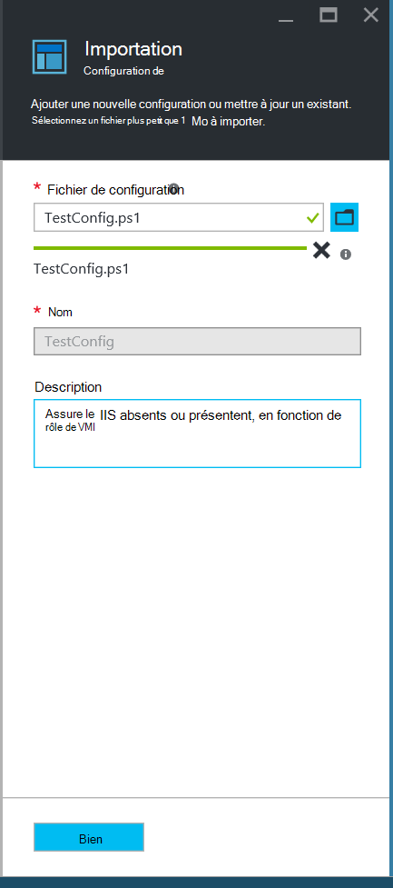
    

6. Cliquez sur **OK**.

## <a name="viewing-a-configuration-in-azure-automation"></a>Affichage d’une configuration dans Azure Automation

Après avoir importé une configuration, vous pouvez l’afficher dans le portail Azure.

1. Connectez-vous au [portail Azure](https://portal.azure.com).

2. Dans le menu de concentrateur, cliquez sur **toutes les ressources** , puis sur le nom de votre compte d’Automation.

3. Sur la lame **compte d’Automation** , cliquez sur **Configurations de DSC**

4. Sur la lame de **Configurations de DSC** , cliquez sur **TestConfig** (c’est le nom de la configuration que vous avez importé dans la procédure précédente).

5. Sur la lame **TestConfig Configuration** , cliquez sur **Afficher la source configuration**.

    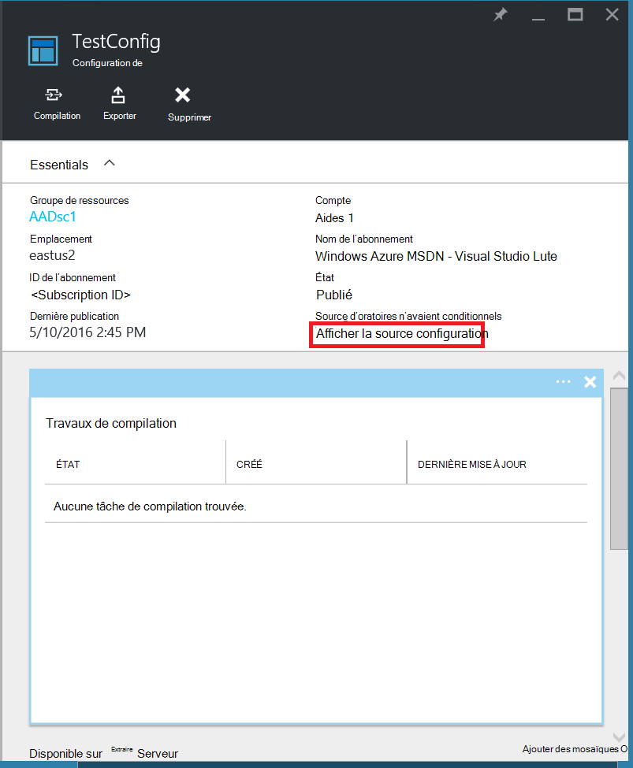
    
    Une lame de **TestConfig Configuration source** s’ouvre, affichant le code PowerShell pour la configuration.
    
## <a name="compiling-a-configuration-in-azure-automation"></a>Compilation d’une configuration dans Azure Automation

Avant d’appliquer un état de votre choix à un nœud, une configuration DSC définir cet état doit être compilée dans une ou plusieurs configurations de nœud (document MOF) et placée sur le serveur Automation DSC Pull. Pour une description plus détaillée de la compilation des configurations dans Azure Automation DSC, consultez [compilation de configurations dans Azure Automation DSC](automation-dsc-compile.md). Pour plus d’informations sur la compilation des configurations, consultez [Configurations de DSC](https://msdn.microsoft.com/PowerShell/DSC/configurations).

1. Connectez-vous au [portail Azure](https://portal.azure.com).

2. Dans le menu de concentrateur, cliquez sur **toutes les ressources** , puis sur le nom de votre compte d’Automation.

3. Sur la lame **compte d’Automation** , cliquez sur **Configurations de DSC**

4. Sur la lame de **Configurations de DSC** , cliquez sur **TestConfig** (le nom de la configuration précédemment importé).

5. Sur la lame **TestConfig Configuration** , cliquez sur **compiler**, puis cliquez sur **Oui**. Démarre un travail de compilation.
    
    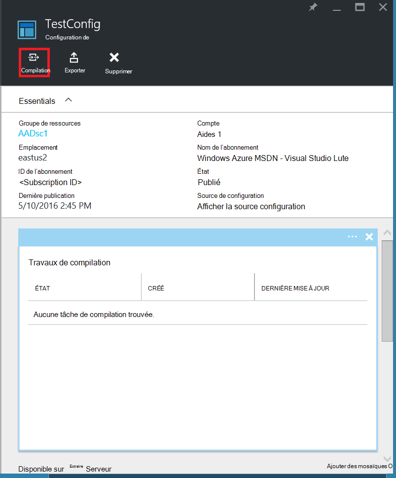
    
> [AZURE.NOTE] Lorsque vous compilez une configuration dans Azure Automation, elle déploie automatiquement toute configuration du nœud créé MOF n’a pour le serveur de collecte.

## <a name="viewing-a-compilation-job"></a>Affichage d’un travail de compilation

Une fois que vous démarrez une compilation, vous pouvez l’afficher dans la mosaïque de **travaux de Compilation** de la lame de **Configuration** . La mosaïque de **travaux de Compilation** affiche en cours d’exécution, terminé et échec des travaux. Lorsque vous ouvrez une lame de travail de compilation, il affiche des informations sur cette tâche, y compris les erreurs ou les avertissements, les paramètres d’entrée utilisés dans la configuration et la compilation de journaux.

1. Connectez-vous au [portail Azure](https://portal.azure.com).

2. Dans le menu de concentrateur, cliquez sur **toutes les ressources** , puis sur le nom de votre compte d’Automation.

3. Sur la lame **compte d’Automation** , cliquez sur **Configurations de DSC**.

4. Sur la lame de **Configurations de DSC** , cliquez sur **TestConfig** (le nom de la configuration précédemment importé).

5. Dans la fenêtre **tâches de Compilation** de la lame **TestConfig Configuration** , cliquez sur une des tâches répertoriées. Une **Travail de Compilation** de lame s’ouvre, portant la date de début de la tâche de compilation.

    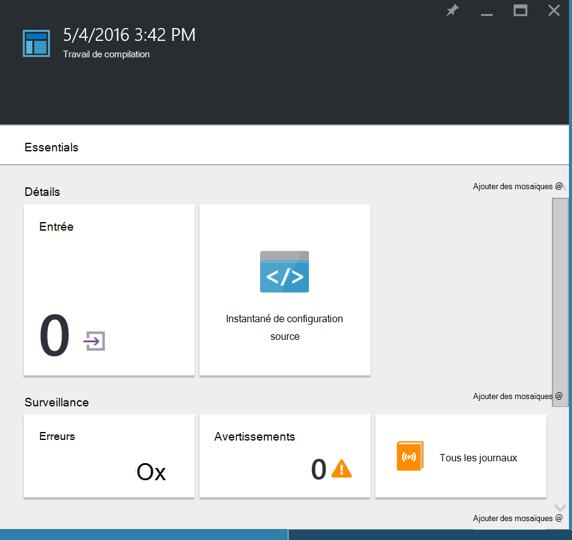
  
6. Cliquez sur n’importe quel carré dans la **Travail de Compilation de** lame pour obtenir plus de détails sur la tâche.

## <a name="viewing-node-configurations"></a>Afficher les configurations de nœud

Réalisation d’une tâche de compilation crée une ou plusieurs configurations de nœud de nouveau. Une configuration de nœud est un document MOF est déployé sur le serveur extrait et prêt à être extraites et appliquées par un ou plusieurs nœuds. Vous pouvez afficher les configurations de nœud dans votre compte d’automatisation de la lame de **Configurations de nœud de DSC** . Une configuration de nœud a un nom avec le *nom de configuration*de l’écran. *NodeName*.

1. Connectez-vous au [portail Azure](https://portal.azure.com).

2. Dans le menu de concentrateur, cliquez sur **toutes les ressources** , puis sur le nom de votre compte d’Automation.

3. Sur la lame **compte d’Automation** , cliquez sur **Configurations de nœud de DSC**.

    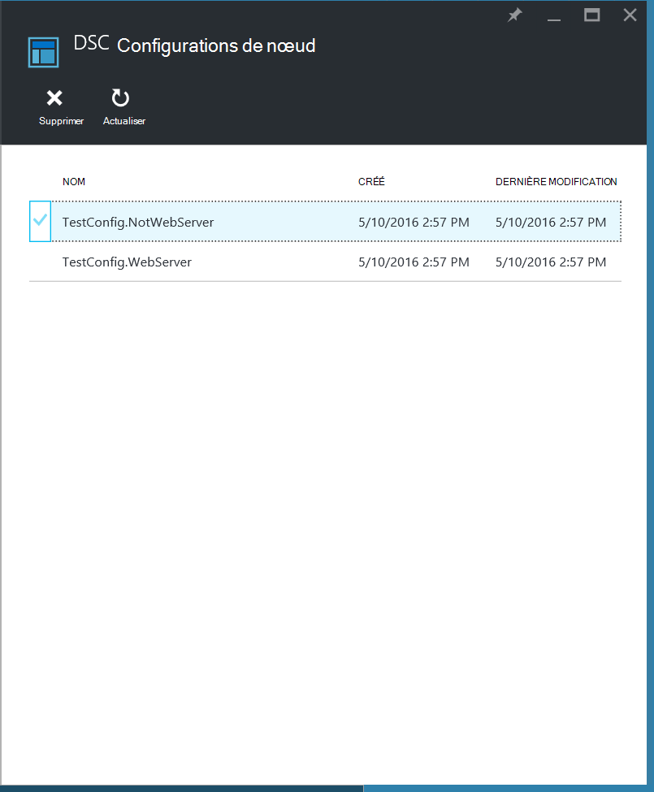
    
## <a name="onboarding-an-azure-vm-for-management-with-azure-automation-dsc"></a>Intégration d’un Azure VM pour la gestion avec Azure Automation DSC

Vous pouvez utiliser Azure Automation DSC pour gérer des Azure VM (classique et Gestionnaire de ressources), sur site VMs, machines Linux, AWS VM et les machines physiques sur site. Dans cette rubrique, nous aborderons comment intégré seuls ordinateurs virtuels de gestionnaire de ressources Azure. Pour plus d’informations sur l’intégration autres types d’ordinateurs, voir [intégration des ordinateurs pour la gestion par Azure Automation DSC](automation-dsc-onboarding.md).

### <a name="to-onboard-an-azure-resource-manager-vm-for-management-by-azure-automation-dsc"></a>Intégré à un gestionnaire de ressources de Azure VM pour la gestion par Azure Automation DSC

1. Connectez-vous au [portail Azure](https://portal.azure.com).

2. Dans le menu de concentrateur, cliquez sur **toutes les ressources** , puis sur le nom de votre compte d’Automation.

3. Sur la lame **compte d’Automation** , cliquez sur **Les nœuds de DSC**.

4. Dans la lame **DSC nœuds** , cliquez sur **Ajouter Azure VM**.

    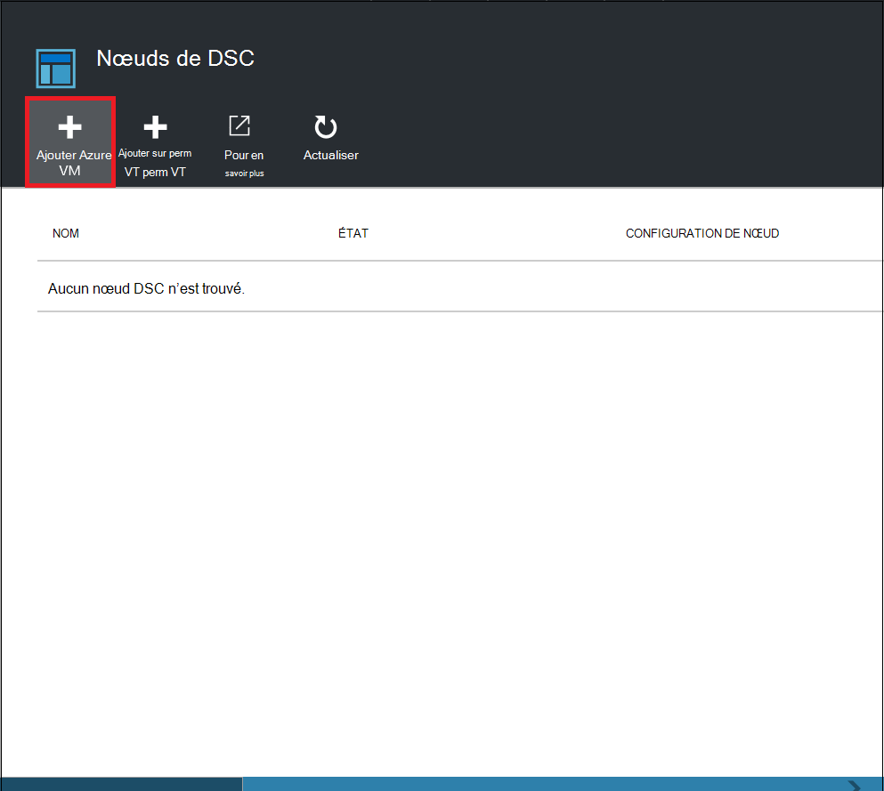

5. De la lame **d’Ajouter des ordinateurs virtuels Azure** , cliquez sur **Sélectionner les ordinateurs virtuels intégrée**.

6. De la lame de **Sélectionner les ordinateurs virtuels** , sélectionnez l’ordinateur virtuel que vous souhaitez intégré et cliquez sur **OK**.

    >[AZURE.IMPORTANT] Il doit s’agir d’un gestionnaire de ressources de Azure VM exécutant Windows Server 2008 R2 ou une version ultérieure.
    
7. De la lame **d’Ajouter des ordinateurs virtuels Azure** , cliquez sur **configurer les données d’enregistrement**.

8. De la lame **d’enregistrement** , entrez le nom de la configuration de nœud que vous souhaitez appliquer à la machine virtuelle dans la zone **Nom du nœud de Configuration** . Celui-ci doit exactement correspondre le nom d’une configuration de nœud dans le compte de l’Automation. Donnez un nom à ce stade est facultative. Vous pouvez modifier la configuration de nœud assignée après l’intégration du nœud.
**Redémarrez le nœud si nécessaire**et cliquez sur **OK**.
    
    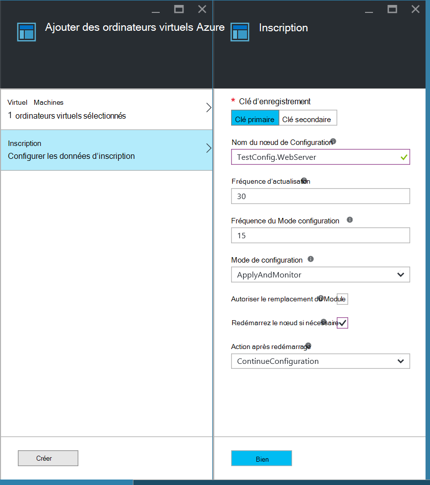
    
    La configuration de nœud spécifiée s’appliqueront à la machine virtuelle à des intervalles spécifiés par la **Fréquence du Mode Configuration**et vérifie pour les mises à jour de la configuration des nœuds à des intervalles spécifiés par la **Fréquence de rafraîchissement**de la machine virtuelle. Pour plus d’informations sur l’utilisation de ces valeurs, reportez-vous à la section [configuration du Gestionnaire de Configuration Local](https://msdn.microsoft.com/PowerShell/DSC/metaConfig).
    
9. De la lame **d’Ajouter des ordinateurs virtuels Azure** , cliquez sur **créer**.

Azure démarre le processus d’intégration de la machine virtuelle. Lorsqu’il est terminé, la machine virtuelle s’afficheront dans la lame de **Nœuds de DSC** dans le compte de l’Automation.

## <a name="viewing-the-list-of-dsc-nodes"></a>Affichage de la liste de nœuds de DSC

Vous pouvez afficher la liste de tous les ordinateurs qui ont été onboarded pour la gestion de votre compte d’Automation dans la lame **DSC nœuds** .

1. Connectez-vous au [portail Azure](https://portal.azure.com).

2. Dans le menu de concentrateur, cliquez sur **toutes les ressources** , puis sur le nom de votre compte d’Automation.

3. Sur la lame **compte d’Automation** , cliquez sur **Les nœuds de DSC**.

## <a name="viewing-reports-for-dsc-nodes"></a>Affichage des rapports pour les nœuds de DSC

Chaque fois que Azure Automation DSC effectue une vérification de cohérence sur un nœud géré, le nœud envoie un rapport d’état sur le serveur de collecte. Vous pouvez consulter ces rapports sur la lame pour ce nœud.

1. Connectez-vous au [portail Azure](https://portal.azure.com).

2. Dans le menu de concentrateur, cliquez sur **toutes les ressources** , puis sur le nom de votre compte d’Automation.

3. Sur la lame **compte d’Automation** , cliquez sur **Les nœuds de DSC**.

4. Dans la fenêtre **rapports** , cliquez sur une des rapports dans la liste.

    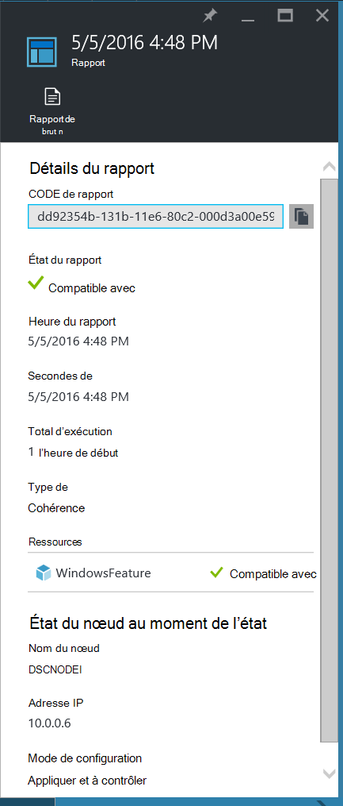

Sur la lame pour un rapport individuel, vous pouvez voir les informations d’état suivantes pour la vérification de cohérence correspondante :

- L’état, si le nœud est « Conforme », la configuration de « Échec », ou le nœud « Non compatibles » (lorsque le nœud est en mode de **applyandmonitor** et que l’ordinateur n’est pas dans l’état souhaité).
- Heure de début de la vérification de cohérence.
- Le total d’exécution de la vérification de cohérence.
- Le type de vérification de cohérence.
- Toutes les erreurs, y compris le code d’erreur et le message d’erreur. 
- Toutes les ressources DSC utilisées dans la configuration et l’état de chaque ressource (si le nœud est dans l’état souhaité pour cette ressource), vous pouvez cliquer sur chaque ressource afin d’obtenir des informations plus détaillées pour cette ressource.
- Le nom, adresse IP et le mode de configuration du nœud.

Vous pouvez également cliquer sur **Afficher le rapport brut** pour afficher les données réelles, le nœud envoie au serveur. Pour plus d’informations sur l’utilisation de ces données, reportez-vous [à l’aide d’un serveur de rapports DSC](https://msdn.microsoft.com/powershell/dsc/reportserver).

Il peut prendre un certain temps après qu’un nœud est onboarded avant le premier état est disponible. Vous devrez peut-être attendre jusqu'à 30 minutes pour le premier rapport après avoir intégré un nœud.

## <a name="reassigning-a-node-to-a-different-node-configuration"></a>Réaffectation d’un nœud à une configuration de nœud différent

Vous pouvez affecter un nœud pour utiliser une configuration de nœud différent que celui que vous avez initialement affecté.

1. Connectez-vous au [portail Azure](https://portal.azure.com).

2. Dans le menu de concentrateur, cliquez sur **toutes les ressources** , puis sur le nom de votre compte d’Automation.

3. Sur la lame **compte d’Automation** , cliquez sur **Les nœuds de DSC**.

4. Sur la lame de **Nœuds de DSC** , cliquez sur le nom du nœud que vous souhaitez réaffecter.

5. Sur la lame pour ce nœud, cliquez sur **affecter le nœud**.

    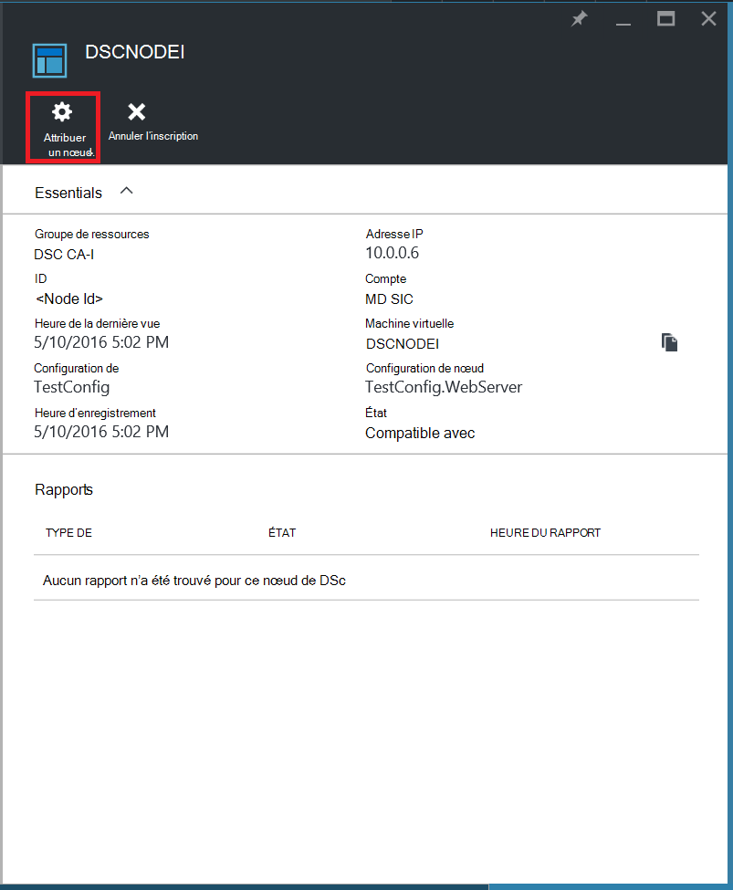

6. Sur la blade **d’Attribuer une Configuration de nœud** , sélectionnez la configuration du nœud auquel vous souhaitez attribuer le nœud, puis cliquez sur **OK**.

    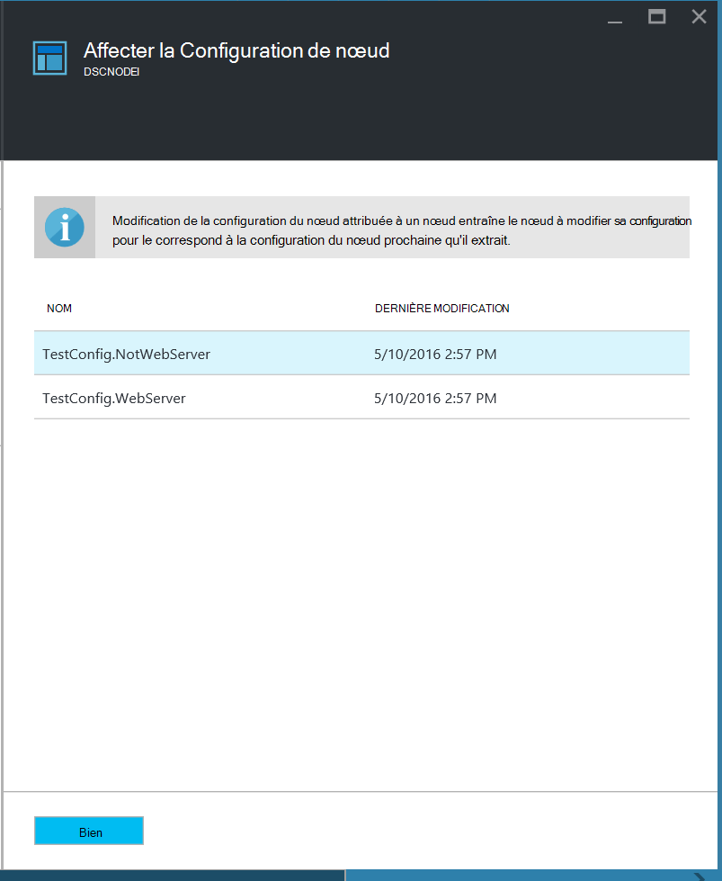
    
## <a name="unregistering-a-node"></a>Annuler l’inscription d’un nœud

Si vous ne souhaitez plus être géré par Azure Automation DSC d’un nœud, vous pouvez annuler son inscription.

1. Connectez-vous au [portail Azure](https://portal.azure.com).

2. Dans le menu de concentrateur, cliquez sur **toutes les ressources** , puis sur le nom de votre compte d’Automation.

3. Sur la lame **compte d’Automation** , cliquez sur **Les nœuds de DSC**.

4. Sur la lame de **Nœuds de DSC** , cliquez sur le nom du nœud que vous souhaitez annuler l’inscription.

5. Sur la lame pour ce nœud, cliquez sur **désinscrire**.

    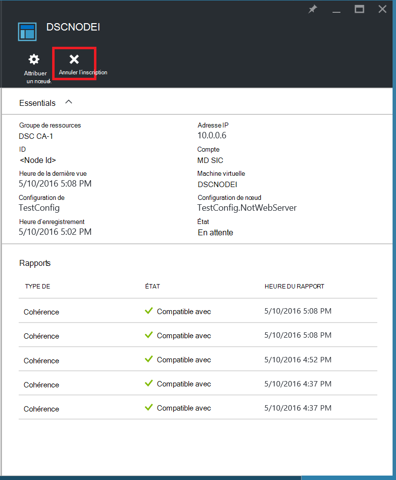

## <a name="related-articles"></a>Articles connexes
* [Vue d’ensemble de Automation DSC Azure](automation-dsc-overview.md)
* [Machines d’intégration pour la gestion par Azure Automation DSC](automation-dsc-onboarding.md)
* [Windows PowerShell souhaité de la vue d’ensemble de la Configuration de l’état](https://msdn.microsoft.com/powershell/dsc/overview)
* [Applets de commande Automation DSC Azure](https://msdn.microsoft.com/library/mt244122.aspx)
* [Tarification d’Automation DSC Azure](https://azure.microsoft.com/pricing/details/automation/)

