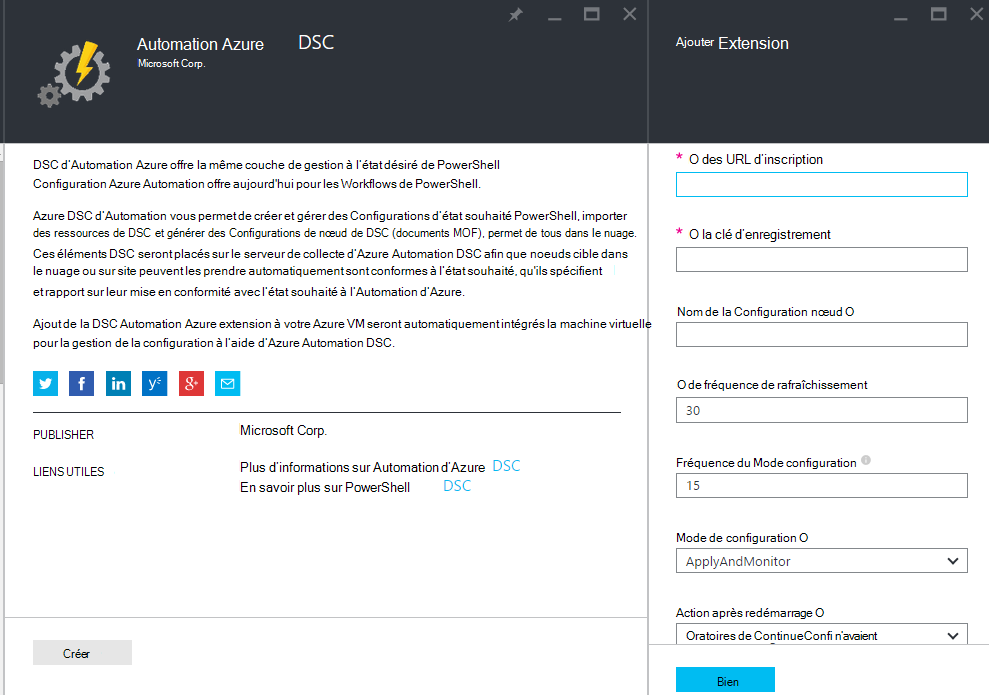
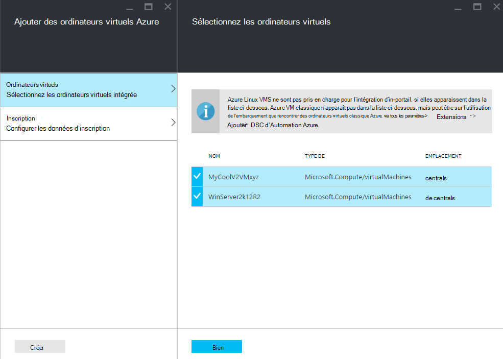
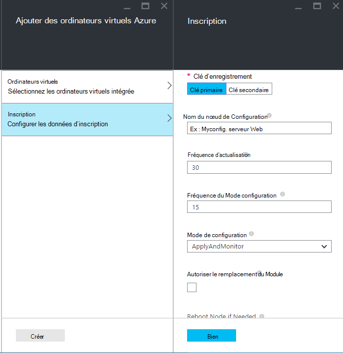
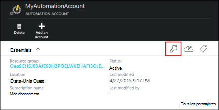
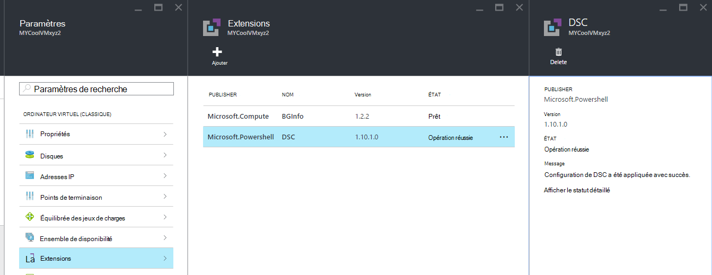

<properties 
   pageTitle="Intégration des machines physiques et virtuelles pour la gestion par Azure Automation DSC | Microsoft Azure" 
   description="Comment configurer des ordinateurs pour la gestion avec Azure Automation DSC" 
   services="automation" 
   documentationCenter="dev-center-name" 
   authors="coreyp-at-msft" 
   manager="stevenka" 
   editor="tysonn"/>

<tags
   ms.service="automation"
   ms.devlang="NA"
   ms.topic="article"
   ms.tgt_pltfrm="powershell"
   ms.workload="TBD" 
   ms.date="04/22/2016"
   ms.author="coreyp"/>

# Machines d’intégration pour la gestion par Azure Automation DSC

## Pourquoi gérer les machines avec DSC d’Automation Azure ?

Comme la [Configuration d’état souhaité de PowerShell](https://technet.microsoft.com/library/dn249912.aspx), Configuration de l’état souhaité Azure Automation est un service de gestion de configuration simple et puissante, pour les nœuds de DSC (machines physiques et virtuelles) dans n’importe quel centre de données de nuage ou sur site. Il permet l’évolutivité sur des milliers de machines rapidement et facilement à partir d’un emplacement central et sécurisé. Vous pouvez facilement intégrés machines, affecter les configurations déclaratives et afficher des rapports indiquant chaque machine de conformité à l’état souhaité que vous avez spécifié. La couche de gestion Azure Automation DSC est à DSC, nouveautés de la couche de gestion Azure Automation pour l’écriture de scripts PowerShell. En d’autres termes, de la même façon que Azure Automation vous permet de gérer des scripts PowerShell, il vous permet également gérer les configurations de DSC. Pour en savoir plus sur les avantages de l’utilisation d’Azure Automation DSC, consultez [vue d’ensemble de l’Azure Automation DSC](automation-dsc-overview.md). 

Azure DSC d’Automation vous permet de gérer un grand nombre d’ordinateurs :

*    Machines virtuelles Azure (classique)
*    Machines virtuelles Azure
*    Machines virtuelles de Amazon Web Services (AWS)
*    Physique/virtuel Windows local, les machines ou dans un nuage de Azure/AWS
*    Sur site, dans Azure, ou dans un nuage de Azure les machines Linux physique/virtuel

En outre, si vous n’êtes pas prêt à gérer la configuration de l’ordinateur à partir du cloud, Azure Automation DSC peut également servir comme un point de terminaison de rapport uniquement. Cela vous permet de définir la configuration de votre choix (push) via DSC sur site et afficher le détail des rapports riches sur la conformité du nœud avec l’état souhaité dans Azure Automation.

Les sections suivantes décrivent comment vous pouvez bord chaque type de machine à DSC d’Automation Azure.

## Machines virtuelles Azure (classique)

Avec DSC d’Automation Azure, vous pouvez facilement intégrés machines virtuelles Azure (classic) pour la gestion de la configuration à l’aide d’Azure portal, ou PowerShell. Dans les coulisses et sans aucun administrateur n’ait à distance de la machine virtuelle, l’extension de Configuration de l’état souhaité Azure VM enregistre la machine virtuelle avec Azure Automation DSC. Dans la mesure où l’extension de Configuration de l’état souhaité Azure VM s’exécute en mode asynchrone, des étapes pour suivre sa progression ou résoudre les problèmes qu’il sont fournis dans la section [**intégration de machine virtuelle Azure de dépannage**](#troubleshooting-azure-virtual-machine-onboarding) ci-dessous.

### Azure portal

Dans le [portail Azure](http://portal.azure.com/), cliquez sur **Parcourir** -> **machines virtuelles (classique)**. Sélectionnez la machine virtuelle Windows que vous souhaitez intégré. Sur la lame de tableau de bord de la machine virtuelle, cliquez sur **tous les paramètres** -> **Extensions de** -> **Ajouter** -> **Azure Automation DSC** -> **créer**. Entrez les [valeurs de PowerShell DSC Local Configuration Manager](https://msdn.microsoft.com/powershell/dsc/metaconfig4) requis pour votre cas d’utilisation, la clé d’enregistrement de votre compte d’Automation et URL d’enregistrement et, éventuellement, une configuration de nœud pour attribuer à la machine virtuelle.

Pour rechercher l’enregistrement d’URL et la clé pour l’automatisation compte intégrée l’ordinateur, reportez-vous à la section [**sécurisation d’enregistrement**](#secure-registration) ci-dessous.

### PowerShell

    # log in to both Azure Service Management and Azure Resource Manager
    Add-AzureAccount
    Add-AzureRmAccount
    
    # fill in correct values for your VM/Automation account here
    $VMName = ""
    $ServiceName = ""
    $AutomationAccountName = ""
    $AutomationAccountResourceGroup = ""

    # fill in the name of a Node Configuration in Azure Automation DSC, for this VM to conform to
    $NodeConfigName = ""

    # get Azure Automation DSC registration info
    $Account = Get-AzureRmAutomationAccount -ResourceGroupName $AutomationAccountResourceGroup -Name $AutomationAccountName
    $RegistrationInfo = $Account | Get-AzureRmAutomationRegistrationInfo

    # use the DSC extension to onboard the VM for management with Azure Automation DSC
    $VM = Get-AzureVM -Name $VMName -ServiceName $ServiceName
    
    $PublicConfiguration = ConvertTo-Json -Depth 8 @{
      SasToken = ""
      ModulesUrl = "https://eus2oaasibizamarketprod1.blob.core.windows.net/automationdscpreview/RegistrationMetaConfigV2.zip"
      ConfigurationFunction = "RegistrationMetaConfigV2.ps1\RegistrationMetaConfigV2"

    # update these PowerShell DSC Local Configuration Manager defaults if they do not match your use case.
    # See https://technet.microsoft.com/library/dn249922.aspx?f=255&MSPPError=-2147217396 for more details
     Properties = @{
        RegistrationKey = @{
          UserName = 'notused'
          Password = 'PrivateSettingsRef:RegistrationKey'
        }
        RegistrationUrl = $RegistrationInfo.Endpoint
        NodeConfigurationName = $NodeConfigName
        ConfigurationMode = "ApplyAndMonitor"
        ConfigurationModeFrequencyMins = 15
        RefreshFrequencyMins = 30
        RebootNodeIfNeeded = $False
        ActionAfterReboot = "ContinueConfiguration"
        AllowModuleOverwrite = $False
      }
    }

    $PrivateConfiguration = ConvertTo-Json -Depth 8 @{
      Items = @{
         RegistrationKey = $RegistrationInfo.PrimaryKey
      }
    }
    
    $VM = Set-AzureVMExtension `
     -VM $vm `
     -Publisher Microsoft.Powershell `
     -ExtensionName DSC `
     -Version 2.19 `
     -PublicConfiguration $PublicConfiguration `
     -PrivateConfiguration $PrivateConfiguration `
     -ForceUpdate

    $VM | Update-AzureVM

## Machines virtuelles Azure

Azure DSC d’Automation vous permet de facilement intégré des ordinateurs virtuels Azure pour la gestion de la configuration, à l’aide des modèles de l’Azure portal, Gestionnaire de ressources Azure ou PowerShell. Dans les coulisses et sans aucun administrateur n’ait à distance de la machine virtuelle, l’extension de Configuration de l’état souhaité Azure VM enregistre la machine virtuelle avec Azure Automation DSC. Dans la mesure où l’extension de Configuration de l’état souhaité Azure VM s’exécute en mode asynchrone, des étapes pour suivre sa progression ou résoudre les problèmes qu’il sont fournis dans la section [**intégration de machine virtuelle Azure de dépannage**](#troubleshooting-azure-virtual-machine-onboarding) ci-dessous.

### Azure portal

Dans le [portail Azure](https://portal.azure.com/), accédez au compte Azure Automation auquel les ordinateurs virtuels intégrées. Dans le tableau de bord compte Automation, cliquez sur **Les nœuds de DSC** -> **Ajouter Azure VM**.

Sous **Sélectionnez les ordinateurs virtuels intégrée**, sélectionnez une ou plusieurs machines virtuelles Azure à bord.

Sous **configurer les données d’enregistrement**, entrez les [valeurs de PowerShell DSC Local Configuration Manager](https://msdn.microsoft.com/powershell/dsc/metaconfig4) requis pour votre cas d’utilisation et éventuellement d’une configuration de nœud pour attribuer à la machine virtuelle.

 
### Modèles de gestionnaire de ressources Azure

Les machines virtuelles Azure peuvent être déployés et onboarded à DSC d’Automation Azure via des modèles Azure le Gestionnaire de ressources. Voir la rubrique [Configure un ordinateur virtuel via l’extension de DSC et Azure Automation DSC](https://azure.microsoft.com/documentation/templates/dsc-extension-azure-automation-pullserver/) pour un exemple de modèle qui onboards un ordinateur virtuel existant Azure Automation DSC. Pour trouver la clé d’enregistrement et les URL d’enregistrement pris en tant qu’entrée dans ce modèle, reportez-vous à la section [**sécurisation d’enregistrement**](#secure-registration) ci-dessous.

### PowerShell

L’applet de commande [AzureRmAutomationDscNode-Registre](https://msdn.microsoft.com/library/mt603833.aspx) peut servir à des machines virtuelles intégrés dans le portail Azure via PowerShell.

## Machines virtuelles de Amazon Web Services (AWS)

Vous pouvez facilement intégrés machines virtuelles de Amazon Web Services pour la gestion de la configuration par Azure DSC de Automation à l’aide de la Shared Computer Toolkit DSC AWS. Plus d’informations sur la trousse à outils [ici](https://blogs.msdn.microsoft.com/powershell/2016/04/20/aws-dsc-toolkit/).

## Physique/virtuel Windows local, les machines ou dans un nuage de Azure/AWS

Machines de Windows local et les ordinateurs Windows dans des nuages de non-Azure (par exemple, Amazon Web Services) peuvent également être onboarded à DSC d’Automation Azure, dans la mesure où ils ont un accès sortant à internet au moyen de quelques étapes simples :

1. Assurez-vous que la dernière version de [WMF 5](http://aka.ms/wmf5latest) est installée sur les ordinateurs que vous souhaitez intégré pour Azure Automation DSC.
2. Suivez les instructions de la section [**metaconfigurations de la génération de DSC**](#generating-dsc-metaconfigurations) ci-dessous pour générer un dossier contenant des metaconfigurations de DSC nécessaires.
3. À distance, appliquer la metaconfiguration PowerShell DSC sur les ordinateurs que vous souhaitez intégré. **L’ordinateur, de que cette commande est exécutée à partir doit être la version la plus récente de [WMF 5](http://aka.ms/wmf5latest) installé**:

    `Set-DscLocalConfigurationManager -Path C:\Users\joe\Desktop\DscMetaConfigs -ComputerName MyServer1, MyServer2`

4. Si vous ne pouvez pas appliquer les metaconfigurations PowerShell DSC à distance, copiez le dossier metaconfigurations de l’étape 2 sur chaque ordinateur à bord. Appelez ensuite **Ensemble-DscLocalConfigurationManager** localement sur chaque ordinateur à bord.
5. À l’aide d’un portail Azure du ou des applets de commande, vérifiez que les ordinateurs intégrés apparaissent maintenant en tant que nœuds de DSC enregistrées dans votre compte Azure Automation.

## Sur site, dans Azure, ou dans un nuage de Azure les machines Linux physique/virtuel

Ordinateurs de Linux sur site, les ordinateurs Linux dans Azure et ordinateurs Linux dans des nuages de non-Azure peuvent également être onboarded à DSC d’Automation Azure, dans la mesure où ils ont un accès sortant à internet au moyen de quelques étapes simples :

1. Assurez-vous que la dernière version de l' [agent de DSC Linux](http://www.microsoft.com/download/details.aspx?id=49150) est installée sur les ordinateurs que vous souhaitez intégré pour Azure Automation DSC.

2. Si les [valeurs par défaut du Gestionnaire de Configuration de PowerShell DSC Local](https://msdn.microsoft.com/powershell/dsc/metaconfig4) correspondant à votre cas d’usage, et que vous souhaitez intégré de machines telles qu’ils **extraient et signaler à DSC d’Automation Azure** :

    *    Sur chaque ordinateur Linux à intégré pour Azure Automation DSC, permet Register.py intégré en utilisant les paramètres par défaut du Gestionnaire de Configuration de PowerShell DSC Local :

        `/opt/microsoft/dsc/Scripts/Register.py <Automation account registration key> <Automation account registration URL>`

    *    Pour trouver la clé d’enregistrement et l’URL de l’enregistrement de votre compte d’Automation, reportez-vous à la section [**sécurisation d’enregistrement**](#secure-registration) ci-dessous.

    Si le Gestionnaire de Configuration de PowerShell DSC Local par défaut **faire** ne correspondent **pas** votre cas d’utilisation, ou si vous souhaitez les ordinateurs intégrés tels que leur rapport à DSC d’Automation Azure, mais ne pas configuration du collecteur ou modules PowerShell à partir de celui-ci, suivez les étapes 3 à 6. Dans le cas contraire, passez directement à l’étape 6.

3.  Suivez les instructions de la section [**metaconfigurations de la génération de DSC**](#generating-dsc-metaconfigurations) ci-dessous pour générer un dossier contenant des metaconfigurations de DSC nécessaires.
4.  À distance, appliquer la metaconfiguration PowerShell DSC sur les ordinateurs que vous souhaitez intégré :
        
        $SecurePass = ConvertTo-SecureString -String "<root password>" -AsPlainText -Force
        $Cred = New-Object System.Management.Automation.PSCredential "root", $SecurePass
        $Opt = New-CimSessionOption -UseSsl -SkipCACheck -SkipCNCheck -SkipRevocationCheck

        # need a CimSession for each Linux machine to onboard
        
        $Session = New-CimSession -Credential $Cred -ComputerName <your Linux machine> -Port 5986 -Authentication basic -SessionOption $Opt
        
        Set-DscLocalConfigurationManager -CimSession $Session –Path C:\Users\joe\Desktop\DscMetaConfigs
    
L’ordinateur, de que cette commande est exécutée à partir doit être la version la plus récente de [WMF 5](http://aka.ms/wmf5latest) installé.

5.  Si vous ne pouvez pas appliquer les metaconfigurations PowerShell DSC à distance, pour chaque ordinateur Linux à bord, copier le metaconfiguration correspondant à cet ordinateur à partir du dossier à l’étape 5, sur l’ordinateur Linux. Appelez ensuite `SetDscLocalConfigurationManager.py` localement sur chaque ordinateur Linux souhaité à intégré à DSC d’Automation Azure :

    `/opt/microsoft/dsc/Scripts/SetDscLocalConfigurationManager.py –configurationmof <path to metaconfiguration file>`

6.  À l’aide d’un portail Azure du ou des applets de commande, vérifiez que les ordinateurs intégrés apparaissent maintenant en tant que nœuds de DSC enregistrées dans votre compte Azure Automation.

##Génération de DSC metaconfigurations
Intégrée de façon générique n’importe quelle machine à DSC d’Automation Azure, une metaconfiguration de DSC peut être générée qui, lorsqu’elle est appliquée, indique à l’agent DSC sur l’ordinateur à extraire et/ou de rapport Azure Automation DSC. Metaconfigurations de DSC pour Azure Automation DSC peuvent être générées à l’aide d’une configuration de PowerShell DSC, ou les applets de commande PowerShell de Automation Azure.

**Remarque :** DSC metaconfigurations contiennent les secrets nécessaires à bord une machine à un objet Automation de compte pour la gestion. Assurez-vous de protéger convenablement toutes metaconfigurations de DSC que vous créez, ou les supprimer après utilisation.

###À l’aide d’une Configuration de DSC
1.  Ouvrez le PowerShell ISE en tant qu’administrateur sur un ordinateur dans votre environnement local. L’ordinateur doit avoir la version la plus récente de [WMF 5](http://aka.ms/wmf5latest) installé.

2.  Copiez le script suivant localement. Ce script contient une configuration de PowerShell DSC pour la création d’une commande pour lancer la création de metaconfiguration et metaconfigurations.
    
        # The DSC configuration that will generate metaconfigurations
        [DscLocalConfigurationManager()]
        Configuration DscMetaConfigs 
        { 
            param 
            ( 
                [Parameter(Mandatory=$True)] 
                [String]$RegistrationUrl,
         
                [Parameter(Mandatory=$True)] 
                [String]$RegistrationKey,

                [Parameter(Mandatory=$True)] 
                [String[]]$ComputerName,

                [Int]$RefreshFrequencyMins = 30, 
            
                [Int]$ConfigurationModeFrequencyMins = 15, 
            
                [String]$ConfigurationMode = "ApplyAndMonitor", 
            
                [String]$NodeConfigurationName,

                [Boolean]$RebootNodeIfNeeded= $False,

                [String]$ActionAfterReboot = "ContinueConfiguration",

                [Boolean]$AllowModuleOverwrite = $False,

                [Boolean]$ReportOnly
            )

    
            if(!$NodeConfigurationName -or $NodeConfigurationName -eq "") 
            { 
                $ConfigurationNames = $null 
            } 
            else 
            { 
                $ConfigurationNames = @($NodeConfigurationName) 
            }

            if($ReportOnly)
            {
               $RefreshMode = "PUSH"
            }
            else
            {
               $RefreshMode = "PULL"
            }

            Node $ComputerName
            {

                Settings 
                { 
                    RefreshFrequencyMins = $RefreshFrequencyMins 
                    RefreshMode = $RefreshMode 
                    ConfigurationMode = $ConfigurationMode 
                    AllowModuleOverwrite = $AllowModuleOverwrite 
                    RebootNodeIfNeeded = $RebootNodeIfNeeded 
                    ActionAfterReboot = $ActionAfterReboot 
                    ConfigurationModeFrequencyMins = $ConfigurationModeFrequencyMins 
                }

                if(!$ReportOnly)
                {
                   ConfigurationRepositoryWeb AzureAutomationDSC 
                    { 
                        ServerUrl = $RegistrationUrl 
                        RegistrationKey = $RegistrationKey 
                        ConfigurationNames = $ConfigurationNames 
                    }

                    ResourceRepositoryWeb AzureAutomationDSC 
                    { 
                       ServerUrl = $RegistrationUrl 
                       RegistrationKey = $RegistrationKey 
                    }
                }

                ReportServerWeb AzureAutomationDSC 
                { 
                    ServerUrl = $RegistrationUrl 
                    RegistrationKey = $RegistrationKey 
                }
            } 
        }
        
        # Create the metaconfigurations
        # TODO: edit the below as needed for your use case
        $Params = @{
             RegistrationUrl = '<fill me in>';
             RegistrationKey = '<fill me in>';
             ComputerName = @('<some VM to onboard>', '<some other VM to onboard>');
             NodeConfigurationName = 'SimpleConfig.webserver';
             RefreshFrequencyMins = 30;
             ConfigurationModeFrequencyMins = 15;
             RebootNodeIfNeeded = $False;
             AllowModuleOverwrite = $False;
             ConfigurationMode = 'ApplyAndMonitor';
             ActionAfterReboot = 'ContinueConfiguration';
             ReportOnly = $False;  # Set to $True to have machines only report to AA DSC but not pull from it
        }
        
        # Use PowerShell splatting to pass parameters to the DSC configuration being invoked
        # For more info about splatting, run: Get-Help -Name about_Splatting
        DscMetaConfigs @Params

3.  Renseignez la clé d’enregistrement et une URL pour votre compte de Automation, ainsi que les noms des ordinateurs à bord. Tous les autres paramètres sont facultatifs. Pour trouver la clé d’enregistrement et l’URL de l’enregistrement de votre compte d’Automation, reportez-vous à la section [**sécurisation d’enregistrement**](#secure-registration) ci-dessous.

4.  Si vous souhaitez que les ordinateurs indiquent des informations d’état DSC pour Azure Automation DSC, mais pas extraire les modules de PowerShell ou de configuration, le paramètre **ReportOnly** la valeur true.

5.  Exécutez le script. Vous devez maintenant avoir un dossier appelé **DscMetaConfigs** dans votre répertoire de travail, contenant des metaconfigurations PowerShell DSC pour les ordinateurs à bord.

###À l’aide des applets de commande Azure Automation
Si les valeurs par défaut du Gestionnaire de Configuration de PowerShell DSC Local correspondant à votre cas d’utilisation, et vous souhaitez machines intégrés tel qu’ils extraient et rapport Azure Automation DSC, les applets de commande Azure Automation fournissent une méthode simplifiée de génération des metaconfigurations de DSC nécessaires :

1.  Ouvrez la console PowerShell ou PowerShell ISE en tant qu’administrateur sur un ordinateur dans votre environnement local.

2.  Se connecter au Gestionnaire de ressources Azure à l’aide de **Add-AzureRmAccount**

3.  Télécharger les metaconfigurations PowerShell DSC pour les ordinateurs que vous souhaitez à intégré à partir du compte de l’Automation à laquelle vous souhaitez des nœuds intégrés :

        # Define the parameters for Get-AzureRmAutomationDscOnboardingMetaconfig using PowerShell Splatting
        $Params = @{
            ResourceGroupName = 'ContosoResources'; # The name of the ARM Resource Group that contains your Azure Automation Account
            AutomationAccountName = 'ContosoAutomation'; # The name of the Azure Automation Account where you want a node on-boarded to
            ComputerName = @('web01', 'web02', 'sql01'); # The names of the computers that the meta configuration will be generated for
            OutputFolder = "$env:UserProfile\Desktop\";
        }
        
        # Use PowerShell splatting to pass parameters to the Azure Automation cmdlet being invoked
        # For more info about splatting, run: Get-Help -Name about_Splatting
        Get-AzureRmAutomationDscOnboardingMetaconfig @Params

Vous devez maintenant avoir un dossier appelé ***DscMetaConfigs***, contenant des metaconfigurations PowerShell DSC pour les ordinateurs à bord.

##D’enregistrement sécurisé

Machines peuvent en toute sécurité intégrée à un compte Azure automatisation par le biais du protocole d’enregistrement WMF 5 DSC, qui permet à un nœud de DSC pour s’authentifier sur un serveur d’extraction de PowerShell DSC V2 ou rapport (y compris Azure Automation DSC). Le nœud est inscrit sur le serveur à l' **URL de l’enregistrement**, l’authentification à l’aide d’une **clé d’enregistrement**. Lors de l’inscription, le nœud de DSC et DSC Pull/Reporting serveur négocient un certificat unique pour ce nœud à utiliser pour l’authentification pour l’inscription du serveur après. Ce processus empêche les nœuds d’onboarded à partir de l’emprunt d’identité à une qu'autre, par exemple, si un nœud est compromise et en agissant à des fins malveillantes. Après l’inscription, la clé d’enregistrement n’est pas utilisée pour l’authentification à nouveau et il est supprimée à partir du nœud.

Vous pouvez obtenir les informations requises pour le protocole d’inscription DSC depuis la blade de **Gestion des clés** dans le portail Azure aperçu. Ouvrez cette blade en cliquant sur l’icône de clé dans le panneau **Essentials** pour le compte de l’Automation.

*    URL d’enregistrement est le champ URL de la blade de gestion des clés.
*    Clé d’enregistrement est la clé d’accès primaire ou secondaire touche d’accès rapide dans la blade de gestion des clés. Une clé peut être utilisée.

Pour plus de sécurité, les touches d’accès primaire et secondaire d’un compte d’Automation peuvent être régénérées à tout moment (sur la blade de **Gestion des clés** ) afin d’empêcher les enregistrements futurs de nœud à l’aide de clés précédentes.

##Résolution des problèmes d’intégration d’Azure VM

Azure DSC d’Automation vous permet de facilement intégré VMs de Windows Azure pour la gestion de la configuration. Dans les coulisses, l’extension de Configuration de l’état souhaité Azure VM est utilisée pour enregistrer l’ordinateur virtuel avec Azure Automation DSC. Dans la mesure où l’extension de Configuration de l’état souhaité Azure VM s’exécute de façon asynchrone, suivi de sa progression et la résolution des problèmes de son exécution peuvent être importants. 

>[AZURE.NOTE] N’importe quelle méthode d’intégration une VM de Windows Azure pour Azure Automation DSC qui utilise l’extension de Configuration de l’état souhaité Azure VM peut prendre jusqu'à une heure pour le nœud à afficher comme enregistré dans Azure Automation. C’est la machine virtuelle pour Azure Automation DSC suite à l’installation de Windows Management Framework 5.0 sur la machine virtuelle par l’extension Azure VM DSC, qui est requise pour la carte.

Pour résoudre les problèmes ou afficher l’état de l’extension de Configuration de l’état souhaité Azure VM, dans l’Azure portal naviguer vers la machine virtuelle en cours d’onboarded, puis cliquez sur -> **paramètres de tous les** -> **les Extensions** -> **DSC**. Pour plus de détails, vous pouvez cliquer sur **Afficher le statut détaillé**.

## L’expiration et la réinscription

Après avoir inscrit un ordinateur comme un nœud de DSC dans Azure Automation DSC, il existe un certain nombre de raisons pourquoi vous devrez peut-être réenregistrer ce nœud dans le futur :

* Après l’inscription, chaque nœud négocie automatiquement un certificat unique pour l’authentification qui expire après un an. Actuellement, le protocole d’inscription PowerShell DSC ne peut pas automatiquement renouveler les certificats lorsqu’ils approchent d’expiration, vous devez réenregistrer les nœuds après un délai d’un an. Avant la réinscription, assurez-vous que chaque nœud exécute RTM de Windows Management Framework 5.0. Si l’expiration du certificat d’authentification d’un nœud et le nœud n’est pas réinscrit, le nœud ne pourra pas communiquer avec l’Automation d’Azure et est marqué « Blocage ». Réinscription effectuée 90 jours ou moins à partir de l’heure d’expiration du certificat ou à tout moment après le délai d’expiration du certificat, entraîne un nouveau certificat est généré et utilisé.

* Pour modifier les [valeurs de PowerShell DSC Local Configuration Manager](https://msdn.microsoft.com/powershell/dsc/metaconfig4) qui ont été définis lors de l’enregistrement initial du nœud, par exemple ConfigurationMode. Actuellement, ces valeurs d’agent DSC peuvent uniquement être modifiés via réinscription. La seule exception est la Configuration nœud affecté au nœud--peut être modifié dans Azure Automation DSC directement.

Réinscription peut être effectuée de la même façon que vous avez enregistré le nœud à l’origine, à l’aide d’une des méthodes d’intégration décrits dans ce document. Vous n’avez pas besoin d’annuler l’inscription d’un nœud à partir d’Azure Automation DSC avant la réinscription il.

## Articles connexes
* [Vue d’ensemble de Automation DSC Azure](automation-dsc-overview.md)
* [Applets de commande Automation DSC Azure](https://msdn.microsoft.com/library/mt244122.aspx)
* [Tarification d’Automation DSC Azure](https://azure.microsoft.com/pricing/details/automation/)

