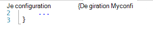
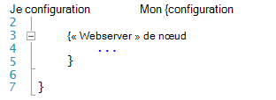
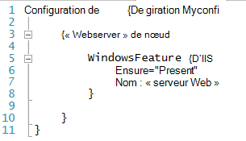
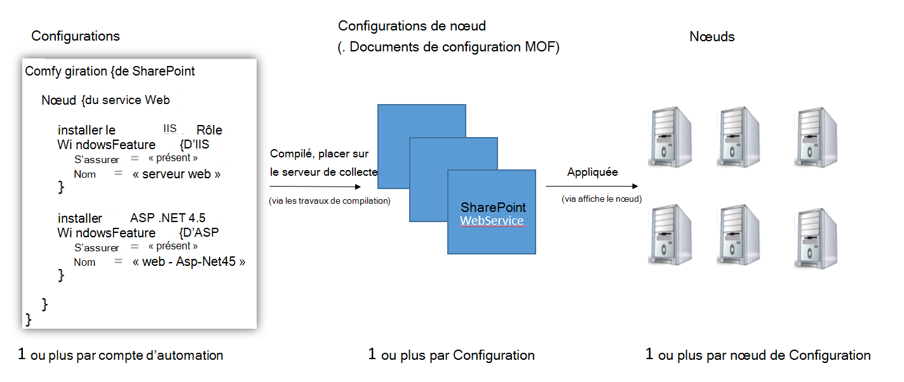
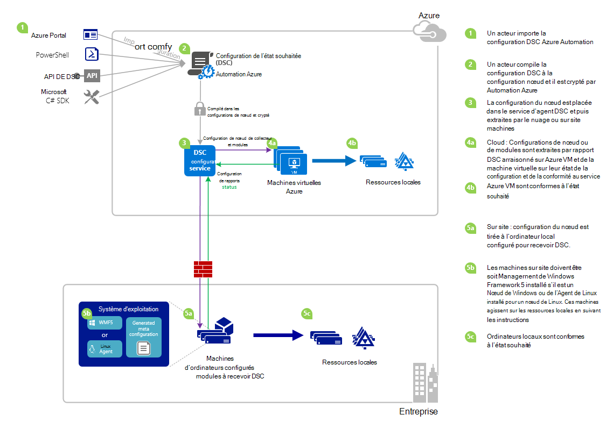

<properties 
   pageTitle="Vue d’ensemble de Automation Azure DSC | Microsoft Azure" 
   description="Une vue d’ensemble d’Azure Automation souhaité état Configuration (DSC), ses termes et problèmes connus" 
   services="automation" 
   documentationCenter="dev-center-name" 
   authors="coreyp-at-msft" 
   manager="stevenka" 
   editor="tysonn"
   keywords="PowerShell dsc, configuration de l’état souhaité, azure dsc de powershell"/>

<tags
   ms.service="automation"
   ms.devlang="NA"
   ms.topic="article"
   ms.tgt_pltfrm="powershell"
   ms.workload="TBD" 
   ms.date="05/10/2016"
   ms.author="magoedte;coreyp"/>

# Vue d’ensemble de Automation Azure DSC #

##Nouveautés Azure Automation DSC##
Déploiement et maintenance de l’état souhaité de vos serveurs et les ressources de l’application peuvent être fastidieux et source d’erreurs. Avec Azure Automation souhaité état Configuration (DSC), vous pouvez déployer de manière cohérente, fiable de surveiller et mettre automatiquement à jour l’état souhaité de toutes vos ressources informatiques à l’échelle à partir du cloud. Basé sur PowerShell DSC, Automation DSC peut aligner avec un état spécifique sur les machines physiques et virtuelles (VMs), à l’aide de Windows ou Linux et dans le nuage ou sur site à la configuration de l’ordinateur. Vous pouvez activer la livraison de services informatiques continue avec contrôle de cohérence et gestion des changements rapide au sein de votre environnement informatique de hybride hétérogène en toute simplicité.

DSC d’Automation Azure s’appuie sur les notions de base introduites dans DSC PowerShell pour fournir une expérience de gestion de configuration encore plus facile. Azure Automation DSC apporte la même couche de gestion pour la [Configuration d’état souhaité PowerShell](https://msdn.microsoft.com/powershell/dsc/overview) Automation d’Azure offre pour l’écriture de scripts PowerShell dès aujourd'hui.

Azure DSC d’Automation vous permet [créer et de gérer les Configurations d’état souhaité PowerShell](https://technet.microsoft.com/library/dn249918.aspx), importer des [Ressources de DSC](https://technet.microsoft.com/library/dn282125.aspx)et de générer des Configurations de nœud de DSC (documents MOF), tout dans le nuage. Ces éléments DSC seront placés sur l’automatisation d’Azure [DSC pull server](https://technet.microsoft.com/library/dn249913.aspx) afin que les noeuds cible (par exemple, les machines physiques et virtuelles) dans le nuage ou sur site peuvent les prendre, automatiquement sont conformes à l’état souhaité, qu'ils spécifient et rapport sur leur mise en conformité avec l’état souhaité à l’Automation d’Azure.

Vous préférez regarder à lecture ? Examinez le dessous de vidéo à partir de mai 2015, lors de la première annonce de DSC d’Automation Azure. **Remarque :** Alors que les concepts et le cycle de vie abordés dans cette vidéo sont corrects, Azure Automation DSC a beaucoup progressé depuis cette vidéo a été enregistrée. Il est désormais disponible, a une interface utilisateur beaucoup plus étendue dans le portail Azure et prend en charge de nombreuses fonctions supplémentaires.

> [AZURE.VIDEO microsoft-ignite-2015-heterogeneous-configuration-management-using-microsoft-azure-automation]

## Conditions d’Automation Azure DSC ##
### Configuration de ###
PowerShell DSC a introduit un nouveau concept appelé configurations. Configurations vous permettent de définir, via la syntaxe de PowerShell, l’état souhaité de votre environnement. Pour configurer votre environnement DSC, définir un bloc de script Windows PowerShell en utilisant le mot clé de configuration, puis suivi d’un identificateur, puis avec les accolades ({}) pour délimiter le bloc.

À l’intérieur du bloc de configuration, vous pouvez définir des blocs de configuration nœud qui spécifient la configuration souhaitée pour un ensemble de nœuds (ordinateurs) dans votre environnement qui doit être configuré exactement de la même. De cette façon, une configuration de nœud représente un « rôle » pour un ou plusieurs nœuds de supposer. Un bloc de configuration nœud démarre avec le mot clé du nœud. Suivez ce mot clé avec le nom du rôle, qui peut être une variable ou une expression. Après le nom de rôle, utilisez les accolades {} pour délimiter le bloc de configuration du nœud.

 
À l’intérieur du bloc de configuration nœud, vous pouvez définir des blocs de ressources pour configurer les ressources de DSC spécifiques. Un bloc de ressources commence par le nom de la ressource, suivie de l’identificateur que vous souhaitez spécifier pour ce bloc, puis d’accolades {} pour délimiter le bloc.

Pour plus d’informations sur le mot clé de configuration, consultez : [Présentation des mots-clés de Configuration dans Configuration de l’état souhaité](http://blogs.msdn.com/b/powershell/archive/2013/11/05/understanding-configuration-keyword-in-desired-state-configuration.aspx "Comprendre mot clé de Configuration dans Configuration de l’état souhaité")

En cours d’exécution (en le compilant) une configuration DSC produira une ou plusieurs DSC nœud configurations (documents MOF), qui sont les nœuds de DSC qui s’appliquent à répondre avec l’état souhaité.

Azure DSC d’Automation vous permet d’importer, auteur, et la compilation des configurations de DSC dans Automation d’Azure, similaire à la façon dont les procédures opérationnelles peuvent être importées, créé et démarré dans Azure Automation.

>[AZURE.IMPORTANT] Une configuration doit contenir un seul bloc de configuration, avec le même nom que la configuration, dans Azure Automation DSC. 

###Configuration de nœud###

Lors de la compilation d’une Configuration de DSC, une ou plusieurs configurations de nœud sont produites selon les blocs de nœud dans la configuration. Une configuration de nœud est identique à celui d’un « MOF » ou « document configuration » (si vous êtes familier avec ces termes PS DSC) et représente le « rôle », tels que le serveur Web ou travailleur qui souhaitable d’état un ou plusieurs nœuds doit assumer ou vérifier la conformité par rapport à. Les noms de configurations de nœud dans Azure Automation DSC prennent la forme de « Configuration Name.NodeConfigurationBlockName ».

PS Nœuds de DSC connaissance de configurations de nœud qu’ils doivent appliquer via des émetteurs de DSC, ou méthodes d’extraction. Azure Automation DSC repose sur la méthode d’extraction DSC, où les configurations de nœud de demande de nœuds qu'ils doivent s’appliquer à partir de la DSC Automation Azure chercher serveur. Étant donné que les nœuds de la demande pour Azure Automation DSC, les nœuds peuvent être situés derrière des pare-feux, que tous les ports fermés, etc. d’entrée. Il leur suffit d’un accès sortant à Internet (que ce soit directement ou via un serveur proxy).

###Nœud###

Un nœud de DSC est n’importe quel ordinateur qui a sa configuration gérée par DSC. Il peut s’agir de Linux Azure VM, VM de locaux Windows / physique hôte ou ordinateur dans un autre cloud public. Nœuds d’appliquer des configurations de nœud pour atteindre et maintenir la conformité avec l’état souhaité, qu'ils définissent et peuvent également le rapport à un serveur de rapports sur leur état de la configuration et la mise en conformité par rapport à l’état souhaité.

DSC d’Automation Azure facilite l’ajout de nœuds pour la gestion par Azure Automation DSC et permet de changer la configuration du nœud affectée à chaque nœud côté serveur, afin que la prochaine, qu'un noeud vérifie le serveur pour obtenir des instructions, il suppose un rôle différent et modifier sa configuration et l’état de conformité il doit créer un rapport pour faire correspondre.

###Ressources###
Ressources de DSC sont les blocs de construction que vous pouvez utiliser pour définir une configuration Windows PowerShell souhaité état Configuration (DSC). DSC est livré avec un ensemble de ressources intégrées telles que celles des fichiers et dossiers, les fonctionnalités de serveur et rôles, paramètres du Registre, variables d’environnement et les services et processus. Pour connaître la liste complète des ressources de DSC intégrés et comment les utiliser, consultez [Intégrés Windows PowerShell souhaité Configuration de ressources d’état](https://technet.microsoft.com/library/dn249921.aspx).

Ressources de DSC peuvent également être importés dans le cadre des Modules PowerShell pour étendre l’ensemble des ressources de DSC intégrés. Ressources non-par défaut se fera vers le bas par les nœuds de DSC à partir du serveur d’extraction de DSC, si une configuration de nœud que le nœud est destiné à mettre contient des références à ces ressources. Pour savoir comment créer des ressources personnalisées, consultez [Génération personnalisée Windows PowerShell souhaité Configuration ressources d’état](https://technet.microsoft.com/library/dn249927.aspx).

Azure DSC d’Automation est livré avec intégré les mêmes ressources de DSC comme PS DSC. Des ressources supplémentaires peuvent être ajoutés pour Azure Automation DSC en important des modules PowerShell contenant les ressources dans Azure Automation.

###Travail de compilation###
Un travail de compilation dans Azure Automation DSC est une instance de la compilation d’une configuration, pour créer une ou plusieurs configurations de nœud. Ils sont similaires aux tâches d’automatisation d’Azure de procédure opérationnelle, sauf qu’ils n’effectuent pas réellement de n’importe quelle tâche, à l’exception de to créer des configurations de nœud. Toute configuration de nœud créée par un travail de compilation est placée automatiquement sur le serveur de collecte d’Azure Automation DSC et remplace les versions précédentes de configurations de nœud, si elles existaient pour cette configuration. Le nom d’une configuration de nœuds produite par un travail de compilation prend la forme de « ConfigurationName.NodeConfigurationBlockName ». Par exemple, la compilation la configuration ci-dessous produirait une configuration nœud unique appelée « MyConfiguration.webserver »

>[AZURE.NOTE] À l’instar des procédures opérationnelles, les configurations peuvent être publiées. Ce n’est pas lié à placer des éléments de DSC sur le serveur de collecte Azure Automation DSC. Travaux de compilation provoquent des articles DSC soient placés sur le serveur de collecte d’Azure Automation DSC. Pour plus d’informations sur « publication » dans Automatisation d’Azure, voir [publication d’une procédure opérationnelle](https://msdn.microsoft.com/library/dn903765.aspx).

##Cycle de vie de DSC Automation Azure##
Atteindre un ensemble géré des nœuds configurés correctement à partir d’un compte vide automation implique un ensemble de processus permettant de définir des configurations, l’activation de ces configurations en configurations de nœud et intégration des nœuds pour Azure Automation DSC et les configurations de nœud. Le diagramme suivant illustre le cycle de vie DSC d’Automation Azure :

L’image suivante illustre le processus pas à pas détaillé dans le cycle de vie de DSC. Il comprend différentes manières une configuration est importée et appliquée aux noeuds dans Azure Automation, les composants requis pour un ordinateur local prendre en charge DSC et interactions entre les différents composants. 

     

##Problèmes / problèmes connus :##

- Lors de la mise à niveau à la version finale de 5 WMF, si l’ordinateur est déjà enregistré en tant que nœud dans Azure Automation DSC, Veuillez annuler son inscription d’Azure Automation DSC et l’enregistrer à nouveau une fois la mise à niveau de la version RTM de 5 WMF.

- Azure DSC d’Automation ne gère pas les configurations de DSC partielles ou composites pour l’instant. Toutefois, les ressources de composite DSC peuvent être importés et utilisés dans Azure Automation DSC Configurations comme dans PowerShell local, ce qui permet la réutilisation de configuration.

- La dernière version de WMF 5 doit être installée pour l’agent DSC de PowerShell pour Windows être en mesure de communiquer avec l’Automation d’Azure. La dernière version de l’agent DSC de PowerShell pour Linux doit être installée pour Linux être en mesure de communiquer avec l’Automation d’Azure.

- Le serveur extrait de PowerShell DSC traditionnel attend compresse de module pour être placé sur le serveur de collecte dans le format **ModuleName_Version.zip »**. Automation Azure attend des modules PowerShell à importer avec des noms sous la forme de **ModuleName.zip**. Consultez [ce billet de blog](https://azure.microsoft.com/blog/2014/12/15/authoring-integration-modules-for-azure-automation/) pour plus d’informations sur le format de Module d’intégration nécessaire pour importer le module dans Azure Automation. 

- Les modules PowerShell importés dans Azure Automation ne peut pas contenir les fichiers .doc ou .docx. Certains modules PowerShell contenant des ressources de DSC contiennent ces fichiers, à des fins d’aide. Ces fichiers doivent être supprimés à partir de modules, avant de l’importer dans Azure Automation.

- Lorsqu’un nœud est tout d’abord enregistré avec un compte Azure Automation, ou le nœud est modifié pour correspondre à un autre nœud configuration côté serveur, son état est « Conforme », même si le statut de ce nœud n’est pas réellement conforme à la configuration de nœuds qu’il est maintenant mappée à. Une fois que le nœud effectue sa première extraction et envoie son premier rapport, après l’inscription ou la modification d’un mappage de configuration de nœud, l’état du nœud peut être approuvé.

- Lorsque arrivant une VM de Windows Azure pour la gestion par Azure DSC de Automation à l’aide de nos méthodes d’intégration directe, il pourrait prendre une heure pour la machine virtuelle s’affiche sous la forme d’un nœud de DSC dans Azure Automation. C’est la machine virtuelle pour Azure Automation DSC suite à l’installation de Windows Management Framework 5.0 sur la machine virtuelle par l’extension Azure VM DSC, qui est requise pour la carte.

- Après l’inscription, chaque nœud négocie automatiquement un certificat unique pour l’authentification qui expire après un an. À ce stade, le protocole d’inscription PowerShell DSC ne peut pas automatiquement renouveler les certificats lorsqu’ils approchent d’expiration, vous devez réenregistrer les nœuds après un délai d’un an. Avant la réinscription, assurez-vous que chaque nœud exécute RTM de Windows Management Framework 5.0. Si l’expiration du certificat d’authentification d’un nœud et le nœud n’est pas réinscrit, le nœud ne pourra pas communiquer avec l’Automation d’Azure et est marqué « Blocage ». Réinscription est effectuée de la même façon que vous avez enregistré le nœud initialement. Réinscription effectuée 90 jours ou moins à partir de l’heure d’expiration du certificat ou à tout moment après le délai d’expiration du certificat, entraîne un nouveau certificat est généré et utilisé.

- Lors de la mise à niveau à la version finale de 5 WMF, si l’ordinateur est déjà enregistré en tant que nœud dans Azure Automation DSC, Veuillez annuler son inscription d’Azure Automation DSC et l’enregistrer à nouveau une fois la mise à niveau de la version RTM de 5 WMF. Avant la réinscription, supprimez le fichier $env:windir\system32\configuration\DSCEngineCache.mof.

- Les applets de commande PowerShell DSC peuvent ne pas fonctionnent si le RTM de WMF 5 est installé sur l’aperçu de Production 5 WMF. Pour résoudre ce problème, exécutez la commande suivante dans une session PowerShell avec élévation de privilèges (exécutée en tant qu’administrateur) :`mofcomp $env:windir\system32\wbem\DscCoreConfProv.mof`
 

##Articles connexes##

- [Intégration de machines pour la gestion par Azure Automation DSC] (.. /Automation/Automation-DSC-onboarding.MD)
- [Compilation configurations dans Azure Automation DSC] (.. /Automation/Automation-DSC-compile.MD)
- [Azure Automation DSC applets de commande] (https://msdn.microsoft.com/library/mt244122.aspx)
- [Prix azure Automation DSC] (https://azure.microsoft.com/pricing/details/automation/)
- [Déploiement continue aux machines virtuelles IaaS en utilisant Automation Azure DSC et Chocolatey] (automation-dsc-cd-chocolatey.md)
