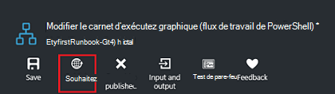
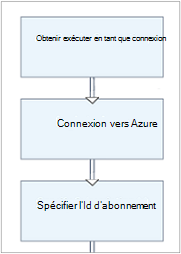
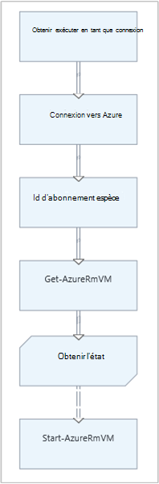

<properties
    pageTitle="Mon premier graphique procédure opérationnelle dans Azure automatisation | Microsoft Azure"
    description="Didacticiel qui vous guide tout au long de la création, les tests et la publication d’une procédure opérationnelle de graphique simple."
    services="automation"
    documentationCenter=""
    authors="mgoedtel"
    manager="jwhit"
    editor=""
    keywords="procédure opérationnelle, modèle de procédure opérationnelle, l’automatisation de procédure opérationnelle, procédure opérationnelle azure"/>
<tags
    ms.service="automation"
    ms.workload="tbd"
    ms.tgt_pltfrm="na"
    ms.devlang="na"
    ms.topic="get-started-article"
    ms.date="07/06/2016"
    ms.author="magoedte;bwren"/>

# <a name="my-first-graphical-runbook"></a>Ma première procédure d’opérationnelle graphique

> [AZURE.SELECTOR] - [Graphique](automation-first-runbook-graphical.md) - [PowerShell](automation-first-runbook-textual-PowerShell.md) - [PowerShell de flux de travail](automation-first-runbook-textual.md)

Ce didacticiel vous guide tout au long de la création d’une [procédure opérationnelle graphique](automation-runbook-types.md#graphical-runbooks) dans Azure Automation.  Nous allons commencer par une procédure opérationnelle simple que nous allons tester et publier pendant que nous expliquons comment effectuer le suivi de l’état de la tâche de procédure opérationnelle.  Puis nous allons modifier la procédure opérationnelle pour gérer les ressources Azure, démarrage d’une machine virtuelle Azure dans ce cas.  Nous allons puis renforcer la procédure opérationnelle en ajoutant des paramètres de procédure opérationnelle et liens conditionnelles.

## <a name="prerequisites"></a>Conditions préalables

Pour terminer ce didacticiel, vous devez les éléments suivants.

-   Abonnement Azure.  Si vous n’en avez pas, vous pouvez [activer vos avantages d’abonné MSDN](https://azure.microsoft.com/pricing/member-offers/msdn-benefits-details/) ou <a href="/pricing/free-account/" target="_blank"> [s’inscrire pour obtenir un compte gratuit](https://azure.microsoft.com/free/).
-   [Exécuter en tant que compte azure](automation-sec-configure-azure-runas-account.md) pour contenir la procédure opérationnelle et s’authentifier auprès de ressources Azure.  Ce compte doit disposer d’autorisations pour démarrer et arrêter la machine virtuelle.
-   Une machine virtuelle Azure.  Nous arrêter et démarrer cet ordinateur afin qu’il ne doit pas être production.


## <a name="step-1---create-new-runbook"></a>Étape 1 : créer la nouvelle procédure d’opérationnelle

Nous allons commencer par créer une procédure opérationnelle simple qui renvoie le texte *Hello World*.

1.  Dans le portail d’Azure, ouvrez votre compte Automation.  
    La page compte d’Automation vous offre une vue rapide des ressources dans ce compte.  Vous devez déjà avoir certains actifs.  La plupart de ceux est les modules qui sont automatiquement inclus dans un nouveau compte d’Automation.  Vous devez également avoir l’immobilisation d’informations d’identification qui est mentionnée dans les [conditions préalables](#prerequisites).
2.  Cliquez sur le carré de **procédures opérationnelles** pour ouvrir la liste des procédures opérationnelles.<br> 
3.  Créer une procédure opérationnelle de nouveau en cliquant sur le bouton **Ajouter une procédure opérationnelle** , puis **créer une nouvelle procédure d’opérationnelle**.
4.  Nommez la procédure opérationnelle le *Graphique MyFirstRunbook*.
5.  Dans ce cas, nous allons créer une [procédure opérationnelle graphique](automation-graphical-authoring-intro.md) afin de le sélectionner **graphique** pour le **type de procédure opérationnelle**.<br> <br>
6.  Cliquez sur **créer** pour créer la procédure opérationnelle et ouvrez l’éditeur de graphique.

## <a name="step-2---add-activities-to-the-runbook"></a>Étape 2 : ajouter des activités à la procédure opérationnelle

Le contrôle de la bibliothèque sur le côté gauche de l’éditeur vous permet de sélectionner les activités à ajouter à votre procédure opérationnelle.  Nous allons ajouter une applet de commande **Write-Output** pour exporter le texte de la procédure opérationnelle.

1.  Dans le contrôle de la bibliothèque, cliquez dans la zone de recherche et tapez **Write-Output**.  Les résultats de recherche seront afficheront ci-dessous. <br> 
2.  Faites défiler jusqu’au bas de la liste.  Vous pouvez cliquez avec le bouton droit sur **Write-Output** et sélectionnez **Ajouter à la zone de dessin** ou cliquez sur l’ellipse située en regard de l’applet de commande et puis sélectionnez **Ajouter à la zone de dessin**.
3.  Cliquez sur l’activité de **Write-Output** sur la toile.  La lame de contrôle de Configuration qui vous permet de configurer l’activité s’affiche.
4.  L' **étiquette** par défaut est le nom de l’applet de commande, mais nous pouvons le modifier par un nom plus convivial. Changer en *Écrivez Hello World dans la sortie*.
5.  Cliquez sur **paramètres** pour fournir des valeurs pour les paramètres de l’applet de commande.  
    Des applets de commande ont plusieurs jeux de paramètres, et vous devez sélectionner que vous allez utiliser. Dans ce cas, **Write-Output** ne possède qu’un seul paramètre, afin que vous n’avez pas besoin de sélectionner un. <br> 
6.  Sélectionnez le paramètre **d’objet d’entrée** .  Il s’agit du paramètre où nous allons indiquer le texte à envoyer au flux de sortie.
7.  Dans le menu déroulant **source de données** , sélectionnez **l’expression de PowerShell**.  La liste déroulante de **source de données** fournit différentes sources que vous utilisez pour remplir une valeur de paramètre.  
    Vous pouvez utiliser la sortie à partir de ces sources comme une expression de PowerShell, une immobilisation Automation ou une autre activité.  Dans ce cas, nous voulons simplement le texte *Hello World*. Nous pouvons utiliser une expression de PowerShell et spécifier une chaîne.
8.  Dans la zone **Expression** , tapez *« Hello World »* et puis cliquez sur **OK** deux fois pour revenir à la zone de dessin.<br> 
9.  Cliquez sur **Enregistrer**pour enregistrer la procédure opérationnelle.<br> 

## <a name="step-3---test-the-runbook"></a>Étape 3 : Test de la procédure opérationnelle

Avant de nous publier la procédure opérationnelle pour le rendre disponible dans la production, nous voulons tester pour vous assurer qu’il fonctionne correctement.  Lorsque vous testez une procédure opérationnelle, vous exécutez sa version **brouillon** et affichez sa sortie de manière interactive.

1.  Cliquez sur **volet de tests** pour ouvrir les lames de Test.<br> 
2.  Cliquez sur **Démarrer** pour démarrer le test.  Ce doit être la seule option activée.
3.  Un [projet de procédure opérationnelle](automation-runbook-execution.md) est créée et son état s’affiche dans le volet.  
    Le statut de la tâche démarre comme *en attente* indiquant qu’il attend d’un travailleur de procédure opérationnelle dans le nuage devienne disponible.  Il passe alors au *départ* lorsqu’un travailleur déclare le travail et *en cours d’exécution* au démarrage de la procédure opérationnelle réellement en cours d’exécution.  
4.  Une fois le travail de procédure opérationnelle terminée, ses résultats s’affiche. Dans notre cas, nous devrions voir *Hello World*.<br> 
5.  Fermez la lame de Test pour revenir à la zone de dessin.

## <a name="step-4---publish-and-start-the-runbook"></a>Étape 4 : publier et démarrer la procédure opérationnelle

La procédure opérationnelle créée est toujours en mode brouillon. Il nous faut publier avant que nous pouvons exécuter en production.  Lorsque vous publiez une procédure opérationnelle, vous remplacez la version publiée existante avec la version de brouillon.  Dans notre cas, nous n’avons pas une version publiée encore parce que nous venons de créer la procédure opérationnelle.

1.  Cliquez sur **Publier** pour publier la procédure opérationnelle, puis sur **Oui** lorsque vous y êtes invité.<br> 
2.  Si vous faites défiler à gauche pour afficher la procédure opérationnelle dans la lame de **procédures opérationnelles** , il affiche un **État de création** **publié**.
3.  Faites défiler vers la droite pour afficher la lame pour **MyFirstRunbook**.  
    Les options en haut nous permettent de démarrer la procédure opérationnelle, planifier qu’il démarre à un moment donné dans le futur ou créer un [webhook](automation-webhooks.md) de sorte qu’il peut être démarré lors d’un appel HTTP.
4.  Nous voulons simplement démarrer la procédure opérationnelle ainsi, cliquez sur **Démarrer** , puis sur **Oui** lorsque vous y êtes invité.<br> 
5.  Une lame de travail est ouvert pour le projet de procédure opérationnelle que nous venons de créer.  Nous pouvons fermer cette blade, mais dans ce cas nous allons laisser ouverte afin que nous puissions suivre la progression du travail.
6.  Le statut de la tâche est affiché dans le **Résumé de la tâche** et correspond à l’état que nous avons vu lorsque nous avons testé la procédure opérationnelle.<br> 
7.  Une fois la procédure opérationnelle état indique *terminé*, cliquez sur **sortie**. La lame de **sortie** est ouvert, et nous pouvons voir *Hello World* dans le volet.<br>   
8.  Fermez la lame de sortie.
9.  Cliquez sur **Tous les journaux** pour ouvrir la lame de flux de données pour le projet de procédure opérationnelle.  Nous devrions voir uniquement de *Hello World* dans le flux de sortie, mais ceci peut indiquer des autres flux de données pour un projet de procédure opérationnelle, tels que des commentaires et d’erreur si la procédure opérationnelle écrit leur.<br> 
10. Fermez la lame de tous les journaux et la lame de tâche pour revenir à la lame de MyFirstRunbook.
11. Cliquez sur **tâches** pour ouvrir la lame de travaux pour cette procédure opérationnelle.  Cette option répertorie toutes les tâches créées par cette procédure opérationnelle. Nous devrions voir uniquement une des tâches répertoriées dans la mesure où nous ne s’exécutaient le travail une seule fois.<br> 
12. Vous pouvez cliquer sur cette tâche pour ouvrir le volet de travail même que nous avons vu lorsque nous avons commencé la procédure opérationnelle.  Cela vous permet de revenir en arrière dans le temps et afficher les détails de n’importe quelle tâche qui a été créé pour une procédure opérationnelle particulière.

## <a name="step-5---create-variable-assets"></a>Étape 5 - créer des immobilisations variables

Nous avons testé et publié notre procédure opérationnelle, mais que jusqu'à présent il ne fait rien d’utile. Nous souhaitons faire gérer les ressources Azure.  Avant de nous configurons la procédure opérationnelle pour s’authentifier, nous allons créer une variable pour contenir l’ID d’abonnement et de référencer une fois que nous le programme d’installation de l’activité de s’authentifier à l’étape 6 ci-dessous.  Y compris une référence au contexte d’abonnement vous permet de travailler facilement entre plusieurs abonnements.  Avant de continuer, copiez votre ID d’abonnement à partir de l’option des abonnements sur le volet de Navigation.  

1. Dans la lame comptes d’Automation, cliquez sur le carreau **capitaux** et la lame de **ressources** est ouvert.
2. Dans la blade d’actifs, cliquez sur la mosaïque de **Variables** .
3. Sur la lame de Variables, cliquez sur **Ajouter une variable**.<br>
4. Dans la nouvelle blade variable, dans la zone **nom** , entrez **AzureSubscriptionId** , puis dans la zone **valeur** , entrez votre ID d’abonnement.  Conserver la *chaîne* pour le **Type** et la valeur par défaut pour le **chiffrement**.  
5. Cliquez sur **créer** pour créer la variable.  


## <a name="step-6---add-authentication-to-manage-azure-resources"></a>Étape 6 - ajouter une authentification pour gérer les ressources Azure

Maintenant que nous avons une variable pour contenir l’ID d’abonnement, nous pouvons configurer notre procédure opérationnelle pour authentifier avec exécuter en tant que celles qui sont référencés dans les [conditions préalables](#prerequisites).  Il suffit d’ajouter l’Azure exécuter en tant que connexion **actif** et **Add-AzureRMAccount** applet de commande pour la toile.  

1.  Ouvrez l’éditeur graphique en cliquant sur **Modifier** sur la lame de MyFirstRunbook.<br> 
2.  Nous n’avons plus besoin **Écrivez Hello World en sortie** , avec le bouton droit dessus et sélectionnez **Supprimer**.
3.  Dans le contrôle de la bibliothèque, développez **connexions** et ajoutez **AzureRunAsConnection** à la zone de dessin en sélectionnant **Ajouter à la zone de dessin**.
4.  Dans la zone de dessin, sélectionnez **AzureRunAsConnection** et dans le panneau de Configuration, tapez **Obtenir exécuter en tant que connexion** dans la zone de texte **d’étiquette** .  Il s’agit de la connexion 
5.  Dans le contrôle de la bibliothèque, dans la zone de recherche tapez **Add-AzureRmAccount** .
6.  Ajouter **Ajouter-AzureRmAccount** à la zone de dessin.<br> 
7.  Survolez **Obtenir exécuter en tant que connexion** jusqu'à ce qu’un cercle apparaît au bas de la forme. Cliquez sur le cercle, puis faites glisser la flèche pour **Ajouter-AzureRmAccount**.  La flèche que vous venez de créer est un *lien*.  La procédure opérationnelle débute par **Obtenir exécuter en tant que connexion** et puis exécutez **Add-AzureRmAccount**.<br> 
8.  Dans la zone de dessin, sélectionnez **Add-AzureRmAccount** et dans la Configuration de contrôler le type de volet **connexion vers Azure** dans **l’étiquette** de la zone de texte.
9.  Cliquez sur **paramètres** et la Configuration du paramètre activité blade s’affiche. 
10.  **Ajouter-AzureRmAccount** a plusieurs jeux de paramètres, vous devez sélectionner une avant de nous pouvons fournir les valeurs de paramètre.  Cliquez sur **La valeur de paramètre** , puis sélectionnez le jeu de paramètres de **ServicePrincipalCertificate** . 
11.  Une fois que vous sélectionnez le jeu de paramètres, les paramètres sont affichés dans la lame de Configuration de paramètre d’activité.  Cliquez sur **APPLICATIONID**.<br> 
12.  De la lame de la valeur de paramètre, sélectionnez la **sortie de l’activité** de la **source de données** et sélectionnez **Obtenir exécuter en tant que connexion** dans la liste, le type de zone de texte **chemin d’accès du champ** **ApplicationId**, puis cliquez sur **OK**.  Nous spécifions le nom de la propriété pour le chemin d’accès du champ car l’activité renvoie un objet avec plusieurs propriétés.
13.  Cliquez sur **CERTIFICATETHUMBPRINT**et dans la lame de la valeur de paramètre, sélectionnez la **sortie de l’activité** de la **source de données**.  Sélectionnez **Obtenir exécuter en tant que connexion** dans la liste, le type de zone de texte **chemin d’accès du champ** **CertificateThumbprint**et puis cliquez sur **OK**. 
14.  Cliquez sur **SERVICEPRINCIPAL**, dans la lame de la valeur de paramètre, sélectionnez **ConstantValue** pour la **source de données**, cliquez sur l’option **True**et puis cliquez sur **OK**.
15.  Cliquez sur **TENANTID**et de la lame de la valeur de paramètre, sélectionnez la **sortie de l’activité** pour la **source de données**.  Sélectionnez **Obtenir exécuter en tant que connexion** dans la liste, le type de zone de texte **chemin d’accès du champ** **TenantId**et puis cliquez sur **OK** à deux reprises.  
16.  Dans le contrôle de la bibliothèque, dans la zone de recherche tapez **Set-AzureRmContext** .
17.  Ajouter **Jeu-AzureRmContext** à la zone de dessin.
18.  Dans la zone de dessin, sélectionnez **Jeu-AzureRmContext** et dans la Configuration de contrôler le type de volet **Spécifier Id d’abonnement** dans la zone de texte **d’étiquette** .
19.  Cliquez sur **paramètres** et la Configuration du paramètre activité blade s’affiche. 
20. **AzureRmContext de l’ensemble** a plusieurs jeux de paramètres, vous devez sélectionner une avant de nous pouvons fournir les valeurs de paramètre.  Cliquez sur **La valeur de paramètre** , puis sélectionnez le jeu de paramètres **SubscriptionId** .  
21.  Une fois que vous sélectionnez le jeu de paramètres, les paramètres sont affichés dans la lame de Configuration de paramètre d’activité.  Cliquez sur **SubscriptionID**
22.  De la lame de la valeur de paramètre, sélectionnez **Variable actif** pour la **source de données** et sélectionnez **AzureSubscriptionId** dans la liste puis cliquez sur **OK** à deux reprises.   
23.  Survolez la **connexion vers Azure** jusqu'à ce qu’un cercle apparaît au bas de la forme. Cliquez sur le cercle et faites glisser la flèche pour **Spécifier un Id de souscription**.


Votre procédure opérationnelle doit ressembler à ce qui suit à ce stade : <br>

## <a name="step-7---add-activity-to-start-a-virtual-machine"></a>Étape 7 - ajouter une activité pour démarrer un ordinateur virtuel

Nous allons maintenant ajouter une activité **Début-AzureRmVM** pour démarrer un ordinateur virtuel.  Vous pouvez choisir n’importe quelle machine virtuelle dans votre abonnement Azure, et pour l’instant, nous serons coder ce nom dans l’applet de commande.

1. Dans le contrôle de la bibliothèque, dans la zone de recherche tapez **Début-AzureRm** .
2. Ajouter **Début-AzureRmVM** pour la toile et puis cliquez sur et faites glisser sous **Spécifiez Id d’abonnement**.
3. Survolez les **Id d’abonnement spécifier** jusqu'à ce qu’un cercle apparaît au bas de la forme.  Cliquez sur le cercle et faites glisser la flèche pour **Démarrer-AzureRmVM**. 
4.  Sélectionnez **Démarrer-AzureRmVM**.  Cliquez sur **paramètres** , puis sur **Paramètre défini** pour afficher les jeux de **Début-AzureRmVM**.  Sélectionnez le jeu de paramètres de **ResourceGroupNameParameterSetName** . Remarque que **ResourceGroupName** et **nom** ont des points d’exclamation ensuite les.  Cela signifie qu’ils sont des paramètres obligatoires.  Notez également que les deux attendent des valeurs de chaîne.
5.  Sélectionnez un **nom**.  Sélectionnez **expression de PowerShell** pour la **source de données** et tapez le nom de l’ordinateur virtuel entouré de guillemets doubles que nous allons commencer avec cette procédure opérationnelle.  Cliquez sur **OK**.<br>
6.  Sélectionnez **ResourceGroupName**. Utilisez **PowerShell expression** de la **source de données** et le nom du groupe de ressources entouré de guillemets doubles.  Cliquez sur **OK**.<br> 
8.  Cliquez sur volet de Test afin que nous puissions tester la procédure opérationnelle.
9.  Cliquez sur **Démarrer** pour démarrer le test.  Une fois qu’elle est terminée, vérifiez que l’ordinateur virtuel a été démarré.

Votre procédure opérationnelle doit ressembler à ce qui suit à ce stade : <br>

## <a name="step-8---add-additional-input-parameters-to-the-runbook"></a>Étape 8 : ajouter des paramètres d’entrée supplémentaires à la procédure opérationnelle

Notre procédure opérationnelle démarre actuellement la machine virtuelle dans le groupe de ressources que nous avons spécifiée dans l’applet de commande **Start-AzureRmVM** , mais notre procédure opérationnelle serait plus utile si nous aurions pu spécifier à la fois au démarrage de la procédure opérationnelle.  Nous allons maintenant ajouter des paramètres d’entrée pour la procédure opérationnelle pour fournir ces fonctionnalités.

1. Ouvrez l’éditeur graphique en cliquant sur **Modifier** dans le volet de **MyFirstRunbook** .
2. Cliquez sur **entrée et la sortie** , puis **Ajouter l’entrée** pour ouvrir le volet du paramètre d’entrée de procédure opérationnelle.<br> 
3. Spécifiez *VMName* pour le **nom**.  Conserver la *chaîne* pour le **Type**, mais modifier **obligatoire** sur *Oui*.  Cliquez sur **OK**.
4. Créer un deuxième paramètre d’entrée obligatoire appelé *ResourceGroupName* et puis cliquez sur **OK** pour fermer le volet **d’entrée et de sortie** .<br> 
5. Sélectionnez l’activité **Début-AzureRmVM** , puis sur **paramètres**.
6. Modifier la **source de données** pour le **nom** **d’entrée de procédure opérationnelle** , puis sélectionnez **VMName**.<br>
7. Modifier la **source de données** pour **ResourceGroupName** à **l’entrée de procédure opérationnelle** , puis sélectionnez **ResourceGroupName**.<br> 
8. Enregistrez la procédure opérationnelle et ouvrez le volet de Test.  Notez que vous pouvez désormais fournir des valeurs pour les deux variables d’entrée qui seront utilisés dans le test.
9. Fermez le volet du Test.
10. Cliquez sur **Publier** pour publier la nouvelle version de la procédure opérationnelle.
11. Arrêtez l’ordinateur virtuel que vous avez lancé à l’étape précédente.
12. Cliquez sur **Démarrer** pour commencer la procédure opérationnelle.  Tapez **VMName** et **ResourceGroupName** pour l’ordinateur virtuel que vous souhaitez démarrer.<br> 
13. Une fois la procédure opérationnelle terminée, vérifiez que l’ordinateur virtuel a été démarré.

## <a name="step-9---create-a-conditional-link"></a>Étape 9 - permet de créer un lien conditionnel

Nous allons maintenant modifier la procédure opérationnelle afin qu’il tente uniquement de démarrer la machine virtuelle si elle n’est pas déjà démarré.  Nous allons pour cela en ajoutant une applet de commande **Get-AzureRmVM** pour la procédure opérationnelle qui obtient l’état de niveau d’instance de l’ordinateur virtuel. Nous allons ensuite ajouter un module de code PowerShell Workflow appelé **Get Status** avec un extrait de code PowerShell pour déterminer si l’état de l’ordinateur virtuel est en cours d’exécution ou arrêté.  Un lien conditionnel à partir du module **Get Status** s’exécute uniquement **Démarrer-AzureRmVM** si l’état en cours d’exécution en cours est arrêté.  Enfin, nous génère un message d’information vous si la machine virtuelle a été démarrée avec succès ou ne pas à l’aide de l’applet de commande PowerShell de Write-Output.

1. Ouvrez **MyFirstRunbook** dans l’éditeur de graphique.
2. Supprimer le lien entre **l’Id d’abonnement spécifier** et **AzureRmVM-démarrer** en cliquant dessus et en appuyant sur la touche *SUPPR* .
3. Dans le contrôle de la bibliothèque, dans la zone de recherche tapez **Get-AzureRm** .
4. Ajouter **Get-AzureRmVM** à la zone de dessin.
5. Cliquez sur **Get-AzureRmVM** , puis **La valeur de paramètre** pour afficher les jeux de **Get-AzureRmVM**.  Sélectionnez le jeu de paramètres de **GetVirtualMachineInResourceGroupNameParamSet** .  Remarque que **ResourceGroupName** et **nom** ont des points d’exclamation ensuite les.  Cela signifie qu’ils sont des paramètres obligatoires.  Notez également que les deux attendent des valeurs de chaîne.
6. Sous **nom de** **source de données** , sélectionnez **l’entrée de la procédure opérationnelle** et sélectionnez **VMName**.  Cliquez sur **OK**.
7. Sous **source de données** pour **ResourceGroupName**, sélectionnez **l’entrée de la procédure opérationnelle** et sélectionnez **ResourceGroupName**.  Cliquez sur **OK**.
8. Sous **source de données** pour **l’état**, sélectionnez la **valeur de constante** et puis cliquez sur **True**.  Cliquez sur **OK**.  
9. Créer un lien à partir de **l’Id d’abonnement spécifier** à **Get-AzureRmVM**.
10. Dans le contrôle de la bibliothèque, développez **Contrôle de procédure opérationnelle** et ajouter du **Code** à la zone de dessin.  
11. Créer un lien à partir de **Get-AzureRmVM** au **Code**.  
12. Cliquez sur **le Code** et dans le volet de Configuration, modifier l’étiquette pour **Obtenir l’état**.
13. Paramètre de **Code** de sélection et la lame de **l’Éditeur de Code** s’affiche.  
14. Dans l’éditeur de code, collez l’extrait de code suivant :

     ```
     $StatusesJson = $ActivityOutput['Get-AzureRmVM'].StatusesText 
     $Statuses = ConvertFrom-Json $StatusesJson 
     $StatusOut ="" 
     foreach ($Status in $Statuses){ 
     if($Status.Code -eq "Powerstate/running"){$StatusOut = "running"} 
     elseif ($Status.Code -eq "Powerstate/deallocated") {$StatusOut = "stopped"} 
     } 
     $StatusOut 
     ```

15. Créer un lien à partir **d’Obtenir l’état** de **Début-AzureRmVM**.<br>   
16. Sélectionnez le lien et dans le volet de Configuration, modifier la **condition de l’appliquer** à **Oui**.   Notez le lien se transforme en une ligne en pointillé indiquant que l’activité de cible sera uniquement exécutée si la condition prend la valeur true.  
17. Pour l' **expression de Condition**, tapez *$ActivityOutput ['Get Status'] - eq « Arrêté »*.  **AzureRmVM-démarrer** maintenant fonctionnera uniquement si l’ordinateur virtuel est arrêté.
18. Dans le contrôle de la bibliothèque, développez les **applets de commande** , puis sur **Microsoft.PowerShell.Utility**.
19. Ajouter **Write-Output** pour la toile deux fois.<br> 
20. Sur le premier contrôle de **Write-Output** , cliquez sur **paramètres** et modifiez la valeur de **l’étiquette** pour *Signaler le démarrage de machine virtuelle*.
21. Pour un **objet d’entrée**, modifier la **source de données** **d’expression de PowerShell** et type de l’expression *« $VMName démarré avec succès. »*.
22. Dans le deuxième contrôle de **Write-Output** , cliquez sur **paramètres** et modifiez la valeur de **l’étiquette** à *Notifier VM Démarrer a échoué*
23. Pour un **objet d’entrée**, modifier la **source de données** à **l’expression de PowerShell** et type de l’expression *« $VMName ne peut pas démarrer. »*.
24. Créer un lien à partir de **Début-AzureRmVM** pour **Notifier le démarrage de machine virtuelle** et **Notifier VM Démarrer a échoué**.
25. Sélectionner le lien pour **Signaler le démarrage de machine virtuelle** et modifier la **condition de l’appliquer** à **True**.
26. Pour l' **expression de Condition**, tapez *$ActivityOutput ['début-AzureRmVM']. IsSuccessStatusCode - eq $true*.  Ce contrôle de Write-Output s’exécute désormais uniquement si l’ordinateur virtuel est démarré.
27. Sélectionner le lien pour **Avertir de l’échec démarrer VM** et modifier la **condition de l’appliquer** à **True**.
28. Pour l' **expression de Condition**, tapez *$ActivityOutput ['début-AzureRmVM']. IsSuccessStatusCode - ne $true*.  Ce contrôle de Write-Output s’exécute désormais uniquement si l’ordinateur virtuel n’a pas démarré correctement.
29. Enregistrez la procédure opérationnelle et ouvrez le volet de Test.
30. Démarrez la procédure opérationnelle avec la machine virtuelle s’est arrêtée, et elle doit commencer.

## <a name="next-steps"></a>Étapes suivantes

-   Pour en savoir plus sur la création de graphiques, voir [Graphical authoring dans Azure Automation](automation-graphical-authoring-intro.md)
-   Pour vous familiariser avec les procédures opérationnelles de PowerShell, voir [Ma première procédure de PowerShell opérationnelle](automation-first-runbook-textual-powershell.md)
-   Pour vous familiariser avec les procédures opérationnelles de flux de travail de PowerShell, voir [Ma première procédure de flux de travail de PowerShell opérationnelle](automation-first-runbook-textual.md)
