<properties
    pageTitle="Ma première procédure de PowerShell opérationnelle dans Azure automatisation | Microsoft Azure"
    description="Didacticiel qui vous guide tout au long de la création, les tests et la publication d’une simple procédure de PowerShell opérationnelle."
    services="automation"
    documentationCenter=""
    authors="mgoedtel"
    manager="jwhit"
    editor=""
    keywords="powershell Azure, didacticiel de script powershell, automatisation powershell"/>
<tags
    ms.service="automation"
    ms.workload="tbd"
    ms.tgt_pltfrm="na"
    ms.devlang="na"
    ms.topic="get-started-article"
    ms.date="07/19/2016"
    ms.author="magoedte;sngun"/>

# <a name="my-first-powershell-runbook"></a>Ma première procédure de PowerShell opérationnelle

> [AZURE.SELECTOR] - [Graphique](automation-first-runbook-graphical.md) - [PowerShell](automation-first-runbook-textual-PowerShell.md) - [PowerShell de flux de travail](automation-first-runbook-textual.md)  

Ce didacticiel vous guide tout au long de la création d’une [procédure opérationnelle de PowerShell](automation-runbook-types.md#powershell-runbooks) dans Azure Automation. Nous allons commencer par une procédure opérationnelle simple que nous allons tester et publier pendant que nous expliquons comment effectuer le suivi de l’état de la tâche de procédure opérationnelle. Puis nous allons modifier la procédure opérationnelle pour gérer les ressources Azure, démarrage d’une machine virtuelle Azure dans ce cas. Nous allons ensuite renforcer la procédure opérationnelle en ajoutant des paramètres de procédure opérationnelle.

## <a name="prerequisites"></a>Conditions préalables

Pour terminer ce didacticiel, vous devez les éléments suivants.

-   Abonnement Azure. Si vous n’en avez pas, vous pouvez [activer vos avantages d’abonné MSDN](https://azure.microsoft.com/pricing/member-offers/msdn-benefits-details/) ou <a href="/pricing/free-account/" target="_blank"> [s’inscrire pour obtenir un compte gratuit](https://azure.microsoft.com/free/).
-   [Compte d’automation](automation-security-overview.md) pour contenir la procédure opérationnelle et s’authentifier auprès de ressources Azure.  Ce compte doit disposer d’autorisations pour démarrer et arrêter la machine virtuelle.
-   Une machine virtuelle Azure. Nous arrêter et démarrer cet ordinateur afin qu’il ne doit pas être production.

## <a name="step-1---create-new-runbook"></a>Étape 1 : créer la nouvelle procédure d’opérationnelle

Nous allons commencer par créer une procédure opérationnelle simple qui renvoie le texte *Hello World*.

1.  Dans le portail d’Azure, ouvrez votre compte Automation.  
    La page compte d’Automation vous offre une vue rapide des ressources dans ce compte. Vous devez déjà avoir certains actifs. La plupart de ceux est les modules qui sont automatiquement inclus dans un nouveau compte d’Automation. Vous devez également avoir l’immobilisation d’informations d’identification qui est mentionnée dans les [conditions préalables](#prerequisites).
2.  Cliquez sur le carré de **procédures opérationnelles** pour ouvrir la liste des procédures opérationnelles.  
      
3.  Créer une procédure opérationnelle de nouveau en cliquant sur le bouton **Ajouter une procédure opérationnelle** , puis **créer une nouvelle procédure d’opérationnelle**.
4.  Nommez la procédure opérationnelle du *MyFirstRunbook-PowerShell*.
5.  Dans ce cas, nous allons créer une [procédure opérationnelle de PowerShell](automation-runbook-types.md#powershell-runbooks) afin de le sélectionner **Powershell** pour le **type de procédure opérationnelle**.  
    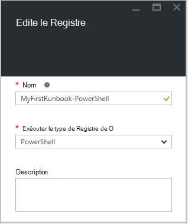  
6.  Cliquez sur **créer** pour créer la procédure opérationnelle et ouvrez l’éditeur de texte.

## <a name="step-2---add-code-to-the-runbook"></a>Étape 2 : ajouter du code à la procédure opérationnelle

Vous pouvez soit code type directement dans la procédure opérationnelle, ou vous pouvez sélectionner des applets de commande, des procédures opérationnelles et des ressources à partir du contrôle de bibliothèque et les ajouter à la procédure opérationnelle avec tous les paramètres associés. Pour cette procédure pas à pas, nous allons taper directement dans la procédure opérationnelle.

1.  Notre procédure opérationnelle est actuellement vide, type *Write-Output « Hello World ».*.  
    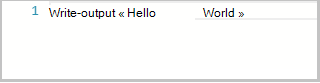  
2.  Cliquez sur **Enregistrer**pour enregistrer la procédure opérationnelle.  
    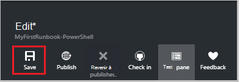  

## <a name="step-3---test-the-runbook"></a>Étape 3 : Test de la procédure opérationnelle

Avant de nous publier la procédure opérationnelle pour le rendre disponible dans la production, nous voulons tester pour vous assurer qu’il fonctionne correctement. Lorsque vous testez une procédure opérationnelle, vous exécutez sa version **brouillon** et affichez sa sortie de manière interactive.

1.  Cliquez sur le **volet du Test** pour ouvrir le volet de Test.  
      
2.  Cliquez sur **Démarrer** pour démarrer le test. Ce doit être la seule option activée.
3.  Un [projet de procédure opérationnelle](automation-runbook-execution.md) est créée et son état.  
    Le statut de la tâche démarrera en tant que *en attente* , indiquant qu’il est en attente pour un travailleur de procédure opérationnelle dans le nuage à venir disponibles. Il passe alors au *départ* lorsqu’un travailleur déclare le travail et *en cours d’exécution* au démarrage de la procédure opérationnelle réellement en cours d’exécution.  
4.  Une fois le travail de procédure opérationnelle terminée, ses résultats s’affiche. Dans notre cas, nous devrions voir *Hello World*  
    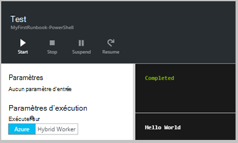  
5.  Fermez le volet de Test pour revenir à la zone de dessin.

## <a name="step-4---publish-and-start-the-runbook"></a>Étape 4 : publier et démarrer la procédure opérationnelle

La procédure opérationnelle créée est toujours en mode brouillon. Il nous faut publier avant que nous pouvons exécuter en production. Lorsque vous publiez une procédure opérationnelle, vous remplacez la version publiée existante avec la version de brouillon. Dans notre cas, nous n’avons pas une version publiée encore parce que nous venons de créer la procédure opérationnelle.

1.  Cliquez sur **Publier** pour publier la procédure opérationnelle, puis sur **Oui** lorsque vous y êtes invité.  
      
2.  Si vous faites défiler à gauche pour afficher la procédure opérationnelle dans le volet de **procédures opérationnelles** de maintenant, il affiche un **État de création** **publié**.
3.  Faites défiler vers la droite pour afficher le volet de **MyFirstRunbook-PowerShell**.  
    Les options dans la partie supérieure permet de démarrer la procédure opérationnelle, permet d’afficher la procédure opérationnelle, planifier qu’il démarre à un moment donné dans le futur, ou de créer un [webhook](automation-webhooks.md) afin que celle-ci peut être démarrée par un appel HTTP.
4.  Nous voulons simplement démarrer la procédure opérationnelle ainsi, cliquez sur **Démarrer** , puis cliquez sur **Ok** lorsque la blade de démarrer la procédure opérationnelle s’ouvre.  
    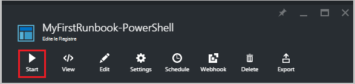  
5.  Un volet de travail est ouvert pour le projet de procédure opérationnelle que nous venons de créer. Nous pouvons fermer ce volet, mais dans ce cas nous allons laisser ouverte afin que nous puissions suivre la progression du travail.
6.  Le statut de la tâche est affiché dans le **Résumé de la tâche** et correspond à l’état que nous avons vu lorsque nous avons testé la procédure opérationnelle.  
    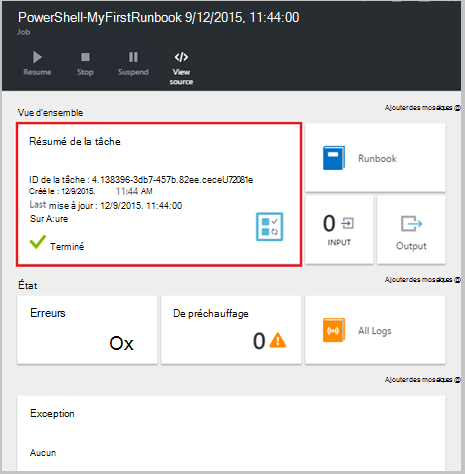  
7.  Une fois la procédure opérationnelle état indique *terminé*, cliquez sur **sortie**. Pour ouvrir le volet de sortie, et nous pouvons voir *Hello World*.  
    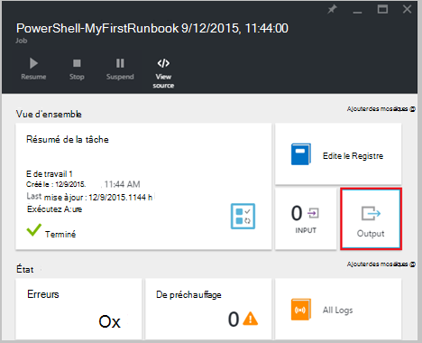
8.  Fermez le volet de sortie.
9.  Cliquez sur **Tous les journaux** pour ouvrir le volet de flux de données pour le projet de procédure opérationnelle. Nous devrions voir uniquement de *Hello World* dans le flux de sortie, mais ceci peut indiquer des autres flux de données pour un projet de procédure opérationnelle, tels que des commentaires et d’erreur si la procédure opérationnelle écrit leur.  
    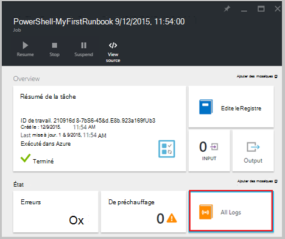  
10. Fermer le volet de flux et de travail à retourner dans le volet de MyFirstRunbook-PowerShell.
11. Cliquez sur **tâches** pour ouvrir le volet de tâches de cette procédure opérationnelle. Cette option répertorie toutes les tâches créées par cette procédure opérationnelle. Nous devrions voir uniquement une des tâches répertoriées dans la mesure où nous ne s’exécutaient le travail une seule fois.  
    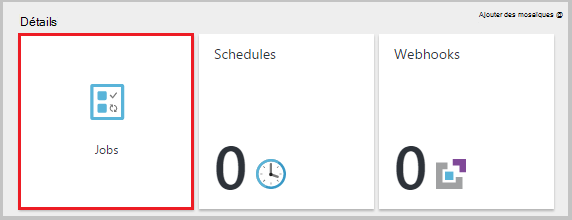  
12. Vous pouvez cliquer sur cette tâche pour ouvrir le volet de travail même que nous avons vu lorsque nous avons commencé la procédure opérationnelle. Cela vous permet de revenir en arrière dans le temps et afficher les détails de n’importe quelle tâche qui a été créé pour une procédure opérationnelle particulière.

## <a name="step-5---add-authentication-to-manage-azure-resources"></a>Étape 5 - ajouter une authentification pour gérer les ressources Azure

Nous avons testé et publié notre procédure opérationnelle, mais que jusqu'à présent il ne fait rien d’utile. Nous souhaitons faire gérer les ressources Azure. Il ne sera en mesure de le faire que si nous n’avez pas il authentifie en utilisant les informations d’identification qui sont référencées dans les [conditions préalables](#prerequisites). Cela se fait avec l’applet de commande **Add-AzureRmAccount** .

1.  Ouvrez l’éditeur de texte en cliquant sur **Modifier** dans le volet de MyFirstRunbook-PowerShell.  
    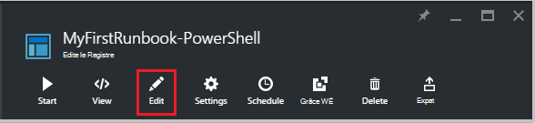  
2.  Nous n’avons plus besoin la ligne de **Write-Output** , continuez et supprimez-le.
3.  Tapez ou copiez et collez le code suivant qui gère l’authentification avec votre compte Automation exécuter en tant que :

    ```
     $Conn = Get-AutomationConnection -Name AzureRunAsConnection 
     Add-AzureRMAccount -ServicePrincipal -Tenant $Conn.TenantID `
     -ApplicationId $Conn.ApplicationID -CertificateThumbprint $Conn.CertificateThumbprint
    ``` 
<br>
4.  Cliquez sur **tester le volet** afin que nous puissions tester la procédure opérationnelle.
5.  Cliquez sur **Démarrer** pour démarrer le test. Une fois terminée, vous devriez recevoir une sortie similaire pour les informations de base suivantes, affichage à partir de votre compte. Cela confirme que les informations d’identification sont valides. <br> 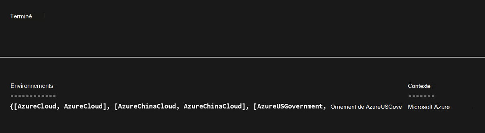

## <a name="step-6---add-code-to-start-a-virtual-machine"></a>Étape 6 - Ajout de code pour démarrer une machine virtuelle

Maintenant que notre procédure opérationnelle s’authentifie à notre abonnement Azure, nous pouvons gérer les ressources. Nous allons ajouter une commande pour démarrer une machine virtuelle. Vous pouvez choisir n’importe quelle machine virtuelle dans votre abonnement Azure, et pour l’instant, nous serons coder ce nom dans l’applet de commande.

1.  *Add-AzureRmAccount*, entrez *Start-AzureRmVM-nom 'VMName' - ResourceGroupName 'NameofResourceGroup'* fournissant le nom et le nom du groupe de ressources de l’ordinateur virtuel pour démarrer.  
    
    ```
     $Conn = Get-AutomationConnection -Name AzureRunAsConnection 
     Add-AzureRMAccount -ServicePrincipal -Tenant $Conn.TenantID `
     -ApplicationID $Conn.ApplicationID -CertificateThumbprint $Conn.CertificateThumbprint 
     Start-AzureRmVM -Name 'VMName' -ResourceGroupName 'ResourceGroupName'
     ```
<br>
2.  Enregistrez la procédure opérationnelle, puis cliquez sur **Test volet afin que nous puissions tester** .
3.  Cliquez sur **Démarrer** pour démarrer le test. Une fois qu’elle est terminée, vérifiez que l’ordinateur virtuel a été démarré.

## <a name="step-7---add-an-input-parameter-to-the-runbook"></a>Étape 7 : ajouter un paramètre d’entrée à la procédure opérationnelle

Notre procédure opérationnelle actuellement démarre l’ordinateur virtuel que nous codé en dur dans la procédure opérationnelle, mais il serait plus utile si nous pouvons spécifier la machine virtuelle au démarrage de la procédure opérationnelle. Nous allons maintenant ajouter des paramètres d’entrée pour la procédure opérationnelle pour fournir ces fonctionnalités.

1.  Ajouter des paramètres à la procédure opérationnelle pour *VMName* et *ResourceGroupName* et utilisation de ces variables avec l’applet de commande **Start-AzureRmVM** comme dans l’exemple ci-dessous.  
    
    ```
    Param(
       [string]$VMName,
       [string]$ResourceGroupName
    )
     $Conn = Get-AutomationConnection -Name AzureRunAsConnection 
     Add-AzureRMAccount -ServicePrincipal -Tenant $Conn.TenantID `
     -ApplicationID $Conn.ApplicationID -CertificateThumbprint $Conn.CertificateThumbprint 
     Start-AzureRmVM -Name $VMName -ResourceGroupName $ResourceGroupName
     ```
<br> 
2.  Enregistrez la procédure opérationnelle et ouvrez le volet de Test. Notez que vous pouvez désormais fournir des valeurs pour les deux variables d’entrée qui seront utilisés dans le test.
3.  Fermez le volet du Test.
4.  Cliquez sur **Publier** pour publier la nouvelle version de la procédure opérationnelle.
5.  Arrêtez l’ordinateur virtuel que vous avez lancé à l’étape précédente.
6.  Cliquez sur **Démarrer** pour commencer la procédure opérationnelle. Tapez **VMName** et **ResourceGroupName** pour l’ordinateur virtuel que vous souhaitez démarrer.  
    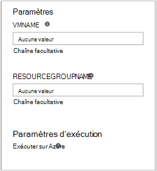  
7.  Une fois la procédure opérationnelle terminée, vérifiez que l’ordinateur virtuel a été démarré.

## <a name="differences-from-powershell-workflow"></a>Différences de flux de travail de PowerShell

Procédures opérationnelles de PowerShell ont le même cycle de vie, capacités et la gestion de procédures opérationnelles de flux de travail de PowerShell, mais il existe certaines différences et les limitations :

1.  Exécutent de procédures opérationnelles de PowerShell rapide par rapport aux procédures opérationnelles de PowerShell le flux de travail car ils n’ont pas étape de compilation.
2.  Procédures opérationnelles de flux de travail PowerShell prend en charge les points de contrôle, à l’aide de points de contrôle, les procédures opérationnelles de PowerShell le flux de travail peut reprendre à partir de n’importe quel point dans la procédure opérationnelle, considérant que les procédures opérationnelles de PowerShell peut reprendre uniquement à partir du début.
3.  Procédures opérationnelles de flux de travail PowerShell prend en charge l’exécution parallèle et série alors que les procédures opérationnelles de PowerShell peut uniquement exécuter les commandes en série.
4.  Dans une procédure opérationnelle de flux de travail de PowerShell, une activité, une commande ou un bloc de script peut avoir sa propre instance d’exécution que dans une procédure opérationnelle de PowerShell, tous les éléments dans un script s’exécute dans une instance d’exécution unique. Il existe également des [différences syntaxiques](https://technet.microsoft.com/magazine/dn151046.aspx) entre une procédure opérationnelle de PowerShell native et une procédure opérationnelle du flux de travail de PowerShell.

## <a name="next-steps"></a>Étapes suivantes

-   Pour vous familiariser avec les procédures opérationnelles de graphiques, voir [Ma première procédure de opérationnelle graphique](automation-first-runbook-graphical.md)
-   Pour vous familiariser avec les procédures opérationnelles de flux de travail de PowerShell, voir [Ma première procédure de flux de travail de PowerShell opérationnelle](automation-first-runbook-textual.md)
-   Pour en savoir plus sur les types de procédure opérationnelle, leurs avantages et leurs limites, consultez [types de procédure opérationnelle Azure Automation](automation-runbook-types.md)
-   Pour plus d’informations sur le script PowerShell prend en charge la fonctionnalité, voir [script PowerShell natif prend en charge dans Azure Automation](https://azure.microsoft.com/blog/announcing-powershell-script-support-azure-automation-2/)
