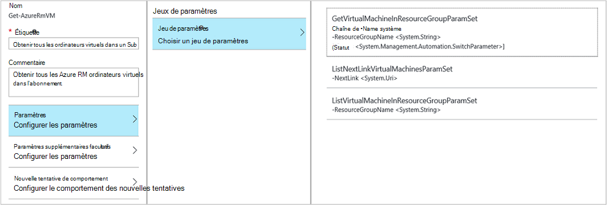

<properties 
    pageTitle="La création de graphiques dans Azure automatisation | Microsoft Azure"
    description="Création graphique vous permet de créer des procédures opérationnelles pour Azure Automation sans utilisation de code. Cet article fournit une introduction à la création de graphiques et tous les détails nécessaires à la création d’une procédure opérationnelle graphique."
    services="automation"   
    documentationCenter=""
    authors="mgoedtel"
    manager="jwhit"
    editor="tysonn" />
<tags 
    ms.service="automation"
    ms.devlang="na"
    ms.topic="article"
    ms.tgt_pltfrm="na"
    ms.workload="infrastructure-services"
    ms.date="06/03/2016"
    ms.author="magoedte;bwren" />

# Création graphique dans Azure Automation

## Introduction

Création graphique vous permet de créer des procédures opérationnelles pour Azure Automation sans la complexité du code sous-jacent de Windows PowerShell ou de flux de travail de PowerShell. Vous ajoutez des activités à la zone de dessin à partir d’une bibliothèque d’applets de commande et les procédures opérationnelles, les relier et configurez pour former un flux de travail.  Si vous avez déjà travaillé avec System Center Orchestrator ou automatisation de gestion de Service (SMA), puis cela devrait vous être familier.   

Cet article fournit une introduction à la création de graphiques et les concepts que vous devez mise en route de la création d’une procédure opérationnelle graphique.

## Procédures opérationnelles graphique

Tous les procédures opérationnelles dans Azure Automation sont des flux de travail Windows PowerShell.  Graphique et graphique du flux de travail PowerShell de procédures opérationnelles génèrent un code PowerShell qui est exécuté par les travailleurs de l’Automation, mais vous n’êtes pas en mesure de l’afficher ou le modifier directement.  Une procédure opérationnelle graphique peut être converti vers une procédure opérationnelle de flux de travail graphique PowerShell et vice versa, mais elles ne peuvent pas être converties en une procédure opérationnelle textuelle. Une procédure opérationnelle de texte existant ne peut pas être importé dans l’éditeur de graphique.  

## Vue d’ensemble de l’éditeur de graphique

Vous pouvez ouvrir l’éditeur de graphique dans le portail Azure par la création ou la modification d’une procédure opérationnelle graphique.

Les sections suivantes décrivent les contrôles de l’éditeur de graphique.

### Zone de dessin
La zone de dessin est vous permet de concevoir votre procédure opérationnelle.  Vous ajoutez des activités à partir des nœuds dans le contrôle de la bibliothèque à la procédure opérationnelle et les associez à des liens pour définir la logique de la procédure opérationnelle.

Vous pouvez utiliser les contrôles en bas de la zone de travail pour effectuer un zoom avant et arrière.

### Contrôle de la bibliothèque

Le contrôle de la bibliothèque est où vous sélectionnez les [activités](#activities) à ajouter à votre procédure opérationnelle.  Vous ajoutez à la zone de dessin où vous les connectez à d’autres activités.  Il comprend quatre sections décrites dans le tableau suivant.

| Section | Description |
|:---|:---|
| Applets de commande | Inclut toutes les applets de commande qui peuvent être utilisés dans votre procédure opérationnelle.  Applets de commande sont organisés par le module.  Tous les modules que vous avez installé dans votre compte automation sera disponible.  |
| Procédures opérationnelles |  Inclut les procédures opérationnelles dans votre compte d’automation. Ces procédures opérationnelles peuvent être ajoutés à la zone de dessin à utiliser en tant que procédures opérationnelles des enfants. Seulement les procédures opérationnelles du même type de base en tant que la procédure opérationnelle en cours de modification sont affichés ; pour un graphique procédures opérationnelles uniquement basé sur PowerShell de procédures opérationnelles sont affichés, alors que pour les procédures opérationnelles de flux de travail graphique PowerShell seulement PowerShell Workflow basé sur les procédures opérationnelles sont affichés.
| Actifs | Inclut les [actifs de l’automation](http://msdn.microsoft.com/library/dn939988.aspx) dans votre compte d’automation qui peut être utilisé dans votre procédure opérationnelle.  Lorsque vous ajoutez un capital à une procédure opérationnelle, il ajoute une activité de flux de travail qui obtient l’élément sélectionné.  Dans le cas d’actifs variables, vous pouvez sélectionner si vous souhaitez ajouter une activité pour obtenir la variable ou la valeur de la variable.
| Contrôle de procédure opérationnelle | Inclut des activités de contrôle de procédure opérationnelle qui peuvent être utilisées dans votre procédure opérationnelle actuelle. Une *jonction* prend plusieurs entrées et attend jusqu'à ce que tout s’est terminée avant de poursuivre le flux de travail. Une activité de *Code* exécute une ou plusieurs lignes de code PowerShell ou PowerShell de flux de travail en fonction du type de graphique de procédure opérationnelle.  Vous pouvez utiliser cette activité de code personnalisé ou pour une fonctionnalité qui est difficile à obtenir avec d’autres activités.|

### Contrôle de la configuration

Le contrôle de Configuration est où vous fournissez des détails pour un objet sélectionné dans la zone de dessin. Les propriétés disponibles dans ce contrôle dépend du type d’objet sélectionné.  Lorsque vous sélectionnez une option dans le contrôle de Configuration, il ouvrira les lames supplémentaires afin de fournir des informations supplémentaires.

### Contrôle de test

Le contrôle de Test n’est pas affiché lors du premier démarrage de l’éditeur de graphique. Il est ouvert lorsque vous interactivement [tester une procédure opérationnelle graphique](#graphical-runbook-procedures).  

## Procédures de procédure opérationnelle graphique 

### Exportation et importation d’une procédure opérationnelle graphique

Vous ne pouvez exporter que la version publiée d’une procédure opérationnelle graphique.  Si la procédure opérationnelle n’a pas encore été publiée, le bouton **Exporter publiée** va être désactivé.  Lorsque vous cliquez sur le bouton **Exporter est publié** , la procédure opérationnelle est téléchargé sur votre ordinateur local.  Le nom du fichier correspond au nom de la procédure opérationnelle avec une extension *graphrunbook* .

Vous pouvez importer un fichier de procédure opérationnelle graphique ou un graphique PowerShell Workflow en sélectionnant l’option **Importer** lors de l’ajout d’une procédure opérationnelle.   Lorsque vous sélectionnez le fichier à importer, vous pouvez conserver le même **nom** ou fournir un nouveau.  Le champ Type de procédure opérationnelle affiche le type de procédure opérationnelle après elle évalue le fichier sélectionné et si vous essayez de sélectionner un autre type qui n’est pas correct, un message s’affichera, en notant les conflits potentiels et lors de la conversion, il peut y avoir des erreurs de syntaxe.  

### Tester une procédure opérationnelle graphique

Vous pouvez tester la version provisoire d’une procédure opérationnelle dans le portail Azure tout en laissant la version publiée de la procédure opérationnelle inchangée, ou vous pouvez tester une procédure opérationnelle de nouveau avant qu’il a été publié. Cela vous permet de vérifier que la procédure opérationnelle fonctionne correctement avant de remplacer la version publiée. Lorsque vous testez une procédure opérationnelle, l’exécution de la procédure opérationnelle brouillon et toutes les actions qu’il exécute sont terminées. Aucun historique de travail n’est créé, mais est affiché dans le volet de résultat de Test. 

Ouvrir le contrôle de Test pour une procédure opérationnelle en ouvrant la procédure opérationnelle pour modifier et puis cliquez sur le bouton **Test** .

Le contrôle de Test d’invite pour tous les paramètres d’entrée, et vous pouvez commencer la procédure opérationnelle en cliquant sur le bouton **Démarrer** .

### Publication d’une procédure opérationnelle graphique

Chaque procédure opérationnelle dans Azure Automation a un projet et une version publié. Que la version publiée est disponible pour être exécuté, et que la version de brouillon peut être modifiée. La version publiée n’est pas affectée par toute modification apportée à la version de brouillon. Lorsque le brouillon est prêt à être disponible, puis vous le publier qui remplace la version publiée avec la version de brouillon.

Vous pouvez publier une procédure opérationnelle graphique en ouvrant la procédure opérationnelle pour le montage et puis en cliquant sur le bouton **Publier** .

Lorsqu’une procédure opérationnelle n’a pas encore été publiée, elle a le statut **nouvelle**.  Lors de sa publication, elle a le statut **publié**.  Si vous modifiez la procédure opérationnelle après qu’il a été publié, et les versions de projet et publiés sont différentes, la procédure opérationnelle a un statut **en cours de modification**.

 

Vous avez également la possibilité de revenir à la version publiée d’une procédure opérationnelle.  Il rejette les modifications apportées depuis la dernière publication de la procédure opérationnelle et remplace la version provisoire de la procédure opérationnelle avec la version publiée.

## Activités

Les activités sont les blocs de construction d’une procédure opérationnelle.  Une activité peut être une applet de commande PowerShell, une procédure opérationnelle d’enfant ou une activité de workflow.  Vous ajoutez une activité à la procédure opérationnelle par le droit de la souris en cliquant dessus dans le contrôle de la bibliothèque et en sélectionnant **Ajouter à la zone de dessin**.  Vous pouvez ensuite cliquez sur et faites glisser l’activité pour le placer n’importe où sur la zone que vous souhaitez.  L’emplacement de la de l’activité sur la zone de dessin n’affecte pas le fonctionnement de la procédure opérationnelle en aucune façon.  Vous pouvez disposition votre procédure opérationnelle mais vous trouverez mieux visualiser son fonctionnement. 

Sélectionnez l’activité dans la zone de travail pour configurer les propriétés et les paramètres de la lame de Configuration.  Vous pouvez modifier l' **étiquette** de l’activité à quelque chose qui est descriptif pour vous.  L’applet de commande d’origine est toujours en cours d’exécution, vous modifiez simplement son nom complet qui sera utilisé dans l’éditeur de graphique.  L’étiquette doit être unique au sein de la procédure opérationnelle. 

### Jeux de paramètres

Un jeu de paramètres définit les paramètres obligatoires et facultatifs qui acceptent des valeurs pour une applet de commande particulière.  Toutes les applets de commande ont au moins un paramètre défini, et certaines ont plusieurs.  Si une applet de commande a plusieurs jeux de paramètres, vous devez sélectionner celui que vous allez utiliser avant de pouvoir configurer les paramètres.  Le jeu de paramètres que vous choisissez dépend de paramètres que vous pouvez configurer.  Vous pouvez modifier le jeu de paramètres utilisé par une activité en sélectionnant **La valeur de paramètre** et un autre jeu.  Dans ce cas, toutes les valeurs de paramètre que vous avez configurés sont perdues.

Dans l’exemple suivant, l’applet de commande Get-AzureRmVM a trois jeux de paramètres.  Vous ne pouvez pas configurer les valeurs de paramètre jusqu'à ce que vous sélectionnez un des ensembles de paramètres.  Le paramètre ListVirtualMachineInResourceGroupParamSet défini est de retourner tous les ordinateurs virtuels dans un groupe de ressources et a un seul paramètre facultatif.  Le GetVirtualMachineInResourceGroupParamSet est pour la spécification de la machine virtuelle, vous souhaitez retourner et a deux obligatoires et un paramètre facultatif.

#### Valeurs de paramètre

Lorsque vous spécifiez une valeur pour un paramètre, vous sélectionnez une source de données pour déterminer comment la valeur doit être spécifiée.  Les valeurs valides pour ce paramètre dépend de sources de données disponibles pour un paramètre particulier.  Par exemple, Null ne sera pas une option disponible pour un paramètre qui n’autorise pas les valeurs null.

| Source de données | Description |
|:---|:---|
|Valeur de constante|Tapez une valeur pour le paramètre.  Cela est disponible uniquement pour les types de données suivants : Int32, Int64, String, Boolean, DateTime, commutateur. |
|Sortie de l’activité|Sortie d’une activité qui précède l’activité en cours dans le flux de travail.  Toutes les activités valides apparaît.  Sélectionnez simplement l’activité à utiliser son résultat pour la valeur du paramètre.  Si l’activité renvoie un objet avec plusieurs propriétés, vous pouvez taper le nom de la propriété après avoir sélectionné l’activité.|
|Entrée de procédure opérationnelle |Sélectionnez un paramètre d’entrée de procédure opérationnelle en tant qu’entrée pour le paramètre de l’activité.|  
|Capital variable|Sélectionnez une Variable Automation comme entrée.|  
|Ressources d’informations d’identification|Sélectionnez les informations d’identification d’Automation comme entrée.|  
|Certificat actif|Sélectionnez un certificat Automation comme entrée.|  
|Ressource de connexion|Sélectionnez une connexion Automation comme entrée.| 
|Expression de PowerShell|Spécifiez simple [expression de PowerShell](#powershell-expressions).  L’expression sera évaluée avant l’activité et le résultat utilisé pour la valeur de paramètre.  Vous pouvez utiliser des variables pour faire référence à la sortie d’une activité ou d’un paramètre d’entrée de procédure opérationnelle.|
|N’est pas configuré|Efface toute valeur qui a été configuré précédemment.|

#### Paramètres supplémentaires facultatifs

Toutes les applets de commande auront la possibilité de fournir des paramètres supplémentaires.  Il s’agit des paramètres communs de PowerShell ou d’autres paramètres personnalisés.  Une zone de texte où vous pouvez fournir les paramètres à l’aide de la syntaxe de PowerShell vous sont présentées.  Par exemple, pour utiliser le paramètre commun de **commentaires** , vous devez spécifier **»-Verbose : $True »**.

### Réessayer d’activité

**Réessayer de comportement** permet à une activité à exécuter plusieurs fois jusqu'à ce qu’une condition particulière est remplie, fonctionne comme une boucle.  Vous pouvez utiliser cette fonctionnalité pour les activités qui doivent s’exécuter plusieurs fois, sont sujets à erreur et peut besoin plus d’une tentative de réussite ou tester les informations de sortie de l’activité de données valides.    

Lorsque vous activez la nouvelle tentative pour une activité, vous pouvez définir un retard et une condition.  Le délai est le délai (exprimé en secondes ou en minutes) que la procédure opérationnelle attendra avant d’exécuter à nouveau l’activité.  Si aucun délai n’est spécifié, puis l’activité réexécuter immédiatement après la fin. 

La condition de nouvelle tentative est une expression de PowerShell qui est évaluée après chaque exécution de l’activité.  Si l’expression prend la valeur True, l’activité s’exécute à nouveau.  Si l’expression prend la valeur False puis l’activité ne s’exécute pas à nouveau, et la procédure opérationnelle passe à l’activité suivante. 

La condition de nouvelle tentative peut utiliser une variable appelée $RetryData qui fournit l’accès à des informations sur les tentatives de l’activité.  Cette variable possède les propriétés dans le tableau suivant.

| Propriété | Description |
|:--|:--|
| NumberOfAttempts | Nombre de fois que l’activité a été exécutée.              |
| Sortie           | Sortie à partir de la dernière exécution de l’activité.                    |
| TotalDuration    | A dépassé le délai écoulé depuis lors du premier démarrage de l’activité. |
| StartedAt        | Heure au format UTC que du premier lancement de l’activité.           |

Voici des exemples d’activité Réessayer les conditions.

    # Run the activity exactly 10 times.
    $RetryData.NumberOfAttempts -ge 10 

    # Run the activity repeatedly until it produces any output.
    $RetryData.Output.Count -ge 1 

    # Run the activity repeatedly until 2 minutes has elapsed. 
    $RetryData.TotalDuration.TotalMinutes -ge 2

Après avoir configuré une condition de nouvelle tentative pour une activité, l’activité inclut deux des signaux visuels pour vous rappeler.  Un est présenté dans l’activité et l’autre lorsque vous passez en revue la configuration de l’activité.

### Contrôle de Script de flux de travail

Un contrôle de Code est une activité spéciale qui accepte de script PowerShell ou de flux de travail PowerShell selon le type de procédure d’opérationnelle graphique créé pour fournir des fonctionnalités qui sinon peut-être pas disponible.  Il ne peut pas accepter de paramètres, mais il peut utiliser des variables pour les paramètres d’entrée d’activité de sortie et de procédure opérationnelle.  Toute sortie de l’activité est ajoutée à la databus, à moins ne qu’aucune sortie lier dans ce cas, il est ajouté à la sortie de la procédure opérationnelle.

Par exemple, le code suivant effectue les calculs de date à l’aide d’une variable d’entrée de procédure opérationnelle appelée $NumberOfDays.  Il envoie ensuite une heure date calculée en tant que sortie devant être utilisé par les activités suivantes de la procédure opérationnelle.

    $DateTimeNow = (Get-Date).ToUniversalTime()
    $DateTimeStart = ($DateTimeNow).AddDays(-$NumberOfDays)}
    $DateTimeStart

## Des liens et des flux de travail

Un **lien** dans une procédure opérationnelle graphique connecte deux activités.  Il s’affiche dans la zone de dessin sous la forme d’une flèche pointant de l’activité de la source vers l’activité de destination.  Les activités s’exécutent dans la direction de la flèche avec l’activité de destination commençant après la fin de l’activité de la source.  

### Créer un lien

Créer un lien entre les deux activités en sélectionnant l’activité de la source et en cliquant sur le cercle au bas de la forme.  Faites glisser la flèche pour l’activité de destination et la libération.

Cliquez sur le lien pour configurer ses propriétés dans la lame de Configuration.  Cela inclut le type de lien qui est décrit dans le tableau suivant.

| Type de lien | Description |
|:---|:---|
| Pipeline | L’activité de destination est exécutée une fois pour chaque objet de sortie à partir de l’activité de la source.  L’activité de destination n’est pas exécuté si l’activité de la source entraîne aucune sortie.  Résultat de l’activité de la source est disponible sous la forme d’un objet.  |
| Séquence | L’activité de destination s’exécute une seule fois.  Elle reçoit un tableau d’objets à partir de l’activité de la source.  Résultat de l’activité de la source est disponible sous la forme d’un tableau d’objets. |

### Début d’activité

Une procédure opérationnelle graphique commence par toutes les activités qui n’ont pas un lien entrant.  Ce sera souvent qu’une seule activité qui peut agir en tant que de l’activité de début de la procédure opérationnelle.  Si plusieurs activités n’ont pas un lien entrant, puis démarre la procédure opérationnelle en les exécutant en parallèle.  Il suivra alors les liens pour exécuter d’autres activités que chacun est terminée.

### Conditions

Lorsque vous spécifiez une condition sur un lien, l’activité de destination uniquement s’exécuter si la condition prend la valeur true.  Vous utiliserez généralement une variable $ActivityOutput dans une condition pour récupérer la sortie de l’activité de la source.  

Pour un lien de pipeline, vous spécifiez une condition pour un seul objet, et la condition est évaluée pour chaque sortie de l’objet par l’activité de la source.  L’activité de destination est alors exécutée pour chaque objet qui satisfait à la condition.  Par exemple, avec une activité source de Get-AzureRmVm, la syntaxe suivante pourrait servir pour un lien de pipeline conditionnelle pour récupérer des machines virtuelles uniquement dans le groupe de ressources nommé *Group1*.  

    $ActivityOutput['Get Azure VMs'].Name -match "Group1"

Pour un lien de la séquence, la condition n’est évaluée qu’une seule fois dans la mesure où une seule baie est retournée qui contient toutes les sorties d’objets à partir de l’activité de la source.  De ce fait, un lien de séquence ne peut pas être utilisé pour le filtrage comme une liaison de pipeline mais détermine simplement si l’activité suivante est exécutée. Prenez par exemple l’ensemble des activités suivantes dans notre procédure opérationnelle de démarrer la machine virtuelle.   
Il existe trois liens de séquence différents qui sont vérification des valeurs fournies pour les deux paramètres d’entrée de procédure opérationnelle qui représente le nom de la machine virtuelle et le nom du groupe de ressources afin de déterminer qui est l’action appropriée à entreprendre - démarrer une machine virtuelle unique, démarrez tous les ordinateurs virtuels dans le groupe de ressources ou tous les ordinateurs virtuels dans un abonnement.  Pour la liaison de séquence entre connexion vers Azure et machine virtuelle unique de Get, voici la logique de la condition :

    <# 
    Both VMName and ResourceGroupName runbook input parameters have values 
    #>
    (
    (($VMName -ne $null) -and ($VMName.Length -gt 0))
    ) -and (
    (($ResourceGroupName -ne $null) -and ($ResourceGroupName.Length -gt 0))
    )

Lorsque vous utilisez un lien conditionnel, les données disponibles à partir de l’activité de la source à d’autres activités dans cette branche seront être filtrées par la condition.  Si une activité est la source pour plusieurs liaisons, puis les données disponibles pour les activités de chaque branche dépend de la condition dans le lien se connecter à cette branche.

Par exemple, l’activité **Début-AzureRmVm** dans la procédure opérationnelle ci-dessous démarre toutes les machines virtuelles.  Il a deux liens conditionnelles.  Le premier lien conditionnel utilise l’expression *$ActivityOutput ['début-AzureRmVM']. IsSuccessStatusCode - eq $true* pour filtrer si l’activité Début-AzureRmVm s’est terminée correctement.  La seconde utilise l’expression *$ActivityOutput ['début-AzureRmVM']. IsSuccessStatusCode - ne $true* pour filtrer si l’activité Début-AzureRmVm Échec du démarrage de l’ordinateur virtuel.  

Toute activité qui suit le premier lien et utilise le résultat de l’activité de Get-AzureVM obtient uniquement les ordinateurs virtuels qui ont été démarrés au moment de l’exécution de Get-AzureVM.  Toute activité qui suit le deuxième lien obtiendrez uniquement les ordinateurs virtuels qui ont été arrêtés au moment de l’exécution de Get-AzureVM.  Toute activité qui suit le troisième lien obtiendra tous les ordinateurs virtuels, quel que soit leur état de fonctionnement.

### Jonctions

Une jonction est une activité spéciale qui attendra jusqu'à ce que toutes les branches entrants est terminé.  Cela vous permet à plusieurs activités en parallèle et vous assurer que tout s’est terminée avant de poursuivre.

Une jonction peut avoir un nombre illimité de liens entrants, pas plus d’un de ces liens peut être un pipeline.  Le nombre de liens entrants de séquence n’est pas limité.  Vous pourrez créer la jonction avec plusieurs liens entrants de pipeline et d’enregistrer la procédure opérationnelle, mais il échoue lorsqu’il est exécuté.

L’exemple suivant fait partie d’une procédure opérationnelle qui démarre un ensemble d’ordinateurs virtuels lors du téléchargement des correctifs à appliquer à ces ordinateurs simultanément.  Une jonction permet de garantir que les deux processus sont terminés avant la poursuite de la procédure opérationnelle.

### Cycles

Un cycle est lorsqu’un liens d’activité de destination vers son activité source ou vers une autre activité qui est éventuellement liée à sa source.  Cycles ne sont actuellement pas autorisées lors de la création du graphique.  Si votre procédure opérationnelle a un cycle, il enregistrera correctement mais recevra une erreur lors de l’exécution.

### Partage de données entre les activités

Toutes les données de sortie à une activité avec un lien sortant sont écrit dans le *databus* pour la procédure opérationnelle.  Toute activité dans la procédure opérationnelle peut utiliser des données sur la databus pour remplir les valeurs de paramètre ou d’inclure dans le code de script.  Une activité peut accéder à la sortie d’une activité précédente dans le workflow.     

Comment les données sont écrites à la databus dépendant de le type de lien sur l’activité.  Pour un **tuyau**, les données sont sortie en tant qu’objets de multiples.  Pour un lien de la **séquence** , les données sont de sortie sous la forme d’un tableau.  S’il existe une seule valeur, elle sera sortie sous la forme d’un tableau à un élément unique.

Vous pouvez accéder aux données du databus à l’aide d’une des deux méthodes.  Tout d’abord utilise une source de données de **Sortie de l’activité** pour remplir un paramètre d’une autre activité.  Si le résultat est un objet, vous pouvez spécifier une propriété unique.

Vous pouvez également récupérer le résultat d’une activité dans une source de données **d’Expression de PowerShell** ou d’une activité de **Script de flux de travail** avec une variable ActivityOutput.  Si le résultat est un objet, vous pouvez spécifier une propriété unique.  Les variables ActivityOutput utilisent la syntaxe suivante.

    $ActivityOutput['Activity Label']
    $ActivityOutput['Activity Label'].PropertyName 

### Points de contrôle

Vous pouvez définir des [points de contrôle](automation-powershell-workflow.md#checkpoints) dans une procédure opérationnelle du flux de travail PowerShell graphique en sélectionnant la *procédure opérationnelle du point de contrôle* sur toutes les activités.  Cela provoque un point de contrôle à définir après l’exécution de l’activité.

Points de contrôle sont activées uniquement dans des procédures opérationnelles de flux de travail graphique PowerShell, il n’est pas disponible dans les procédures opérationnelles de graphique.  Si la procédure opérationnelle utilise des applets de commande Azure, vous devez suivre toute activité contrôlée avec un Add-AzureRMAccount dans le cas où la procédure opérationnelle est interrompue et qu’il redémarre à partir de ce point de contrôle sur un autre travailleur. 

## Authentification auprès de ressources Azure

Procédures opérationnelles dans Azure Automation qui gèrent les ressources Azure exige une authentification à Azure.  La nouvelle fonctionnalité [Exécuter en tant que compte](automation-sec-configure-azure-runas-account.md) (également appelée en tant que service principal) est la méthode par défaut pour accéder aux ressources d’Azure le Gestionnaire de ressources dans votre abonnement avec les procédures opérationnelles d’Automation.  Vous pouvez ajouter cette fonctionnalité à une procédure opérationnelle graphique en ajoutant l’actif de connexion **AzureRunAsConnection** , qui est à l’aide de l’applet de commande PowerShell, [Get-AutomationConnection](https://technet.microsoft.com/library/dn919922%28v=sc.16%29.aspx) et une applet de commande [Add-AzureRmAccount](https://msdn.microsoft.com/library/mt619267.aspx) pour la toile. Ceci est illustré dans l’exemple suivant.  
L’activité d’obtenir exécuter en tant que connexion (par exemple, Get-AutomationConnection), est configuré avec une source de données de valeur de constante nommée AzureRunAsConnection.  
L’activité suivante, Add-AzureRmAccount, ajoute le compte à utiliser Exécuter en tant qu’authentifié dans la procédure opérationnelle. 
 
Pour les paramètres **APPLICATIONID** **CERTIFICATETHUMBPRINT**et **TENANTID** , vous devrez spécifier le nom de la propriété pour le chemin d’accès du champ car l’activité renvoie un objet avec plusieurs propriétés.  Sinon, lorsque vous exécutez la procédure opérationnelle, il échouera tentative d’authentification.  C’est ce que vous devez au minimum pour authentifier votre procédure opérationnelle avec le compte Exécuter en tant que.

Pour conserver la compatibilité descendante pour les abonnés qui ont créé un compte d’Automation à l’aide d’un [compte d’utilisateur d’AD Azure](automation-sec-configure-aduser-account.md) pour gérer les ressources Azure Service Management (ASM) ou le Gestionnaire de ressources Azure, la méthode d’authentification est l’applet de commande Add-AzureAccount avec une [ressource d’informations d’identification](http://msdn.microsoft.com/library/dn940015.aspx) qui représente un utilisateur Active Directory disposant d’un accès au compte Azure.

Vous pouvez ajouter cette fonctionnalité à une procédure opérationnelle graphique en ajoutant une ressource d’informations d’identification pour la toile suivie d’une activité de Add-AzureAccount.  Ajouter-AzureAccount utilise l’activité d’informations d’identification pour son entrée.  Ceci est illustré dans l’exemple suivant.

Vous devez authentifier au début de la procédure opérationnelle et après chaque point de contrôle.  Cela signifie que l’ajout d’une activité d’addition Add-AzureAccount après une activité de Workflow-point de contrôle. Vous ne devez pas une activité de d’informations d’identification d’ajout dans la mesure où vous pouvez utiliser le même 

## Procédure opérationnelle d’entrée et de sortie

### Entrée de procédure opérationnelle

Une procédure opérationnelle peut nécessiter l’entrée d’un utilisateur au démarrage de la procédure opérationnelle via le portail d’Azure, ou à partir d’une autre procédure d’opérationnelle si l’objet actuel est utilisé en tant qu’enfant.
Par exemple, si vous avez une procédure opérationnelle qui crée un ordinateur virtuel, vous devez fournir des informations telles que le nom de l’ordinateur virtuel et d’autres propriétés chaque fois que vous démarrez la procédure opérationnelle.  

Vous acceptez d’entrée pour une procédure opérationnelle en définissant un ou plusieurs paramètres d’entrée.  Vous fournissez des valeurs pour ces paramètres chaque fois que la procédure opérationnelle est démarré.  Lorsque vous démarrez une procédure opérationnelle avec le portail Azure, il vous invite à fournir des valeurs pour chacun des paramètres d’entrée de la procédure d’opérationnelle.

Vous pouvez accéder à des paramètres d’entrée pour une procédure opérationnelle en cliquant sur le bouton **d’entrée et de sortie** sur la barre d’outils de procédure opérationnelle.  

 

Le contrôle **d’entrée et de sortie** dans laquelle vous pouvez modifier un paramètre d’entrée existant ou créez-en un nouveau en cliquant sur **Ajouter entrée**s’ouvre. 

Chaque paramètre d’entrée est défini par les propriétés dans le tableau suivant.

|Propriété|Description|
|:---|:---|
| Nom | Le nom unique du paramètre.  Il ne peut contenir que des caractères numériques alpha et ne peut pas contenir d’espace. |
| Description | Une description facultative pour le paramètre d’entrée.  |
| Type de | Type de données attendu pour la valeur du paramètre.  Le portail Azure fournit un contrôle approprié pour le type de données de chaque paramètre lors de l’entrée. |
| Obligatoire | Spécifie si une valeur doit être fournie pour le paramètre.  Impossible de démarrer la procédure opérationnelle si vous ne fournissez pas une valeur pour chaque paramètre obligatoire qui n’a pas de valeur par défaut définie. |
| Valeur par défaut | Spécifie la valeur utilisée pour le paramètre si aucune n’est pas fournie.  Cela peut être Null ou une valeur spécifique. |

### Sortie de procédure opérationnelle

Créé par toute activité qui ne dispose pas d’un lien sortant de données seront ajoutées à la [sortie de la procédure opérationnelle](http://msdn.microsoft.com/library/azure/dn879148.aspx).  La sortie est enregistrée avec le projet de procédure opérationnelle et est disponible pour une procédure opérationnelle du parent lorsque la procédure opérationnelle est utilisée en tant qu’enfant.  

## Expressions de PowerShell

Un des avantages de la création graphique vous fournit la possibilité de créer une procédure opérationnelle avec une connaissance minimale de PowerShell.  Actuellement, vous n’avez pas besoin de connaître un peu de PowerShell, bien que pour certaines [valeurs de paramètre](#activities) de remplissage et de définir des [conditions de lien](#links-and-workflow).  Cette section fournit une brève introduction aux expressions de PowerShell pour les utilisateurs qui ne sont peut-être pas familiers de ce dernier.  Les détails complets de PowerShell sont disponibles à la [génération de scripts avec Windows PowerShell](http://technet.microsoft.com/library/bb978526.aspx). 

### Source de données d’expression PowerShell

Vous pouvez utiliser une expression de PowerShell comme source de données pour remplir la valeur d’un [paramètre de l’activité](#activities) avec les résultats d’un code PowerShell.  Cela peut être une seule ligne de code qui exécute une fonction simple ou plusieurs lignes qui effectuent une logique complexe.  Toute sortie d’une commande qui n’est pas assignée à une variable est la valeur du paramètre. 

Par exemple, la commande suivante affiche la date actuelle. 

    Get-Date

Les commandes suivantes construire une chaîne à partir de la date actuelle et l’assigner à une variable.  Le contenu de la variable est ensuite envoyé à la sortie 

    $string = "The current date is " + (Get-Date)
    $string

Les commandes suivantes évaluent la date actuelle et retournent une chaîne indiquant si la date du jour est un jour de la semaine ou un week-end. 

    $date = Get-Date
    if (($date.DayOfWeek = "Saturday") -or ($date.DayOfWeek = "Sunday")) { "Weekend" }
    else { "Weekday" }
    
 
### Sortie de l’activité

Pour utiliser la sortie de l’activité précédente dans la procédure opérationnelle, utilisez la variable $ActivityOutput avec la syntaxe suivante.

    $ActivityOutput['Activity Label'].PropertyName

Par exemple, avoir une activité avec une propriété qui requiert le nom d’un ordinateur virtuel dans ce cas, vous pouvez utiliser l’expression suivante.

    $ActivityOutput['Get-AzureVm'].Name

Si la propriété nécessitant la machine virtuelle au lieu de simplement une propriété d’objet, vous devez retourner l’objet entier à l’aide de la syntaxe suivante.

    $ActivityOutput['Get-AzureVm']

Vous pouvez également utiliser le résultat d’une activité dans une expression plus complexe, telle que la suivante qui concatène le texte pour le nom de l’ordinateur virtuel.

    "The computer name is " + $ActivityOutput['Get-AzureVm'].Name

### Conditions

Utiliser des [opérateurs de comparaison](https://technet.microsoft.com/library/hh847759.aspx) pour comparer des valeurs ou de déterminer si une valeur correspond à un modèle spécifié.  Une comparaison renvoie une valeur de $true ou $false.

Par exemple, la condition suivante détermine si l’ordinateur virtuel à partir d’une activité nommée *Get-AzureVM* est actuellement *arrêté*. 

    $ActivityOutput["Get-AzureVM"].PowerState –eq "Stopped"

La condition suivante vérifie si le même ordinateur virtuel est dans un état différent *s’est arrêté*.

    $ActivityOutput["Get-AzureVM"].PowerState –ne "Stopped"

Vous pouvez joindre plusieurs conditions à l’aide d’un [opérateur logique](https://technet.microsoft.com/library/hh847789.aspx) tel que **- et** ou **- ou**.  Par exemple, la condition suivante vérifie si l’ordinateur virtuel même dans l’exemple précédent est dans un état *d’arrêt* ou *d’Arrêter*.

    ($ActivityOutput["Get-AzureVM"].PowerState –eq "Stopped") -or ($ActivityOutput["Get-AzureVM"].PowerState –eq "Stopping") 

### Tables de hachage

[Tables de hachage](http://technet.microsoft.com/library/hh847780.aspx) sont des paires nom/valeur qui sont utiles pour renvoyer un ensemble de valeurs.  Propriétés de certaines activités peuvent s’attendre à une table de hachage au lieu d’une valeur simple.  Vous pouvez également voir comme table de hachage à un dictionnaire. 

Vous créez une table de hachage avec la syntaxe suivante.  Une table de hachage peut contenir n’importe quel nombre d’entrées, mais chacun est défini par un nom et une valeur.

    @{ <name> = <value>; [<name> = <value> ] ...}

Par exemple, l’expression suivante crée une table de hachage à utiliser dans la source de données pour un paramètre de l’activité qui a prévu une table de hachage avec des valeurs pour une recherche sur internet.

    $query = "Azure Automation"
    $count = 10
    $h = @{'q'=$query; 'lr'='lang_ja';  'count'=$Count}
    $h

L’exemple suivant utilise la sortie d’une activité appelée *Obtenir la connexion Twitter* pour remplir une table de hachage.

    @{'ApiKey'=$ActivityOutput['Get Twitter Connection'].ConsumerAPIKey;
      'ApiSecret'=$ActivityOutput['Get Twitter Connection'].ConsumerAPISecret;
      'AccessToken'=$ActivityOutput['Get Twitter Connection'].AccessToken;
      'AccessTokenSecret'=$ActivityOutput['Get Twitter Connection'].AccessTokenSecret}

## Étapes suivantes

- Pour vous familiariser avec les procédures opérationnelles de flux de travail de PowerShell, voir [Ma première procédure de flux de travail de PowerShell opérationnelle](automation-first-runbook-textual.md) 
- Pour vous familiariser avec les procédures opérationnelles de graphiques, voir [Ma première procédure de opérationnelle graphique](automation-first-runbook-graphical.md)
- Pour en savoir plus sur les types de procédure opérationnelle, leurs avantages et leurs limites, consultez [types de procédure opérationnelle Azure Automation](automation-runbook-types.md)
- Pour comprendre comment s’authentifier en utilisant le compte Automation exécuter en tant que, consultez [Configurer l’exécuter en tant que compte Azure](automation-sec-configure-azure-runas-account.md)
 
