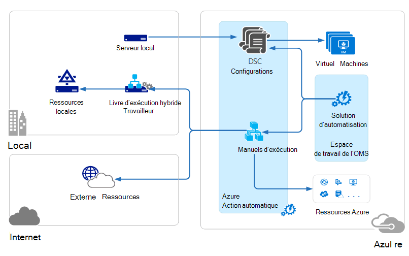
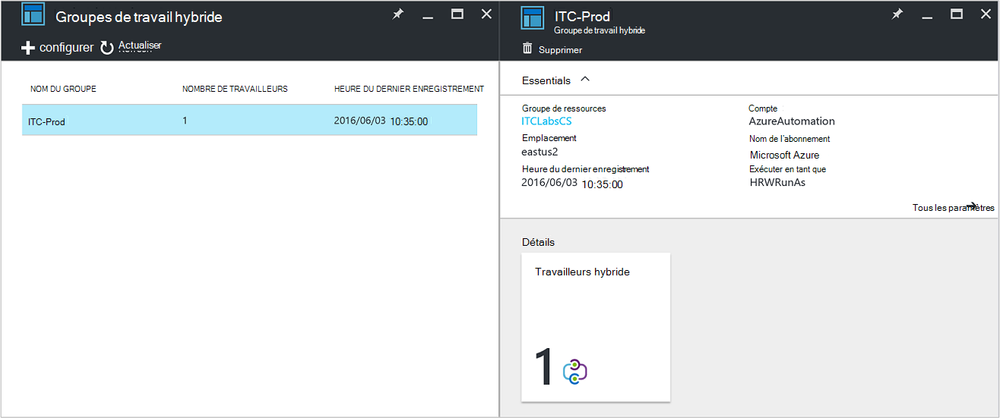
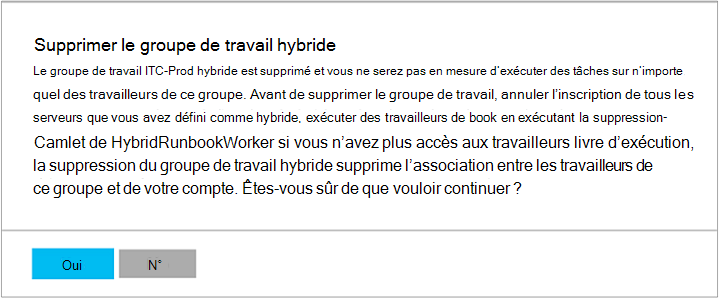

<properties
   pageTitle="Travailleurs de procédure opérationnelle hybride Automation Azure | Microsoft Azure"
   description="Cet article fournit des informations sur l’installation et l’utilisation de travailleur de procédure opérationnelle hybride qui est une fonctionnalité d’automatisation Azure qui vous permet d’exécuter des procédures opérationnelles sur les ordinateurs dans votre centre de données local."
   services="automation"
   documentationCenter=""
   authors="mgoedtel"
   manager="jwhit"
   editor="tysonn" />
<tags
   ms.service="automation"
   ms.devlang="na"
   ms.topic="article"
   ms.tgt_pltfrm="na"
   ms.workload="infrastructure-services"
   ms.date="10/14/2016"
   ms.author="bwren" />

# Travailleurs de procédure opérationnelle Automation Azure hybride

Procédures opérationnelles dans Azure Automation ne peut pas accéder à ressources dans votre centre de données local dans la mesure où ils s’exécutent dans le nuage Azure.  La fonction de travail de procédure opérationnelle hybride d’Azure Automation vous permet de d’exécuter des procédures opérationnelles sur les machines situées dans votre centre de données afin de gérer les ressources locales. Les procédures opérationnelles sont stockés et gérés dans Azure Automation et puis remis à un ou plusieurs ordinateurs locaux.  

Cette fonctionnalité est illustrée dans l’image suivante.   

Vous pouvez désigner un ou plusieurs ordinateurs dans votre centre de données à agir en tant que travailleur procédure opérationnelle hybride et exécuter des procédures opérationnelles Azure Automation.  Chaque travailleur requiert l’Agent de gestion de Microsoft avec une connexion à Microsoft Operations Management Suite et de l’environnement de procédure opérationnelle Azure Automation.  Suite de gestion des opérations est utilisé uniquement pour l’installation et la maintenance de l’agent de gestion et à contrôler la fonctionnalité du travailleur.  La livraison des procédures opérationnelles et de l’instruction à exécuter sont effectuées par Automation d’Azure.

Il n’existe aucune configuration de pare-feu entrant pour prendre en charge des travailleurs de procédure opérationnelle hybride. L’agent sur l’ordinateur local établit toutes les communications avec l’Automation d’Azure dans le nuage. Lorsque vous démarrez une procédure opérationnelle, Azure Automation crée une instruction qui est récupérée par l’agent. L’agent puis récupère la procédure opérationnelle et tous les paramètres avant de l’exécuter.  Elle récupère également les [actifs](http://msdn.microsoft.com/library/dn939988.aspx) qui sont utilisés par la procédure opérationnelle d’Automation d’Azure.

>[AZURE.NOTE] Travailleurs de procédure opérationnelle hybride ne prennent pas en charge [Configurations de DSC](automation-dsc-overview.md).

## Groupes de travail de procédure opérationnelle hybride

Chaque travailleur de procédure opérationnelle hybride est un membre d’un groupe de travail de procédure opérationnelle hybride que vous spécifiez lors de l’installation de l’agent.  Un groupe peut inclure un seul agent, mais vous pouvez installer plusieurs agents dans un groupe pour une haute disponibilité.

Lorsque vous démarrez une procédure opérationnelle sur un travailleur de procédure opérationnelle hybride, vous spécifiez qu’elle sera exécutée sur le groupe.  Les membres du groupe déterminera quel travailleur traitera la demande.  Vous ne pouvez pas spécifier un travail donné.

## Exigences en matière de procédure opérationnelle travailleur hybride

Vous devez désigner au moins un ordinateur local pour exécuter des tâches de procédure opérationnelle hybride.  Cet ordinateur doit disposer des éléments suivants :

- Windows Server 2012 ou version ultérieure
- Windows PowerShell version 4.0 ou ultérieure
- Au moins deux cœurs et 4 Go de RAM

Tenez compte des recommandations suivantes pour les travailleurs hybride : 

- Désigner plusieurs travailleurs hybride dans chaque groupe pour une haute disponibilité.  
- Les travailleurs hybride peuvent coexister avec les serveurs de procédure opérationnelle automatisation de la gestion Service ou System Center Orchestrator.
- Envisagez d’utiliser un ordinateur physiquement situé dans ou à proximité de la région de votre compte d’Automation dans la mesure où les données de projet sont renvoyées à Azure Automation en fin de travail.

>[AZURE.NOTE] Travail de procédure opérationnelle hybride version 7.2.11136.0 prend actuellement en charge la communication via un serveur proxy uniquement avec des scripts PowerShell.  Prise en charge de scripts PowerShell de flux de travail sera disponible dans une version future.  

### Configurer les paramètres de proxy et de pare-feu

Pour le collaborateur de procédure opérationnelle sur site hybride à la connexion et l’inscrire auprès du service Microsoft Operations Management Suite (OMS), il doit avoir accès pour le numéro de port et l’URL décrites ci-dessous.  Il s’agit en plus des [ports et l’URL requises pour l’Agent de surveillance de Microsoft](../log-analytics/log-analytics-proxy-firewall.md#configure-proxy-and-firewall-settings-with-the-microsoft-monitoring-agent) pour vous connecter à OMS. Si vous utilisez un serveur proxy pour la communication entre l’agent et le service OMS, vous devrez vous assurer que les ressources appropriées sont accessibles. Si vous utilisez un pare-feu pour limiter l’accès à Internet, vous devez configurer votre pare-feu pour autoriser l’accès. 

Les informations ci-dessous répertorient les URL qui sont requis pour le travailleur de procédure opérationnelle hybride communiquer avec l’automatisation et le port.

- Port : Seul TCP 443 est requise pour accéder à Internet
- Global d’URL : *.azure-automation.net

Si vous avez un compte d’automatisation défini pour une région spécifique et si vous souhaitez limiter la communication avec ce centre de données régional, le tableau suivant fournit l’enregistrement DNS pour chaque région.

|**Région**|**Enregistrement DNS**|
|--------------|--------------|
|États-Unis centre sud|scus-jobruntimedata-prod-su1.azure-automation.net|
|Les États-Unis 2|eus2-jobruntimedata-prod-su1.azure-automation.net|
|Europe de l’ouest|Nous-jobruntimedata-prod-su1.azure-automation.net|
|Europe du Nord|ne-jobruntimedata-prod-su1.azure-automation.net|
|Canada Central|CC-jobruntimedata-prod-su1.azure-automation.net|
|Asie du Sud-est|SEA-jobruntimedata-prod-su1.azure-automation.net|
|Central de l’Inde|cid-jobruntimedata-prod-su1.azure-automation.net|
|Nord-est du Japon|jpe-jobruntimedata-prod-su1.azure-automation.net|
|L’Australie sud-est|ASE-jobruntimedata-prod-su1.azure-automation.net|

## L’installation de travailleur de procédure opérationnelle hybride

La procédure suivante décrit comment installer et configurer le travail de procédure opérationnelle hybride.  Effectuer les deux premières étapes pour votre environnement d’automatisation et répétez les étapes restantes pour chaque ordinateur de travail.

### 1. création d’espace de travail de la Suite de gestion des opérations

Si vous ne disposez pas déjà d’un espace de travail Suite de gestion des opérations, puis en créer un à l’aide d’instructions à [configurer votre espace de travail](https://technet.microsoft.com/library/mt484119.aspx). Vous pouvez utiliser un espace de travail existant si vous en avez déjà.

### 2. Ajoutez la solution d’automatisation pour l’espace de travail de la Suite de gestion des opérations

Solutions ajoutent des fonctionnalités à la Suite de gestion des opérations.  La solution d’automatisation ajoute des fonctionnalités pour une Automation d’Azure, y compris la prise en charge de travail de procédure opérationnelle hybride.  Lorsque vous ajoutez la solution à votre espace de travail, il enverra automatiquement des composants de travail sur l’ordinateur de l’agent que vous installerez à l’étape suivante.

Suivez les instructions de la section [pour ajouter une solution à l’aide de la galerie de Solutions](../log-analytics/log-analytics-add-solutions.md) pour ajouter de la solution **d’automatisation** à votre espace de travail de la Suite de gestion des opérations.

### 3. installation de l’Agent de surveillance Microsoft

L’Agent de surveillance Microsoft connecte les ordinateurs à la Suite de gestion des opérations.  Lorsque vous installez l’agent sur l’ordinateur local et le connectez à votre espace de travail, il téléchargera automatiquement les composants requis pour le travail de procédure opérationnelle hybride.

Suivez les instructions sur les [ordinateurs Windows de se connecter au journal Analytique](../log-analytics/log-analytics-windows-agents.md) pour installer l’agent sur l’ordinateur local.  Vous pouvez répéter ce processus pour les ordinateurs à ajouter plusieurs travailleurs à votre environnement.

Lorsque l’agent est connecté avec succès à la Suite de gestion des opérations, il apparaît dans l’onglet **Sources connectées** du volet **paramètres** du Operations Management Suite.  Vous pouvez vérifier que l’agent a téléchargé correctement dans la solution d’automatisation lorsqu’il a un dossier nommé **AzureAutomationFiles** dans les Agent\Agent de surveillance C:\Program Files\Microsoft.  Pour vérifier la version du travailleur hybride procédure opérationnelle, vous pouvez accéder à Agent\Agent\AzureAutomation\ de surveillance C:\Program Files\Microsoft et notez le \\dossier *version* .   

### 4. installer l’environnement de procédure opérationnelle et se connecter à l’Automation d’Azure

Lorsque vous ajoutez un agent à la Suite de gestion des opérations, la solution d’automatisation pousse vers le bas le module PowerShell de **HybridRegistration** contenant l’applet de commande **Add-HybridRunbookWorker** .  Cette applet de commande vous permet d’installer l’environnement de procédure opérationnelle sur l’ordinateur et l’enregistrer avec l’Automation d’Azure.

Ouvrez une session PowerShell en mode administrateur et exécutez les commandes suivantes pour importer le module.

    cd "C:\Program Files\Microsoft Monitoring Agent\Agent\AzureAutomation\<version>\HybridRegistration"
    Import-Module HybridRegistration.psd1

Ensuite, exécutez l’applet de commande **Add-HybridRunbookWorker** à l’aide de la syntaxe suivante :

    Add-HybridRunbookWorker –Name <String> -EndPoint <Url> -Token <String>

Vous pouvez obtenir les informations requises pour cette applet de commande à partir de la blade de **Gestion des clés** dans le portail Azure.  Ouvrez cette blade en cliquant sur l’icône de clé dans le panneau des éléments pour le compte de l’automation.

- **Nom** est le nom du groupe de travail de procédure opérationnelle hybride. Si ce groupe existe déjà dans le compte de l’automatisation, l’ordinateur actuel est ajouté à celle-ci.  Si elle n’existe pas déjà, il est ajouté.
- **Point de terminaison** est le champ **URL** de la blade de **Gestion des clés** .
- **Jeton** est la **Clé d’accès primaire** dans la blade de **Gestion des clés** .  

Utilisez le **-Verbose** commutateur avec **Add-HybridRunbookWorker** de recevoir des informations détaillées sur l’installation.

### 5. installer les modules PowerShell

Procédures opérationnelles peuvent utiliser toutes les activités et les applets de commande définies dans les modules installés dans votre environnement d’automatisation d’Azure.  Ces modules ne sont pas automatiquement déployés sur les ordinateurs locaux, vous devez les installer manuellement.  L’exception est le module Azure qui est installé par défaut, accès aux applets de commande pour toutes les activités et les services Azure pour Azure Automation.

Étant donné que l’objectif principal de la fonctionnalité de traitement de procédure opérationnelle hybride est de gérer des ressources locales, vous aurez probablement besoin d’installer les modules de prise en charge de ces ressources.  Vous pouvez faire référence à [L’installation de Modules](http://msdn.microsoft.com/library/dd878350.aspx) pour plus d’informations sur l’installation des modules de Windows PowerShell.

## Suppression du travail de procédure opérationnelle hybride

Vous pouvez supprimer un ou plusieurs travailleurs de procédure opérationnelle hybride d’un groupe, ou vous pouvez supprimer le groupe, en fonction de vos besoins.  Pour supprimer un travail de procédure opérationnelle hybride à partir d’un ordinateur local, ouvrez une session PowerShell en mode administrateur et exécutez la commande suivante - applet de commande **Remove-HybridRunbookWorker** .  Utilisez le **-Verbose** passer pour un journal détaillé du processus de suppression. 

Ceci ne supprime pas le contrôle Microsoft Agent à partir de l’ordinateur, uniquement les fonctionnalités et la configuration du rôle Collaborateur de procédure opérationnelle hybride.  

Pour supprimer un groupe, vous devez tout d’abord supprimer le travailleur de procédure opérationnelle hybride à partir de chaque ordinateur qui est membre du groupe à l’aide de la commande indiquée plus haut, et puis vous procédez comme suit pour supprimer le groupe.  

1. Ouvrez le compte de l’Automation dans le portail Azure.
2. Sélectionnez le carreau de **Groupes de travail hybride** et dans la lame de **Groupes de travail hybride** , sélectionnez le groupe que vous souhaitez supprimer.  Après avoir sélectionné un groupe spécifique, la lame de propriétés de **groupe de travail hybrides** s’affiche.     
3. Sur la lame de propriétés pour le groupe sélectionné, cliquez sur **Supprimer**.  Un message apparaît vous invitant à confirmer cette action et cliquez sur **Oui** si vous êtes sûr de que vouloir continuer.    Ce processus peut prendre plusieurs secondes pour se terminer et vous pouvez suivre sa progression sous **Notifications** à partir du menu.  

## Démarrage des procédures opérationnelles sur le travail de procédure opérationnelle hybride

[Démarrage d’une procédure opérationnelle dans Azure Automation](automation-starting-a-runbook.md) décrit les différentes méthodes permettant de démarrer une procédure opérationnelle.  Travail de procédure opérationnelle hybride ajoute une option **RunOn** dans laquelle vous pouvez spécifier le nom d’un groupe de travail de procédure opérationnelle hybride.  Si un groupe est spécifié, la procédure opérationnelle est récupéré et exécuté par des travailleurs de ce groupe.  Si cette option n’est pas spécifiée, il est exécuté dans Azure Automation comme d’habitude.

Lorsque vous démarrez une procédure opérationnelle dans Azure portal, s’affiche avec l’option **exécuter sur** où vous pouvez sélectionner **Azure** ou **Hybride travailleur**.  Si vous sélectionnez **Hybride travailleur**, vous pouvez sélectionner le groupe à partir d’une liste déroulante.

Utilisez le paramètre **RunOn** que vous pouvez utiliser la commande suivante pour démarrer une procédure opérationnelle nommé Test-procédure opérationnelle sur un groupe de travailleurs de procédure opérationnelle hybride nommé MyHybridGroup à l’aide de Windows PowerShell.

    Start-AzureRmAutomationRunbook –AutomationAccountName "MyAutomationAccount" –Name "Test-Runbook" -RunOn "MyHybridGroup"

>[AZURE.NOTE] Le paramètre **RunOn** a été ajouté à l’applet de commande **Start-AzureAutomationRunbook** dans la version 0.9.1 de Microsoft Azure PowerShell.  Vous devez [Télécharger la dernière version](https://azure.microsoft.com/downloads/) si vous avez une installation ancienne.  Vous devez uniquement installer cette version sur une station de travail où vous commencez la procédure opérationnelle à partir de Windows PowerShell.  Vous n’avez pas besoin de l’installer sur l’ordinateur de travail, sauf si vous avez l’intention de lancer les procédures opérationnelles à partir de cet ordinateur.  Impossible actuellement de démarrer une procédure opérationnelle sur un travailleur de procédure opérationnelle hybride à partir d’une autre procédure d’opérationnelle car cela nécessite la version la plus récente de Powershell Azure doit être installé dans votre compte d’Automation.  La version la plus récente sera automatiquement mis à jour dans Azure Automation et automatiquement répercutée vers les travailleurs bientôt.

## Autorisations de procédure opérationnelle

Procédures opérationnelles en cours d’exécution sur un travailleur de procédure opérationnelle hybride ne peut pas utiliser même [méthode qui est utilisée en général pour les procédures opérationnelles authentification auprès de ressources Azure](automation-configuring.md#configuring-authentication-to-azure-resources) puisqu’elles accéderont les ressources en dehors d’Azure.  La procédure opérationnelle peut fournir sa propre authentification aux ressources locales, ou vous pouvez spécifier un compte de RunAs pour fournir un contexte utilisateur pour toutes les procédures d’opérationnelles.

### Authentification de procédure opérationnelle

Par défaut, les procédures opérationnelles s’exécutera dans le contexte du compte système local sur l’ordinateur local, afin qu’ils doivent fournir leur propre authentification aux ressources auxquels ils auront accès.  

Vous pouvez utiliser les actifs [d’information d’identification](http://msdn.microsoft.com/library/dn940015.aspx) et des [certificats](http://msdn.microsoft.com/library/dn940013.aspx) dans votre procédure opérationnelle avec les applets de commande qui vous permettent de spécifier des informations d’identification afin de vous pouvez s’authentifier auprès de ressources différentes.  L’exemple suivant montre une partie d’une procédure opérationnelle qui redémarre un ordinateur.  Il récupère les informations d’identification à partir d’une ressource d’informations d’identification et le nom de l’ordinateur à partir d’un élément variable et utilise ensuite ces valeurs avec l’applet de commande Restart-Computer.

    $Cred = Get-AzureRmAutomationCredential -ResourceGroupName "ResourceGroup01" -Name "MyCredential"
    $Computer = Get-AzureRmAutomationVariable -ResourceGroupName "ResourceGroup01" -Name  "ComputerName"

    Restart-Computer -ComputerName $Computer -Credential $Cred

Vous pouvez également exploiter [InlineScript](automation-powershell-workflow.md#inline-script) qui vous permet d’exécuter des blocs de code sur un autre ordinateur avec les informations d’identification spécifiées par le [paramètre commun de PSCredential](http://technet.microsoft.com/library/jj129719.aspx).

### Compte de RunAs

Au lieu de procédures opérationnelles fournir leur propre authentification aux ressources locales, vous pouvez spécifier un compte **RunAs** pour un groupe de travail hybrides.  Vous spécifiez une [ressource d’informations d’identification](automation-credentials.md) qui a accès aux ressources locales et procédures opérationnelles tous seront exécuteront sous ces informations d’identification lors de l’exécution sur un travailleur de procédure opérationnelle hybride dans le groupe.  

Le nom d’utilisateur pour les informations d’identification doit être l’un des formats suivants :

- domaine\nom d’utilisateur 
- username@domain
- nom d’utilisateur (pour les comptes locaux sur l’ordinateur local)

Utilisez la procédure suivante pour spécifier un compte RunAs pour un groupe de travail hybride :

1. Créer une [ressource d’informations d’identification](automation-credentials.md) avec l’accès aux ressources locales.
2. Ouvrez le compte de l’Automation dans le portail Azure.
2. Sélectionnez la mosaïque de **Groupes de travail hybride** , puis sélectionnez le groupe.
3. Sélectionnez **tous les paramètres** , puis sur **paramètres de groupe de travail hybrides**.
4. Remplacez **Exécuter en tant que** **par défaut** **personnalisé**.
5. Sélectionnez les informations d’identification, puis cliquez sur **Enregistrer**.

## Création des procédures opérationnelles pour travail de procédure opérationnelle hybride

Il n’y a aucune différence dans la structure des procédures opérationnelles qui s’exécutent dans Azure Automation et ceux qui s’exécutent sur un travailleur de procédure opérationnelle hybride. Procédures opérationnelles que vous utilisez avec chaque probablement diffèrent considérablement bien que dans la mesure où les procédures opérationnelles pour travail de procédure opérationnelle hybride généralement gère les ressources locales dans votre centre de données alors que les procédures opérationnelles dans Azure Automation généralement gérer les ressources dans le nuage Azure. 

Vous pouvez modifier une procédure opérationnelle pour travail de procédure opérationnelle hybride dans Azure Automation, mais peuvent avoir des difficultés si vous essayez de tester la procédure opérationnelle dans l’éditeur.  Les modules PowerShell qui accèdent aux ressources locales ne soient pas installés dans votre environnement d’automatisation d’Azure dans ce cas, le test échoue.  Si vous n’installez pas les modules requis, réexécutez la procédure opérationnelle, mais il ne sera pas en mesure d’accéder aux ressources locales pour un test complet.

## Résolution des problèmes de procédures opérationnelles sur le travail de procédure opérationnelle hybride

[Sortie de procédure opérationnelle et les messages](automation-runbook-output-and-messages.md) envoyés à Azure Automation par hybride travailleurs comme procédure opérationnelle travaux exécutent dans le nuage.  Vous pouvez également activer les flux Verbose et la progression de la même façon que vous le feriez pour d’autres procédures opérationnelles.  

Les journaux sont stockés localement sur chaque travailleur hybride à C:\ProgramData\Microsoft\System Center\Orchestrator\7.2\SMA\Sandboxes.

Si les procédures opérationnelles ne sont pas completeing correctement et que la tâche récapitulative affiche l’état **suspendu**, veuillez consulter l’article dépannage [hybride procédure opérationnelle travailleur : un travail de procédure opérationnelle se termine avec l’état suspendu](automation-troubleshooting-hrw-runbook-terminates-suspended.md).   

## Relation avec l’automatisation de la gestion Service

[Automatisation de gestion de service (SMA)](https://technet.microsoft.com/library/dn469260.aspx) vous permet d’exécuter les procédures opérationnelles même qui sont pris en charge par Automation Azure dans votre centre de données local. SMA est généralement déployé avec le Pack de Windows Azure, Windows Azure Pack contient une interface graphique pour la gestion des SMA. Contrairement à Automation d’Azure, SMA nécessite une installation locale qui comprend des serveurs web pour héberger le API, une base de données pour contenir les procédures opérationnelles et configuration SMA et des travailleurs de procédure opérationnelle pour exécuter des travaux de procédure opérationnelle. Automation Azure fournit ces services dans le nuage et vous devez mettre à jour les travailleurs hybride procédure opérationnelle dans votre environnement local.

Si vous êtes un utilisateur SMA existant, vous pouvez déplacer les procédures opérationnelles à l’Automation d’Azure pour être utilisé avec le travail de procédure opérationnelle hybride sans apporter de modifications, en supposant qu’ils effectuent leur propre authentification aux ressources comme décrit dans la [création des procédures opérationnelles pour travail de procédure opérationnelle hybride](#creating-runbooks-for-hybrid-runbook-worker).  Procédures opérationnelles dans le SMA s’exécutent dans le contexte du compte de service sur le serveur de traitement qui peut-être fournir l’authentification pour les procédures opérationnelles.

Vous pouvez utiliser les critères suivants pour déterminer si Automation Azure avec travailleur de procédure opérationnelle hybride ou l’automatisation de la gestion Service est plus adaptée à vos besoins.

- SMA nécessite une installation locale de ses composants sous-jacents qui sont connectés à Windows Azure Pack si une interface de gestion graphique est nécessaire. Plus de ressources locales sont nécessaires avec les coûts de maintenance plus élevés que l’automatisation d’Azure, qui ne nécessite un agent installé sur les travailleurs de procédure opérationnelle locale. Les agents sont gérés par la Suite de gestion des opérations, plus réduire vos coûts de maintenance.
- Automation Azure stocke ses procédures opérationnelles dans le nuage et les remet aux travailleurs de procédure opérationnelle hybride sur site. Si votre stratégie de sécurité n’autorise pas ce comportement, vous devez utiliser SMA.
- SMA est inclus avec System Center ; et par conséquent, requiert une licence de System Center 2012 R2. Automation Azure est basée sur un modèle hiérarchisé d’abonnement.
- Automation Azure a fonctions avancées telles que des procédures opérationnelles graphiques qui ne sont pas disponibles dans le SMA.

## Étapes suivantes

- Pour en savoir plus sur les différentes méthodes qui peuvent être utilisés pour démarrer une procédure opérationnelle, voir [une procédure opérationnelle dans Azure Automation](automation-starting-a-runbook.md)
- Pour comprendre les différentes procédures permettant de travailler avec les procédures opérationnelles de PowerShell et de flux de travail de PowerShell dans Automation Azure à l’aide de l’éditeur de texte, consultez [modification d’une procédure opérationnelle dans Azure Automation](automation-edit-textual-runbook.md)

 
