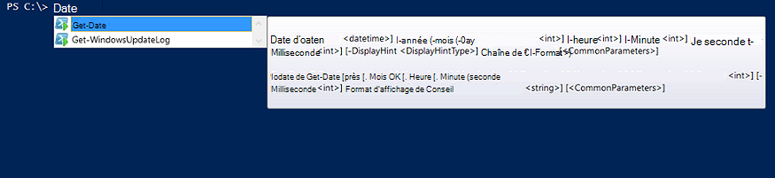

<properties
   pageTitle="Créer un Module d’intégration Automation Azure | Microsoft Azure"
   description="Didacticiel qui vous guide dans l’utilisation de création, de test et exemple de modules d’intégration dans Azure Automation."
   services="automation"
   documentationCenter=""
   authors="mgoedtel"
   manager="jwhit"
   editor="" />

<tags
   ms.service="automation"
   ms.workload="tbd"
   ms.tgt_pltfrm="na"
   ms.devlang="na"
   ms.topic="get-started-article"
   ms.date="09/12/2016"
   ms.author="magoedte" />

# <a name="azure-automation-integration-modules"></a>Modules d’intégration Automation Azure

PowerShell est la technologie fondamentale Azure Automation. Dans la mesure où Azure Automation est basée sur PowerShell, modules PowerShell sont essentiels pour l’extensibilité de l’automatisation d’Azure. Dans cet article, nous vous guide à travers les caractéristiques d’utilisation de Automation Azure de modules PowerShell, appelés « Modules d’intégration » et les meilleures pratiques pour la création de vos propres modules PowerShell pour vous assurer qu’ils fonctionnent sous forme de Modules d’intégration dans Azure Automation. 

## <a name="what-is-a-powershell-module"></a>Quel est un PowerShell Module ?

Un module de PowerShell est un groupe d’applets de commande PowerShell telles que **Get-Date** ou **Copy-Item**, qui peut être utilisé à partir de la console PowerShell, des scripts, des workflows, des procédures opérationnelles et des ressources de PowerShell DSC WindowsFeature ou de fichier, qui peut être utilisé à partir de configurations de PowerShell DSC. Toutes les fonctionnalités de PowerShell est exposé via les applets de commande et les ressources de DSC, et chaque ressource de l’applet de commande/DSC est sauvegardée par un module PowerShell, un grand nombre de qui sont livrés avec PowerShell dans elle-même. Par exemple, l’applet de commande **Get-Date** fait partie du module PowerShell de Microsoft.PowerShell.Utility, applet de commande **Copy-Item** fait partie du module PowerShell de la Microsoft.PowerShell.Management et la ressource de Package DSC fait partie du module PSDesiredStateConfiguration PowerShell. Deux de ces modules sont livrés avec PowerShell. Mais de nombreux modules de PowerShell ne sont pas fournis dans le cadre de PowerShell et sont distribués à la place avec des produits de premier ou de tiers tels que System Center 2012 Configuration Manager ou par la vaste communauté de PowerShell dans des lieux tels que PowerShell galerie.  Les modules sont utiles car ils simplifient les tâches complexes grâce à la fonctionnalité encapsulée.  Pour plus d’informations sur [les modules PowerShell sur MSDN](https://msdn.microsoft.com/library/dd878324%28v=vs.85%29.aspx). 

## <a name="what-is-an-azure-automation-integration-module"></a>Quel est un Module d’intégration Automation Azure ?

Un Module d’intégration n’est pas très différent d’un module de PowerShell. Son simplement un module PowerShell qui contient éventuellement un fichier supplémentaire - un fichier de métadonnées de spécification d’un type de connexion d’Automation d’Azure pour être utilisé avec les applets de commande du module de procédures opérationnelles. Facultatif du fichier ou non, ces modules peuvent être importés dans Automation Azure afin de rendre les applets de commande disponibles pour une utilisation dans des procédures opérationnelles et de leurs ressources DSC disponible pour une utilisation dans des configurations de DSC de PowerShell. Dans les coulisses, Automation d’Azure stocke ces modules et au travail de procédure opérationnelle et le moment de l’exécution du travail DSC compiliation les charger dans les sandbox Azure Automation où procédures opérationnelles sont exécutées et les configurations de DSC sont compilées.  Toutes les ressources DSC dans des modules sont automatiquement placés sur le serveur de collecte DSC d’Automation, afin qu’ils peuvent être extraits par des machines, essayez d’appliquer les configurations DSC.  Nous expédier un certain nombre de modules d’Azure PowerShell prêts à l’emploi dans l’automatisation d’Azure pour pouvoir utiliser, vous pouvez démarrer l’automatisation de gestion Azure immédiatement, mais vous pouvez facilement importer des modules PowerShell pour tout système, le service ou l’outil que vous souhaitez intégrer à. 

>[AZURE.NOTE] Certains modules sont livrés en tant que « modules globaux » dans le service d’Automation. Ces modules globaux sont disponibles pour vous lorsque vous créez un compte d’automation, nous les mettre à jour parfois qui les envoie automatiquement à votre compte d’automation. Si vous ne souhaitez pas les mises à jour automatiques, vous pouvez toujours importer le même module vous-même, et qui aura priorité sur la version du module global de ce module nous fournis dans le service. 

Le format dans lequel vous importez un package Integration Module est un fichier compressé avec le même nom que le module et une extension .zip. Il contient le module de Windows PowerShell et les fichiers de prise en charge, y compris un fichier manifeste (.psd1) si le module a un.

Si le module doit contenir un type de connexion d’Automation d’Azure, il doit également contenir un fichier portant le nom *<ModuleName>*-Automation.json qui spécifie les propriétés de type de connexion. Il s’agit d’un fichier json placé dans le dossier des modules de votre fichier .zip compressé et contient les champs d’une « connexion » qui est nécessaire pour se connecter au système ou au service le module représente. Ceci mettra fin à créer un type de connexion dans Azure Automation. À l’aide de ce fichier, vous pouvez définir les noms de champs, les types, et si les champs peuvent être cryptées et/ou facultatif, pour le type de connexion du module. Voici un modèle au format json :

```
{ 
   "ConnectionFields": [
   {
      "IsEncrypted":  false,
      "IsOptional":  false,
      "Name":  "ComputerName",
      "TypeName":  "System.String"
   },
   {
      "IsEncrypted":  false,
      "IsOptional":  true,
      "Name":  "Username",
      "TypeName":  "System.String"
   },
   {
      "IsEncrypted":  true,
      "IsOptional":  false,
      "Name":  "Password",
   "TypeName":  "System.String"
   }],
   "ConnectionTypeName":  "DataProtectionManager",
   "IntegrationModuleName":  "DataProtectionManager"
}
```

Si vous avez déployé le Service automatisation de la gestion et créé des packages des Modules d’intégration pour les procédures opérationnelles d’automation, cela devrait vous être très familier. 


## <a name="authoring-best-practices"></a>Création des meilleures pratiques

Le fait que les Modules d’intégration sont essentiellement des modules PowerShell, qui ne signifie pas que nous disposons d’un ensemble de pratiques autour de leur création. Il existe toujours un certain nombre de choses, que nous vous recommandons de que prendre en compte lors de la création d’un module PowerShell, pour le rendre plus utilisable dans Azure Automation. Certaines d'entre elles sont spécifiques à Azure Automation, et certains d'entre eux sont utiles afin que vos modules fonctionnent correctement dans le Workflow de PowerShell, indépendamment de si vous utilisez l’Automation. 

1. Inclure un résumé, description, aide et URI pour chaque applet de commande dans le module. Dans PowerShell, vous pouvez définir certaines informations d’aide pour les applets de commande permettre à l’utilisateur de recevoir de l’aide sur leur utilisation avec l’applet de commande **Get-Help** . Par exemple, voici comment vous pouvez définir un synopsis et aider les URI pour un module PowerShell écrit dans un fichier .psm1.<br>  

    ```
    <#
        .SYNOPSIS
         Gets all outgoing phone numbers for this Twilio account 
    #>
    function Get-TwilioPhoneNumbers {
    [CmdletBinding(DefaultParameterSetName='SpecifyConnectionFields', `
    HelpUri='http://www.twilio.com/docs/api/rest/outgoing-caller-ids')]
    param(
       [Parameter(ParameterSetName='SpecifyConnectionFields', Mandatory=$true)]
       [ValidateNotNullOrEmpty()]
       [string]
       $AccountSid,

       [Parameter(ParameterSetName='SpecifyConnectionFields', Mandatory=$true)]
       [ValidateNotNullOrEmpty()]
       [string]
       $AuthToken,

       [Parameter(ParameterSetName='UseConnectionObject', Mandatory=$true)]
       [ValidateNotNullOrEmpty()]
       [Hashtable]
       $Connection
    )

    $cred = CreateTwilioCredential -Connection $Connection -AccountSid $AccountSid -AuthToken $AuthToken

    $uri = "$TWILIO_BASE_URL/Accounts/" + $cred.UserName + "/IncomingPhoneNumbers"
    
    $response = Invoke-RestMethod -Method Get -Uri $uri -Credential $cred

    $response.TwilioResponse.IncomingPhoneNumbers.IncomingPhoneNumber
    }
    ```
<br> 
Fournir cette information n’affichera pas uniquement cette aide à l’aide de l’applet de commande **Get-Help** dans la console PowerShell, il expose également cette fonctionnalité d’aide dans Azure Automation, par exemple lors de l’insertion des activités lors de la programmation de procédure opérationnelle. Cliquez sur « Afficher l’aide détaillée », l’URI de l’aide s’ouvre dans un autre onglet du navigateur web que vous utilisez pour accéder à l’Automation d’Azure.<br>
2. Si le module s’exécute sur un système distant, une. Il doit contenir un fichier de métadonnées du Module d’intégration qui définit les informations nécessaires pour vous connecter à un système distant, c'est-à-dire le type de connexion. b. Chaque applet de commande dans le module doit être en mesure de prendre dans un objet de connexion (il s’agit d’une instance de ce type de connexion) en tant que paramètre.  
    Applets de commande dans le module deviennent plus faciles à utiliser dans Azure Automation si vous autorisez le passage d’un objet avec les champs de type de connexion en tant que paramètre à l’applet de commande. Ainsi, les utilisateurs n’ont pas à mapper des paramètres de la ressource de connexion pour les paramètres correspondants de l’applet de commande chaque fois qu’ils appellent une applet de commande. Basé sur l’exemple de procédure opérationnelle ci-dessus, il utilise une ressource de connexion Twilio appelée CorpTwilio pour accéder à Twilio et renvoyer tous les numéros de téléphone du compte.  Remarquez comment il mappe les champs de la connexion aux paramètres de l’applet de commande ?<br>

    ```
    workflow Get-CorpTwilioPhones
    {
      $CorpTwilio = Get-AutomationConnection -Name 'CorpTwilio'
    
      Get-TwilioPhoneNumbers 
        -AccountSid $CorpTwilio.AccountSid  
        -AuthToken $CorptTwilio.AuthToken
    }
    ```
<br>
Un moyen plus simple et mieux à cette approche est directement en passant l’objet de connexion à l’applet de commande-

    ```
    workflow Get-CorpTwilioPhones
    {
      $CorpTwilio = Get-AutomationConnection -Name 'CorpTwilio'

      Get-TwilioPhoneNumbers -Connection $CorpTwilio
    }
    ```
<br>
Vous pouvez activer le comportement comme suit pour vos applets de commande en l’autorisant à accepter un objet de connexion directement sous la forme d’un paramètre, au lieu de champs de connexion uniquement pour les paramètres. Vous voudrez généralement un paramètre la valeur de chacun, afin qu’un utilisateur n’utilise ne pas Azure Automation peut appeler vos applets de commande sans la construction d’une table de hachage en tant que l’objet de connexion. Jeu de paramètres **SpecifyConnectionFields** ci-dessous est utilisé pour passer des propriétés de champ une par une de la connexion. **UseConnectionObject** vous permet de passer des droits par le biais de la connexion. Comme vous pouvez le voir, l’applet de commande Send-TwilioSMS dans le [module Twilio PowerShell](https://gallery.technet.microsoft.com/scriptcenter/Twilio-PowerShell-Module-8a8bfef8) permet le passage dans les deux cas : 

    ```
    function Send-TwilioSMS {
      [CmdletBinding(DefaultParameterSetName='SpecifyConnectionFields', `
      HelpUri='http://www.twilio.com/docs/api/rest/sending-sms')]
      param(
         [Parameter(ParameterSetName='SpecifyConnectionFields', Mandatory=$true)]
         [ValidateNotNullOrEmpty()]
         [string]
         $AccountSid,

         [Parameter(ParameterSetName='SpecifyConnectionFields', Mandatory=$true)]
         [ValidateNotNullOrEmpty()]
         [string]
         $AuthToken,

         [Parameter(ParameterSetName='UseConnectionObject', Mandatory=$true)]
         [ValidateNotNullOrEmpty()]
         [Hashtable]
         $Connection

       )
    }
    ```
<br>
3. Définir le type de sortie pour toutes les applets de commande dans le module. Définition d’un type de sortie pour une applet de commande permet à IntelliSense au moment du design pour vous aider à déterminer les propriétés de sortie de l’applet de commande à utiliser lors de la programmation. Il est particulièrement utile lors de l’Automation procédure opérationnelle graphique de création, où les connaissances de moment de design est clé pour une expérience utilisateur conviviale avec votre module.<br> <br> Ceci est similaire à la fonctionnalité « type avance » de la sortie d’une cmdlet dans PowerShell ISE sans avoir à exécuter.<br> <br>
4. Applets de commande dans le module ne devrait pas durer de types d’objet complexe pour les paramètres. Workflow de PowerShell est différent de PowerShell dans la mesure où il stocke des types complexes dans un format désérialisé. Types primitifs restera en tant que primitives, mais les types complexes sont convertis dans leurs versions désérialisées, qui sont essentiellement des conteneurs de propriétés. Par exemple, si vous avez utilisé l’applet de commande **Get-Process** dans une procédure opérationnelle (ou d’un flux de travail de PowerShell d’ailleurs), elle renvoie un objet de type [Deserialized.System.Diagnostic.Process], pas le type attendu de [System.Diagnostic.Process]. Ce type a les mêmes propriétés que le type non désérialisé, mais aucune de ces méthodes. Et si vous essayez de passer cette valeur en tant que paramètre à une applet de commande, où l’applet de commande attend une valeur [System.Diagnostic.Process] pour ce paramètre, vous recevrez l’erreur suivante : *ne peut pas traiter la transformation argument de paramètre « processus ». Erreur : « Impossible de convertir la valeur « System.Diagnostics.Process (CcmExec) » de type « Deserialized.System.Diagnostics.Process » en type « System.Diagnostics.Process ».*   C’est parce qu’il existe une incompatibilité de type entre le type attendu [System.Diagnostic.Process] et [Deserialized.System.Diagnostic.Process] type donné. La résoudre ce problème consiste à s’assurer que les applets de commande de votre module ne prennent pas les types de paramètres complexes. Voici la mauvaise façon de le faire.

    ```
    function Get-ProcessDescription {
      param (
            [System.Diagnostic.Process] $process
      )
      $process.Description
    }
    ``` 
<br>
Et Voici la bonne façon, dans un type primitif qui peut être utilisé en interne par l’applet de commande pour saisir l’objet complexe et l’utiliser. Étant donné que les applets de commande exécutent dans le contexte de PowerShell, pas PowerShell flux de travail, à l’intérieur de l’applet de commande $process devient le type correct de [System.Diagnostic.Process].  

    ```
    function Get-ProcessDescription {
      param (
            [String] $processName
      )
      $process = Get-Process -Name $processName

      $process.Description
    }
    ```
<br>
Les ressources de connexion dans les procédures opérationnelles sont des tables de hachage, qui sont d’un type complexe, et encore ces tables de hachage semblent pouvoir être transmis dans les applets de commande pour leur – paramètre de connexion parfaitement, avec aucune exception de cast. Techniquement, certains types de PowerShell peuvent convertir correctement de son formulaire sérialisé dans leur forme désérialisé et peuvent donc être passés dans des applets de commande pour les paramètres d’accepter le type non - désérialisé. Table de hachage est l’une d'entre elles. Il est possible pour les types définis de l’auteur d’un module à mettre en oeuvre d’une manière qui ils peuvent désérialiser correctement ainsi, mais il y a un compromis à faire. Le type doit avoir un constructeur par défaut, toutes les propriétés publiques et avoir un PSTypeConverter. Toutefois, pour les types déjà définie par l’auteur du module ne possède pas, il est inutile pour « corriger », donc la recommandation afin d’éviter des types complexes pour un ensemble de paramètres. Création de procédure opérationnelle une info-bulle : si pour une raison quelconque, votre besoin d’applets de commande de prendre un paramètre de type complexe, ou si vous utilisez un module d’une autre personne qui requiert un paramètre de type complexe, la solution de contournement dans les procédures opérationnelles de flux de travail de PowerShell et Workflows PowerShel dans PowerShell locale, est d’encapsuler l’applet de commande qui génère le type complexe et l’applet de commande qui utilise le type complexe dans la même activité InlineScript. Dans la mesure où InlineScript exécute son contenu comme PowerShell plutôt que des flux de travail de PowerShell, l’applet de commande générant le type complexe produirait ce type correct, pas le type complexe désérialisé.
5. Vérifiez toutes les applets de commande dans le module sans état. Flux de travail PowerShell s’exécute chaque applet de commande appelé dans le flux de travail dans une session différente. Cela signifie que les applets de commande qui dépendent de l’état de session créés / modifiés par les autres applets de commande dans le même module ne fonctionne pas dans les procédures opérationnelles de flux de travail de PowerShell.  Voici un exemple de ce que ne pas le faire.

    ```
    $globalNum = 0
    function Set-GlobalNum {
       param(
           [int] $num
       )
      
       $globalNum = $num
    }
    function Get-GlobalNumTimesTwo {
       $output = $globalNum * 2
     
       $output
    }
    ```
<br>
6. Le module doit être contenu en totalité dans un package en mesure de Xcopy. Modules d’automatisation d’Azure sont distribués dans les sandbox d’Automation lors de procédures opérationnelles doivent s’exécuter, il est nécessaire de travailler indépendamment de l’hôte, sur qu'ils s’exécutent. Cela signifie que vous devez pouvoir Zip le package module, déplacez-le vers un autre hôte avec la version de PowerShell identique ou plus récente, et qu’il fonctionne normalement lors de l’importation dans l’environnement de PowerShell de cet hôte. Dans l’ordre pour que cela se produise, le module ne doit pas dépendent sur tous les fichiers en dehors du dossier de module (le dossier qui obtient compressé lorsque vous importez dans Azure Automation), ou sur les paramètres de Registre unique sur un hôte, telles que celles définies par l’installation d’un produit. Si cela n’est pas suivie, le module ne sera pas utilisable dans Azure Automation.  

## <a name="next-steps"></a>Étapes suivantes

- Pour vous familiariser avec les procédures opérationnelles de flux de travail de PowerShell, voir [Ma première procédure de flux de travail de PowerShell opérationnelle](automation-first-runbook-textual.md)
- Pour en savoir plus sur la création de Modules PowerShell, consultez [écriture d’un Module de Windows PowerShell](https://msdn.microsoft.com/library/dd878310%28v=vs.85%29.aspx)