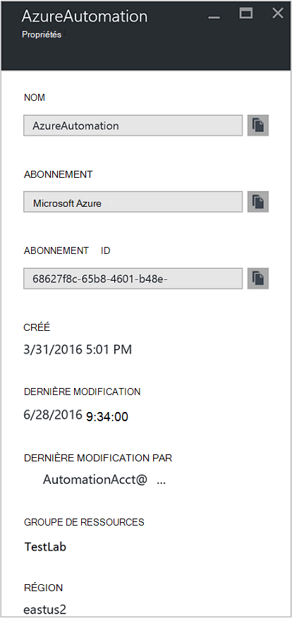
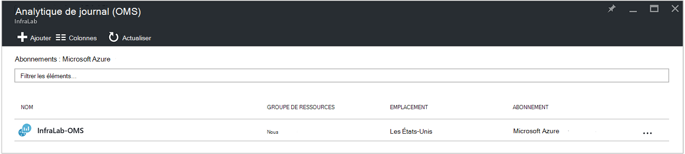
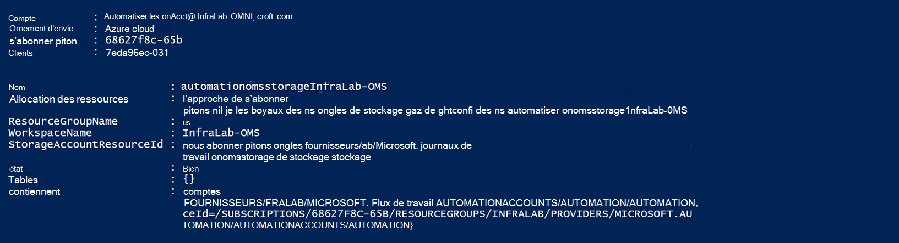
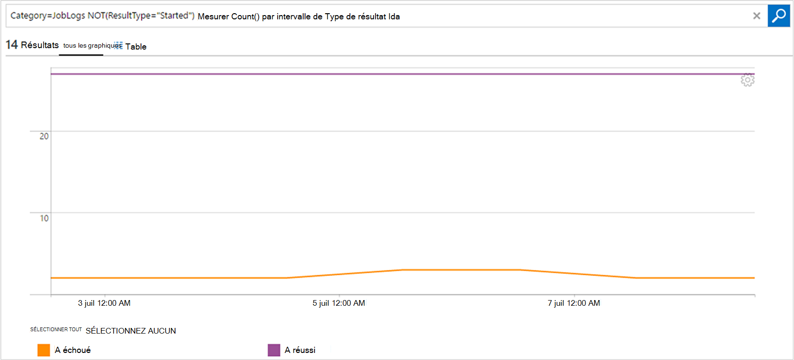

<properties
    pageTitle="Transférer l’état des travaux et des flux de travail d’Automation au journal Analytique (OMS) | Microsoft Azure"
    description="Cet article explique comment envoyer des flux de travaux procédure opérationnelle et le statut de la tâche à Microsoft Operations Management Suite journal Analytique pour fournir un éclairage supplémentaire et la gestion."
    services="automation"
    documentationCenter=""
    authors="MGoedtel"
    manager="jwhit"
    editor="tysonn" />
<tags
    ms.service="automation"
    ms.devlang="na"
    ms.topic="article"
    ms.tgt_pltfrm="na"
    ms.workload="infrastructure-services"
    ms.date="09/22/2016"
    ms.author="magoedte" />

# Transférer l’état des travaux et des flux de travail d’Automation au journal Analytique (OMS)

Automation peut envoyer procédure opérationnelle flux de statut et de travail des tâches à votre espace de travail Microsoft Operations Management Suite (OMS) journal Analytique.  Alors que vous pouvez afficher ces informations dans le portail Azure ou avec PowerShell par statut de la tâche individuelle ou toutes les tâches pour un compte particulier d’Automation, rien avancée pour prendre en charge de vos exigences opérationnelles vous oblige à créer des scripts PowerShell personnalisés.  Désormais avec Anaytics de journal, vous pouvez :

- Obtenez un aperçu de vos tâches d’automatisation 
- Déclencheur d’un e-mail ou une alerte en fonction de votre statut de tâche de procédure opérationnelle (échec ou suspendu) 
- Écrire des requêtes avancées au sein de votre flux de travail 
- Mise en corrélation de travaux sur les comptes d’Automation 
- Visualiser l’historique du travail dans le temps     

## Conditions requises et les considérations relatives au déploiement

Pour commencer l’envoi de vos journaux d’automatisation pour l’Analytique de journal, vous devez disposer des éléments suivants :

1. Un abonnement OMS. Pour plus d’informations, consultez [mise en route de journal Analytique](../log-analytics/log-analytics-get-started.md).  

    >[AZURE.NOTE]L’espace de travail de l’OMS et le compte d’Automation doivent être dans le même abonnement Azure afin que cette configuration fonctionne correctement. 
  
2. Un [compte de stockage Azure](../storage/storage-create-storage-account.md).  
   
    >[AZURE.NOTE]Le compte de stockage *doit* être dans la même région que le compte de l’Automation. 
 
3. PowerShell Azure avec la version 1.0.8 ou ultérieure des applets de commande des perspectives opérationnelles. Pour plus d’informations sur cette version et comment l’installer, voir [Comment faire pour installer et configurer Azure PowerShell](../powershell-install-configure.md).
4. Diagnostic Azure et PowerShell Analytique de journal.  Pour plus d’informations sur cette version et comment l’installer, voir [Diagnostic d’Azure et Analytique du journal](https://www.powershellgallery.com/packages/AzureDiagnosticsAndLogAnalytics/0.1).  
5. Télécharger le script PowerShell **Enable-AzureDiagnostics.ps1** à partir de la [Galerie de PowerShell](https://www.powershellgallery.com/packages/Enable-AzureDiagnostics/1.0/DisplayScript). Ce script configure les éléments suivants :
 - Un compte de stockage pour contenir les procédure opérationnelle tâche flux de données d’état et d’un compte d’Automation que vous spécifiez.
 - Activer la collecte des données à partir de votre compte Automation de les stocker dans un compte de stockage Azure Blob au format JSON.
 - Configurer la collecte des données à partir de votre compte de stockage Blob OMS journal Analytique.
 - Activer la solution automatisation journal Analytique de votre espace de travail de l’OMS.   

Le script **AzureDiagnostics.ps1-activer** requiert les paramètres suivants lors de l’exécution :

- *AutomationAccountName* - le nom de votre compte d’Automation
- *LogAnalyticsWorkspaceName* - le nom de votre espace de travail de l’OMS

Pour rechercher les valeurs de *AutomationAccountName*, sélectionnez votre compte de Automation à partir de la blade **compte d’Automation** dans le portail Azure et sélectionnez **tous les paramètres**.  À partir de la blade de **tous les paramètres** , sous **Paramètres du compte** , sélectionnez **Propriétés**.  De la lame de **Propriétés** , vous pouvez noter ces valeurs.  .

## Le programme d’installation de l’intégration avec journal Analytique

1. Sur votre ordinateur, démarrez **Windows PowerShell** à partir de l’écran de **démarrage** .  
2. À partir du shell de ligne de commande PowerShell, accédez au dossier qui contient le script que vous avez téléchargé et exécuter la modification des valeurs pour les paramètres *- AutomationAccountName* et *- LogAnalyticsWorkspaceName*.

    >[AZURE.NOTE] Vous devez authentifier avec Azure après avoir exécuté le script.  Vous **devez** vous connecter avec un compte qui est membre du rôle Administrateurs d’abonnement et administrateur de collègues de l’abonnement.   
    
        .\Enable-AzureDiagnostics -AutomationAccountName <NameofAutomationAccount> `
        -LogAnalyticsWorkspaceName <NameofOMSWorkspace> `

3. Après l’exécution de ce script, vous devriez voir enregistrements de journal Analytique environ 30 minutes après que les nouvelles données de diagnostics sont écrite dans le stockage.  Si les enregistrements ne sont pas disponibles après cette heure reportez-vous à la section Dépannage dans les [fichiers JSON dans le stockage blob](../log-analytics/log-analytics-azure-storage-json.md#troubleshooting-configuration-for-azure-diagnostics-written-to-blob-in-json).

### Vérification de la configuration

Pour confirmer que le script configuré votre compte de l’Automation et l’OMS wokspace avec succès, vous pouvez effectuer les opérations suivantes dans PowerShell.  Avant cela, pour rechercher que les valeurs de votre nom d’espace de travail OMS et le nom de groupe de ressources, à partir du portail Azure, naviguez jusqu’au journal Analytique (OMS) et la lame de journal Analytique (OMS), notez la valeur pour le **nom** et le **Groupe de ressources**.   nous utiliserons ces deux valeurs lorsque nous Vérifiez la configuration de votre espace de travail OMS à l’aide de l’applet de commande PowerShell, [Get-AzureRmOperationalInsightsStorageInsight](https://msdn.microsoft.com/library/mt603567.aspx).

1.  À partir du portail Azure, accédez à des comptes de stockage et de recherche pour le compte de stockage suivant, qui utilise la convention d’affectation de noms - *AutomationAccountNameomsstorage*.  Une fois une procédure opérationnelle travail terminé, peu de temps par la suite, vous devriez voir deux conteneurs d’objet Blob créés - **perspectives-journaux-joblogs** et **perspectives-journaux-jobstreams**.  

2.  À partir de PowerShell, exécutez le code suivant de PowerShell, la modification des valeurs pour les paramètres **ResourceGroupName** et **WorkspaceName** que vous avez copié ou indiqué précédemment.  

    Obtenir de connexion-AzureRmAccount-AzureRmSubscription - SubscriptionName 'SubscriptionName' | Get de SET-AzureRmContext-AzureRmOperationalInsightsStorageInsight - ResourceGroupName « OMSResourceGroupName » »-« OMSWorkspaceName » de l’espace de travail 

    La storage insight pour l’espace de travail OMS spécifié est retourné.  Nous voulons confirmer la storage insight pour le compte d’automatisation que nous avons spécifié précédemment existe et que l’objet **d’état** affiche la valeur **OK**.  .

## Enregistrements de journal Analytique

Automation crée deux types d’enregistrements dans le référentiel de l’OMS.

### Journaux de projet

Propriété | Description|
----------|----------|
Heure | Date et heure lorsque l’exécution de la tâche de procédure opérationnelle.|
resourceId | Spécifie le type de ressource dans Azure.  Pour l’automatisation, la valeur est le compte de l’Automation associé à la procédure opérationnelle.|
operationName | Spécifie le type d’opération exécutée dans Azure.  Pour l’automatisation, la valeur sera la tâche.|
resultType | Le statut de la tâche de procédure opérationnelle.  Les valeurs possibles sont : -Démarrage -Arrêté -Suspendu -Échec -A réussi.|
resultDescription | Décrit l’état de résultat des travaux de procédure opérationnelle.  Les valeurs possibles sont : -La tâche est démarrée -Échouée de la tâche -Fin du travail|
ID de corrélation | GUID qui est l’Id de corrélation de la tâche de procédure opérationnelle.|
Catégorie | Classification du type de données.  Pour l’automatisation, la valeur est JobLogs.|
RunbookName | Le nom de la procédure opérationnelle.|
ID de travail | GUID qui est l’Id de la tâche de procédure opérationnelle.|
Appelant |  Qui a initié l’opération.  Les valeurs possibles sont une adresse de messagerie ou un système pour les tâches planifiées.|

### Flux de travail
Propriété | Description|
----------|----------|
Heure | Date et heure lorsque l’exécution de la tâche de procédure opérationnelle.|
resourceId | Spécifie le type de ressource dans Azure.  Pour l’automatisation, la valeur est le compte de l’Automation associé à la procédure opérationnelle.|
operationName | Spécifie le type d’opération exécutée dans Azure.  Pour l’automatisation, la valeur sera la tâche.|
resultType | Le statut de la tâche de procédure opérationnelle.  Les valeurs possibles sont : -InProgress|
resultDescription | Inclut le flux de sortie à partir de la procédure opérationnelle.|
ID de corrélation | GUID qui est l’Id de corrélation de la tâche de procédure opérationnelle.|
Catégorie | Classification du type de données.  Pour l’automatisation, la valeur est JobStreams.|
RunbookName | Le nom de la procédure opérationnelle.|
ID de travail | GUID qui est l’Id de la tâche de procédure opérationnelle.|
Appelant | Qui a initié l’opération.  Les valeurs possibles sont une adresse de messagerie ou un système pour les tâches planifiées.| 
StreamType | Le type de flux de travail. Les valeurs possibles sont : -Progression -Sortie -Avertissement -Erreur -Débogage -Détaillé|

## Affichage d’Automation se connecte Analytique du journal 

Maintenant que vous avez commencé l’envoi de vos journaux de projet d’Automation à journal Analytique, nous allons voir ce que vous pouvez faire avec ces journaux au sein de l’OMS.   

### Envoyer un courrier électronique lorsqu’une tâche de procédure opérationnelle échoue ou suspend 

Un de nos premiers clients demande concerne la possibilité d’envoyer un message électronique ou un texte lorsque quelque chose se passe mal avec un travail de procédure opérationnelle.   

Pour créer une règle d’alerte, commencez par créer un journal pour les enregistrements de tâche de procédure opérationnelle qui doit appeler l’alerte.  Le bouton **alerte** sera ensuite disponible pour vous permettre de créer et de configurer la règle d’alerte.

1.  Dans la page Vue d’ensemble de l’OMS, cliquez sur **Recherche**.
2.  Créer une requête de recherche de journal de votre alerte en tapant ce qui suit dans le champ requête : `Category=JobLogs (ResultType=Failed || ResultType=Suspended)`.  Vous pouvez également regrouper par le RunbookName à l’aide de : `Category=JobLogs (ResultType=Failed || ResultType=Suspended) | measure Count() by RunbookName_s`.   
  
    Si vous avez défini des journaux à partir de plus d’un compte d’Automation ou l’abonnement à votre espace de travail, peut également vous intéresser dans le regroupement de vos alertes par l’abonnement ou le compte de l’Automation.  Nom de compte d’Automation peut être dérivé du champ de la ressource dans la recherche de JobLogs.  

3.  Cliquez sur l' **alerte** en haut de la page pour ouvrir l’écran **Ajouter une règle d’alerte** .  Pour plus d’informations sur les options de configuration de l’alerte, veuillez consulter [les alertes dans le journal Analytique](../log-analytics/log-analytics-alerts.md#creating-an-alert-rule).

### Rechercher tous les travaux qui s’est terminée avec des erreurs 

En plus des alertes en fonction des défaillances, vous souhaitez probablement savoir lorsqu’un projet de procédure opérationnelle a eu une erreur de fin (PowerShell génère un flux d’erreur, mais ne se terminant pas des erreurs ne provoquent pas de suspendre ou d’échec de votre opération).    

1. Dans le portail de l’OMS, cliquez sur **Recherche**.
2. Dans le champ de requête, tapez `Category=JobStreams StreamType_s=Error | measure count() by JobId_g` , puis cliquez sur **Rechercher**.

### Affichage des flux de tâches d’un projet  

Lors du débogage d’un projet, vous pouvez également rechercher dans les flux de travail.  La requête ci-dessous illustre le flux de données pour un seul travail avec GUID 2ebd22ea-e05e-4eb9 - 9d 76-d73cbd4356e0 :   

`Category=JobStreams JobId_g="2ebd22ea-e05e-4eb9-9d76-d73cbd4356e0" | sort TimeGenerated | select ResultDescription` 

### Afficher l’état de travail historique 

Enfin, vous souhaiterez peut-être visualiser l’historique du travail dans le temps.  Vous pouvez utiliser cette requête pour rechercher l’état de vos tâches dans le temps. 

`Category=JobLogs NOT(ResultType="started") | measure Count() by ResultType interval 1day`  
   

## Résumé

En envoyant vos données de statut et de flux de travail Automation à Analytique de journal, vous pouvez obtenir une meilleure vision de l’état de vos tâches d’automatisation en définissant des alertes pour vous avertir lorsqu’il y a un problème et des tableaux de bord personnalisés à l’aide de requêtes avancées permettant de visualiser les résultats de la procédure opérationnelle, état du travail de procédure opérationnelle et autres indicateurs clés associés ou les mesures.  Cela permettra de fournir une plus grande visibilité opérationnelle et les incidents d’adresse plus rapides.  

## Étapes suivantes

- Pour en savoir plus sur la façon de construire des requêtes de recherche et de consulter les journaux de projet d’Automation avec journal Analytique, voir [recherche de journal de journal Analytique](../log-analytics/log-analytics-log-searches.md)
- Pour comprendre comment créer et extraire des messages d’erreur et de sortie de procédures opérationnelles, consultez [messages et sortie de procédure opérationnelle](automation-runbook-output-and-messages.md) 
- Pour en savoir plus sur l’exécution de procédure opérationnelle, comment faire pour surveiller la procédure opérationnelle des travaux et d’autres informations techniques, voir [suivi d’un projet de procédure opérationnelle](automation-runbook-execution.md)
- Pour en savoir plus sur OMS journal Analytique et les sources de collection de données, reportez-vous à la section [des données de stockage Azure de collecte dans la vue d’ensemble du journal Analytique](../log-analytics/log-analytics-azure-storage.md)