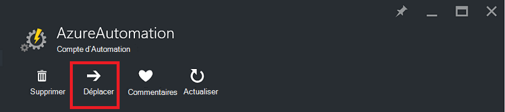
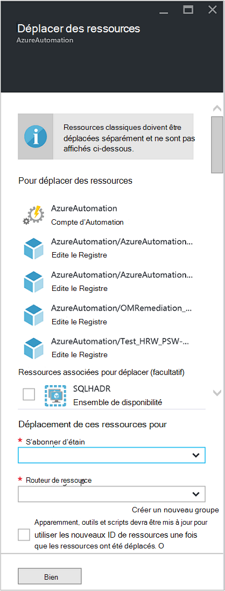

<properties
   pageTitle="Migrer le compte de l’Automation et de ressources | Microsoft Azure"
   description="Cet article décrit comment déplacer un compte d’Automation dans Azure Automation et des ressources associées d’un abonnement à un autre."
   services="automation"
   documentationCenter=""
   authors="MGoedtel"
   manager="jwhit"
   editor="tysonn" />
<tags
   ms.service="automation"
   ms.devlang="na"
   ms.topic="article"
   ms.tgt_pltfrm="na"
   ms.workload="infrastructure-services"
   ms.date="07/07/2016"
   ms.author="magoedte" />

# <a name="migrate-automation-account-and-resources"></a>Migrer le compte de l’Automation et de ressources

Pour les comptes de l’Automation et des ressources associées (c'est-à-dire les actifs, les procédures opérationnelles, les modules, etc.) que vous avez créé dans le portail Azure et à migrer à partir d’un groupe de ressources vers un autre ou d’un abonnement à un autre, vous pouvez accomplir facilement ceci avec la fonctionnalité [déplacer les ressources](../resource-group-move-resources.md) disponible sur le portail Azure. Toutefois, avant d’effectuer cette action, vous devez tout d’abord examiner la [liste de contrôle avant de déplacer les ressources](../resource-group-move-resources.md#Checklist-before-moving-resources) et en outre, la liste ci-dessous spécifiques à l’Automation de.   

1.  Le groupe de ressources abonnement de destination doit être dans la même région comme source.  Cela signifie que les comptes Automation ne peut être déplacés entre les régions.
2.  Lorsque vous déplacez des ressources (par exemple, les procédures opérationnelles, travaux, etc.), le groupe de la source et le groupe cible sont verrouillés pour la durée de l’opération. Écrire et les opérations de suppression sont bloqués sur les groupes jusqu'à ce que le déplacement se termine.  
3.  Les procédures opérationnelles ou les variables qui font référence à un ID d’abonnement ou les ressources de l’abonnement existant devra être mise à jour une fois la migration terminée.   


>[AZURE.NOTE] Cette fonctionnalité ne gère pas automation ressources standard.

## <a name="to-move-the-automation-account-using-the-portal"></a>Pour déplacer le compte d’Automation à l’aide du portail

1. À partir de votre compte d’Automation, cliquez sur **déplacer** en haut de la lame.<br> <br> 
2. Sur la lame de **déplacer des ressources** , notez qu’il présente des ressources liées à votre compte d’automatisation et de vos groupes de ressources.  Sélectionnez **l’abonnement** et le **groupe de ressources** dans la liste déroulante, ou sélectionnez l’option **créer un nouveau groupe de ressources** et entrez un nouveau nom de groupe de ressource dans le champ.  
3. Revoir et sélectionner la case à cocher vous confirme *comprendre les outils et scripts devront être mis à jour pour utiliser les nouveaux ID de ressource après déplacement de ressources* puis cliquez sur **OK**.<br> <br>   

Cette action prendra quelques minutes.  Dans les **Notifications**, s’affiche avec un état de chaque action qui a lieu - validation, la migration, puis enfin lorsqu’il est terminé.     

## <a name="to-move-the-automation-account-using-powershell"></a>Pour déplacer le compte d’Automation à l’aide de PowerShell

Pour déplacer les ressources de Automation existants vers un autre groupe de ressources ou d’abonnement, utilisez l’applet de commande **Get-AzureRmResource** pour obtenir le compte d’Automation spécifique, puis l’applet de commande **Move-AzureRmResource** pour effectuer le déplacement.

Le premier exemple montre comment déplacer un compte d’automatisation pour un groupe de ressources.

   ```
    $resource = Get-AzureRmResource -ResourceName "TestAutomationAccount" -ResourceGroupName "ResourceGroup01"
    Move-AzureRmResource -ResourceId $resource.ResourceId -DestinationResourceGroupName "NewResourceGroup"
   ``` 

Après avoir exécuté l’exemple de code ci-dessus, vous devrez vérifier à effectuer cette action.  Une fois que vous cliquez sur **Oui** et permettre le script continuer, vous ne recevrez pas de notifications pendant qu’il procède à la migration.  

Pour déplacer vers un nouvel abonnement, inclure une valeur pour le paramètre *DestinationSubscriptionId* .

   ```
    $resource = Get-AzureRmResource -ResourceName "TestAutomationAccount" -ResourceGroupName "ResourceGroup01"
    Move-AzureRmResource -ResourceId $resource.ResourceId -DestinationResourceGroupName "NewResourceGroup" -DestinationSubscriptionId "SubscriptionId"
   ``` 

Comme avec l’exemple précédent, vous serez invité à confirmer le déplacement.  

## <a name="next-steps"></a>Étapes suivantes

- Pour plus d’informations sur le déplacement des ressources vers le nouveau groupe de ressources ou d’abonnement, voir [déplacer des ressources vers le nouveau groupe de ressources ou d’abonnement](../resource-group-move-resources.md)
- Pour plus d’informations sur le contrôle d’accès basée sur les rôles dans l’automatisation d’Azure, consultez [contrôle d’accès par rôle dans Azure Automation](../automation/automation-role-based-access-control.md).
- Pour obtenir des informations sur les applets de commande PowerShell pour la gestion de votre abonnement, consultez [L’aide du PowerShell Azure avec le Gestionnaire de ressources](../powershell-azure-resource-manager.md)
- Pour obtenir des informations sur les fonctionnalités du portail de gestion de votre abonnement, consultez [l’aide du portail Azure pour gérer les ressources](../azure-portal/resource-group-portal.md). 
