<properties 
   pageTitle="Contrôle d’accès par rôle dans Azure automatisation | Microsoft Azure"
   description="Contrôle d’accès basé sur les rôles (RBAC) permet la gestion de l’accès pour les ressources d’Azure. Cet article décrit comment configurer RBAC dans Azure Automation."
   services="automation"
   documentationCenter=""
   authors="mgoedtel"
   manager="jwhit"
   editor="tysonn"
   keywords="basée sur les rôles rbac d’Automation, contrôle d’accès rbac azure" />
<tags 
   ms.service="automation"
   ms.devlang="na"
   ms.topic="get-started-article"
   ms.tgt_pltfrm="na"
   ms.workload="infrastructure-services"
   ms.date="09/12/2016"
   ms.author="magoedte;sngun"/>

# Contrôle d’accès par rôle dans Azure Automation

## Contrôle d’accès basé sur les rôles

Contrôle d’accès basé sur les rôles (RBAC) permet la gestion de l’accès pour les ressources d’Azure. L’utilisation de [RBAC](../active-directory/role-based-access-control-configure.md), vous pouvez séparer les droits au sein de votre équipe et accordez uniquement la quantité de l’accès à des utilisateurs, des groupes et des applications dont ils ont besoin pour effectuer leur travail. Accès basé sur des rôles peuvent être accordées aux utilisateurs à l’aide de l’Azure portal, Azure outils de ligne de commande ou des API de gestion d’Azure.

## RBAC dans les comptes de l’Automation

Dans Azure Automation, l’accès est accordé en attribuant le rôle RBAC approprié pour les utilisateurs, les groupes et les applications au niveau de la portée du compte Automation. Voici les rôles intégrés pris en charge par un compte d’Automation :  

|**Rôle** | **Description** |
|:--- |:---|
| Propriétaire | Le rôle de propriétaire autorise l’accès à toutes les ressources et les actions dans un compte de Automation, y compris l’accès à d’autres utilisateurs, les groupes et les applications à gérer le compte de l’Automation. |
| Collaborateur | Le rôle de collaborateur vous permet de gérer tout sauf modifier les autorisations d’accès d’un autre utilisateur à un compte d’Automation. |
| Lecteur | Le rôle de lecteur vous permet d’afficher toutes les ressources dans un compte de Automation, mais ne peut pas apporter de modifications.|
| Opérateur d’Automation | Le rôle de l’opérateur d’Automation vous permet de d’effectuer les tâches opérationnelles telles que Démarrer, d’arrêter, de suspendre, de reprendre et de planifier des tâches. Ce rôle est utile si vous souhaitez protéger vos ressources compte d’Automation comme actifs d’informations d’identification et de procédures opérationnelles de l’affichage ou la modification, mais autoriser les membres de votre organisation exécuter ces procédures opérationnelles. |
| Administrateur d’accès utilisateur | Le rôle d’administrateur d’accès utilisateur vous permet de vous permet de gérer l’accès des utilisateurs aux comptes d’Automation d’Azure. |

>[AZURE.NOTE] Vous ne pouvez pas accorder des droits d’accès à une procédure opérationnelle spécifique ou les procédures opérationnelles, uniquement aux ressources et aux actions dans le compte de l’Automation.  

Dans cet article, nous vous guidera comment configurer RBAC dans Azure Automation. Mais d’abord, examinons un plus près les autorisations individuelles accordées au collaborateur, lecteur, Automation opérateur et administrateur d’accès utilisateur, afin que nous avons une bonne compréhension avant toute personne accordant des droits pour le compte de l’Automation.  Dans le cas contraire, il peut entraîner des conséquences inattendues ou indésirables.     

## Autorisations de rôle de collaborateur

Le tableau suivant présente les actions spécifiques qui peuvent être exécutées par le rôle de collaborateur dans Automation.

| **Type de ressource** | **En lecture** | **Écriture** | **Supprimer** | **Autres Actions** |
|:--- |:---|:--- |:---|:--- |
| Compte d’Automation Azure |  |  |  | | 
| Automation certificat actif |  |  |  | |
| Ressource de connexion d’Automation |  |  |  | | 
| Actif de Type connexion Automation |  |  |  | | 
| Automation d’informations d’identification actif |  |  |  | |
| Ressources de planification Automation |  |  |  | |
| Immobilisation de Variable Automation |  |  |  | |
| Automation souhaitée de Configuration de l’état | | | |  |
| Type de ressource de travail de procédure opérationnelle hybride |  | |  | | 
| Travail Automation Azure |  |  | |  | 
| Flux de travaux d’automatisation |  | | | | 
| Programmer l’automatisation des tâches |  |  |  | |
| Module d’automatisation |  |  |  | |
| Procédure opérationnelle d’Automation Azure |  |  |  |  |
| Brouillon de procédure opérationnelle d’Automation |  | | |  |
| Travail de Test Automation brouillon de procédure opérationnelle |  |  | |  | 
| Webhook de l’Automation |  |  |  |  |

## Autorisations de rôle de lecteur

Le tableau suivant présente les actions spécifiques qui peuvent être exécutées par le rôle de lecteur dans Automation.

| **Type de ressource** | **En lecture** | **Écriture** | **Supprimer** | **Autres Actions** |
|:--- |:---|:--- |:---|:--- |
| Administrateur d’abonnement classique |  | | | 
| Verrou de gestion |  | | | 
| Autorisation |  | | |
| Opérations des fournisseurs |  | | | 
| Affectation de rôle |  | | | 
| Définition de rôle |  | | | 

## Autorisations de rôle d’opérateur Automation

Le tableau suivant présente les actions spécifiques qui peuvent être exécutées par le rôle de l’opérateur de l’Automation dans Automation.

| **Type de ressource** | **En lecture** | **Écriture** | **Supprimer** | **Autres Actions** |
|:--- |:---|:--- |:---|:--- |
| Compte d’Automation Azure |  | | | 
| Automation certificat actif | | | |
| Ressource de connexion d’Automation | | | |
| Actif de Type connexion Automation | | | |
| Automation d’informations d’identification actif | | | |
| Ressources de planification Automation |  |  | | |
| Immobilisation de Variable Automation | | | |
| Automation souhaitée de Configuration de l’état | | | | |
| Type de ressource de travail de procédure opérationnelle hybride | | | | | 
| Travail Automation Azure |  |  | |  | 
| Flux de travaux d’automatisation |  | | |  
| Programmer l’automatisation des tâches |  |  | | |
| Module d’automatisation | | | |
| Procédure opérationnelle d’Automation Azure |  | | | |
| Brouillon de procédure opérationnelle d’Automation | | | |
| Travail de Test Automation brouillon de procédure opérationnelle | | | |  
| Webhook de l’Automation | | | |

Pour plus de détails, les [actions de l’opérateur Automation](../active-directory/role-based-access-built-in-roles.md#automation-operator) répertorie les actions prises en charge par le rôle d’opérateur Automation sur le compte de l’Automation et à ses ressources.

## Autorisations du rôle administrateur d’accès utilisateur

Le tableau suivant présente les actions spécifiques qui peuvent être exécutées par le rôle administrateur d’utilisateurs Access dans Automation.

| **Type de ressource** | **En lecture** | **Écriture** | **Supprimer** | **Autres Actions** |
|:--- |:---|:--- |:---|:--- |
| Compte d’Automation Azure |  | | | |
| Automation certificat actif |  | | | |
| Ressource de connexion d’Automation |  | | | |
| Actif de Type connexion Automation |  | | | |
| Automation d’informations d’identification actif |  | | | |
| Ressources de planification Automation |  | | | |
| Immobilisation de Variable Automation |  | | | |
| Automation souhaitée de Configuration de l’état | | | | |
| Type de ressource de travail de procédure opérationnelle hybride |  | | | | 
| Travail Automation Azure |  | | | | 
| Flux de travaux d’automatisation |  | | | | 
| Programmer l’automatisation des tâches |  | | | |
| Module d’automatisation |  | | | |
| Procédure opérationnelle d’Automation Azure |  | | | |
| Brouillon de procédure opérationnelle d’Automation |  | | | |
| Travail de Test Automation brouillon de procédure opérationnelle |  | | | | 
| Webhook de l’Automation |  | | |

## Configurer RBAC pour votre compte d’Automation à l’aide du portail Azure

1.  Connectez-vous au [Portail Azure](https://portal.azure.com/) et ouvrez votre compte Automation à partir de la blade d’Automation comptes.  

2.  Cliquez sur le contrôle **d’accès** dans le coin supérieur droit. Cela ouvre la blade **d’utilisateurs** dans laquelle vous pouvez ajouter des utilisateurs, des groupes et des applications pour gérer votre compte d’Automation et d’afficher les rôles existants qui peuvent être configurés pour le compte de l’Automation.  

      

>[AZURE.NOTE] **Administrateurs de l’abonnement** existe déjà en tant que l’utilisateur par défaut. Groupe active directory administrateurs abonnement comprend les administrateurs de service et de la co-administrator(s) pour votre abonnement Azure. L’administrateur de Service est le propriétaire de votre abonnement Azure et de ses ressources et est ont le rôle de propriétaire héritées pour les comptes d’automation trop. Cela signifie que l’accès est **hérité** pour **les administrateurs de service et admins-co** d’un abonnement et ses **affecté** pour tous les autres utilisateurs. Cliquez sur **administrateurs de l’abonnement** pour afficher plus de détails sur leurs autorisations.  

### Ajouter un nouvel utilisateur et attribuer un rôle

1.  À partir de la blade d’utilisateurs, cliquez sur **Ajouter** pour ouvrir la **lame d’accès Ajouter** où vous pouvez ajouter un utilisateur, un groupe ou une application et leur attribuer un rôle.  

    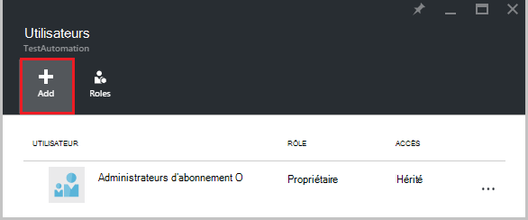  

2.  Sélectionnez un rôle dans la liste des rôles disponibles. Nous allons choisir le rôle de **lecteur** , mais vous pouvez choisir un des rôles prédéfinis disponibles qui la prend en charge un compte d’Automation ou n’importe quel rôle personnalisé que peut avoir défini.  

    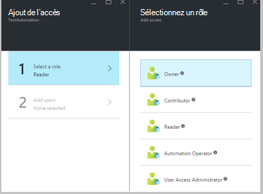  

3.  Cliquez sur **Ajouter des utilisateurs** à ouvrir la blade **d’Ajouter des utilisateurs** . Si vous avez ajouté tous les utilisateurs, groupes ou applications pour gérer votre abonnement, puis les utilisateurs répertoriés et vous pouvez les sélectionner pour ajouter l’accès. Si il n’existe pas de tous les utilisateurs répertoriés, ou si l’utilisateur qui vous intéressez ajout n’est pas répertorié puis cliquez sur **inviter** pour ouvrir la lame **inviter un invité** , où vous pouvez inviter un utilisateur avec une adresse de messagerie compte Microsoft valide comme Outlook.com, OneDrive ou ID de Xbox Live. Une fois que vous avez entré l’adresse de messagerie de l’utilisateur, cliquez sur **Sélectionner** pour ajouter l’utilisateur, puis cliquez sur **OK**. 

    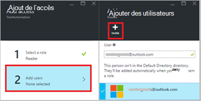  
 
    Maintenant, vous devriez voir l’utilisateur ajouté à la lame **d’utilisateurs** avec le rôle de **lecteur** affecté.  

      

    Vous pouvez également affecter un rôle à l’utilisateur de la lame de **rôles** . 

1. Cliquez sur **rôles** du serveur lame pour ouvrir la **lame de rôles**aux utilisateurs. À partir de cette carte, vous pouvez afficher le nom du rôle, le nombre d’utilisateurs et de groupes qui sont affectés à ce rôle.

    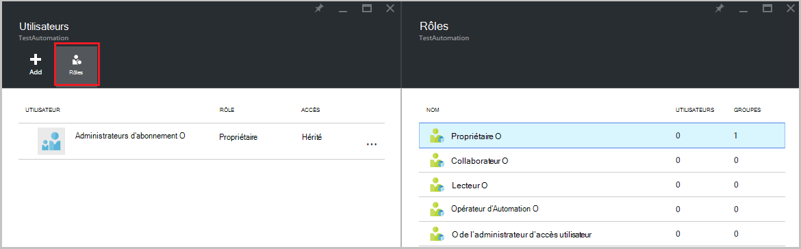  
   
    >[AZURE.NOTE] Contrôle d’accès basé sur le rôle ne peut être défini qu’au niveau des comptes d’Automation et non à toutes les ressources sous le compte de l’Automation.

    Vous pouvez affecter plus d’un rôle à un utilisateur, un groupe ou une application. Par exemple, si vous ajoutez le rôle de **l’Opérateur d’Automation** avec le **rôle de lecteur** à l’utilisateur, puis ils peuvent afficher toutes les ressources de l’automatisation, ainsi exécuter les tâches de procédure opérationnelle. Vous pouvez développer la liste déroulante pour afficher une liste des rôles attribués à l’utilisateur.  

    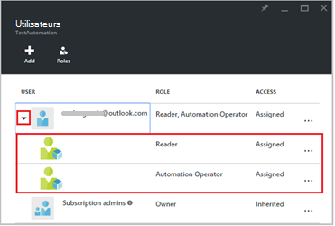  
 
### Supprimer un utilisateur

Vous pouvez supprimer l’autorisation d’accès pour un utilisateur qui ne gère pas le compte de l’Automation, ou qui ne fonctionne plus pour l’organisation. Voici la procédure pour supprimer un utilisateur : 

1.  À partir de la blade **d’utilisateurs** , sélectionnez l’affectation de rôle que vous souhaitez supprimer.

2.  Cliquez sur le bouton **Supprimer** dans la lame de détails d’affectation.

3.  Cliquez sur **Oui** pour confirmer la suppression. 

    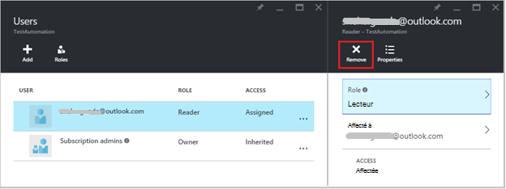  

## Rôle utilisateur

Lorsqu’un utilisateur affecté à un rôle se connecte à son compte d’Automation, ils peuvent maintenant voir le compte du propriétaire répertorié dans la liste des **Répertoires de par défaut**. Pour afficher le compte qu’ils ont été ajoutés à Automation, ils doivent faire basculer le répertoire par défaut pour le répertoire par défaut de l’utilisateur.  

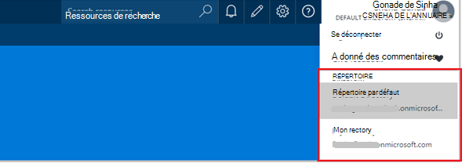  

### Expérience de l’utilisateur pour le rôle d’opérateur de Automation

Lorsqu’un utilisateur, ce qui est affecté au compte de Automation qu'ils sont affectés aux vues rôle opérateur d’Automation, ils peuvent afficher uniquement la liste des procédures opérationnelles, les travaux de procédure opérationnelle et les planifications créées dans le compte de l’Automation mais ne peut pas afficher leur définition. Vous pouvez démarrer, arrêter, suspendre, reprendre ou planifier le travail de procédure opérationnelle. L’utilisateur n’aura pas accès aux autres ressources Automation, telles que les configurations, les groupes de travail hybride ou des nœuds de DSC.  

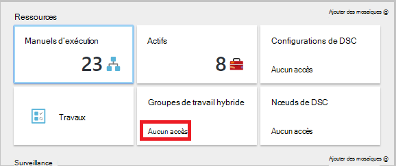  

Lorsque l’utilisateur clique sur la procédure opérationnelle, les commandes pour afficher la source ou de modifier la procédure opérationnelle ne sont pas fournies comme le rôle d’opérateur Automation ne permet pas à y accéder.  

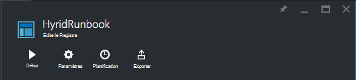  

L’utilisateur aura accès pour afficher et créer des planifications, mais n’a pas accès à un autre type d’immobilisation.  

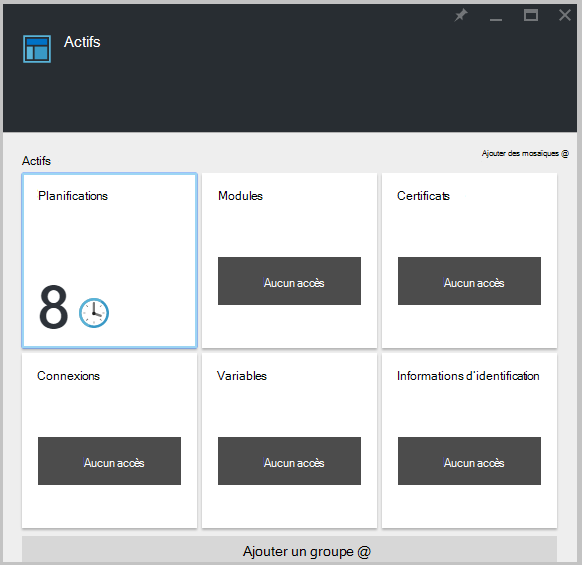  

Cet utilisateur n’a également pas accès pour afficher le webhooks associé à une procédure opérationnelle

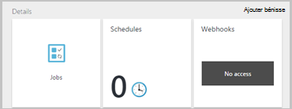  

## Configurer votre compte d’Automation à l’aide de PowerShell d’Azure RBAC

Accès basé sur les rôles peut également être configuré pour un compte d’Automation à l’aide de la suivant [les applets de commande PowerShell d’Azure](../active-directory/role-based-access-control-manage-access-powershell.md).

• [Get-AzureRmRoleDefinition](https://msdn.microsoft.com/library/mt603792.aspx) répertorie tous les rôles RBAC disponibles dans Azure Active Directory. Vous pouvez utiliser cette commande avec la propriété de **nom** pour la liste de toutes les actions pouvant être effectuées par un rôle spécifique.  
    **Exemple :**  
    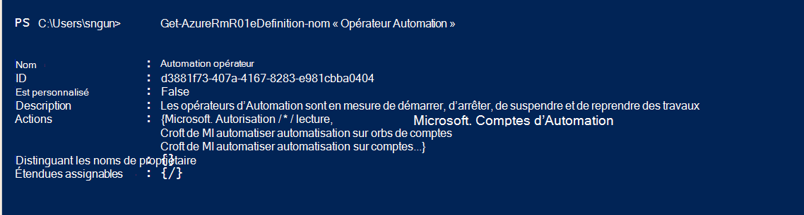  

• [Get-AzureRmRoleAssignment](https://msdn.microsoft.com/library/mt619413.aspx) répertorie les attributions de rôle Azure AD RBAC au niveau de la portée spécifiée. Sans paramètres, cette commande renvoie toutes les affectations de rôle au titre de l’abonnement. Utilisez le paramètre **ExpandPrincipalGroups** pour les affectations de la liste l’accès pour l’utilisateur spécifié, ainsi que les groupes de de que l’utilisateur est un membre.  
    **Exemple :** Utilisez la commande suivante pour répertorier tous les utilisateurs et leurs rôles au sein d’un compte d’automation.

    Get-AzureRMRoleAssignment -scope “/subscriptions/<SubscriptionID>/resourcegroups/<Resource Group Name>/Providers/Microsoft.Automation/automationAccounts/<Automation Account Name>” 

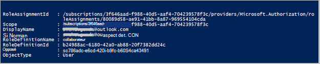

• [New-AzureRmRoleAssignment](https://msdn.microsoft.com/library/mt603580.aspx) pour accorder l’accès à des utilisateurs, des groupes et des applications à une portée particulière.  
    **Exemple :** Utilisez la commande suivante pour attribuer le rôle de « Opérateur Automation » d’un utilisateur dans la portée du compte de l’Automation.

    New-AzureRmRoleAssignment -SignInName <sign-in Id of a user you wish to grant access> -RoleDefinitionName "Automation operator" -Scope “/subscriptions/<SubscriptionID>/resourcegroups/<Resource Group Name>/Providers/Microsoft.Automation/automationAccounts/<Automation Account Name>”  

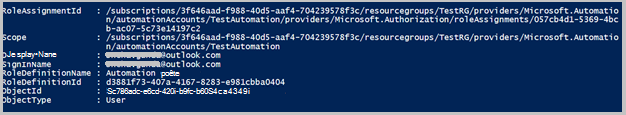

• Utilisez [Remove-AzureRmRoleAssignment](https://msdn.microsoft.com/library/mt603781.aspx) pour supprimer l’accès d’un utilisateur spécifié, le groupe ou l’application à partir d’une portée particulière.  
    **Exemple :** Utilisez la commande suivante pour supprimer l’utilisateur du rôle « Opérateur Automation » dans la portée du compte de l’Automation.

    Remove-AzureRmRoleAssignment -SignInName <sign-in Id of a user you wish to remove> -RoleDefinitionName "Automation Operator" -Scope “/subscriptions/<SubscriptionID>/resourcegroups/<Resource Group Name>/Providers/Microsoft.Automation/automationAccounts/<Automation Account Name>”

Dans les exemples ci-dessus, remplacez ** **connexion Id**, **Id de l’abonnement**, **nom de la ressource groupe** Automation nom de compte** et les détails de votre compte. Cliquez sur **Oui** lorsque vous êtes invité à confirmer avant de supprimer l’affectation de rôle d’utilisateur.   

## Étapes suivantes
-  Pour plus d’informations sur les différentes façons de configurer RBAC pour Azure Automation, reportez-vous à la [gestion RBAC avec PowerShell d’Azure](../active-directory/role-based-access-control-manage-access-powershell.md).
- Pour plus d’informations sur les différentes manières de lancer une procédure opérationnelle, voir [une procédure opérationnelle](automation-starting-a-runbook.md)
- Pour plus d’informations sur la procédure opérationnelle de différents types, voir [types de procédure opérationnelle Azure Automation](automation-runbook-types.md)

