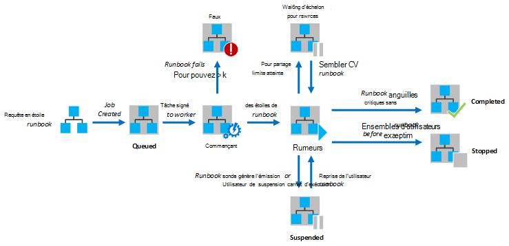
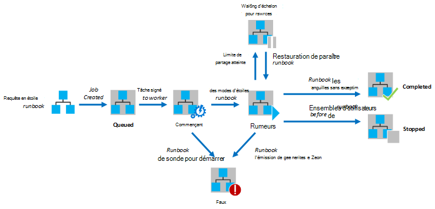

<properties
   pageTitle="Exécution de procédure opérationnelle dans Azure Automation"
   description="Décrit les détails du mode de traitement d’une procédure opérationnelle dans Azure Automation."
   services="automation"
   documentationCenter=""
   authors="mgoedtel"
   manager="stevenka"
   editor="tysonn" />
<tags
   ms.service="automation"
   ms.devlang="na"
   ms.topic="article"
   ms.tgt_pltfrm="na"
   ms.workload="infrastructure-services"
   ms.date="03/21/2016"
   ms.author="bwren" />

# Exécution de procédure opérationnelle dans Azure Automation

Lorsque vous démarrez une procédure opérationnelle dans Azure Automation, une tâche est créée. Une tâche est une instance d’exécution unique d’une procédure opérationnelle. Un travailleur Azure Automation est affecté à l’exécution de chaque tâche. Tandis que les travailleurs sont partagées par plusieurs comptes d’Azure, travaux à partir de différents comptes d’Automation sont isolées entre elles. Vous n’avez pas de contrôle sur quel travailleur sera service à la demande pour votre travail.  Une procédure opérationnelle unique peut avoir plusieurs tâches en cours d’exécution à un moment donné. Lorsque vous affichez la liste des procédures opérationnelles dans Azure portal, il affiche l’état de la dernière tâche qui a été démarrée pour chaque procédure opérationnelle. Vous pouvez afficher la liste des tâches pour chaque procédure opérationnelle afin de suivre l’état de chaque. Pour une description des statuts de travail différent, reportez-vous à la section [Statuts de traitement](#job-statuses).

Le diagramme suivant illustre le cycle de vie d’un projet de procédure opérationnelle pour les [procédures opérationnelles de graphiques](automation-runbook-types.md#graphical-runbooks) et de [procédures opérationnelles de flux de travail de PowerShell](automation-runbook-types.md#powershell-workflow-runbooks).

Le diagramme suivant illustre le cycle de vie d’un projet de procédure opérationnelle pour les [procédures opérationnelles de PowerShell](automation-runbook-types.md#powershell-runbooks).

Les travaux ont accès à vos ressources Azure par l’établissement d’une connexion à votre abonnement Azure. Ils auront uniquement accès aux ressources dans votre centre de données si ces ressources sont accessibles à partir du cloud public.

## Statuts de traitement

Le tableau suivant décrit les différents statuts possibles pour une tâche.

| État| Description|
|:---|:---|
|Terminé|La tâche s’est terminée correctement.|
|A échoué| Pour les [procédures opérationnelles de PowerShell le flux de travail et de graphique](automation-runbook-types.md), la procédure opérationnelle la compilation a échoué.  Pour les [procédures opérationnelles de PowerShell Script](automation-runbook-types.md), la procédure opérationnelle n’a pas pu démarrer ou le travail a rencontré une exception. |
|Échec, en attente de ressources|La tâche a échoué car elle a atteint la limite de [partage équitable](#fairshare) de trois fois et démarré à partir du même point de contrôle ou à partir du début de la procédure opérationnelle à chaque fois.|
|La file d’attente|La tâche est en attente de ressources sur un travailleur de l’Automation à venir disponibles afin que celle-ci peut être démarrée.|
|Démarrage|La tâche a été affectée à un travailleur, et le système est en cours de démarrage.|
|Reprise|Le système est en cours de reprise de la tâche une fois qu’il a été suspendu.|
|En cours d’exécution|Le travail est en cours d’exécution.|
|En cours d’exécution, en attente de ressources|Le travail a été déchargé car il a atteint la limite de [l’ordonnanceur](#fairshare) . Il reprendra peu de temps à partir de son dernier point de contrôle.|
|Arrêté|La tâche a été arrêtée par l’utilisateur avant la fin.|
|Arrêt|Le système est en cours de l’arrêt de la tâche.|
|Suspendu|Le travail a été suspendu par l’utilisateur, par le système ou par une commande dans la procédure opérationnelle. Une tâche qui est interrompue peut être démarrée à nouveau et reprend à partir de son dernier point de contrôle ou à partir du début de la procédure opérationnelle si elle ne possède aucun point de reprise. La procédure opérationnelle sera suspendue uniquement par le système dans le cas d’une exception. Par défaut, ErrorActionPreference est définie sur **Continue** ce qui signifie que la tâche continueront à s’exécuter sur une erreur. Si cette variable de préférence est définie pour **Arrêter** la tâche suspend suite à une erreur.  S’applique uniquement aux [procédures opérationnelles de Workflow de PowerShell et graphique](automation-runbook-types.md) .|
|Suspension|Le système tente de suspendre la tâche à la demande de l’utilisateur. La procédure opérationnelle doit atteindre son point de contrôle suivant avant d’être suspendu. Si elle a déjà passé son dernier point de contrôle, il va terminer avant d’être suspendu.  S’applique uniquement aux [procédures opérationnelles de Workflow de PowerShell et graphique](automation-runbook-types.md) .|

## Affichage de l’état de travail en utilisant le portail de gestion Azure

### Tableau de bord Automation

Le tableau de bord Automation affiche un résumé de toutes les procédures opérationnelles pour un compte particulier d’automation. Il inclut également une vue d’ensemble de l’utilisation du compte. Le graphique de synthèse affiche le nombre de total de tâches pour toutes les procédures opérationnelles entré chaque état sur un nombre donné de jours ou d’heures. Vous pouvez sélectionner la plage de temps sur le coin supérieur droit du graphique. L’axe du temps du graphique change en fonction du type de période que vous sélectionnez. Vous pouvez choisir d’afficher la ligne correspondant à un statut particulier en cliquant dessus, en haut de l’écran.

Vous pouvez utiliser les étapes suivantes pour afficher le tableau de bord d’Automation.

1. Dans le portail de gestion Azure, sélectionnez **Automation** et puis cliquez sur le nom d’un compte d’automation.
1. Sélectionnez l’onglet **tableau de bord** .

### Tableau de bord de procédure opérationnelle

Le tableau de bord de procédure opérationnelle affiche un résumé pour une procédure opérationnelle unique. Le graphique de synthèse affiche le nombre de total de tâches pour la procédure opérationnelle qui a entré chaque état sur un nombre donné de jours ou d’heures. Vous pouvez sélectionner la plage de temps sur le coin supérieur droit du graphique. L’axe du temps du graphique change en fonction du type de période que vous sélectionnez. Vous pouvez choisir d’afficher la ligne correspondant à un statut particulier en cliquant dessus, en haut de l’écran.

Vous pouvez utiliser les étapes suivantes pour afficher le tableau de bord de procédure opérationnelle.

1. Dans le portail de gestion Azure, sélectionnez **Automation** et puis cliquez sur le nom d’un compte d’automation.
1. Cliquez sur le nom d’une procédure opérationnelle.
1. Sélectionnez l’onglet **tableau de bord** .

### Résumé de la tâche

Vous pouvez afficher une liste de toutes les tâches qui ont été créés pour une procédure opérationnelle particulière et leur état le plus récent. Vous pouvez filtrer cette liste par statut de la tâche et la plage de dates de la dernière modification de la tâche. Cliquez sur le nom d’une tâche pour afficher des informations détaillées et sa sortie. La vue détaillée de la tâche comprend les valeurs pour les paramètres de procédure opérationnelle qui ont été fournies pour cette tâche.

Vous pouvez utiliser les étapes suivantes pour afficher les tâches pour une procédure opérationnelle.

1. Dans le portail de gestion Azure, sélectionnez **Automation** et puis cliquez sur le nom d’un compte d’automation.
1. Cliquez sur le nom d’une procédure opérationnelle.
1. Sélectionnez l’onglet **tâches** .
1. Cliquez sur dans la colonne **Tâche créée** pour un projet afficher ses détails et la production.

## Récupération de l’état du travail à l’aide de Windows PowerShell

Vous pouvez utiliser [Get-AzureAutomationJob](http://msdn.microsoft.com/library/azure/dn690263.aspx) pour récupérer les travaux créés pour une procédure opérationnelle et les détails d’une tâche particulière. Si vous démarrez une procédure opérationnelle avec Windows PowerShell à l’aide de [Démarrer-AzureAutomationRunbook](http://msdn.microsoft.com/library/azure/dn690259.aspx), il retournera la tâche résultante. Sortie de [Get-AzureAutomationJob](http://msdn.microsoft.com/library/azure/dn690263.aspx)permet d’obtenir les résultats d’un travail.

Les commandes de l’exemple suivant récupère la dernière tâche pour un exemple de procédure opérationnelle et affiche son état, fournissent des valeurs pour les paramètres de procédure opérationnelle et la sortie de la tâche.

    $job = (Get-AzureAutomationJob –AutomationAccountName "MyAutomationAccount" –Name "Test-Runbook" | sort LastModifiedDate –desc)[0]
    $job.Status
    $job.JobParameters
    Get-AzureAutomationJobOutput –AutomationAccountName "MyAutomationAccount" -Id $job.Id –Stream Output

## Partie équitable

Pour partager des ressources entre tous les procédures opérationnelles dans le nuage, Azure Automation déchargera temporairement un travail après qu’il a fonctionné pendant 3 heures.    Procédures opérationnelles de [graphique](automation-runbook-types.md#graphical-runbooks) et des [Flux de travail de PowerShell](automation-runbook-types.md#powershell-workflow-runbooks) va reprendre à partir de leur dernier [point de contrôle](http://technet.microsoft.com/library/dn469257.aspx#bk_Checkpoints). Pendant ce temps, la tâche affiche un état en cours d’exécution, en attente de ressources. Si la procédure opérationnelle ne possède aucun point de contrôle ou si la tâche n’a pas atteint le premier point de contrôle avant d’en cours de déchargement, puis il redémarre à partir du début.  Procédures opérationnelles de [PowerShell](automation-runbook-types.md#powershell-runbooks) sont toujours redémarrés depuis le début, dans la mesure où ils ne prennent pas en charge les points de contrôle.

>[AZURE.NOTE] La limite de partage équitable n’est pas applicable aux travaux de procédure opérationnelle en cours d’exécution sur les travailleurs de procédure opérationnelle hybride.

Si la procédure opérationnelle redémarre à partir du même point de contrôle ou à partir du début de la procédure opérationnelle trois fois de suite, il va se terminer avec un état d’échec, en attente de ressources. Il s’agit de protéger des procédures opérationnelles en cours d’exécution indéfiniment sans fin, qu’ils ne sont pas en mesure de rendre au point de contrôle suivant sans rupture de charge à nouveau. Dans ce cas, vous recevrez l’exception suivante avec l’erreur.

*La tâche ne peut pas continuer car il a été supprimé à plusieurs reprises le même point de contrôle. Assurez-vous que votre procédure opérationnelle n’effectue pas les opérations de longue durée sans persistance de son état.*

Lorsque vous créez une procédure opérationnelle, vous devez vous assurer que l’heure d’exécution de toutes les activités entre les deux points de contrôle ne dépasse pas 3 heures. Vous devrez peut-être ajouter des points de contrôle à votre procédure opérationnelle afin de garantir que ne pas atteint cette limite à 3 heures ou diviser les longues opérations en cours d’exécution. Par exemple, votre procédure opérationnelle peut effectuer une réindexation sur une grande base de données SQL. Si cette opération unique n’est pas effectuée dans la limite de partage équitable, la tâche sera déchargée et redémarrée à partir du début. Dans ce cas, vous devez décomposer en plusieurs étapes, comme la réindexation d’une table à la fois, l’opération de réindexation et insérez un point de contrôle après chaque opération afin que le travail peut reprendre après la dernière opération à effectuer.

## Étapes suivantes

- [Démarrage d’une procédure opérationnelle dans Azure Automation](automation-starting-a-runbook.md)
