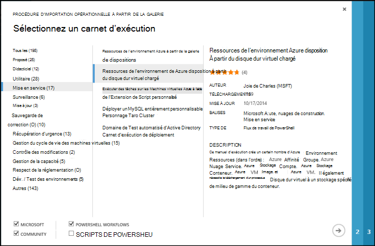
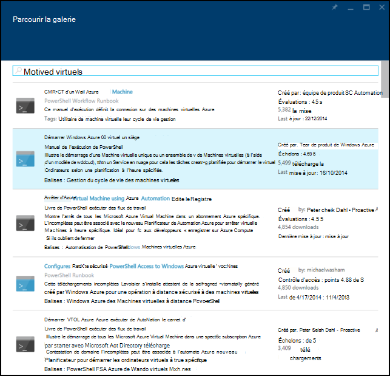
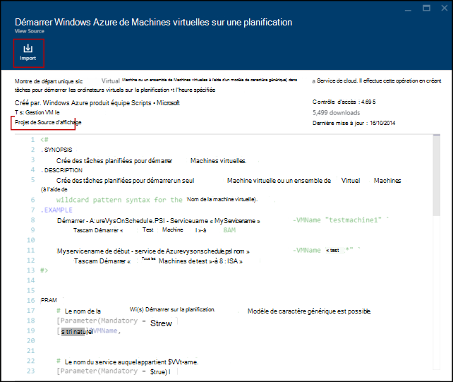
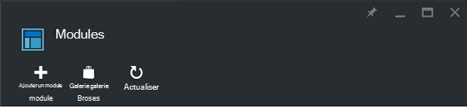
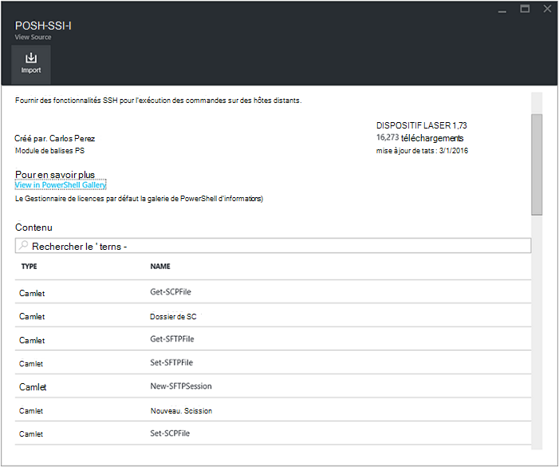
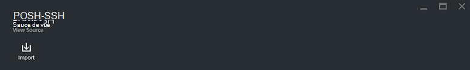
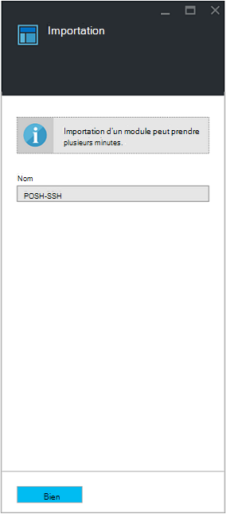

<properties
    pageTitle="Galeries de module et de procédure opérationnelle pour Azure automatisation | Microsoft Azure"
    description="Procédures opérationnelles et les modules de Microsoft et la Communauté sont disponibles pour vous d’installer et d’utiliser dans votre environnement Azure Automation.  Cet article décrit comment vous pouvez accéder à ces ressources et de contribuer les procédures opérationnelles à la galerie."
    services="automation"
    documentationCenter=""
    authors="mgoedtel"
    manager="jwhit"
    editor="tysonn" />
<tags
    ms.service="automation"
    ms.devlang="na"
    ms.topic="article"
    ms.tgt_pltfrm="na"
    ms.workload="infrastructure-services"
    ms.date="09/18/2016"
    ms.author="magoedte;bwren" />

# Galeries de module et de procédure opérationnelle pour Azure Automation

Plutôt que de créer vos propres modules et les procédures opérationnelles dans Azure Automation, vous pouvez accéder à une variété de scénarios qui ont déjà été générés par Microsoft et la Communauté.  Vous pouvez utiliser ces scénarios sans modification ou vous pouvez les utiliser comme point de départ et les modifier pour vos besoins spécifiques.

Vous pouvez obtenir les procédures opérationnelles à partir de la [Galerie de procédure opérationnelle](#runbooks-in-runbook-gallery) et les modules à partir de la [Galerie de PowerShell](#modules-in-powerShell-gallery).  Vous pouvez également contribuer à la Communauté en partageant des scénarios que vous développez.

## Procédures opérationnelles dans la galerie de procédure opérationnelle

La [Galerie de procédure opérationnelle](http://gallery.technet.microsoft.com/scriptcenter/site/search?f[0].Type=RootCategory&f[0].Value=WindowsAzure&f[1].Type=SubCategory&f[1].Value=WindowsAzure_automation&f[1].Text=Automation) offre une variété de procédures opérationnelles de Microsoft et de la Communauté que vous pouvez importer dans Azure Automation. Vous pouvez soit télécharger une procédure opérationnelle à partir de la galerie qui est hébergée dans le [Centre de scripts TechNet](http://gallery.technet.microsoft.com/), ou vous pouvez importer directement les procédures opérationnelles à partir de la galerie dans l’Azure portal classique ou Azure portal.

Vous ne pouvez importer directement à partir de la galerie de procédure opérationnelle à l’aide de l’Azure portal classique ou Azure portal. Vous ne pouvez pas effectuer cette fonction à l’aide de Windows PowerShell.

>[AZURE.NOTE] Vous devez valider le contenu de n’importe quel procédures opérationnelles que vous obtenez à partir de la galerie de procédure opérationnelle et soyez extrêmement prudent dans l’installation et en les exécutant dans un environnement de production. |

### Pour importer une procédure opérationnelle à partir de la galerie de procédure opérationnelle avec le portail classique Azure

1. Dans le portail d’Azure, cliquez sur, les **nouveaux** **Services d’App**, **procédure opérationnelle**, **l’automatisation** **De la galerie**.
2. Sélectionnez une catégorie pour afficher les procédures opérationnelles associées et sélectionnez une procédure opérationnelle pour afficher ses détails. Lorsque vous sélectionnez la procédure opérationnelle que vous le souhaitez, cliquez sur le bouton flèche droite.

    

3. Passez en revue le contenu de la procédure opérationnelle et notez les conditions requises dans la description. Lorsque vous avez terminé, cliquez sur le bouton flèche droite.
4. Entrez les détails de la procédure opérationnelle et puis cliquez sur le bouton de coche. Le nom de procédure opérationnelle est déjà renseigné.
5. La procédure opérationnelle s’affiche sous l’onglet **procédures opérationnelles** pour le compte de l’Automation.

### Pour importer une procédure opérationnelle à partir de la galerie de procédure opérationnelle avec le portail Azure

1. Dans le portail d’Azure, ouvrez votre compte Automation.
2. Cliquez sur le carré de **procédures opérationnelles** pour ouvrir la liste des procédures opérationnelles.
3. Cliquez sur le bouton **Parcourir la galerie** .

    

4. Recherchez l’élément de galerie vous souhaitez et le sélectionnez pour afficher ses détails.

    

4. Cliquez sur le **projet de code source de vue** pour afficher l’article dans le [Centre de scripts TechNet](http://gallery.technet.microsoft.com/).
5. Pour importer un élément, cliquez sur pour afficher les détails, puis cliquez sur le bouton **Importer** .

    

6. Vous pouvez également modifier le nom de la procédure opérationnelle et puis cliquez sur **OK** pour importer la procédure opérationnelle.
5. La procédure opérationnelle s’affiche sous l’onglet **procédures opérationnelles** pour le compte de l’Automation.

### Ajout d’une procédure opérationnelle à la galerie de procédure opérationnelle

Microsoft vous conseille d’ajouter des procédures opérationnelles à la galerie de procédure opérationnelle que vous pensez être utiles à d’autres utilisateurs.  Vous pouvez ajouter une procédure opérationnelle en le [téléchargeant vers le centre de scripts](http://gallery.technet.microsoft.com/site/upload) en prenant en compte les informations suivantes.

- Vous devez spécifier *De Windows Azure* pour la **catégorie** et l' *automatisation* de la **sous-catégorie** de la procédure opérationnelle à afficher dans l’Assistant.  

- Le téléchargement doit être un seul fichier .ps1 ou .graphrunbook.  Si la procédure opérationnelle nécessite des modules, procédures opérationnelles des enfants ou des ressources, vous devez indiquer ceux dans la description de la soumission et dans la section de commentaires de la procédure opérationnelle.  Si vous avez un scénario nécessitant des procédures opérationnelles plusieurs, chacun télécharger séparément, puis Lister les noms des procédures connexes opérationnelles dans chacune de leur description. Assurez-vous que vous utilisez les mêmes balises afin qu’ils s’affichent dans la même catégorie. Pour consulter la description que les autres procédures opérationnelles sont requis pour les utilisateurs auront le scénario fonctionne.

- Ajouter la balise « GraphicalPS » si vous publiez une **procédure opérationnelle de graphique** (pas un flux de travail graphique). 

- Insérez un PowerShell ou un flux de travail PowerShell extrait de code dans la description à l’aide d’icône **Insérer la section de code** .

- Le résumé pour le téléchargement s’affichera dans les résultats de la galerie de procédure opérationnelle afin que vous devez fournir des informations détaillées qui vous aidera à un utilisateur les fonctionnalités de la procédure opérationnelle.

- Vous devez affecter une des trois balises suivantes pour le téléchargement.  La procédure opérationnelle apparaît dans l’Assistant, sous les catégories qui correspondent à ses balises.  Toutes les balises pas sur cette liste seront ignorés par l’Assistant. Si vous ne spécifiez pas les balises correspondantes, la procédure opérationnelle apparaît dans la catégorie autre.

 - Sauvegarde
 - Gestion de la capacité
 - Contrôle des modifications
 - Respect de la réglementation
 - Dév. / Test des environnements
 - Reprise après sinistre
 - Surveillance
 - Application de correctifs
 - Mise en service
 - Mise à jour
 - Gestion du cycle de vie des machines virtuelles

- Automation met à jour la bibliothèque une fois par heure, afin que vous ne verrez pas vos contributions immédiatement.

## Modules dans la galerie de PowerShell

Les modules PowerShell contiennent des applets de commande que vous pouvez utiliser dans les procédures opérationnelles et des modules que vous pouvez installer dans Azure Automation sont disponibles dans la [Galerie de PowerShell](http://www.powershellgallery.com).  Vous pouvez lancer cette galerie à partir du portail Azure et les installer directement dans Azure Automation, ou vous pouvez les télécharger et les installer manuellement.  Vous ne pouvez pas installer les modules directement à partir du portail classique Azure, mais vous pouvez les télécharger les installer comme vous le feriez pour tout autre module.

### Pour importer un module à partir de la galerie de Module d’Automation avec le portail Azure

1. Dans le portail d’Azure, ouvrez votre compte Automation.
2. Cliquez sur le carré **d’actifs** pour ouvrir la liste des immobilisations.
3. Cliquez sur le carré de **Modules** pour ouvrir la liste des modules.
4. Cliquez sur le bouton **Parcourir la galerie** et la lame de galerie Parcourir est lancée.

      
5. Une fois que vous avez lancé la lame de galerie Parcourir, vous pouvez rechercher dans les champs suivants :

   - Nom du module
   - Balises
   - Auteur
   - Nom de la ressource/DSC de l’applet de commande

6. Munissez-vous d’un module qui vous intéresse et sélectionnez-le pour afficher ses détails.  
Lorsque vous développez un module spécifique, vous pouvez afficher des informations sur le module, y compris un lien vers la galerie de PowerShell, les requis des dépendances et toutes les applets de commande et/ou les ressources DSC contenant le module.

      

7. Pour installer le module directement dans Azure Automation, cliquez sur le bouton **Importer** .

    

8. Lorsque vous cliquez sur le bouton Importer, vous verrez le nom du module que vous souhaitez importer. Si toutes les dépendances sont installés, le bouton **OK** est actif. Si vous ne disposez pas de dépendances, vous devez importer ces avant de pouvoir importer ce module.
9. Cliquez sur **OK** pour importer le module, et la lame de module est lancé. Lors de l’automatisation d’Azure importe un module à votre compte, il extrait les métadonnées sur le module et les applets de commande.

    

    Cette opération peut prendre quelques minutes étant donné que chaque activité doit être extrait.
10. Vous recevrez une notification que le module est déployé et une notification lorsqu’elle est terminée.
11. Une fois que le module est importé, vous verrez les activités disponibles, et vous pouvez utiliser ses ressources dans vos procédures opérationnelles et de la Configuration de l’état souhaité.

## Demande d’un module ou une procédure opérationnelle

Vous pouvez envoyer des demandes à la [Voix de l’utilisateur](https://feedback.azure.com/forums/246290-azure-automation/).  Si vous devez écrire une procédure opérationnelle de l’aide ou avez une question sur PowerShell, publier une question sur notre [forum](http://social.msdn.microsoft.com/Forums/windowsazure/en-US/home?forum=azureautomation&filter=alltypes&sort=lastpostdesc).

## Étapes suivantes

- Pour vous familiariser avec les procédures opérationnelles, reportez-vous à la section [Création ou importation d’une procédure opérationnelle dans Azure Automation](automation-creating-importing-runbook.md)
- Pour comprendre les différences entre PowerShell et les flux de travail de PowerShell avec les procédures opérationnelles, consultez [formation PowerShell de flux de travail](automation-powershell-workflow.md)
