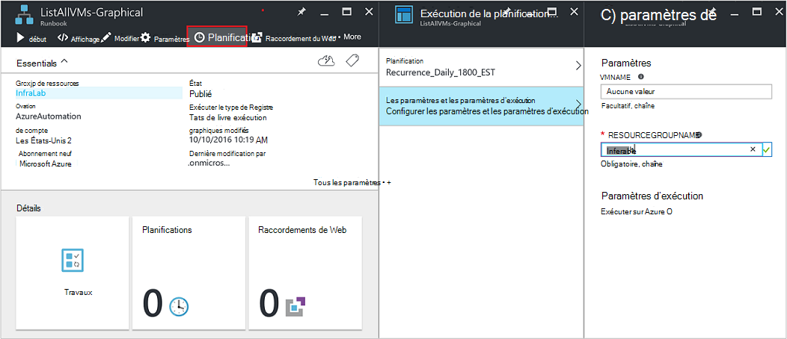

<properties
   pageTitle="Paramètres d’entrée de procédure opérationnelle | Microsoft Azure"
   description="Paramètres d’entrée de procédure opérationnelle augmentent la flexibilité de procédures opérationnelles en vous permettant de passer des données à une procédure opérationnelle lors de son démarrage. Cet article décrit différents scénarios où les paramètres d’entrée sont utilisées dans les procédures opérationnelles."
   services="automation"
   documentationCenter=""
   authors="MGoedtel"
   manager="jwhit"
   editor="tysonn" />
<tags
   ms.service="automation"
   ms.devlang="na"
   ms.topic="article"
   ms.tgt_pltfrm="na"
   ms.workload="infrastructure-services"
   ms.date="10/11/2016"
   ms.author="sngun"/>

# <a name="runbook-input-parameters"></a>Paramètres d’entrée de procédure opérationnelle

Paramètres d’entrée de procédure opérationnelle augmentent la flexibilité de procédures opérationnelles en vous permettant de lui passer des données lorsqu’il est démarré. Les paramètres permettent les actions de procédure opérationnelle d’être ciblées pour des environnements et des scénarios spécifiques. Dans cet article, nous vous guiderons à travers différents scénarios où les paramètres d’entrée sont utilisées dans les procédures opérationnelles.

## <a name="configure-input-parameters"></a>Configurer les paramètres d’entrée

Paramètres d’entrée peuvent être configurés dans PowerShell, le Workflow de PowerShell et procédures opérationnelles de graphique. Une procédure opérationnelle ne peut avoir plusieurs paramètres avec différents types de données, ou aucun. Les paramètres d’entrée peuvent être obligatoires ou facultatifs, et vous pouvez affecter une valeur par défaut pour les paramètres optionnels. Vous pouvez affecter des valeurs aux paramètres d’entrée pour une procédure opérationnelle lorsque vous le démarrez via l’une des méthodes disponibles. Ces méthodes incluent le démarrage d’une procédure opérationnelle à partir du portail ou d’un service web. Vous pouvez également démarrer un comme une procédure opérationnelle enfant appelée inline dans une autre procédure d’opérationnelle.

## <a name="configure-input-parameters-in-powershell-and-powershell-workflow-runbooks"></a>Configurer les paramètres d’entrée dans les procédures opérationnelles de PowerShell et de flux de travail de PowerShell

PowerShell et les [procédures opérationnelles de flux de travail de PowerShell](automation-first-runbook-textual.md) dans Azure Automation prend en charge les paramètres d’entrée qui sont définies par les attributs suivants.  

| **Propriété** | **Description** |
|:--- |:---|
| Type de | Obligatoire. Le type de données attendu pour la valeur du paramètre. Tout type .NET est valide. |
| Nom | Obligatoire. Le nom du paramètre. Il doit être unique au sein de la procédure opérationnelle et peuvent contenir uniquement des lettres, nombres ou caractères de soulignement. Il doit commencer par une lettre. |
| Obligatoire | Facultatif. Spécifie si une valeur doit être fournie pour le paramètre. Si vous le définissez sur **$true**, une valeur doit être fournie lors de la procédure opérationnelle est démarré. Si vous choisissez **$false**, une valeur est facultative. |
| Valeur par défaut | Facultatif.  Spécifie une valeur qui sera utilisée pour le paramètre si une valeur n’est passée au démarrage de la procédure opérationnelle. Une valeur par défaut peut être définie pour un paramètre et effectuera automatiquement le paramètre facultatif, quel que soit le paramètre obligatoire. |

Windows PowerShell prend en charge plus d’attributs que ceux répertoriés ici, comme la validation, alias, et le paramètre définit des paramètres d’entrée. Toutefois, l’Automation d’Azure prend actuellement en charge uniquement les paramètres d’entrée ci-dessus.

Une définition de paramètre dans les procédures opérationnelles de PowerShell le flux de travail a la forme générale suivante, où les différents paramètres sont séparés par des virgules.

   ```
     Param
     (
         [Parameter (Mandatory= $true/$false)]
         [Type] Name1 = <Default value>,

         [Parameter (Mandatory= $true/$false)]
         [Type] Name2 = <Default value>
     )
   ```

>[AZURE.NOTE] Lorsque vous définissez les paramètres, si vous ne spécifiez pas l’attribut **obligatoire** , alors par défaut, le paramètre est considéré comme facultatif. En outre, si vous définissez une valeur par défaut pour un paramètre dans les procédures opérationnelles de flux de travail de PowerShell, il est considéré par PowerShell comme un paramètre optionnel, quelle que soit la valeur de l’attribut **obligatoire** .

Par exemple, nous allons configurer les paramètres d’entrée pour une procédure opérationnelle PowerShell de flux de travail qui génère le plus de détails sur les machines virtuelles, une machine virtuelle unique ou tous les ordinateurs virtuels au sein d’un groupe de ressources. Cette procédure opérationnelle a deux paramètres, comme illustré dans la capture d’écran suivante : le nom de la machine virtuelle et le nom du groupe de ressources.


Dans ce paramètre définition les paramètres **$VMName** et **$resourceGroupName** sont des paramètres simples de type chaîne. Toutefois, procédures opérationnelles de PowerShell et de flux de travail PowerShell prend en charge tous les types simples et complexes, telles que **l’objet** ou **PSCredential** pour les paramètres d’entrée.

Si votre procédure opérationnelle a un paramètre d’entrée du type d’objet, puis utiliser une table de hachage PowerShell (nom, valeur) paires de passer une valeur. Par exemple, si vous avez le paramètre suivant dans une procédure opérationnelle :

     [Parameter (Mandatory = $true)]
     [object] $FullName

Vous pouvez passer ensuite la valeur suivante pour le paramètre :

    @{"FirstName"="Joe";"MiddleName"="Bob";"LastName"="Smith"}


## <a name="configure-input-parameters-in-graphical-runbooks"></a>Configurer les paramètres d’entrée dans les procédures opérationnelles de graphique

Pour [configurer une procédure opérationnelle graphique](automation-first-runbook-graphical.md) avec les paramètres d’entrée, nous allons créer une procédure opérationnelle graphique qui affiche des détails sur les machines virtuelles, une machine virtuelle unique ou tous les ordinateurs virtuels au sein d’un groupe de ressources. Configuration d’une procédure opérationnelle se compose des deux activités principales, comme décrit ci-dessous.

[**Authentifier les procédures opérationnelles avec Azure exécuter en tant que compte**](automation-sec-configure-azure-runas-account.md) d’authentifier avec Azure.

[**Get-AzureRmVm**](https://msdn.microsoft.com/library/mt603718.aspx) pour obtenir les propriétés d’un ordinateurs virtuels.

Vous pouvez utiliser l’activité [**Write-Output**](https://technet.microsoft.com/library/hh849921.aspx) en sortie les noms des ordinateurs virtuels. L’activité de **Get-AzureRmVm** accepte deux paramètres, le **nom de l’ordinateur virtuel** et le **nom du groupe de ressources**. Dans la mesure où ces paramètres peuvent nécessiter des valeurs différentes à chaque fois que vous démarrez la procédure opérationnelle, vous pouvez ajouter des paramètres d’entrée à votre procédure opérationnelle. Voici la procédure pour ajouter des paramètres d’entrée :

1. Sélectionnez la procédure opérationnelle graphique à partir de la blade de **procédures opérationnelles** et puis cliquez sur [**Modifier**](automation-graphical-authoring-intro.md) il.

2. Dans l’éditeur de procédure opérationnelle, cliquez sur **entrée et la sortie** pour ouvrir la blade **d’entrée et de sortie** .

    

3. La blade **d’entrée et de sortie** affiche une liste de paramètres d’entrée définis pour la procédure opérationnelle. Sur cette carte, vous pouvez ajouter un paramètre d’entrée ou modifier la configuration d’un paramètre d’entrée existante. Pour ajouter un nouveau paramètre pour la procédure opérationnelle, cliquez sur **Ajouter entrée** pour ouvrir la lame du **paramètre d’entrée de procédure opérationnelle** . Vous pouvez configurer les paramètres suivants :

  	| **Propriété** | **Description** |
  	|:--- |:---|
  	| Nom | Obligatoire.  Le nom du paramètre. Il doit être unique au sein de la procédure opérationnelle et peuvent contenir uniquement des lettres, nombres ou caractères de soulignement. Il doit commencer par une lettre. |
  	| Description | Facultatif. Description de l’objectif du paramètre d’entrée. |
  	| Type de | Facultatif. Le type de données attendu pour la valeur du paramètre. Types de paramètres pris en charge sont **String**, **Int32**, **Int64**, **Decimal**, **Boolean**, **DateTime**et **objet**. Si un type de données n’est pas sélectionné, la valeur par défaut est **String**. |
  	| Obligatoire | Facultatif. Spécifie si une valeur doit être fournie pour le paramètre. Si vous choisissez **Oui**, une valeur doit être fournie lors de la procédure opérationnelle est démarré. Si vous choisissez **Aucun**, puis une valeur n’est pas requise lorsque la procédure opérationnelle est démarré et une valeur par défaut peut être définie. |
  	| Valeur par défaut | Facultatif. Spécifie une valeur qui sera utilisée pour le paramètre si une valeur n’est passée au démarrage de la procédure opérationnelle. Une valeur par défaut peut être définie pour un paramètre qui n’est pas obligatoire. Pour définir une valeur par défaut, choisissez **personnalisé**. Cette valeur est utilisée, sauf si une autre valeur est fournie lors du démarrage de la procédure opérationnelle. Sélectionnez **Aucun** si vous ne souhaitez pas fournir une valeur par défaut. |  

    

4. Créer deux paramètres avec les propriétés suivantes qui seront utilisées par l’activité de **Get-AzureRmVm** :

    - **Paramètre 1 :**
      - Nom - VMName
      - Type : chaîne
      - Obligatoire - No

    - **Paramètre 2 :**
      - Nom - resourceGroupName
      - Type : chaîne
      - Obligatoire - No
      - Valeur par défaut - personnalisé
      - Valeur de personnalisée par défaut - \<nom du groupe de ressources qui contient les ordinateurs virtuels >

5. Une fois que vous ajoutez les paramètres, cliquez sur **OK**.  Vous pouvez maintenant les afficher dans la **entrée et sortie**. Cliquez de nouveau sur **OK** , puis cliquez sur **Enregistrer** et **Publier** votre procédure opérationnelle.

## <a name="assign-values-to-input-parameters-in-runbooks"></a>Affecter des valeurs aux paramètres dans des procédures opérationnelles d’entrée

Vous pouvez passer des valeurs d’entrée de paramètres dans des procédures opérationnelles dans les scénarios suivants.

### <a name="start-a-runbook-and-assign-parameters"></a>Démarrer une procédure opérationnelle et d’affecter des paramètres

Une procédure opérationnelle peut être démarré de plusieurs façons : via le portail d’Azure, avec une webhook, avec les applets de commande PowerShell, l’API REST ou avec le Kit de développement logiciel. Ci-dessous, nous abordons différentes méthodes de démarrage d’une procédure opérationnelle et d’affecter des paramètres.

#### <a name="start-a-published-runbook-by-using-the-azure-portal-and-assign-parameters"></a>Démarrer une procédure opérationnelle publiée à l’aide du portail Azure et d’affecter des paramètres

Lorsque vous [Démarrez la procédure opérationnelle](automation-starting-a-runbook.md#starting-a-runbook-with-the-azure-portal), la lame de **Démarrer la procédure opérationnelle** s’ouvre et vous pouvez configurer les valeurs pour les paramètres que vous venez de créer.


Dans l’étiquette située sous la zone d’entrée, vous pouvez voir les attributs qui ont été définies pour le paramètre. Les attributs incluent type obligatoire ou facultatif et la valeur par défaut. Dans la bulle d’aide à côté du nom de paramètre, vous pouvez voir toutes les informations clés que vous avez besoin prendre des décisions sur les valeurs de paramètre d’entrée. Ces informations incluent si un paramètre est obligatoire ou facultatif. Il inclut également le type et la valeur par défaut (le cas échéant) et autres notes utiles.


>[AZURE.NOTE] Les paramètres de type de chaîne prend en charge les valeurs de chaîne **vide** .  Saisie de **[chaîne vide]** dans la zone de paramètre d’entrée passe une chaîne vide pour le paramètre. Également, les paramètres de type de chaîne ne prend en charge les valeurs **Null** est passées. Si vous ne transmettez aucune valeur pour le paramètre de chaîne, puis PowerShell interprète comme null.

#### <a name="start-a-published-runbook-by-using-powershell-cmdlets-and-assign-parameters"></a>Démarrer une procédure opérationnelle publiée à l’aide des applets de commande PowerShell et affecter des paramètres

  - **Le Gestionnaire de Ressources azure applets de commande :** Vous pouvez démarrer une procédure d’automatisation opérationnelle qui a été créé dans un groupe de ressources à l’aide de [Démarrer-AzureRmAutomationRunbook](https://msdn.microsoft.com/library/mt603661.aspx).

    **Exemple :**

   ```
    $params = @{“VMName”=”WSVMClassic”;”resourceGroupeName”=”WSVMClassicSG”}
 
    Start-AzureRmAutomationRunbook -AutomationAccountName “TestAutomation” -Name “Get-AzureVMGraphical” –ResourceGroupName $resourceGroupName -Parameters $params
   ```

  - **Les cmdlets de gestion des services azure :** Vous pouvez démarrer une procédure d’automatisation opérationnelle qui a été créé dans un groupe de ressources par défaut à l’aide de [Démarrer-AzureAutomationRunbook](https://msdn.microsoft.com/library/dn690259.aspx).

    **Exemple :**

   ```
    $params = @{“VMName”=”WSVMClassic”; ”ServiceName”=”WSVMClassicSG”}

    Start-AzureAutomationRunbook -AutomationAccountName “TestAutomation” -Name “Get-AzureVMGraphical” -Parameters $params
   ```

>[AZURE.NOTE] Lorsque vous démarrez une procédure opérationnelle à l’aide des applets de commande PowerShell, un paramètre par défaut, **MicrosoftApplicationManagementStartedBy** est créée avec la valeur de **PowerShell**. Vous pouvez afficher ce paramètre dans la lame de **Détails de la tâche** .  

#### <a name="start-a-runbook-by-using-an-sdk-and-assign-parameters"></a>Démarrer une procédure opérationnelle à l’aide d’un kit de développement et d’affecter des paramètres

  - **Méthode d’azure le Gestionnaire de ressources :** Vous pouvez démarrer une procédure opérationnelle à l’aide du Kit de développement d’un langage de programmation. Voici un extrait de code C# pour démarrer une procédure opérationnelle dans votre compte d’Automation. Vous pouvez afficher tout le code à notre [référentiel de GitHub](https://github.com/Azure/azure-sdk-for-net/blob/master/src/ResourceManagement/Automation/Automation.Tests/TestSupport/AutomationTestBase.cs).  

   ```
     public Job StartRunbook(string runbookName, IDictionary<string, string> parameters = null)
        {
          var response = AutomationClient.Jobs.Create(resourceGroupName, automationAccount, new JobCreateParameters
           {
              Properties = new JobCreateProperties
               {
                  Runbook = new RunbookAssociationProperty
                   {
                     Name = runbookName
                   },
                     Parameters = parameters
               }
           });
        return response.Job;
        }
   ```

  - **Méthode de gestion des services azure :** Vous pouvez démarrer une procédure opérationnelle à l’aide du Kit de développement d’un langage de programmation. Voici un extrait de code C# pour démarrer une procédure opérationnelle dans votre compte d’Automation. Vous pouvez afficher tout le code à notre [référentiel de GitHub](https://github.com/Azure/azure-sdk-for-net/blob/master/src/ServiceManagement/Automation/Automation.Tests/TestSupport/AutomationTestBase.cs).

   ```      
    public Job StartRunbook(string runbookName, IDictionary<string, string> parameters = null)
      {
        var response = AutomationClient.Jobs.Create(automationAccount, new JobCreateParameters
      {
        Properties = new JobCreateProperties
           {
             Runbook = new RunbookAssociationProperty
           {
             Name = runbookName
                },
                  Parameters = parameters
                }
         });
        return response.Job;
      }
   ```

  Pour démarrer cette méthode, créez un dictionnaire pour stocker les paramètres de procédure opérationnelle, **VMName** et **resourceGroupName**et leurs valeurs. Démarrez ensuite la procédure opérationnelle. Voici l’extrait de code C# pour l’appel de la méthode définie ci-dessus.

   ```
    IDictionary<string, string> RunbookParameters = new Dictionary<string, string>();

    // Add parameters to the dictionary.
    RunbookParameters.Add("VMName", "WSVMClassic");
    RunbookParameters.Add("resourceGroupName", "WSSC1");

    //Call the StartRunbook method with parameters
    StartRunbook(“Get-AzureVMGraphical”, RunbookParameters);
   ```

#### <a name="start-a-runbook-by-using-the-rest-api-and-assign-parameters"></a>Démarrer une procédure opérationnelle à l’aide de l’API REST et affecter des paramètres

Un projet de procédure opérationnelle peut être créé et commencent par l’API d’automatisation d’Azure reste en utilisant la méthode **PUT** avec l’URI de la demande suivante.

    https://management.core.windows.net/<subscription-id>/cloudServices/<cloud-service-name>/resources/automation/~/automationAccounts/<automation-account-name>/jobs/<job-id>?api-version=2014-12-08`

Dans l’URI de la requête, remplacez les paramètres suivants :

  - **id d’abonnement :** Votre ID d’abonnement Azure.  
  - **nom-service cloud :** Le nom du service nuage à laquelle la demande doit être envoyée.  
  - **automation--nom du compte :** Le nom de votre compte d’automation qui est hébergé dans le service nuage spécifié.  
  - **id de la tâche :** Le GUID de la tâche. GUID dans PowerShell peut être créés à l’aide de la **[GUID]::NewGuid(). ToString()** commande.

Pour passer des paramètres de la tâche de procédure opérationnelle, utiliser le corps de la demande. Il prend les deux propriétés suivantes, fournies au format JSON :

  - **Nom de procédure opérationnelle :** Obligatoire. Le nom de la procédure opérationnelle pour le travail doit démarrer.  
  - **Paramètres de procédure opérationnelle :** Facultatif. Un dictionnaire de la liste de paramètres (nom, valeur) format où nom doit être de type chaîne et valeur peut être n’importe quelle valeur JSON valide.

Si vous souhaitez démarrer la procédure **Get-AzureVMTextual** opérationnelle créée précédemment avec **VMName** et **resourceGroupName** en tant que paramètres, utilisez le format JSON suivant pour le corps de la demande.

   ```
    {
      "properties":{
        "runbook":{
        "name":"Get-AzureVMTextual"},
      "parameters":{
         "VMName":"WSVMClassic",
         "resourceGroupName":”WSCS1”}
        }
    }
   ```

Un code d’état HTTP 201 est retourné si le travail est créé avec succès. Pour plus d’informations sur les en-têtes de réponse et le corps de réponse, reportez-vous à l’article sur la [créer un travail de procédure opérationnelle à l’aide de l’API REST.](https://msdn.microsoft.com/library/azure/mt163849.aspx)

### <a name="test-a-runbook-and-assign-parameters"></a>Tester une procédure opérationnelle et d’affecter des paramètres

Lorsque vous [Testez le brouillon de votre procédure opérationnelle](automation-testing-runbook.md) à l’aide de l’option de test, la lame **de Test** s’ouvre et vous pouvez configurer les valeurs pour les paramètres que vous venez de créer.


### <a name="link-a-schedule-to-a-runbook-and-assign-parameters"></a>Lier un programme à une procédure opérationnelle et d’affecter des paramètres

Vous pouvez [lier un programme](automation-schedules.md) à votre procédure opérationnelle afin que la procédure opérationnelle commence à une heure spécifique. Pour attribuer des paramètres d’entrée lors de la création de la planification et la procédure opérationnelle utilisera ces valeurs lorsqu’il est démarré par la planification. Impossible d’enregistrer la planification jusqu'à ce que toutes les valeurs des paramètres obligatoires sont fournies.



### <a name="create-a-webhook-for-a-runbook-and-assign-parameters"></a>Créer une webhook pour une procédure opérationnelle et d’affecter des paramètres

Vous pouvez créer un [webhook](automation-webhooks.md) pour votre procédure opérationnelle et configurer des paramètres d’entrée de procédure opérationnelle. Impossible d’enregistrer le webhook jusqu'à ce que toutes les valeurs des paramètres obligatoires sont fournies.


Lorsque vous exécutez une procédure opérationnelle à l’aide d’un webhook, le paramètre d’entrée prédéfini **[Webhookdata](automation-webhooks.md#details-of-a-webhook)** est envoyé, ainsi que les paramètres d’entrée que vous avez définie. Vous pouvez cliquer sur pour développer le paramètre **WebhookData** pour plus de détails.


## <a name="next-steps"></a>Étapes suivantes

- Pour plus d’informations sur la procédure opérationnelle entrée et de sortie, consultez [Azure Automation : procédure opérationnelle d’entrée, de sortie et procédures opérationnelles imbriqués](https://azure.microsoft.com/blog/azure-automation-runbook-input-output-and-nested-runbooks/).
- Pour plus d’informations sur les différentes manières de lancer une procédure opérationnelle, voir [une procédure opérationnelle](automation-starting-a-runbook.md).
- Pour modifier une procédure opérationnelle textuelle, reportez-vous aux [procédures opérationnelles textuelle de modification](automation-edit-textual-runbook.md).
- Pour modifier une procédure opérationnelle graphique, reportez-vous à [Création de graphique dans Azure Automation](automation-graphical-authoring-intro.md).
