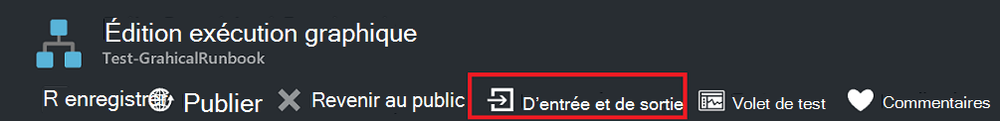

<properties
   pageTitle="Sortie de procédure opérationnelle et Messages dans Automation Azure | Microsoft Azure"
   description="Décrit comment créer et récupérer les résultats et les erreurs des messages à partir de procédures opérationnelles dans Azure Automation."
   services="automation"
   documentationCenter=""
   authors="mgoedtel"
   manager="jwhit"
   editor="tysonn" />
<tags
   ms.service="automation"
   ms.devlang="na"
   ms.topic="article"
   ms.tgt_pltfrm="na"
   ms.workload="infrastructure-services"
   ms.date="08/24/2016"
   ms.author="magoedte;bwren" />

# Sortie de procédure opérationnelle et messages dans Azure Automation

La plupart des procédures opérationnelles de Azure Automation ont une forme de sortie, tel qu’un message d’erreur à l’utilisateur ou un objet complexe destiné à être consommé par un autre workflow. Windows PowerShell fournit [plusieurs flux de données](http://blogs.technet.com/heyscriptingguy/archive/2014/03/30/understanding-streams-redirection-and-write-host-in-powershell.aspx) pour envoyer la sortie à partir d’un script ou un flux de travail. Azure Automation fonctionne avec chacun de ces flux différemment, et que vous devez suivre les méthodes conseillées pour l’utilisation de chaque lorsque vous créez une procédure opérationnelle.

Le tableau suivant fournit une brève description de chacun des flux de données et de leur comportement dans le portail de gestion Azure à lors de l’exécution d’une procédure opérationnelle publié et à [tester une procédure opérationnelle](automation-testing-runbook.md). Des détails supplémentaires sur chaque flux de données sont fournis dans les sections suivantes.

| Flux de données | Description | Publié | Test|
|:---|:---|:---|:---|
|Sortie|Les objets conçus pour être consommés par d’autres procédures opérationnelles.|Écrits dans l’historique des travaux.|Affiche dans le volet de résultat de Test.|
|Avertissement|Message d’avertissement destiné à l’utilisateur.|Écrits dans l’historique des travaux.|Affiche dans le volet de résultat de Test.|
|Erreur|Message d’erreur destiné à l’utilisateur. Contrairement à une exception, la procédure opérationnelle continue après un message d’erreur par défaut.|Écrits dans l’historique des travaux.|Affiche dans le volet de résultat de Test.|
|Commentaires|Messages de fournir des informations générales ou de débogage.|Écrits dans l’historique du travail uniquement si l’enregistrement des commentaires est activé pour la procédure opérationnelle.|Affiche dans le volet sortie de Test uniquement si $VerbosePreference est définie sur Continue dans la procédure opérationnelle.|
|État d’avancement|Enregistrements générés automatiquement avant et après chaque activité dans la procédure opérationnelle. La procédure opérationnelle ne doit pas tenter de créer ses propres enregistrements de progression dans la mesure où ils sont destinés à un utilisateur interactif.|Écrits dans l’historique du travail uniquement si l’enregistrement de la progression est activée pour la procédure opérationnelle.|Pas affiché dans le volet de résultat de Test.|
|Débogage|Messages destinés à un utilisateur interactif. Il ne doit pas être utilisé dans les procédures opérationnelles.|Ne pas écrits dans l’historique des travaux.|Ne pas écrits dans le volet de résultat de Test.|

## Flux de sortie

Le flux de sortie est conçu pour la sortie des objets créés par un script ou un flux de travail lorsqu’il s’exécute correctement. Dans Azure Automation, ce flux est principalement utilisé pour les objets destinés à être consommés par les [procédures opérationnelles du parent qui appellent la procédure opérationnelle actuelle](automation-child-runbooks.md). Lorsque vous [appelez une procédure opérationnelle inline](automation-child-runbooks.md#InlineExecution) à partir d’une procédure opérationnelle du parent, il renvoie des fonctions de données à partir du flux de sortie pour le parent. Vous devez uniquement utiliser le flux de sortie pour communiquer des informations générales à l’utilisateur si vous connaissez que la procédure opérationnelle ne sera jamais appelée par une autre procédure d’opérationnelle. Comme meilleure pratique, toutefois, vous devez généralement utiliser le [flux détaillé](#Verbose) pour communiquer des informations générales à l’utilisateur.

Vous pouvez écrire des données dans le flux de sortie à l’aide de [Write-Output](http://technet.microsoft.com/library/hh849921.aspx) ou en plaçant l’objet sur sa propre ligne dans la procédure opérationnelle.

    #The following lines both write an object to the output stream.
    Write-Output –InputObject $object
    $object

### Sortie d’une fonction

Lorsque vous écrivez dans le flux de sortie d’une fonction qui est inclus dans votre procédure opérationnelle, le résultat est passé à la procédure opérationnelle. Si la procédure opérationnelle affecte ce résultat à une variable, il n’est pas écrit dans le flux de sortie. Écriture à n’importe quel autre flux à partir de dans la fonction écrit dans le flux correspondant pour la procédure opérationnelle.

Prenons l’exemple suivant de procédure opérationnelle.

    Workflow Test-Runbook
    {
        Write-Verbose "Verbose outside of function" -Verbose
        Write-Output "Output outside of function"
        $functionOutput = Test-Function
        $functionOutput

    Function Test-Function
     {
        Write-Verbose "Verbose inside of function" -Verbose
        Write-Output "Output inside of function"
      }
    }

Le flux de sortie pour le projet de procédure opérationnelle serait :

    Output inside of function
    Output outside of function

Le flux détaillé pour le projet de procédure opérationnelle serait :

    Verbose outside of function
    Verbose inside of function

Une fois vous avez publié la procédure opérationnelle et avant de le démarrer, vous devez également activer enregistrement dans les paramètres de procédure opérationnelle afin d’obtenir la sortie du flux détaillé des commentaires.

### Type de données de sortie déclarant

Un workflow peut spécifier le type de données de la sortie à l’aide de l' [attribut de OutputType](http://technet.microsoft.com/library/hh847785.aspx). Cet attribut n’a aucun effet lors de l’exécution, mais il fournit une indication à l’auteur de procédure opérationnelle au moment du design de la sortie attendue de la procédure opérationnelle. L’ensemble d’outils de procédures opérationnelles continue d’évoluer, l’importance de la déclaration des types de données de sortie au moment du design sera plus importance. Par conséquent, il est recommandé d’inclure cette déclaration dans les procédures opérationnelles que vous créez.

Voici une liste d’exemple de types de sortie :

-   System.String
-   System.Int32
-   System.Collections.Hashtable
-   Microsoft.Azure.Commands.Compute.Models.PSVirtualMachine

  
L’exemple suivant de procédure opérationnelle renvoie un objet string et inclut une déclaration de son type de sortie. Si votre procédure opérationnelle renvoie un tableau d’un certain type, vous devez encore spécifier le type, et non un tableau du type.

    Workflow Test-Runbook
    {
       [OutputType([string])]

       $output = "This is some string output."
       Write-Output $output
    }

Pour déclarer un type de sortie de procédures opérationnelles de Grapical ou de flux de travail graphique PowerShell, vous pouvez sélectionner l’option de menu **d’entrée et de sortie** et tapez le nom du type de sortie.  Nous vous recommandons de qu'utiliser le nom complet de la classe .NET pour le rendre facilement identifiables lors de référencement d’une procédure opérationnelle du parent.  Cela expose toutes les propriétés de cette classe pour le bus de données dans la procédure opérationnelle et offre une grande souplesse lorsque vous les utilisez pour la logique conditionnelle, de journalisation et les référencer en tant que valeurs pour d’autres activités dans la procédure opérationnelle.  

Dans l’exemple suivant, nous avons deux de procédures opérationnelles graphiques pour illustrer cette fonctionnalité.  Si nous appliquons le modèle de conception modulaire de procédure opérationnelle, nous disposons d’une procédure d’opérationnelle qui sert le *modèle de procédure opérationnelle de l’authentification* de gestion de l’authentification avec Azure à l’aide d’exécuter en tant que compte.  Notre deuxième procédure opérationnelle, qui serait normalement exécuter la logique de base pour automatiser un scénario donné, dans ce cas va exécuter le *modèle de procédure opérationnelle de l’authentification* et afficher les résultats dans le volet de sortie de **Test** .  Dans des circonstances normales, nous aurions dû cette procédure opérationnelle pour effectuer une opération sur une ressource en exploitant la sortie de la procédure opérationnelle enfant.    

Voici la logique de base de la procédure opérationnelle **AuthenticateTo-Azure** .  .  

Il comprend le type de sortie *Microsoft.Azure.Commands.Profile.Models.PSAzureContext*, qui retournera l’authentification des propriétés de profil.   

Cette procédure opérationnelle est très simple, mais il existe un élément de configuration d’appeler ici.  La dernière activité est l’exécution de l’applet de commande **Write-Output** et écrit les données de profil dans la variable $_ en utilisant une expression PowerShell pour le paramètre **d’objet d’entrée** , qui est requis pour cette applet de commande.  

Pour la deuxième procédure d’opérationnelle dans cet exemple, nommé *ChildOutputType-Test*, nous avons simplement deux activités.   

La première activité appelle la procédure opérationnelle **AuthenticateTo-Azure** et la deuxième activité exécute l’applet de commande **Write-Verbose** avec la **source de données** de **sortie de l’activité** et la valeur de **chemin d’accès au champ** est **Context.Subscription.SubscriptionName**, qui spécifie la sortie de contexte de la procédure opérationnelle **AuthenticateTo-Azure** .      

Le résultat est le nom de l’abonnement.  

Une remarque sur le comportement du contrôle de Type de sortie.  Lorsque vous tapez une valeur dans le champ Type de sortie sur la lame de propriétés d’entrée et de sortie, vous devez cliquer sur le contrôle une fois que vous tapez, afin que votre écriture soit reconnue par le contrôle.  

## Flux de messages

Le flux de sortie, à la différence des flux de messages sont destinés à communiquer des informations à l’utilisateur. Il existe plusieurs flux de message pour différents types d’informations, et chacune est traitée différemment par Automation d’Azure.

### Flux d’avertissement et d’erreur

Les flux d’avertissement et d’erreur sont conçus pour enregistrer les problèmes qui se produisent dans une procédure opérationnelle. Ils sont écrits dans l’historique des travaux lorsqu’une procédure opérationnelle est exécutée et sont inclus dans le volet de résultat de Test dans le portail de gestion Azure lorsqu’une procédure opérationnelle est testé. Par défaut, la procédure opérationnelle continuera l’exécution après un avertissement ou une erreur. Vous pouvez spécifier que la procédure opérationnelle doit être suspendu sur un avertissement ou une erreur en définissant une [variable de préférence](#PreferenceVariables) dans la procédure opérationnelle avant de créer le message. Par exemple, pour déclencher une procédure opérationnelle à suspendre sur une erreur, comme il le ferait une exception, la valeur **$ErrorActionPreference** Stop.

Créer un message d’erreur ou d’avertissement à l’aide de l’applet de commande [d’Écriture-avertissement](https://technet.microsoft.com/library/hh849931.aspx) ou une [Erreur d’écriture](http://technet.microsoft.com/library/hh849962.aspx) . Les activités peuvent également écrire dans ces flux.

    #The following lines create a warning message and then an error message that will suspend the runbook.

    $ErrorActionPreference = "Stop"
    Write-Warning –Message "This is a warning message."
    Write-Error –Message "This is an error message that will stop the runbook because of the preference variable."

### Flux détaillé

Le flux de message détaillé est pour obtenir des informations générales sur l’opération de procédure opérationnelle. Dans la mesure où le [flux de débogage](#Debug) n’est pas disponible dans une procédure opérationnelle, messages documentés convient pour les informations de débogage. Par défaut, les messages détaillés à partir de procédures opérationnelles publiés ne seront pas stockés dans l’historique des travaux. Pour stocker les messages documentés, configurer publié des procédures opérationnelles pour les enregistrements détaillés du journal sous l’onglet Configuration de la procédure opérationnelle dans le portail de gestion Azure. Dans la plupart des cas, vous devez conserver le paramètre par défaut n’enregistre ne pas les enregistrements détaillés pour une procédure opérationnelle pour des raisons de performances. Activez cette option uniquement pour dépanner ou déboguer une procédure opérationnelle.

Lorsque le [test une procédure opérationnelle](automation-testing-runbook.md), messages détaillés ne sont pas affichées même si la procédure opérationnelle est configuré pour enregistrer les enregistrements détaillés. Pour afficher des messages documentés pendant le [test d’une procédure opérationnelle](automation-testing-runbook.md), vous devez définir la variable $VerbosePreference pour continuer. Avec ce jeu de variables, le mode détaillé s’affichera dans le volet de sortie Test du portail Azure.

Créez un message détaillé à l’aide de l’applet de commande [Write-Verbose](http://technet.microsoft.com/library/hh849951.aspx) .

    #The following line creates a verbose message.

    Write-Verbose –Message "This is a verbose message."

### Débogage de flux de données

Le flux de débogage est destiné à un utilisateur interactif et ne doit pas être utilisé dans les procédures opérationnelles.

## Enregistrements de cours

Si vous configurez une procédure opérationnelle pour enregistrer la progression des enregistrements (sous l’onglet Configuration de la procédure opérationnelle dans le portail Azure), puis un enregistrement est écrits dans l’historique du travail avant et après l’exécution de chaque activité. Dans la plupart des cas, vous devez conserver le paramètre par défaut de la journalisation ne pas des enregistrements de cours pour une procédure opérationnelle pour optimiser les performances. Activez cette option uniquement pour dépanner ou déboguer une procédure opérationnelle. Lorsque vous testez une procédure opérationnelle, les messages d’avancement ne s’affichent pas même si la procédure opérationnelle est configuré pour enregistrer les enregistrements de l’état d’avancement.

L’applet de commande [Write-Progress](http://technet.microsoft.com/library/hh849902.aspx) n’est pas valide dans une procédure opérationnelle, dans la mesure où cela est prévu pour une utilisation avec un utilisateur interactif.

## Variables de préférence

Windows PowerShell utilise les [variables de préférence](http://technet.microsoft.com/library/hh847796.aspx) pour déterminer comment répondre aux données envoyées au flux de sortie différents. Vous pouvez définir ces variables dans une procédure opérationnelle pour contrôler comment elle répondra aux données envoyées dans des flux différents.

Le tableau suivant répertorie les variables de préférence qui peuvent être utilisés dans les procédures opérationnelles avec leurs valides et les valeurs par défaut. Notez que ce tableau inclut uniquement les valeurs qui sont valides dans une procédure opérationnelle. Autres valeurs sont valides pour les variables de préférence lorsqu’il est utilisé dans Windows PowerShell en dehors d’Azure Automation.

| Variable| Valeur par défaut| Valeurs valides|
|:---|:---|:---|
|WarningPreference|Continuer|Arrêter Continuer SilentlyContinue|
|ErrorActionPreference|Continuer|Arrêter Continuer SilentlyContinue|
|VerbosePreference|SilentlyContinue|Arrêter Continuer SilentlyContinue|

Le tableau suivant répertorie le comportement pour les valeurs de variable de préférence qui sont valides dans les procédures opérationnelles.

| Valeur| Comportement|
|:---|:---|
|Continuer|Enregistre le message et poursuit l’exécution de la procédure opérationnelle.|
|SilentlyContinue|Poursuit l’exécution de la procédure opérationnelle sans le message de la session. Cela a pour effet d’ignorer le message.|
|Arrêter|Enregistre le message et interrompt la procédure opérationnelle.|

## Récupération de messages et la sortie de procédure opérationnelle

### Azure portal

Vous pouvez afficher les détails d’une tâche de procédure opérationnelle dans le portail Azure à partir de l’onglet tâches d’une procédure opérationnelle. Le résumé de la tâche affiche les paramètres d’entrée et le [flux de sortie](#Output) en plus des informations générales sur la tâche et toutes les exceptions si elles se produisaient. L’historique inclura les messages dans le [flux de sortie](#Output) et [avertissement et erreur de flux de données](#WarningError) en plus des [flux détaillé](#Verbose) et [Des enregistrements de cours](#Progress) si la procédure opérationnelle est configuré pour l’enregistrement des commentaires et des enregistrements de cours.

### Windows PowerShell

Dans Windows PowerShell, vous pouvez récupérer la sortie et les messages à partir d’une procédure opérationnelle à l’aide de l’applet de commande [Get-AzureAutomationJobOutput](https://msdn.microsoft.com/library/mt603476.aspx) . Cette applet de commande requiert l’ID de la tâche et a un paramètre appelé flux de données dans laquelle vous spécifiez le flux de données à renvoyer. Vous pouvez spécifier une pour retourner tous les flux de travail.

L’exemple suivant démarre un exemple de procédure opérationnelle et attend qu’elle se termine. Une fois terminé, le flux de sortie est collectée à partir de la tâche.

    $job = Start-AzureRmAutomationRunbook -ResourceGroupName "ResourceGroup01" `
    –AutomationAccountName "MyAutomationAccount" –Name "Test-Runbook"

    $doLoop = $true
    While ($doLoop) {
       $job = Get-AzureRmAutomationJob -ResourceGroupName "ResourceGroup01" `
       –AutomationAccountName "MyAutomationAccount" -Id $job.JobId
       $status = $job.Status
       $doLoop = (($status -ne "Completed") -and ($status -ne "Failed") -and ($status -ne "Suspended") -and ($status -ne "Stopped")
    }

    Get-AzureRmAutomationJobOutput -ResourceGroupName "ResourceGroup01" `
    –AutomationAccountName "MyAutomationAccount" -Id $job.JobId –Stream Output

### Création de graphiques

Pour les procédures opérationnelles de graphiques, enregistrement supplémentaire est disponible sous la forme de traçage au niveau de l’activité.  Il existe deux niveaux de traçage : Basic et détaillé.  Dans suivi de base, vous pouvez voir le début et l’heure de fin de chaque activité dans la procédure opérationnelle ainsi que des informations liées pour les tentatives de l’activité, telles que le nombre de tentatives et l’heure de début de l’activité.  Dans suivi détaillées, vous obtenez suivi de base plu d’entrée et de sortie pour chaque activité.  Notez qu’actuellement les enregistrements de trace sont écrits à l’aide de flux détaillé, vous devez activer la journalisation détaillée lorsque vous activez le traçage.  Pour les procédures opérationnelles de graphique avec le suivi activé, il est inutile pour consigner des enregistrements de cours, car le traçage base joue le même rôle et des informations plus détaillées.

Vous pouvez voir la capture d’écran ci-dessus que lorsque vous activez des commentaires de journalisation et de suivi pour les procédures opérationnelles graphique, beaucoup plus d’informations sont disponibles dans la vue du flux de travail de production.  Ces informations supplémentaires peuvent être essentielles pour résoudre les problèmes de production avec une procédure opérationnelle, et vous devez l’activer par conséquent uniquement à cet effet et pas d’une manière générale.    
Les enregistrements de Trace peuvent être particulièrement nombreux.  Avec la procédure opérationnelle graphique suivi vous pouvez obtenir des enregistrements de deux à quatre par activité selon si vous avez configuré le suivi Basic ou détaillé.  Sauf si vous avez besoin de ces informations pour effectuer le suivi de la progression d’une procédure opérationnelle pour le dépannage, vous pouvez souhaiter conserver le traçage désactivé.

**Pour activer le traçage au niveau de l’activité, procédez comme suit.**

 1. Dans le portail d’Azure, ouvrez votre compte Automation.

 2. Cliquez sur le carré de **procédures opérationnelles** pour ouvrir la liste des procédures opérationnelles.

 3. Sur la lame de procédures opérationnelles, cliquez pour sélectionner une procédure opérationnelle graphique à partir de la liste des procédures opérationnelles.

 4. Sur la lame de paramètres pour la procédure opérationnelle sélectionnée, cliquez sur **journalisation et de suivi**.

 5. Sur la journalisation et le suivi lame, sous journal des enregistrements détaillés, cliquez **sur** pour activer la journalisation détaillée et le traçage au niveau de l’activité de l’udner, modifier le niveau de suivi de **base** ou **détaillé** , basé sur le niveau de suivi vous demander. 

    

## Étapes suivantes

- Pour en savoir plus sur l’exécution de procédure opérationnelle, comment faire pour surveiller la procédure opérationnelle des travaux et d’autres informations techniques, voir [suivi d’un projet de procédure opérationnelle](automation-runbook-execution.md)
- Pour comprendre comment créer et utiliser des procédures opérationnelles des enfants, consultez les [procédures opérationnelles des enfants dans Azure Automation](automation-child-runbooks.md)
