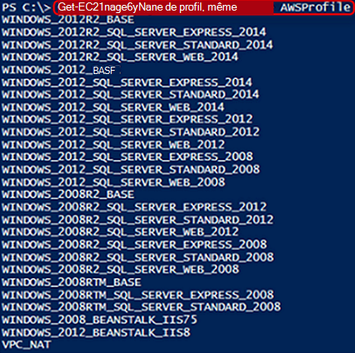

<properties
   pageTitle="Automatisation du déploiement d’un ordinateur virtuel dans les Services Web Amazon | Microsoft Azure"
   description="Cet article explique comment utiliser Automation d’Azure pour automatiser la création d’une VM de Service Web Amazon"
   services="automation"
   documentationCenter=""
   authors="mgoedtel"
   manager="jwhit"
   editor="" />
<tags
   ms.service="automation"
   ms.devlang="na"
   ms.topic="article"
   ms.tgt_pltfrm="na"
   ms.workload="na"
   ms.date="08/17/2016"
   ms.author="tiandert; bwren" />

# <a name="azure-automation-scenario---provision-an-aws-virtual-machine"></a>Scénario d’automatisation Azure - fourniture d’un ordinateur virtuel AWS 

Dans cet article, nous montrent comment vous pouvez tirer parti d’automatisation Azure afin de mettre en service un ordinateur virtuel dans votre abonnement Amazon Web Services (AWS) et nommez cette machine virtuelle spécifique – qui AWS fait référence à « balisage » de la machine virtuelle.

## <a name="prerequisites"></a>Conditions préalables

Pour les besoins de cet article, vous devez avoir un compte Azure Automation et un abonnement AWS. Pour plus d’informations sur la configuration d’un compte Azure Automation et configurez-le avec vos informations d’identification de la souscription AWS, examinez la [Configuration de l’authentification avec Amazon Web Services](../automation/automation-sec-configure-aws-account.md).  Ce compte doit être créé ou mis à jour avec vos informations d’identification de la souscription AWS avant de continuer, nous font référence à ce compte dans les étapes suivantes.


## <a name="deploy-amazon-web-services-powershell-module"></a>Déployer le Module PowerShell de Amazon Web Services

Notre mise en service de procédure opérationnelle VM exploiteront le module PowerShell de AWS pour faire son travail. Procédez comme suit pour ajouter le module à votre compte d’Automation qui est configuré avec vos informations d’identification de la souscription AWS.  

1. Ouvrez votre navigateur web et accédez à la [Galerie de PowerShell](http://www.powershellgallery.com/packages/AWSPowerShell/) et cliquez sur la **déployer à bouton automatisation d’Azure**.<br> 

2. Vous accédez à la page de connexion Azure et après l’authentification, vous seront acheminés vers le portail Azure et présentés avec la lame suivante.<br> 

3. Sélectionnez le groupe de ressources à partir de la liste déroulante **Groupe de ressources** et la lame de paramètres, fournissez les informations suivantes :
   * Dans la liste déroulante **Nouveau ou existant compte d’Automation (chaîne)** , sélectionnez **existant**.  
   * Dans la zone **Nom de compte d’Automation (chaîne)** , tapez le nom exact du compte qui contient les informations d’identification pour votre abonnement AWS Automation.  Par exemple, si vous avez créé un compte dédié, nommé **AWSAutomation**, c’est ce que vous tapez dans la zone.
   * Sélectionnez la région appropriée dans la liste déroulante **Emplacement du compte d’Automation** .

4. Lorsque vous avez terminé d’entrer les informations requises, cliquez sur **créer**.

    >[AZURE.NOTE]Lors de l’importation d’un module PowerShell dans Azure Automation, il est également extraire les applets de commande et ces activités n’apparaissent pas tant que le module soit complètement terminé l’importation et l’extraction des applets de commande. Ce processus peut prendre quelques minutes.  
<br>
5. Dans le portail d’Azure, ouvrez votre compte de Automation référencé à l’étape 3.
6. Cliquez sur le carreau **capitaux** , sur la lame de **ressources** , sélectionnez la vignette de **Modules** .
7. Le module **AWSPowerShell** dans la liste s’affiche sur la lame de **Modules** .

## <a name="create-aws-deploy-vm-runbook"></a>Créer AWS déployer la procédure opérationnelle de machine virtuelle

Une fois le PowerShell Module de AWS a été déployé, nous pouvons maintenant créer une procédure opérationnelle pour automatiser la mise en service d’un ordinateur virtuel dans AWS à l’aide d’un script PowerShell. La procédure suivante va vous montrer comment tirer parti d’un script PowerShell natif dans Azure Automation.  

>[AZURE.NOTE] Pour plus d’options et d’informations sur ce script, visitez la [Galerie de PowerShell](https://www.powershellgallery.com/packages/New-AwsVM/DisplayScript).


1. Télécharger le script PowerShell New-AwsVM à partir de la galerie de PowerShell en ouvrant une session PowerShell et en tapant le texte suivant :<br>
   ```
   Save-Script -Name New-AwsVM -Path \<path\>
   ```
<br>
2. À partir du portail Azure, ouvrez votre compte Automation et cliquez sur la mosaïque de **procédures opérationnelles** .  
3. À partir de la blade de **procédures opérationnelles** , sélectionnez **Ajouter une procédure opérationnelle**.
4. Sur la blade **d’Ajouter une procédure opérationnelle** , sélectionnez **Création rapide** (créer une nouvelle procédure d’opérationnelle).
5. Sur la lame de propriétés de **procédure opérationnelle** , tapez un nom dans la zone nom pour votre procédure opérationnelle et du **type de procédure opérationnelle** de liste déroulante, sélectionnez **PowerShell**, puis cliquez sur **créer**.<br> 
6. Lorsque la blade de modifier de procédure opérationnelle PowerShell s’affiche, copiez et collez le script PowerShell dans la procédure opérationnelle création de zone de dessin.<br> <br>

    >[AZURE.NOTE] Notez les points suivants lorsque vous travaillez avec l’exemple de script PowerShell :
    >
    > - La procédure opérationnelle contient un certain nombre de valeurs de paramètre par défaut. Veuillez évaluer toutes les valeurs par défaut et les mettre à jour le cas échéant.
    > - Si vous avez stocké vos informations d’identification de l’AWS comme une ressource d’informations d’identification de la même façon que **AWScred**, vous devez mettre à jour le script de ligne de 57 pour faire correspondre en conséquence.  
    > - Lorsque vous travaillez avec les commandes de la CLI de l’AWS dans PowerShell, en particulier avec cette procédure opérationnelle exemple, vous devez spécifier la région de l’AWS. Dans le cas contraire, les applets de commande échouera.  Afficher rubrique de l’AWS [Spécifier la région de AWS](http://docs.aws.amazon.com/powershell/latest/userguide/pstools-installing-specifying-region.html) dans AWS Tools pour document PowerShell pour plus de détails.  
<br>
7. Pour récupérer une liste de noms de l’image de votre abonnement AWS, lancer PowerShell ISE et importer le PowerShell Module de AWS.  AWS s’authentifient en remplaçant **Get-AutomationPSCredential** dans votre environnement ISE avec **AWScred = Get-Credential**.  Il vous invite à indiquer vos informations d’identification et vous pouvez fournir votre **ID de clé d’accès** pour le nom d’utilisateur et une **Touche d’accès rapide Secret** pour le mot de passe.  Voir l’exemple ci-dessous :

        #Sample to get the AWS VM available images
        #Please provide the path where you have downloaded the AWS PowerShell module
        Import-Module AWSPowerShell
        $AwsRegion = "us-west-2"
        $AwsCred = Get-Credential
        $AwsAccessKeyId = $AwsCred.UserName
        $AwsSecretKey = $AwsCred.GetNetworkCredential().Password

        # Set up the environment to access AWS
        Set-AwsCredentials -AccessKey $AwsAccessKeyId -SecretKey $AwsSecretKey -StoreAs AWSProfile
        Set-DefaultAWSRegion -Region $AwsRegion

        Get-EC2ImageByName -ProfileName AWSProfile
   La sortie suivante est retournée :<br>
     
8. Copiez et collez l’un des noms d’images dans une variable Automation tel que référencé dans la procédure opérationnelle en tant que **$InstanceType**. Étant donné que dans cet exemple, nous sommes à l’aide de l’AWS libre hiérarchisé abonnement, nous allons utiliser **t2.micro** dans notre exemple de procédure opérationnelle.
9. Enregistrez la procédure opérationnelle, puis cliquez sur **Publier** pour publier la procédure opérationnelle, puis sur **Oui** lorsque vous y êtes invité.


### <a name="testing-the-aws-vm-runbook"></a>Test de la procédure opérationnelle AWS VM
Avant de poursuivre avec la procédure opérationnelle des tests, nous devons vérifier les points suivants. En particulier :

   -  Un actif d’authentification auprès de AWS a été créé appelé **AWScred** ou le script qui a été mis à jour pour référencer le nom de votre capital d’informations d’identification.  
   -  Le module PowerShell de AWS a été importé dans Azure Automation
   -  Une procédure opérationnelle nouveau a été créé et les valeurs de paramètre ont été vérifiés et mis à jour si nécessaire
   -  **Enregistrements détaillés du journal** et éventuellement des **enregistrements du journal des cours** sous la procédure opérationnelle définissant la **journalisation et le suivi** ont été définies sur **On**.<br> 

1. Nous voulons démarrer la procédure opérationnelle et cliquez sur **Démarrer** , puis cliquez sur **OK** lorsque la blade de démarrer la procédure opérationnelle s’ouvre.
2. Sur la lame de démarrer la procédure opérationnelle, fournir un **VMname**.  Acceptez les valeurs par défaut pour les autres paramètres que vous avez préconfiguré dans le script.  Cliquez sur **OK** pour démarrer le travail de procédure opérationnelle.<br> 
3. Un volet de travail est ouvert pour le projet de procédure opérationnelle que nous venons de créer. Fermer ce volet.
4. Nous pouvons afficher la progression de la tâche et le **flux** de sortie d’affichage en sélectionnant la mosaïque de **Tous les journaux** de la lame de tâche de procédure opérationnelle.<br> 
5. Pour confirmer que la machine virtuelle est en cours de mise en service, ouvrez une session dans la Console de gestion AWS si vous n’êtes pas actuellement connecté.<br> 

## <a name="next-steps"></a>Étapes suivantes
-   Pour vous familiariser avec les procédures opérationnelles de graphiques, voir [Ma première procédure de opérationnelle graphique](automation-first-runbook-graphical.md)
-   Pour vous familiariser avec les procédures opérationnelles de flux de travail de PowerShell, voir [Ma première procédure de flux de travail de PowerShell opérationnelle](automation-first-runbook-textual.md)
-   Pour en savoir plus sur les types de procédure opérationnelle, leurs avantages et leurs limites, consultez [types de procédure opérationnelle Azure Automation](automation-runbook-types.md)
-   Pour plus d’informations sur le script PowerShell prend en charge la fonctionnalité, voir [script PowerShell natif prend en charge dans Azure Automation](https://azure.microsoft.com/blog/announcing-powershell-script-support-azure-automation-2/)
