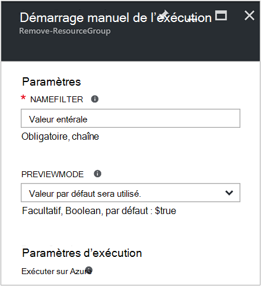
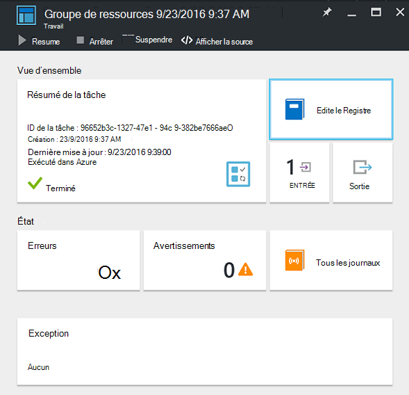
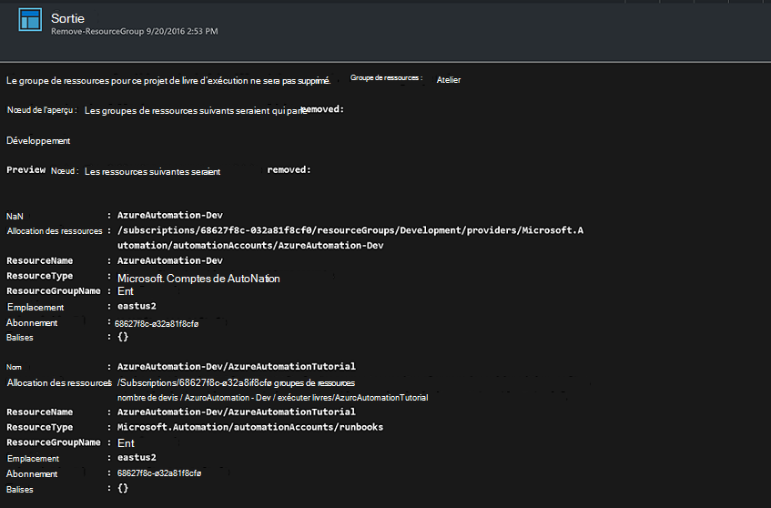

<properties
    pageTitle="Automatiser la suppression des groupes de ressources | Microsoft Azure"
    description="Version de flux de travail de PowerShell d’un scénario d’automatisation d’Azure, y compris les procédures opérationnelles pour supprimer tous les groupes de ressources dans votre abonnement."
    services="automation"
    documentationCenter=""
    authors="MGoedtel"
    manager="jwhit"
    editor=""
    />
<tags
    ms.service="automation"
    ms.workload="tbd"
    ms.tgt_pltfrm="na"
    ms.devlang="na"
    ms.topic="get-started-article"
    ms.date="09/26/2016"
    ms.author="magoedte"/>

# Scénario d’automatisation de Azure - automatiser la suppression des groupes de ressources

De nombreux clients de créer plus d’un groupe de ressources. Certaines peuvent être utilisées pour la gestion des applications de production, et d’autres peuvent être utilisées comme développement, de tests et de reclassement des environnements. Automatiser le déploiement de ces ressources est une chose, mais pouvoir retirer d’un groupe de ressources avec un clic sur le bouton est une autre. Vous pouvez simplifier cette tâche de gestion courante à l’aide de Automation d’Azure. Ceci est utile si vous travaillez avec un abonnement Azure qui a un plafond de dépenses via une offre des membres tels que MSDN ou le programme Microsoft Partner Network Cloud Essentials.

Ce scénario repose sur une procédure opérationnelle de PowerShell et est conçu pour supprimer un ou plusieurs groupes de ressources que vous spécifiez à partir de votre abonnement. Le paramètre par défaut de la procédure opérationnelle consiste à tester avant de continuer. Cela garantit que vous ne supprimez par inadvertance le groupe de ressources avant que vous êtes prêt à terminer cette procédure.   

## Le scénario de mise en route

Ce scénario se compose d’une procédure opérationnelle PowerShell que vous pouvez télécharger à partir de la [Galerie de PowerShell](https://www.powershellgallery.com/packages/Remove-ResourceGroup/1.0/DisplayScript). Vous pouvez également importer directement à partir de la [Galerie de procédure opérationnelle](automation-runbook-gallery.md) dans le portail Azure.  

Procédure opérationnelle | Description|
----------|------------|
Supprimer-ResourceGroup | Supprime un ou plusieurs groupes de ressources Azure et les ressources associées à partir de l’abonnement.  
 
Les paramètres d’entrée suivants sont définis pour cette procédure opérationnelle :

Paramètre | Description|
----------|------------|
NameFilter (obligatoire) | Spécifie un filtre de nom afin de limiter les groupes de ressources que vous avez l’intention de supprimer. Vous pouvez passer plusieurs valeurs à l’aide d’une liste séparée par des virgules. Le filtre n’est pas sensible à la casse et correspondre à n’importe quel groupe de ressources qui contient la chaîne.|
PreviewMode (facultatif) | Exécute la procédure opérationnelle pour afficher les groupes de ressources doit être supprimés, mais n’effectue aucune action. La valeur par défaut est **true** pour éviter la suppression accidentelle d’un ou plusieurs groupes de ressources sont passés à la procédure opérationnelle.  

## Installer et configurer ce scénario

### Conditions préalables

Cette procédure opérationnelle s’authentifie en utilisant le [compte d’Azure exécuter en tant que](automation-sec-configure-azure-runas-account.md).    

### Installer et publier les procédures opérationnelles

Après avoir téléchargé la procédure opérationnelle, vous pouvez l’importer dans les [procédures de procédure opérationnelle d’importation](automation-creating-importing-runbook.md#importing-a-runbook-from-a-file-into-Azure-Automation)à l’aide de la procédure. Publier la procédure opérationnelle après que qu’il a été importé avec succès dans votre compte d’Automation.

## À l’aide de la procédure opérationnelle

La procédure suivante vous guidera tout au long de l’exécution de cette procédure opérationnelle et les aide à que vous familiariser avec son fonctionnement. Vous allez uniquement tester la procédure opérationnelle dans cet exemple, pas vraiment supprimer le groupe de ressources.  

1. À partir du portail Azure, ouvrez votre compte d’Automation, puis cliquez sur **procédures opérationnelles**.
2. Sélectionnez la procédure de **Suppression-ResourceGroup** opérationnelle et cliquez sur **Démarrer**.
3. Lorsque vous démarrez la procédure opérationnelle, la lame de **Démarrer la procédure opérationnelle** s’ouvre et vous pouvez configurer les paramètres. Entrez les noms des groupes de ressources dans votre abonnement, vous pouvez utiliser pour tester et n’entraîne aucun dommage si accidentellement supprimé.  

    >[AZURE.NOTE] Assurez-vous que **Previewmode** a la valeur **true** pour éviter de supprimer les groupes de ressources sélectionné.  **Notez** que cette procédure opérationnelle ne supprime pas le groupe de ressources qui contient le compte d’Automation qui exécute cette procédure opérationnelle.  

4. Après avoir configuré le paramètre de toutes les valeurs, cliquez sur **OK**, et la procédure opérationnelle est en file d’attente pour exécution.  

Pour afficher les détails de la tâche de procédure opérationnelle **Supprimer-ResourceGroup** dans Azure portal, sélectionnez les **tâches** dans la procédure opérationnelle. La tâche récapitulative affiche les paramètres d’entrée et le flux de sortie en plus des informations générales sur la tâche et toutes les exceptions qui se sont produites.  .

Le **Résumé de la tâche** inclut des messages à partir de flux d’erreur, d’avertissement et la sortie. Sélectionnez **sortie** pour afficher les résultats détaillés de l’exécution de la procédure opérationnelle.  

## Étapes suivantes

- Pour commencer à créer votre propre procédure opérationnelle, reportez-vous à la section [Création ou importation d’une procédure opérationnelle dans Azure Automation](automation-creating-importing-runbook.md).
- Pour vous familiariser avec les procédures opérationnelles de flux de travail de PowerShell, voir [Ma première procédure de flux de travail de PowerShell opérationnelle](automation-first-runbook-textual.md).
