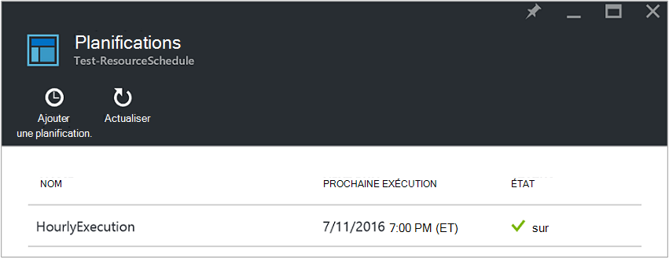
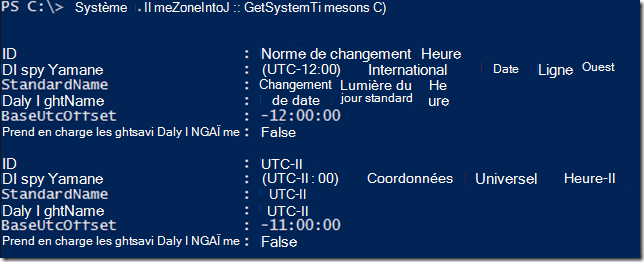
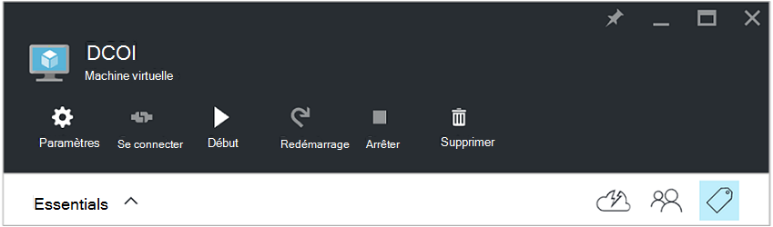
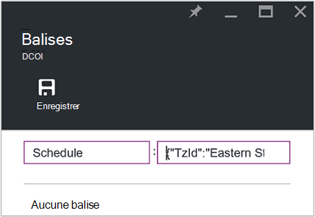
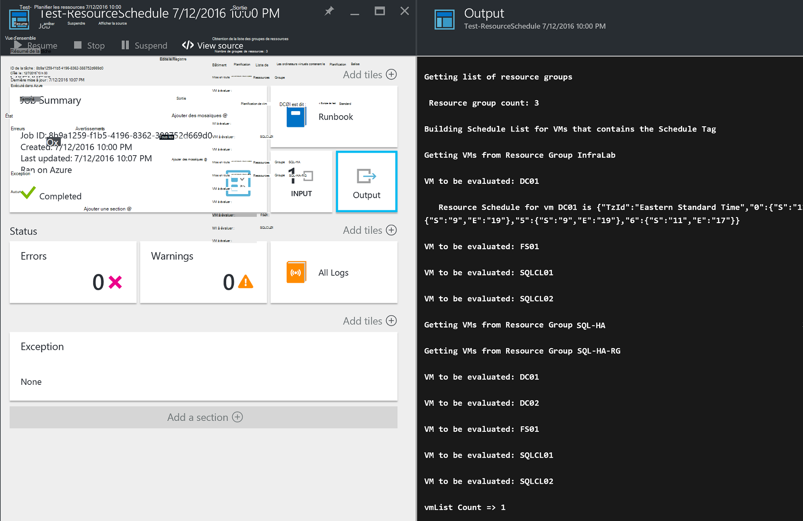

<properties
   pageTitle="À l’aide de balises de format JSON pour créer une planification pour Azure VM démarrage et d’arrêt | Microsoft Azure"
   description="Cet article explique comment utiliser des chaînes JSON sur les balises pour automatiser la planification d’arrêt et de démarrage de la machine virtuelle."
   services="automation"
   documentationCenter=""
   authors="MGoedtel"
   manager="jwhit"
   editor="tysonn" />
<tags
   ms.service="automation"
   ms.devlang="na"
   ms.topic="article"
   ms.tgt_pltfrm="na"
   ms.workload="infrastructure-services"
   ms.date="07/18/2016"
   ms.author="magoedte;paulomarquesc" />

# Scénario d’automatisation de Azure : à l’aide de balises de format JSON pour créer une planification pour Azure VM démarrage et d’arrêt

Les clients veulent souvent de planifier le démarrage et l’arrêt des machines virtuelles pour aider à réduire les coûts d’abonnement ou de prendre en charge les exigences commerciales et techniques.  

Le scénario suivant vous permet de configurer automatisé de démarrage et d’arrêt de vos ordinateurs virtuels à l’aide d’une balise appelée planification à un niveau de groupe de ressources ou machine virtuelle dans Azure. Cette planification peut être configurée avec un temps de démarrage et la durée de l’arrêt du dimanche au samedi.  

Nous n’avons pas certaines options de-l’emploi. Celles-ci comprennent :
-  [Définit de l’échelle de l’ordinateur virtuel](../virtual-machine-scale-sets/virtual-machine-scale-sets-overview.md) avec les paramètres d’échelle automatique qui vous permettent de mettre à l’échelle ou arrière.
- Service [DevTest Labs](../devtest-lab/devtest-lab-overview.md) , qui dispose d’une fonctionnalité intégrée de la planification des opérations de démarrage et d’arrêt.

Toutefois, ces options prennent uniquement en charge des scénarios spécifiques et ne peuvent pas être appliqués aux ordinateurs virtuels d’infrastructure-as-a-service (IaaS).   

Lorsque la balise Schedule est appliquée à un groupe de ressources, elle est également appliquée à tous les ordinateurs virtuels à l’intérieur de ce groupe de ressources. Si une planification est également directement appliquée à un ordinateur virtuel, la planification de la dernière est prioritaire dans l’ordre suivant :

1.  Calendrier appliqué à un groupe de ressources
2.  Calendrier appliqué à un groupe de ressources et de la machine virtuelle dans le groupe de ressources
3.  Calendrier appliqué à une machine virtuelle

Ce scénario essentiellement prend une chaîne JSON dans un format spécifié et l’ajoute en tant que la valeur d’une balise appelée planification. Une procédure opérationnelle répertorie tous les groupes de ressources et les machines virtuelles, puis identifie les planifications pour chaque machine virtuelle basée sur des scénarios répertoriés plus haut. Ensuite, il parcourt les ordinateurs virtuels qui ont des planifications attachées et évalue les actions à entreprendre. Par exemple, il détermine machines virtuelles doivent être arrêté, arrêter ou ignoré.

Ces procédures opérationnelles s’authentifier en utilisant le [compte d’Azure exécuter en tant que](../automation/automation-sec-configure-azure-runas-account.md).

## Télécharger les procédures opérationnelles pour le scénario

Ce scénario se compose des quatre procédures opérationnelles PowerShell de flux de travail que vous pouvez télécharger à partir de la [Galerie TechNet](https://gallery.technet.microsoft.com/Azure-Automation-Runbooks-84f0efc7) ou le référentiel de [GitHub](https://github.com/paulomarquesdacosta/azure-automation-scheduled-shutdown-and-startup) pour ce projet.

Procédure opérationnelle | Description
----------|----------
Test-ResourceSchedule | Vérifie chaque planification de machine virtuelle et effectue l’arrêt ou le démarrage, en fonction de la planification.
Ajouter-ResourceSchedule | Ajoute la balise de planification à un groupe de ressource ou de la machine virtuelle.
Mise à jour-ResourceSchedule | Modifie la balise de planification existante en le remplaçant par une nouvelle.
Supprimer-ResourceSchedule | Supprime la balise Schedule à partir d’un groupe de ressource ou de la machine virtuelle.

## Installer et configurer ce scénario

### Installer et publier les procédures opérationnelles

Après avoir téléchargé les procédures opérationnelles, vous pouvez les importer à l’aide de la procédure de [Création ou importer une procédure opérationnelle dans Azure Automation](automation-creating-importing-runbook.md#importing-a-runbook-from-a-file-into-Azure-Automation).  Publier chaque procédure opérationnelle après que qu’il a été importé avec succès dans votre compte d’Automation.

### Ajouter un calendrier pour la procédure opérationnelle Test-ResourceSchedule

Procédez comme suit pour activer la planification pour la procédure opérationnelle Test-ResourceSchedule. Il s’agit de la procédure opérationnelle qui vérifie les ordinateurs virtuels qui doit être démarrés, arrêtés ou laissées en l’état.

1. À partir du portail Azure, ouvrez votre compte d’Automation, puis cliquez sur la mosaïque de **procédures opérationnelles** .
2. Sur la lame de **Test-ResourceSchedule** , cliquez sur la mosaïque de **planifications** .
3. Sur la lame de **planifications** , cliquez sur **Ajouter un programme**.
4. Sur la lame de **planifications** , cliquez sur **le lien une planification pour votre procédure opérationnelle**. Sélectionnez **créer une nouvelle planification**.
5.  Sur la lame de **nouvelle planification** , tapez le nom de ce calendrier, par exemple : *HourlyExecution*.
6. Pour la planification de **début**, définir l’heure de début à un incrément d’heure.
7. Sélectionnez **récurrence**et pour **se reproduire à chaque intervalle**, sélectionnez **1 heure**.
8. Vérifiez que **définir l’expiration** est définie sur **non**, puis cliquez sur **créer** pour enregistrer votre nouvelle planification.
9. Sur la blade d’options de **Procédure opérationnelle de planification** , sélectionnez **les paramètres et les paramètres d’exécution**. De la lame de Test-ResourceSchedule **paramètres** , entrez le nom de votre abonnement dans le champ **SubscriptionName** .  Il s’agit du seul paramètre qui est requis pour la procédure opérationnelle.  Lorsque vous avez terminé, cliquez sur **OK**.  

La planification de procédure opérationnelle doit se présenter comme suit lorsqu’il est terminé :

 

## Format de la chaîne JSON

Cette solution fondamentalement prend un JSON de chaîne dans un format spécifié et l’ajoute en tant que la valeur d’une balise appelée planification. Une procédure opérationnelle répertorie tous les groupes de ressources et les machines virtuelles, puis identifie les planifications pour chaque ordinateur virtuel.

La procédure opérationnelle effectue une boucle sur les ordinateurs virtuels que vous avez attachées des planifications et vérifie les actions à effectuer. Voici un exemple de la façon dont les solutions doivent être formatées :

    {
       "TzId": "Eastern Standard Time",
        "0": {  
           "S": "11",
           "E": "17"
        },
        "1": {
           "S": "9",
           "E": "19"
        },
        "2": {
           "S": "9",
           "E": "19"
        },
    }

Voici des informations détaillées sur cette structure :

1. Le format de cette structure JSON est optimisé pour contourner la limite de 256 caractères d’une valeur de balise unique dans Azure.

2. *TzId* représente le fuseau horaire de l’ordinateur virtuel. Ce code peut être obtenu à l’aide de la classe TimeZoneInfo .NET dans une session PowerShell--**[System.TimeZoneInfo] :: GetSystemTimeZones()**.

    

    - Les jours ouvrés sont représentés par une valeur numérique égale à zéro à six. La valeur zéro correspond à dimanche.
    - L’heure de début est représentée avec l’attribut **S** , et sa valeur est dans un format de 24 heures.
    - L’heure de fin ou de l’arrêt est représentée avec l’attribut **E** , et sa valeur est dans un format de 24 heures.

    Si les attributs **S** et **E** ont la valeur zéro (0), la machine virtuelle restera dans son état actuel au moment de l’évaluation.   

3. Si vous souhaitez ignorer l’évaluation d’un jour spécifique de la semaine, ne pas ajouter une section pour ce jour de la semaine. Dans l’exemple suivant, seulement lundi est évalué et les autres jours de la semaine sont ignorés :

        {
          "TzId": "Eastern Standard Time",
           "1": {
             "S": "11",
             "E": "17"
           }
        }

## Les groupes de ressources de balise ou VMs

Pour arrêter les ordinateurs virtuels, vous devez baliser les ordinateurs virtuels ou des groupes de ressources dans lequel ils se trouvent. Les ordinateurs virtuels qui n’ont pas une balise de tableau ne sont pas évaluées. Par conséquent, ils ne sont pas démarrés ou arrêtés.

Il existe deux façons de groupes de ressources de balise ou des machines virtuelles grâce à cette solution. Vous pouvez le faire directement à partir du portail. Ou vous pouvez utiliser Add-ResourceSchedule, ResourceSchedule-mise à jour, les procédures opérationnelles de Remove-ResourceSchedule.

### Balise via le portail

Suivez ces étapes pour baliser un ordinateur virtuel ou un groupe de ressources dans le portail :

1. Aplatir la chaîne JSON et vérifiez qu’il n’existe pas d’espaces.  La chaîne JSON doit ressembler à ceci :

        {"TzId":"Eastern Standard Time","0":{"S":"11","E":"17"},"1":{"S":"9","E":"19"},"2": {"S":"9","E":"19"},"3":{"S":"9","E":"19"},"4":{"S":"9","E":"19"},"5":{"S":"9","E":"19"},"6":{"S":"11","E":"17"}}

2. Sélectionnez l’icône de **balise** pour un groupe de ressource ou machine virtuelle à appliquer de cette planification.

    
3. Les balises sont définies suivant une paire clé/valeur. Type **planifié** dans le champ de **clé** , puis collez la chaîne JSON dans le champ **valeur** . Cliquez sur **Enregistrer**. Votre nouvelle balise doit maintenant apparaître dans la liste des balises pour votre ressource.

### Balise à partir de PowerShell

Toutes les procédures opérationnelles d’importées contiennent des informations d’aide au début du script qui décrit comment exécuter les procédures opérationnelles directement à partir de PowerShell. Vous pouvez appeler les procédures opérationnelles Add-ScheduleResource et ScheduleResource de la mise à jour à partir de PowerShell. Pour cela, vous devez en passant les paramètres requis qui vous permettent de créer ou de mettre à jour de la balise de planification sur un groupe de ressource ou machine virtuelle à l’extérieur du portail.  

Pour créer, ajouter et supprimer des balises via PowerShell, vous devez tout d’abord [configurer l’environnement PowerShell pour Azure](../powershell-install-configure.md). Une fois l’installation terminée, vous pouvez procéder aux étapes suivantes.

### Créer une balise schedule avec PowerShell

1. Ouvrez une session PowerShell. Puis utilisez l’exemple suivant s’authentifier avec votre compte Exécuter en tant qu’et pour spécifier un abonnement :   

        Conn = Get-AutomationConnection -Name AzureRunAsConnection
        Add-AzureRMAccount -ServicePrincipal -Tenant $Conn.TenantID `
        -ApplicationId $Conn.ApplicationID -CertificateThumbprint $Conn.CertificateThumbprint
        Select-AzureRmSubscription -SubscriptionName "MySubscription"

2. Définir une table de hachage de planification. Voici un exemple de la manière dont elle doit être créée :

        $schedule= @{ "TzId"="Eastern Standard Time"; "0"= @{"S"="11";"E"="17"};"1"= @{"S"="9";"E"="19"};"2"= @{"S"="9";"E"="19"};"3"= @{"S"="9";"E"="19"};"4"= @{"S"="9";"E"="19"};"5"= @{"S"="9";"E"="19"};"6"= @{"S"="11";"E"="17"}}

3. Définissez les paramètres requis par la procédure opérationnelle. Dans l’exemple suivant, nous prévoyons une machine virtuelle :

        $params = @{"SubscriptionName"="MySubscription";"ResourceGroupName"="ResourceGroup01"; `
        "VmName"="VM01";"Schedule"=$schedule}

    Si vous êtes balisage d’un groupe de ressources, supprimez le paramètre *VMName* à partir de la table de hachage $params comme suit :

        $params = @{"SubscriptionName"="MySubscription";"ResourceGroupName"="ResourceGroup01"; `
        "Schedule"=$schedule}

4. Exécutez la procédure opérationnelle Add-ResourceSchedule avec les paramètres suivants pour créer la balise Schedule :

        Start-AzureRmAutomationRunbook -Name "Add-ResourceSchedule" -Parameters $params `
        -AutomationAccountName "AutomationAccount" -ResourceGroupName "ResourceGroup01"

5. Pour mettre à jour d’un groupe de ressources ou de la balise de l’ordinateur virtuel, exécutez la procédure de **Mise à jour-ResourceSchedule** opérationnelle avec les paramètres suivants :

        Start-AzureRmAutomationRunbook -Name "Update-ResourceSchedule" -Parameters $params `
        -AutomationAccountName "AutomationAccount" -ResourceGroupName "ResourceGroup01"

### Supprimer une balise de planification avec PowerShell

1. Ouvrez une session PowerShell et exécutez la commande suivante pour authentifier avec votre compte Exécuter en tant qu’et pour sélectionner et spécifier un abonnement :

        Conn = Get-AutomationConnection -Name AzureRunAsConnection
        Add-AzureRMAccount -ServicePrincipal -Tenant $Conn.TenantID `
        -ApplicationId $Conn.ApplicationID -CertificateThumbprint $Conn.CertificateThumbprint
        Select-AzureRmSubscription -SubscriptionName "MySubscription"

2. Définissez les paramètres requis par la procédure opérationnelle. Dans l’exemple suivant, nous prévoyons une machine virtuelle :

        $params = @{"SubscriptionName"="MySubscription";"ResourceGroupName"="ResourceGroup01" `
        ;"VmName"="VM01"}

    Si vous supprimez une balise à partir d’un groupe de ressources, supprimez le paramètre *VMName* à partir de la table de hachage $params comme suit :

        $params = @{"SubscriptionName"="MySubscription";"ResourceGroupName"="ResourceGroup01"}

3. Exécutez la procédure de suppression-ResourceSchedule opérationnelle pour supprimer la balise de planification :

        Start-AzureRmAutomationRunbook -Name "Remove-ResourceSchedule" -Parameters $params `
        -AutomationAccountName "AutomationAccount" -ResourceGroupName "ResourceGroup01"

4. Pour mettre à jour d’un groupe de ressources ou de la balise de l’ordinateur virtuel, exécutez la procédure de suppression-ResourceSchedule opérationnelle avec les paramètres suivants :

        Start-AzureRmAutomationRunbook -Name "Remove-ResourceSchedule" -Parameters $params `
        -AutomationAccountName "AutomationAccount" -ResourceGroupName "ResourceGroup01"

>[AZURE.NOTE] Nous vous recommandons de surveiller proactivement ces procédures opérationnelles (et les États de la machine virtuelle) pour vérifier que vos ordinateurs virtuels sont en cours d’arrêt vers le bas et démarré en conséquence.  

Pour afficher les détails de la tâche de procédure opérationnelle du Test-ResourceSchedule dans le portail Azure, sélectionnez la vignette de **travaux** de la procédure opérationnelle. La tâche récapitulative affiche les paramètres d’entrée et le flux de sortie, en plus des informations générales sur la tâche et toutes les exceptions si elles se produisaient.  

Le **Résumé de la tâche** inclut des messages à partir de flux d’erreur, d’avertissement et la sortie. Sélectionnez la mosaïque de **sortie** pour afficher les résultats détaillés de l’exécution de la procédure opérationnelle.

  

## Étapes suivantes

-  Pour vous familiariser avec les procédures opérationnelles de flux de travail de PowerShell, voir [Ma première procédure de flux de travail de PowerShell opérationnelle](automation-first-runbook-textual.md).
-  Pour plus d’informations sur les types de procédure opérationnelle et de leurs avantages et leurs limites, consultez [types de procédure opérationnelle Azure Automation](automation-runbook-types.md).
-  Pour plus d’informations sur le script PowerShell prend en charge les fonctionnalités, consultez [script PowerShell natif prend en charge dans Azure Automation](https://azure.microsoft.com/blog/announcing-powershell-script-support-azure-automation-2/).
-  Pour plus d’informations sur l’enregistrement de procédure opérationnelle et de sortie, consultez la [sortie de procédure opérationnelle et messages dans Azure Automation](automation-runbook-output-and-messages.md).
-  Pour plus d’informations sur un compte Azure exécuter en tant qu’et comment authentifier les procédures opérationnelles en l’utilisant, consultez les [procédures opérationnelles d’authentifier avec Azure exécuter en tant que compte](../automation/automation-sec-configure-azure-runas-account.md).
