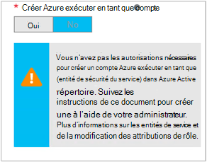

<properties
   pageTitle="Configurer le compte d’utilisateur d’AD Azure | Microsoft Azure"
   description="Cet article décrit comment configurer les informations d’identification du compte utilisateur d’AD Azure pour les procédures opérationnelles dans Automation Azure pour s’authentifier auprès de ARM et ASM."
   services="automation"
   documentationCenter=""
   authors="MGoedtel"
   manager="jwhit"
   editor="tysonn"
   keywords="compte d’utilisateur ad Azure annuaire utilisateur, azure service gestion, azure" />
<tags
   ms.service="automation"
   ms.devlang="na"
   ms.topic="get-started-article"
   ms.tgt_pltfrm="na"
   ms.workload="infrastructure-services"
   ms.date="09/12/2016"
   ms.author="magoedte" />

# Authentifier les procédures opérationnelles avec le Gestionnaire de ressources et de gestion des services Azure

Cet article décrit les étapes que vous devez effectuer pour configurer un compte d’utilisateur d’AD Azure pour les procédures opérationnelles d’Azure Automation en cours d’exécution par rapport aux ressources Azure Service Management (ASM) ou Azure Resource Manager (ARM).  Alors que le problème persiste une identité d’authentification pris en charge pour votre ARM en fonction des procédures opérationnelles, la méthode recommandée est à l’aide du nouveau compte Azure exécuter en tant que.       

## Créer un nouvel utilisateur Active Directory de Azure

1. Connectez-vous au portail Azure classique comme un administrateur du service pour l’abonnement Azure que vous souhaitez gérer.
2. Sélectionnez **Active Directory**et sélectionnez le nom de l’annuaire de votre organisation.
3. Sélectionnez l’onglet **utilisateurs** , puis, dans la zone commande, sélectionnez **Ajouter un utilisateur**.
4. Sur la page de **nous dire sur cet utilisateur** , sous **Type d’utilisateur**, sélectionnez **nouvel utilisateur de votre organisation**.
5. Entrez un nom d’utilisateur.  
6. Sélectionnez le nom du répertoire associé à votre abonnement Azure sur la page Active Directory.
7. Sur la page **profil utilisateur** , fournir un premier et dernier nom, un nom convivial et utilisateur dans la liste des **rôles** .  Ne pas **Activer l’authentification à plusieurs facteurs**.
8. Notez le nom complet de l’utilisateur et mot de passe temporaire.
9. Sélectionnez **Paramètres > administrateurs > Ajouter**.
10. Tapez le nom complet de l’utilisateur que vous avez créé.
11. Sélectionnez l’abonnement que vous souhaitez gérer.
12. Session en dehors d’Azure, puis ouvrez précédent avec le compte que vous venez de créer. Vous devrez modifier le mot de passe de l’utilisateur.

## Créer un compte d’Automation dans portail classique d’Azure
Dans cette section, vous allez effectuer les étapes suivantes pour créer un nouveau compte Azure Automation dans le portail Azure qui sera utilisé avec les procédures opérationnelles que la gestion des ressources en mode ASM et ARM.  

>[AZURE.NOTE] Comptes d’Automation créés avec le portail classique Azure peuvent être gérés par le classique Azure et Azure Portal et un jeu d’applets de commande. Une fois le compte créé, il ne fait aucune différence comment créer et gérer des ressources au sein du compte. Si vous envisagez de continuer à utiliser le portail classique d’Azure, puis vous devez utiliser à la place le portail Azure pour créer tous les comptes d’Automation.

1. Connectez-vous au portail Azure classique comme un administrateur du service pour l’abonnement Azure que vous souhaitez gérer.
2. Sélectionnez **Automation**.
3. Sur la page **d’automatisation** , sélectionnez **créer un compte d’Automation**.
4. Dans la zone **créer un compte d’Automation** , tapez un nom pour votre nouveau compte Automation et sélectionnez une **région** dans la liste déroulante.  
5. Cliquez sur **OK** pour accepter les paramètres et créer le compte.
6. Après sa création qu’il apparaît sur la page de **l’Automation** .
7. Cliquez sur le compte et il vous apportera à la page de tableau de bord.  
8. Sur la page de tableau de bord de Automation, sélectionnez **ressources**.
9. Sur la page **ressources** , sélectionnez **Ajouter des paramètres** , située au bas de la page.
10. Dans la page **Ajouter des paramètres** , sélectionnez **Ajouter les informations d’identification**.
11. Dans la page **Définir les informations d’identification** , sélectionnez les **Informations d’identification de Windows PowerShell** à partir de la liste déroulante **Type d’informations d’identification** et fournissez un nom pour les informations d’identification.
12. Sur le type de page suivant **Définissent les informations d’identification** dans le nom d’utilisateur du compte d’utilisateur AD créé plus haut dans le champ **Nom d’utilisateur** et le mot de passe dans les champs **mot de passe** et **Confirmer le mot de passe** . Cliquez sur **OK** pour enregistrer vos modifications.

## Créer un compte d’Automation dans le portail Azure

Dans cette section, vous allez effectuer les étapes suivantes pour créer un nouveau compte Azure Automation dans le portail Azure qui seront utilisés avec vos procédures opérationnelles de gestion des ressources en mode ARM.  

1. Connectez-vous au portail Azure comme un administrateur du service pour l’abonnement Azure que vous souhaitez gérer.
2. Sélectionnez les **comptes de l’Automation**.
3. Dans la lame comptes d’Automation, cliquez sur **Ajouter**. 
2. De la lame **d’Ajouter un compte de Automation** , dans la zone **nom** , tapez un nom pour votre nouveau compte d’Automation.
5. Si vous avez plus d’un abonnement, spécifiez l’un pour le nouveau compte, ainsi qu’un **groupe de ressources** de nouveau ou existant et un **emplacement**de centre de données Azure.
3. Sélectionnez la valeur **non** pour l’option **créer Azure exécuter en tant que compte** , puis cliquez sur le bouton **créer** .  

    >[AZURE.NOTE] Si vous choisissez de ne pas créer le compte Exécuter en tant qu’en sélectionnant l’option **No**, s’affiche avec un message d’avertissement de la lame **d’Ajouter un compte de Automation** .  Tandis que le compte est créé et affecté au rôle de **collaborateur** dans l’abonnement, il n’aura pas une identité d’authentification correspondant au sein de votre service d’annuaire abonnements et par conséquent, aucun accès aux ressources dans votre abonnement.  Cela empêchera les procédures opérationnelles faisant référence à ce compte d’être en mesure d’authentifier et d’effectuer des tâches sur des ressources ARM.

    

4. Pendant que Azure crée le compte de l’Automation, vous pouvez suivre la progression sous **Notifications** à partir du menu.

Lors de la création de l’information d’identification terminée, vous devrez ensuite créer une ressource d’informations d’identification pour associer le compte d’Automation avec le compte d’utilisateur AD créé précédemment.  Gardez à l’esprit, nous avons créé uniquement le compte de l’Automation et il n’est pas associé à une identité d’authentification.  Effectuez les étapes décrites dans les [ressources d’informations d’identification dans Azure Automation article](../automation/automation-credentials.md#creating-a-new-credential) et entrez la valeur **nom d’utilisateur** au format **domaine\utilisateur**.

## Utilisez les informations d’identification dans une procédure opérationnelle

Vous pouvez récupérer les informations d’identification dans une procédure opérationnelle à l’aide de l’activité de [Get-AutomationPSCredential](http://msdn.microsoft.com/library/dn940015.aspx) et ensuite l’utiliser avec [Add-AzureAccount](http://msdn.microsoft.com/library/azure/dn722528.aspx) pour vous connecter à votre abonnement Azure. Si les informations d’identification sont un administrateur de plusieurs abonnements Azure, vous devez également utiliser [Select-AzureSubscription](http://msdn.microsoft.com/library/dn495203.aspx) pour spécifier celle qui convient. Ceci est illustré dans l’exemple de Windows PowerShell ci-dessous qui apparaissent en haut de la plupart des procédures opérationnelles de Azure Automation.

    $cred = Get-AutomationPSCredential –Name "myuseraccount.onmicrosoft.com"
    Add-AzureAccount –Credential $cred
    Select-AzureSubscription –SubscriptionName "My Subscription"

Vous devez répéter ces lignes après tous [les points de contrôle](http://technet.microsoft.com/library/dn469257.aspx#bk_Checkpoints) dans votre procédure opérationnelle. Si la procédure opérationnelle est interrompu, puis reprend un autre travailleur, il sera nécessaire effectuer l’authentification à nouveau.

## Étapes suivantes
* Passez en revue la procédure opérationnelle de différents types et les étapes de la création de vos propres procédures opérationnelles à partir de l’article suivant de [types de procédure opérationnelle Azure Automation](../automation/automation-runbook-types.md)
