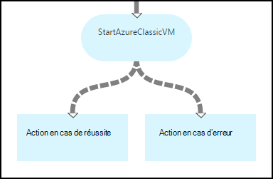
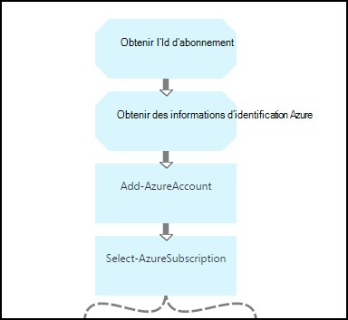
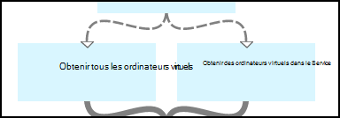
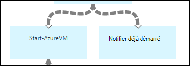
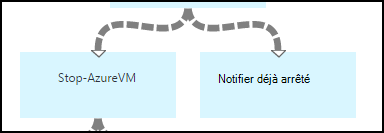
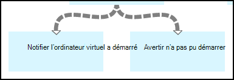
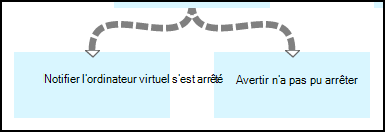

<properties 
    pageTitle="Démarrage et arrêt des machines virtuelles - graphique | Microsoft Azure"
    description="Version de Workflow de PowerShell de scénario Automatisation d’Azure, y compris les procédures opérationnelles pour le démarrage et l’arrêt des machines virtuelles classiques."
    services="automation"
    documentationCenter=""
    authors="mgoedtel"
    manager="jwhit"
    editor="tysonn" />
<tags 
    ms.service="automation"
    ms.devlang="na"
    ms.topic="article"
    ms.tgt_pltfrm="na"
    ms.workload="infrastructure-services"
    ms.date="07/06/2016"
    ms.author="bwren" />

# Scénario d’automatisation Azure - démarrage et arrêt des machines virtuelles

Ce scénario d’automatisation de Azure inclut des procédures opérationnelles pour le démarrage et l’arrêt des machines virtuelles classiques.  Vous pouvez utiliser ce scénario pour une des opérations suivantes :  

- Utilisez les procédures opérationnelles sans modification dans votre propre environnement. 
- Modifier les procédures opérationnelles pour exécuter des fonctionnalités personnalisées.  
- Appelez les procédures opérationnelles à partir d’une autre procédure d’opérationnelle dans le cadre d’une solution globale. 
- Utilisez les procédures opérationnelles sous forme de didacticiels pour apprendre les concepts de création de procédure opérationnelle. 

> [AZURE.SELECTOR]
- [Graphique](automation-solution-startstopvm-graphical.md)
- [Flux de travail de PowerShell](automation-solution-startstopvm-psworkflow.md)

Il s’agit de la version graphique de procédure opérationnelle de ce scénario. Il est également disponible à l’aide de [procédures opérationnelles de flux de travail de PowerShell](automation-solution-startstopvm-psworkflow.md).

## Le scénario de mise en route

Ce scénario se compose de deux deux procédures opérationnelles graphiques que vous pouvez télécharger à partir des liens suivants.  Consultez la [version de flux de travail PowerShell](automation-solution-startstopvm-psworkflow.md) de ce scénario, les liens vers les procédures opérationnelles de flux de travail de PowerShell.

| Procédure opérationnelle | Lien | Type de | Description |
|:---|:---|:---|:---|
| StartAzureClassicVM | [Démarrez la procédure opérationnelle de graphique Azure VM classique](https://gallery.technet.microsoft.com/scriptcenter/Start-Azure-Classic-VM-c6067b3d) | Graphique | Démarre toutes les machines virtuelles classiques dans un abonnement Azure ou tous les ordinateurs virtuels avec un nom de service particulier. |
| StopAzureClassicVM | [Arrêter la procédure opérationnelle de graphique Azure VM classique](https://gallery.technet.microsoft.com/scriptcenter/Stop-Azure-Classic-VM-397819bd) | Graphique | Arrête tous les ordinateurs virtuels dans un compte automation ou tous les ordinateurs virtuels avec un nom de service particulier.  |

## Installation et configuration du scénario

### 1. Installez les procédures opérationnelles

Après avoir téléchargé les procédures opérationnelles, vous pouvez les importer dans les [procédures de procédure opérationnelle de graphique](automation-graphical-authoring-intro.md#graphical-runbook-procedures)à l’aide de la procédure.

### 2. Vérifiez la description et les exigences
Les procédures opérationnelles incluent une activité appelée **Lisez-moi** qui inclut une description et les ressources requises.  Vous pouvez afficher ces informations en sélectionnant l’activité **Read Me** , puis le paramètre de **Script de flux de travail** .  Vous pouvez également obtenir les mêmes informations à partir de cet article. 

### 3. Configuration d’immobilisations
Les procédures opérationnelles nécessitent les actifs suivants que vous devez créer et remplir avec les valeurs appropriées.  Les noms sont par défaut.  Vous pouvez utiliser immobilisations avec des noms différents si vous spécifiez les noms dans les [paramètres d’entrée](#using-the-runbooks) lorsque vous démarrez la procédure opérationnelle.

| Type d’immobilisation | Nom par défaut | Description |
|:---|:---|:---|:---|
| [Informations d’identification](automation-credentials.md) | AzureCredential | Contient les informations d’identification d’un compte ayant les autorisations pour démarrer et arrêter des ordinateurs virtuels dans l’abonnement Azure.  |
| [Variable](automation-variables.md) | AzureSubscriptionId | Contient l’ID d’abonnement de votre abonnement Azure. |

## À l’aide du scénario

### Paramètres

Les procédures opérationnelles chaque ont des [paramètres d’entrée](automation-starting-a-runbook.md#runbook-parameters)suivants.  Vous devez fournir des valeurs pour les paramètres obligatoires et pouvez éventuellement fournir des valeurs pour d’autres paramètres en fonction de vos besoins.

| Paramètre | Type de | Obligatoire | Description |
|:---|:---|:---|:---|
| ServiceName | chaîne | N° | Si une valeur est fournie, toutes les machines virtuelles portant le même nom de service sont démarrés ou arrêtés.  Si aucune valeur n’est fournie, tous les ordinateurs virtuels classiques dans l’abonnement Azure sont démarrés ou arrêtés. |
| AzureSubscriptionIdAssetName | chaîne | N° | Contient le nom de [variable actif](#installing-and-configuring-the-scenario) qui contient l’ID d’abonnement de votre abonnement Azure.  Si vous ne spécifiez aucune valeur, c’est *AzureSubscriptionId* qui est utilisée.  |
| AzureCredentialAssetName | chaîne | N° | Contient le nom de [ressource d’informations d’identification](#installing-and-configuring-the-scenario) qui contient les informations d’identification pour la procédure opérationnelle à utiliser.  Si vous ne spécifiez aucune valeur, c’est *AzureCredential* qui est utilisée.  |

### Démarrer les procédures opérationnelles

Vous pouvez utiliser une des méthodes de [démarrage d’une procédure opérationnelle dans Azure Automation](automation-starting-a-runbook.md) Démarrer, des procédures opérationnelles dans cet article.

Les exemples de commandes suivant utilise Windows PowerShell pour exécuter **StartAzureClassicVM** pour démarrer tous les ordinateurs virtuels avec le nom du service *MyVMService*.

    $params = @{"ServiceName"="MyVMService"}
    Start-AzureAutomationRunbook –AutomationAccountName "MyAutomationAccount" –Name "StartAzureClassicVM" –Parameters $params

### Sortie

Les procédures opérationnelles seront [un message de sortie](automation-runbook-output-and-messages.md) pour chaque ordinateur virtuel en indiquant ou non de l’instruction de départ ou d’arrêt a été envoyée avec succès.  Vous pouvez rechercher une chaîne spécifique dans la sortie pour déterminer le résultat de chaque procédure opérationnelle.  Les chaînes de sortie possibles sont répertoriés dans le tableau suivant.

| Procédure opérationnelle | Condition | Message |
|:---|:---|:---|
| StartAzureClassicVM | Machine virtuelle est déjà en cours d’exécution.  | MyVM est déjà en cours d’exécution. |
| StartAzureClassicVM | Demande de démarrage de machine virtuelle envoyé avec succès | MyVM a été démarré. |
| StartAzureClassicVM | Échec de la demande de démarrage de la machine virtuelle  | MyVM n’a pas pu démarrer |
| StopAzureClassicVM | Machine virtuelle est déjà en cours d’exécution.  | MyVM est déjà arrêté. |
| StopAzureClassicVM | Demande de démarrage de machine virtuelle envoyé avec succès | MyVM a été démarré. |
| StopAzureClassicVM | Échec de la demande de démarrage de la machine virtuelle  | MyVM n’a pas pu démarrer |

Voici une image de l’utilisation de la **StartAzureClassicVM** comme une [procédure opérationnelle d’enfant](automation-child-runbooks.md) dans un graphique exemple de procédure opérationnelle.  Cette méthode utilise les liens conditionnels dans le tableau suivant.

| Lien | Critères |
|:---|:---|
| Lien de réussite | $ActivityOutput ['StartAzureClassicVM']-comme «\* a été démarré. »    |
| Lien vers les erreurs   | $ActivityOutput ['StartAzureClassicVM']-notlike »\* a été démarré. » |

## Analyse détaillée

Voici une description détaillée de la procédures opérationnelles dans ce scénario.  Vous pouvez utiliser ces informations pour personnaliser les procédures opérationnelles ou simplement pour obtenir des informations à partir de ceux-ci pour la création de vos propres scénarios d’automatisation.
 

### Authentification

La procédure opérationnelle commence avec les activités pour définir les [informations d’identification](automation-configuring.md#configuring-authentication-to-azure-resources) et un abonnement Azure qui sera utilisé pour le reste de la procédure opérationnelle.

Les activités de deux premières, **Obtenir des Id d’abonnement** et d' **Obtenir les informations d’identification Azure**, récupérer les [actifs](#installing-the-runbook) qui sont utilisés par les deux activités.  Ces activités peuvent spécifier directement les actifs, mais dont ils ont besoin les noms de ressources.  Dans la mesure où nous sommes permettant à l’utilisateur de spécifier les noms dans les [paramètres d’entrée](#using-the-runbooks), nous avons besoin de ces activités pour récupérer les éléments avec un nom spécifié par le paramètre d’entrée.

**Ajouter-AzureAccount** définit les informations d’identification qui seront utilisées pour le reste de la procédure opérationnelle.  La ressource d’informations d’identification qu’il récupère **d’Obtenir les informations d’identification Azure** doit avoir accès pour démarrer et arrêter des ordinateurs virtuels dans l’abonnement Azure.  L’abonnement qui est utilisé est sélectionné en **Sélectionnez-AzureSubscription** qui utilise l’Id de **l’Id d’abonnement obtenir**d’abonnement.

### Obtenir des machines virtuelles

La procédure opérationnelle doit déterminer les ordinateurs virtuels qui travaillera avec et ils sont déjà démarrés ou arrêtés (selon la procédure opérationnelle).   Une des deux activités récupère les ordinateurs virtuels.  **Obtenir les ordinateurs virtuels dans le Service** s’exécutera si le paramètre d’entrée de *ServiceName* pour la procédure opérationnelle contient une valeur.  **Obtenir tous les ordinateurs de virtuels** s’exécutera si le paramètre d’entrée de *ServiceName* pour la procédure opérationnelle ne contient-elle pas de valeur.  Cette logique est effectuée par les liens conditionnels précédant chaque activité.

Les deux activités utiliser l’applet de commande **Get-AzureVM** .  **Obtenir tous les ordinateurs de virtuels** utilise le paramètre **ListAllVMs** pour renvoyer tous les ordinateurs virtuels.  **Obtenir les ordinateurs virtuels dans le Service** utilise le jeu de paramètres **GetVMByServiceAndVMName** et fournit le paramètre d’entrée **ServiceName** du paramètre **ServiceName** .  

### Fusionner les machines virtuelles

L’activité de **Fusion de machines virtuelles** est nécessaire de fournir une entrée pour **Démarrer-AzureVM** dont a besoin le nom et le nom de service de la vm(s) pour démarrer.  Cette entrée peut provenir soit **Obtenir tous les ordinateurs de virtuels** ou **Obtenir les ordinateurs virtuels dans le Service**, mais **Début-AzureVM** ne pouvez spécifier qu’une seule activité de son entrée.   

Le scénario consiste à créer des **Ordinateurs virtuels de fusion** qui s’exécute l’applet de commande **Write-Output** .  Le paramètre **d’objet d’entrée** de cette applet de commande est une Expression de PowerShell qui combine l’entrée des deux activités précédentes.  Un seul de ces activités est exécuté, un jeu de résultat est prévu uniquement.  **Démarrer-AzureVM** pouvez utiliser cette sortie pour ses paramètres d’entrée. 

### Démarrer/arrêter les machines virtuelles

 

Selon la procédure opérationnelle, essaient des activités suivantes démarrer ou arrêter la procédure opérationnelle à l’aide de **Démarrer-AzureVM** ou **AzureVM à l’arrêt**.  Dans la mesure où l’activité est précédée par un lien de pipeline, elle sera exécutée une fois pour chaque objet retourné à partir **d’Ordinateurs virtuels de fusion**.  Le lien est conditionnel afin que l’activité s’exécute uniquement si la *RunningState* de l’ordinateur virtuel est *arrêté* pour **Démarrer-AzureVM** et *démarré* pour **Arrêter-AzureVM**. Si cette condition n’est pas remplie, **Notifier a déjà été démarré** ou **Notifier a déjà été arrêté** est exécuté pour envoyer un message à l’aide de **Write-Output**.

### Envoyer la sortie

 

La dernière étape de la procédure opérationnelle est pour envoyer le résultat si la demande de démarrage ou d’arrêt pour chaque machine virtuelle a été soumise avec succès. Il y a une nouvelle activité de **Write-Output** pour chacun, et nous savoir laquelle exécuter avec liens conditionnelles.  **Démarrage de machine virtuelle avertir** ou **Notifier un arrêté de machine virtuelle** est exécutée si *OperationStatus* est *réussi*.  Si *OperationStatus* est une autre valeur, la **Notification a échoué pour démarrer** ou la **Notification n’a pas pu arrêter** est exécuté.

## Étapes suivantes

- [Création graphique dans Azure Automation](automation-graphical-authoring-intro.md)
- [Procédures opérationnelles des enfants dans Azure Automation](automation-child-runbooks.md) 
- [Sortie de procédure opérationnelle et messages dans Azure Automation](automation-runbook-output-and-messages.md)