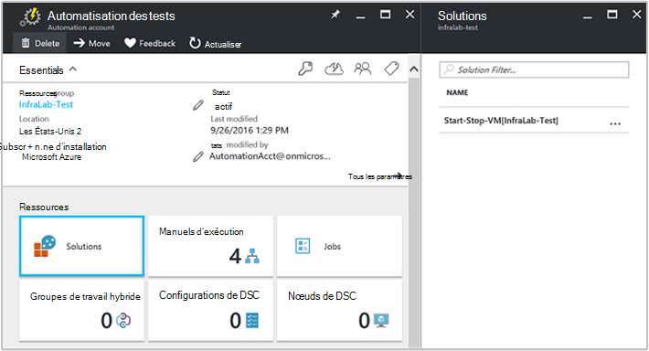

<properties
    pageTitle="Machines virtuelles de démarrage / d’arrêt pendant les heures creuses [Aperçu] Solution | Microsoft Azure"
    description="Les solutions de gestion de l’ordinateur virtuel démarre et arrête vos ordinateurs virtuels de gestionnaire de ressources Azure selon un calendrier et surveiller de manière proactive à partir d’Analytique de journal."
    services="automation"
    documentationCenter=""
    authors="MGoedtel"
    manager="jwhit"
    editor=""
    />
<tags
    ms.service="automation"
    ms.workload="tbd"
    ms.tgt_pltfrm="na"
    ms.devlang="na"
    ms.topic="get-started-article"
    ms.date="10/07/2016"
    ms.author="magoedte"/>

# Machines virtuelles de Start/Stop au cours de la solution d’heures creuses [Aperçu] dans Automation

Les ordinateurs virtuels de Start/Stop au cours de la solution d’heures creuses [Aperçu] démarre et s’arrête de vos ordinateurs virtuels de gestionnaire de ressources Azure sur une planification définie par l’utilisateur et fournit un aperçu de la réussite des tâches Automation de démarrage et d’arrêt de vos machines virtuelles avec OMS journal Analytique.  

## Conditions préalables

- Les procédures opérationnelles de travail avec un [compte d’Azure exécuter en tant que](automation-sec-configure-azure-runas-account.md).  Le compte Exécuter en tant qu’est la méthode d’authentification recommandée dans la mesure où il utilise l’authentification par certificat au lieu d’un mot de passe peut expirer ou changent fréquemment.  

- Cette solution peut uniquement gérer les ordinateurs virtuels qui sont dans le même abonnement et le groupe de ressources qu’où réside le compte de l’Automation.  

- Cette solution déploie uniquement dans les régions Azure suivantes - sud-est de l’Australie, américains Extrême-Orient, Asie du Sud-est et Europe de l’ouest.  Les procédures opérationnelles que gérer la planification de la machine virtuelle peut cibler des ordinateurs virtuels dans une région.  

- Pour envoyer des notifications par courrier électronique lorsque les procédures opérationnelles VM de début et de fin est terminé, un abonnement à Office 365 professionnelles est requis.  

## Composants de la solution

Cette solution se compose des ressources suivantes qui seront importés et ajoutés à votre compte d’Automation.

### Procédures opérationnelles

Procédure opérationnelle | Description|
--------|------------|
CleanSolution MS-gestion des machines virtuelles | Cette procédure opérationnelle va supprimer tout le contenu des ressources et des planifications de lorsque vous accédez à supprimer la solution de votre abonnement.|  
SendMailO365 MS-gestion | Cette procédure opérationnelle envoie un e-mail via Office 365 Exchange.|
StartByResourceGroup MS-gestion des machines virtuelles | Cette procédure opérationnelle est censé démarrer les ordinateurs virtuels (à la fois standard et ARM en fonction des ordinateurs virtuels) qui se trouve dans une liste donnée de groupes de ressources Azure.
StopByResourceGroup MS-gestion des machines virtuelles | Cette procédure opérationnelle est censé arrêter les machines virtuelles (à la fois standard et ARM en fonction des ordinateurs virtuels) qui se trouve dans une liste donnée de groupes de ressources Azure.|
 

### Variables

Variable | Description|
---------|------------|
**SendMailO365 MS-gestion** Procédure opérationnelle ||
SendMailO365-IsSendEmail-MS-gestion | Spécifie si StartByResourceGroup MS-gestion des machines virtuelles et les procédures opérationnelles de StopByResourceGroup-MS-gestion-VM peut envoyer la notification par courrier électronique à la fin.  Sélectionnez **True** pour activer et **False** pour désactiver les alertes par e-mail. Valeur par défaut est **False**.| 
**StartByResourceGroup MS-gestion des machines virtuelles** Procédure opérationnelle ||
StartByResourceGroup-ExcludeList-MS-gestion-VM | Entrez des noms de machine virtuelle doit être exclu d’une opération de gestion ; Séparez les noms à l’aide de point-virgule ( ;). Les valeurs sont sensibles à la casse et le caractère générique (astérisque) est pris en charge.|
StartByResourceGroup-SendMailO365-EmailBodyPreFix-MS-gestion | Texte qui peut être ajoutée au début du corps du message de courrier électronique.|
StartByResourceGroup-SendMailO365-EmailRunBookAccount-MS-gestion | Spécifie le nom du compte qui contient la procédure opérationnelle E-mail Automation.  **Ne modifiez pas cette variable.**|
StartByResourceGroup-SendMailO365-EmailRunbookName-MS-gestion | Spécifie le nom de la procédure opérationnelle d’e-mail.  Il est utilisé par la StartByResourceGroup MS-gestion des machines virtuelles et les procédures opérationnelles de StopByResourceGroup-MS-gestion-VM pour envoyer un e-mail.  **Ne modifiez pas cette variable.**|
StartByResourceGroup-SendMailO365-EmailRunbookResourceGroup-MS-gestion | Spécifie le nom du groupe de ressources qui contient la procédure opérationnelle d’E-mail.  **Ne modifiez pas cette variable.**|
StartByResourceGroup-SendMailO365-EmailSubject-MS-gestion | Spécifie le texte de la ligne d’objet du message électronique.|  
StartByResourceGroup-SendMailO365-EmailToAddress-MS-gestion | Spécifie l’ou les destinataires de l’e-mail.  Permet d’entrer des noms distincts à l’aide de point-virgule ( ;).|
StartByResourceGroup-TargetResourceGroups-MS-gestion-VM | Entrez des noms de machine virtuelle doit être exclu d’une opération de gestion ; Séparez les noms à l’aide de point-virgule ( ;). Les valeurs sont sensibles à la casse et le caractère générique (astérisque) est pris en charge.  Le valeur par défaut (astérisque) inclut tous les groupes de ressources de l’abonnement.|
StartByResourceGroup-TargetSubscriptionID-MS-gestion-VM | Spécifie l’abonnement qui contient les ordinateurs virtuels d’être géré par cette solution.  Ce doit être le même abonnement où réside le compte de l’automatisation de cette solution.|
**StopByResourceGroup MS-gestion des machines virtuelles** Procédure opérationnelle ||
StopByResourceGroup-ExcludeList-MS-gestion-VM | Entrez des noms de machine virtuelle doit être exclu d’une opération de gestion ; Séparez les noms à l’aide de point-virgule ( ;). Les valeurs sont sensibles à la casse et le caractère générique (astérisque) est pris en charge.|
StopByResourceGroup-SendMailO365-EmailBodyPreFix-MS-gestion | Texte qui peut être ajoutée au début du corps du message de courrier électronique.|
StopByResourceGroup-SendMailO365-EmailRunBookAccount-MS-gestion | Spécifie le nom du compte qui contient la procédure opérationnelle E-mail Automation.  **Ne modifiez pas cette variable.**|
StopByResourceGroup-SendMailO365-EmailRunbookResourceGroup-MS-gestion | Spécifie le nom du groupe de ressources qui contient la procédure opérationnelle d’E-mail.  **Ne modifiez pas cette variable.**|
StopByResourceGroup-SendMailO365-EmailSubject-MS-gestion | Spécifie le texte de la ligne d’objet du message électronique.|  
StopByResourceGroup-SendMailO365-EmailToAddress-MS-gestion | Spécifie l’ou les destinataires de l’e-mail.  Permet d’entrer des noms distincts à l’aide de point-virgule ( ;).|
StopByResourceGroup-TargetResourceGroups-MS-gestion-VM | Entrez des noms de machine virtuelle doit être exclu d’une opération de gestion ; Séparez les noms à l’aide de point-virgule ( ;). Les valeurs sont sensibles à la casse et le caractère générique (astérisque) est pris en charge.  Le valeur par défaut (astérisque) inclut tous les groupes de ressources de l’abonnement.|
StopByResourceGroup-TargetSubscriptionID-MS-gestion-VM | Spécifie l’abonnement qui contient les ordinateurs virtuels d’être géré par cette solution.  Ce doit être le même abonnement où réside le compte de l’automatisation de cette solution.|  
 

### Planifications

Planification | Description|
---------|------------|
StartByResourceGroup-planification-MS-gestion | Planification de procédure opérationnelle de StartByResourceGroup, qui effectue le démarrage des ordinateurs virtuels gérés par cette solution.|
StopByResourceGroup-planification-MS-gestion | Planification de procédure opérationnelle de StopByResourceGroup, qui procède à l’arrêt des ordinateurs virtuels gérés par cette solution.|

### Informations d’identification

Informations d’identification | Description|
-----------|------------|
O365Credential | Spécifie un compte d’utilisateur valide Office 365 pour envoyer du courrier électronique.  Obligatoire uniquement si la variable SendMailO365-IsSendEmail-MS-gestion est définie sur **True**.

## Configuration de

Effectuez les étapes suivantes pour ajouter les ordinateurs virtuels de Start/Stop au cours de la solution d’heures creuses [Aperçu] à votre compte d’automatisation et de configurer les variables pour personnaliser la solution.

1. Dans l’écran Accueil dans Azure portal, sélectionnez la mosaïque **Marketplace** .  Si la mosaïque n’est plus épinglée à votre écran d’accueil à partir du volet de navigation de gauche, sélectionnez **Nouveau**.  
2. De la lame du marché, tapez **Démarrer la machine virtuelle** dans la zone de recherche et sélectionnez la solution de **Machines virtuelles de démarrage / d’arrêt pendant les heures creuses [Aperçu]** à partir des résultats de la recherche.  
3. De la lame **d’Ordinateurs virtuels de démarrage / d’arrêt pendant les heures creuses [Aperçu]** pour la solution sélectionnée, passez en revue les informations de résumé et puis cliquez sur **créer**.  
4. La blade **d’Ajouter la Solution** s’affiche où vous êtes invité à configurer la solution avant de l’importer dans votre abonnement Automation.     
5.  Sur la blade **d’Ajouter la Solution** , sélectionnez **espace de travail** et ici, vous sélectionnez un espace de travail OMS est lié à l’abonnement Azure même figurant dans le compte de l’Automation, ou créer un nouvel espace de travail de l’OMS.  Si vous ne disposez pas d’un espace de travail de l’OMS, vous pouvez sélectionner **Créer un nouvel espace de travail** et sur la lame de **l’Espace de travail de l’OMS** , effectuez les opérations suivantes : 
   - Spécifiez un nom pour le nouvel **Espace de travail de l’OMS**.
   - Sélectionnez un **abonnement** à lier en sélectionnant dans la liste déroulante, si la valeur par défaut sélectionnée n’est pas approprié.
   - Pour le **Groupe de ressources**, vous pouvez créer un nouveau groupe de ressources ou sélectionnez un groupe de ressources existant.  
   - Sélectionnez un **emplacement**.  Actuellement, seuls emplacements prévus pour la sélection sont **Sud-est de l’Australie**, **Américains Extrême-Orient**, **Asie du Sud-est**et **Europe de l’ouest**.
   - Sélectionnez un **niveau de tarification**.  La solution est proposée en deux niveaux : libre et OMS payé couche.  La couche libre a une limite sur la quantité de données collectées tous les jours, la période de rétention et de procédure opérationnelle travail runtime minutes.  La couche de l’OMS payé n’a pas une limite sur la quantité de données collectées quotidiennement.  

        > [AZURE.NOTE]
        > Tandis qu’autonome payé le niveau s’affiche sous la forme d’une option, il n’est pas applicable.  Si vous la sélectionnez et poursuivez la création de cette solution dans votre abonnement, il échouera.  Cela sera résolu lors de la sortie officielle de cette solution. Si vous utilisez cette solution, il n’utilise minutes de travail automation et connecter l’ingestion.  La solution n’ajoute pas d’autres nœuds de l’OMS pour votre environnement.  

6. Après avoir fourni les informations requises sur la lame de **l’espace de travail de l’OMS** , cliquez sur **créer**.  Alors que les informations sont vérifiées et l’espace de travail est créé, vous pouvez suivre sa progression sous **Notifications** à partir du menu.  Vous revenez à la blade **d’Ajouter la Solution** .  
7. Sur la blade **d’Ajouter la Solution** , sélectionnez le **Compte de l’Automation**.  Si vous créez un nouvel espace de travail de l’OMS, on doit également créer un nouveau compte d’Automation qui est associées à l’OMS espace de travail spécifié précédemment, y compris votre abonnement Azure, le groupe de ressources et la région.  Vous pouvez sélectionner **créer un compte d’Automation** et sur la blade **d’Automation d’ajouter compte** , fournir les éléments suivants : 
  - Dans le champ **nom** , entrez le nom du compte d’Automation.

    Toutes les autres options sont automatiquement renseignées en fonction de l’espace de travail OMS sélectionné et si ces options ne peuvent pas être modifiées.  Un compte Azure exécuter en tant qu’est la méthode d’authentification par défaut pour les procédures opérationnelles inclus dans cette solution.  Une fois que vous cliquez sur **OK**, les options de configuration sont validées et le compte de l’automatisation est créé.  Vous pouvez suivre sa progression sous **Notifications** à partir du menu. 

    Dans le cas contraire, vous pouvez sélectionner un compte existant Automation exécuter en tant que.  Note que le compte que vous sélectionnez ne peut déjà être lié à un autre espace de travail de l’OMS, sinon, un message s’affichera dans la lame pour vous informer.  Si elle est déjà lié, vous devrez sélectionner un autre compte Automation exécuter en tant qu’ou créez-en un nouveau.    

8. Enfin, sur la blade **d’Ajouter la Solution** , sélectionnez **Configuration** , et la lame de **paramètres** s’affiche.  Sur la lame de **paramètres** , vous êtes invité à :  
   - Spécifiez les **Noms des cibles ResourceGroup**, qui est un nom de groupe de ressources qui contient les ordinateurs virtuels d’être géré par cette solution.  Vous pouvez entrer plusieurs noms et séparez-les par un point-virgule (les valeurs sont sensibles à la casse).  À l’aide d’un caractère générique est pris en charge si vous souhaitez la cible VMs dans tous les groupes de ressources de l’abonnement.
   - Sélectionnez une **planification** qui est la date et l’heure de démarrage et d’arrêt de la machine virtuelle dans les groupes de ressources cible périodique.  

10. Une fois que vous avez terminé la configuration des paramètres initiaux requis pour la solution, sélectionnez **créer**.  Tous les paramètres sont validés et puis il va tenter de déployer la solution dans votre abonnement.  Ce processus peut prendre plusieurs secondes pour se terminer et vous pouvez suivre sa progression sous **Notifications** à partir du menu. 

## Fréquence de collection

Travail journal et une tâche de flux de données données d’automatisation sont intégrées dans le référentiel de l’OMS toutes les cinq minutes.  

## À l’aide de la solution

Lorsque vous ajoutez à la solution de gestion de l’ordinateur virtuel, mosaïque sera ajouté dans votre espace de travail OMS, la **Vue de le StartStopVM** à votre tableau de bord OMS.  Cette mosaïque affiche un nombre et une représentation graphique des tâches de procédures opérationnelles pour la solution qui ont commencé et s’est terminée avec succès.     

Dans votre compte d’Automation, vous pouvez accéder et gérer la solution en sélectionnant la mosaïque de **Solutions** , puis, à partir de la blade de **Solutions** , sélectionnez la solution **Début-fin-VM [Workspace]** dans la liste.     

Sélection de la solution affichera la lame de solution **Début-fin-VM [Workspace]** , où vous pouvez consulter des informations importantes telles que la mosaïque **StartStopVM** , comme dans votre espace de travail OMS, qui affiche un nombre et une représentation graphique des tâches de procédures opérationnelles pour la solution qui ont démarré et ont abouti.     

À partir de là, vous pouvez également ouvrir votre espace de travail de l’OMS et analyser plus en détail les enregistrements de tâche.  Juste sur **tous les paramètres**et dans la lame de **paramètres** , sélectionnez **Quick Start** , puis dans la lame **Quick Start** **Portal de l’OMS**.   Vous ouvrez un nouvel onglet ou une nouvelle session de navigateur et présenter votre espace de travail OMS associé à votre compte d’automatisation et d’abonnement.  

### Configuration des notifications par courrier électronique

Pour activer les notifications par courrier électronique lorsque des informations d’identification du début et fin VM procédures opérationnelles terminées, que vous devez modifier **O365Credential** et, au minimum, les variables suivantes :

 - SendMailO365-IsSendEmail-MS-gestion
 - StartByResourceGroup-SendMailO365-EmailToAddress-MS-gestion
 - StopByResourceGroup-SendMailO365-EmailToAddress-MS-gestion

Pour configurer les informations d’identification **O365Credential** , effectuez les opérations suivantes :

1. À partir de votre compte d’automation, cliquez sur **Tous les paramètres** en haut de la fenêtre. 
2. Sur la lame de **paramètres** dans la section **Ressources de Automation**, sélectionnez **ressources**. 
3. Sur la blade **d’actifs** , sélectionnez la vignette **d’informations d’identification** et de la lame **d’informations d’identification** , sélectionnez l' **O365Credential**.  
4. Permet d’entrer un nom d’utilisateur de Office 365 valide et un mot de passe et cliquez sur **Enregistrer** pour enregistrer vos modifications.  

Pour configurer les variables mises en évidence précédemment, procédez comme suit :

1. À partir de votre compte d’automation, cliquez sur **Tous les paramètres** en haut de la fenêtre. 
2. Sur la lame de **paramètres** dans la section **Ressources de Automation**, sélectionnez **ressources**. 
3. Sur la blade **d’actifs** , sélectionnez la vignette de **Variables** et de la lame de **Variables** , sélectionnez la variable répertoriée ci-dessus et modifiez il la description spécifiée dans la section de [variable](##variables) précédemment qui suit sa valeur.  
4. Cliquez sur **Enregistrer** pour enregistrer les modifications apportées à la variable.   

### Modification de la planification de démarrage et d’arrêt

Gestion de la planification de démarrage et d’arrêt dans cette solution de suit la même procédure comme indiqué dans la [planification d’une procédure opérationnelle dans Azure Automation](automation-scheduling-a-runbook.md).  N’oubliez pas, vous ne pouvez pas modifier la configuration de la planification.  Vous devez désactiver la planification existante et puis créer un nouveau, puis liez à le **StartByResourceGroup MS-gestion de la machine virtuelle** ou d’une procédure opérationnelle **StopByResourceGroup MS-gestion de la machine virtuelle** que vous souhaitez appliquer à la planification.   

## Enregistrements de journal Analytique

Automation crée deux types d’enregistrements dans le référentiel de l’OMS.

### Journaux de projet

Propriété | Description|
----------|----------|
Appelant |  Qui a initié l’opération.  Les valeurs possibles sont une adresse de messagerie ou un système pour les tâches planifiées.|
Catégorie | Classification du type de données.  Pour l’automatisation, la valeur est JobLogs.|
ID de corrélation | GUID qui est l’Id de corrélation de la tâche de procédure opérationnelle.|
ID de travail | GUID qui est l’Id de la tâche de procédure opérationnelle.|
operationName | Spécifie le type d’opération exécutée dans Azure.  Pour l’automatisation, la valeur sera la tâche.|
resourceId | Spécifie le type de ressource dans Azure.  Pour l’automatisation, la valeur est le compte de l’Automation associé à la procédure opérationnelle.|
ResourceGroup | Spécifie le nom du groupe de ressources de la tâche de procédure opérationnelle.|
ResourceProvider | Spécifie le service Azure qui fournit les ressources que vous pouvez déployer et à gérer.  Pour l’automatisation, la valeur est Azure Automation.|
Type de ressource | Spécifie le type de ressource dans Azure.  Pour l’automatisation, la valeur est le compte de l’Automation associé à la procédure opérationnelle.|
resultType | Le statut de la tâche de procédure opérationnelle.  Les valeurs possibles sont : -Démarrage -Arrêté -Suspendu -Échec -A réussi.|
resultDescription | Décrit l’état de résultat des travaux de procédure opérationnelle.  Les valeurs possibles sont : -La tâche est démarrée -Échouée de la tâche -Fin du travail|
RunbookName | Spécifie le nom de la procédure opérationnelle.|
SourceSystem | Spécifie le système source pour les données envoyées.  Pour l’automatisation, la valeur sera : OpsManager|
StreamType | Spécifie le type d’événement. Les valeurs possibles sont : -Détaillé -Sortie -Erreur -Avertissement|
SubscriptionId | Spécifie l’ID d’abonnement de la tâche.
Heure | Date et heure lorsque l’exécution de la tâche de procédure opérationnelle.|

### Flux de travail

Propriété | Description|
----------|----------|
Appelant |  Qui a initié l’opération.  Les valeurs possibles sont une adresse de messagerie ou un système pour les tâches planifiées.|
Catégorie | Classification du type de données.  Pour l’automatisation, la valeur est JobStreams.|
ID de travail | GUID qui est l’Id de la tâche de procédure opérationnelle.|
operationName | Spécifie le type d’opération exécutée dans Azure.  Pour l’automatisation, la valeur sera la tâche.|
ResourceGroup | Spécifie le nom du groupe de ressources de la tâche de procédure opérationnelle.|
resourceId | Spécifie l’identificateur de ressource dans Azure.  Pour l’automatisation, la valeur est le compte de l’Automation associé à la procédure opérationnelle.|
ResourceProvider | Spécifie le service Azure qui fournit les ressources que vous pouvez déployer et à gérer.  Pour l’automatisation, la valeur est Azure Automation.|
Type de ressource | Spécifie le type de ressource dans Azure.  Pour l’automatisation, la valeur est le compte de l’Automation associé à la procédure opérationnelle.|
resultType | Le résultat de la tâche de procédure opérationnelle au moment où que l’événement a été généré.  Les valeurs possibles sont : -InProgress|
resultDescription | Inclut le flux de sortie à partir de la procédure opérationnelle.|
RunbookName | Le nom de la procédure opérationnelle.|
SourceSystem | Spécifie le système source pour les données envoyées.  Pour l’automatisation, la valeur sera OpsManager|
StreamType | Le type de flux de travail. Les valeurs possibles sont : -Progression -Sortie -Avertissement -Erreur -Débogage -Détaillé|
Heure | Date et heure lorsque l’exécution de la tâche de procédure opérationnelle.|

Lorsque vous effectuez une recherche de journal qui renvoie les enregistrements de la catégorie de **JobLogs** ou **JobStreams**, vous pouvez sélectionner la vue **JobLogs** ou **JobStreams** qui affiche un ensemble de mosaïques résumant les mises à jour renvoyés par la recherche.

## Recherches de journaux d’exemple

Le tableau suivant fournit des exemples des recherches de journaux pour les enregistrements de tâche recueillies par cette solution. 

Requête | Description|
----------|----------|
Rechercher les travaux de procédure opérationnelle StartVM qui s’est terminée avec succès | Catégorie = JobLogs RunbookName_s = « StartByResourceGroup-MS-gestion-VM » ResultType = réussite & #124 ; count() mesure par JobId_g|
Rechercher les travaux de procédure opérationnelle StopVM qui s’est terminée avec succès | Catégorie = JobLogs RunbookName_s = « StartByResourceGroup-MS-gestion-VM » ResultType = échec & #124 ; count() mesure par JobId_g
Afficher le statut de la tâche dans le temps pour les procédures opérationnelles de StartVM et de StopVM | Catégorie = JobLogs RunbookName_s = NOT(ResultType="started") « StartByResourceGroup-MS-gestion-VM » ou « StopByResourceGroup-MS-gestion-VM » | mesurer Count() par intervalle de ResultType 1 jour|

## Étapes suivantes

- Pour en savoir plus sur la façon de construire des requêtes de recherche et de consulter les journaux de projet d’Automation avec journal Analytique, voir [recherche de journal de journal Analytique](../log-analytics/log-analytics-log-searches.md)
- Pour en savoir plus sur l’exécution de procédure opérationnelle, comment faire pour surveiller la procédure opérationnelle des travaux et d’autres informations techniques, voir [suivi d’un projet de procédure opérationnelle](automation-runbook-execution.md)
- Pour en savoir plus sur OMS journal Analytique et les sources de collection de données, reportez-vous à la section [des données de stockage Azure de collecte dans la vue d’ensemble du journal Analytique](../log-analytics/log-analytics-azure-storage.md)

   

