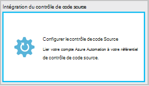
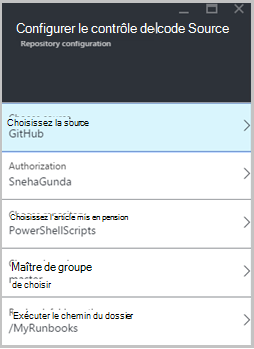
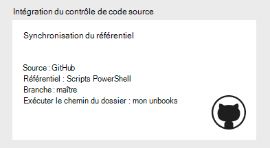
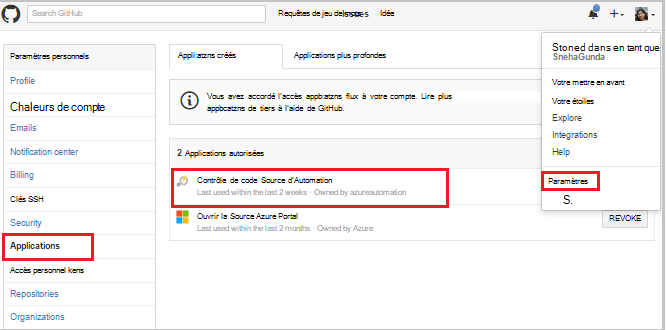
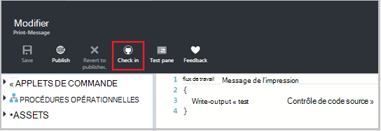
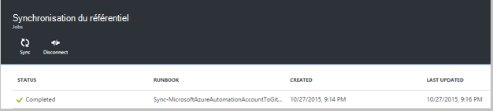
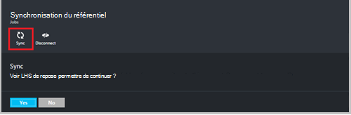
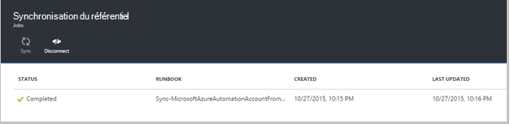
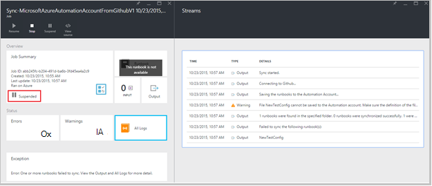
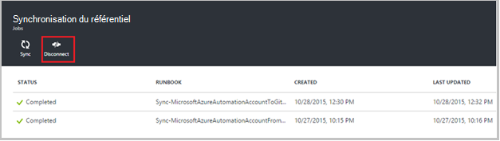

<properties 
    pageTitle=" Intégration dans Azure Automation du contrôle de source | Microsoft Azure"
    description="Cet article décrit l’intégration de contrôle de code source avec GitHub dans Azure Automation."
    services="automation"
    documentationCenter=""
    authors="mgoedtel"
    manager="jwhit"
    editor="tysonn" />    
<tags 
    ms.service="automation"
    ms.devlang="na"
    ms.topic="article"
    ms.tgt_pltfrm="na"
    ms.workload="infrastructure-services"
    ms.date="09/12/2016"
    ms.author="magoedte;sngun" />

# Intégration de contrôle de code source dans Azure Automation

Intégration du contrôle de code source vous permet d’associer des procédures opérationnelles dans votre compte d’automatisation à un référentiel de contrôle de code source GitHub. Contrôle de code source vous permet de collaborer avec votre équipe, effectuer le suivi des modifications et facilement revenir aux versions précédentes de vos procédures opérationnelles. Par exemple, contrôle de code source vous permet de synchroniser les différentes branches de contrôle de code source à vos comptes de Automation de développement, de test ou de production, ce qui vous permet de promouvoir le code qui a été testé dans votre environnement de développement pour votre compte d’automatisation de production.

Contrôle de code source vous permet au code d’Automation de Azure au contrôle de code source extraction ou les procédures opérationnelles à partir du contrôle de code source à l’Automation d’Azure. Cet article décrit comment configurer le contrôle de code source dans votre environnement d’automatisation d’Azure. Nous allons commencer par la configuration Automation Azure pour accéder à votre référentiel GitHub et passez en revue les différentes opérations réalisables à l’aide d’intégration du contrôle de code source. 

>[AZURE.NOTE]Contrôle de code source prend en charge l’extraction et en exécutant un push de [procédures opérationnelles de PowerShell le flux de travail](automation-runbook-types.md#powershell-workflow-runbooks) , ainsi que des [procédures opérationnelles de PowerShell](automation-runbook-types.md#powershell-runbooks). [Procédures opérationnelles de graphiques](automation-runbook-types.md#graphical-runbooks) ne sont pas encore pris en charge.  

Il y a deux étapes requises pour configurer le contrôle de code source pour le compte de votre Automation et une seule si vous avez déjà un compte GitHub. Ils sont les suivantes :
## Étape 1 – Création d’un référentiel GitHub

Si vous avez déjà un compte GitHub et un référentiel que vous souhaitez créer un lien vers Azure Automation, puis connectez-vous à votre compte existant et de démarrer à partir de l’étape 2 ci-dessous. Dans le cas contraire, accédez à [GitHub](https://github.com/), signe pour un nouveau compte et [créer un nouveau référentiel](https://help.github.com/articles/create-a-repo/).

## Étape 2 : configurer le contrôle de code source dans l’automatisation d’Azure

1. À partir de la blade d’Automation compte dans Azure portal, cliquez sur **haut la contrôle de code Source.** 
 
    

2. La lame de **Contrôle de code Source** s’ouvre, dans laquelle vous pouvez configurer les détails de votre compte de GitHub. Vous trouverez ci-dessous la liste des paramètres de configuration :  

  	|**Paramètre**            |**Description** |
  	|:---|:---| 
  	|Choisissez la Source   | Sélectionnez la source. Actuellement, seul **GitHub** est pris en charge. |
  	|Autorisation | Cliquez sur le bouton **Autoriser** pour accorder l’accès à votre référentiel GitHub Azure Automation. Si vous êtes déjà connecté à votre compte de GitHub dans une autre fenêtre, les informations d’identification de ce compte sont utilisées. Une fois que l’autorisation est réussie, la lame affiche votre nom d’utilisateur GitHub sous **Autorisation propriété**. |
  	|Choisissez le référentiel | Sélectionnez un référentiel de GitHub à partir de la liste des référentiels disponibles. |
  	|Choisissez la branche | Sélectionnez la branche à partir de la liste des branches disponibles. Uniquement la branche **principale** est affichée si vous n’avez pas créé de toutes les branches. |
  	|Chemin d’accès du dossier de procédure opérationnelle | Le chemin d’accès du dossier de procédure opérationnelle Spécifie le chemin d’accès dans le référentiel de GitHub à partir de laquelle vous souhaitez extraction ou votre code. Elle doit être entrée dans le format **/foldername/subfoldername**. Seulement les procédures opérationnelles dans le chemin d’accès du dossier de procédure opérationnelle sera synchronisé avec votre compte d’Automation. Procédures opérationnelles dans les sous-dossiers de la procédure opérationnelle dossier s’affichera **pas** être synchronisée. Utilisez **/** à synchroniser toutes les procédures opérationnelles dans le référentiel. |

3. Par exemple, si vous avez un référentiel nommé **PowerShellScripts** qui contient un dossier nommé **RootFolder**, qui contient un dossier nommé des **sous-dossier**. Vous pouvez utiliser les chaînes suivantes à chaque niveau du dossier de synchronisation :

    1. Pour synchroniser les procédures opérationnelles à partir du **référentiel**, le chemin d’accès du dossier de procédure opérationnelle est*/*
    2. Pour synchroniser les procédures opérationnelles à partir de la **propriété RootFolder**, chemin d’accès du dossier de procédure opérationnelle est */RootFolder*
    3. Pour synchroniser les procédures opérationnelles à partir du **sous-dossier**, le chemin d’accès du dossier de procédure opérationnelle est */RootFolder/SubFolder*.
  

4. Après avoir configuré les paramètres, ils sont affichés sur les **des lames de définir le contrôle des sources.**  
 
    

5. Une fois que vous cliquez sur OK, intégration du contrôle de code source est maintenant configurée pour votre compte d’Automation et doit être mis à jour avec les informations de votre GitHub. Vous pouvez maintenant cliquer sur cette partie pour afficher l’ensemble de l’historique du travail source contrôle la synchronisation.  

    

6. Après avoir configuré le contrôle de code source, les ressources d’Automation suivants seront créés dans votre compte d’Automation :  
 Deux [variables actifs](automation-variables.md) sont créés.  
      
    * La variable **Microsoft.Azure.Automation.SourceControl.Connection** contient les valeurs de la chaîne de connexion, comme illustré ci-dessous.  

  	|**Paramètre**            |**Valeur** |
  	|:---|:---|
  	| Nom  | Microsoft.Azure.Automation.SourceControl.Connection |
  	| Type de | Chaîne |
  	| Valeur  | {« Succursale » :\<*le nom de votre branche*>, « RunbookFolderPath » :\<*chemin d’accès du dossier de procédure opérationnelle*>, « ProviderType » :\<*a la valeur 1 pour GitHub*>, « Référentiel » :\<*nom du référentiel*>, « Username » :\<*GitHub votre nom d’utilisateur*>} |   

    * La variable **Microsoft.Azure.Automation.SourceControl.OAuthToken**, contient la valeur chiffrée sécurisée de votre OAuthToken.  

  	|**Paramètre**            |**Valeur** |
  	|:---|:---|
  	| Nom  | Microsoft.Azure.Automation.SourceControl.OAuthToken |
  	| Type de | Unknown(Encrypted) |
  	| Valeur | <*Cryptage OAuthToken*> |  

      

    * **Contrôle de code Source Automation** est ajouté comme une application autorisée à votre compte de GitHub. Pour afficher l’application : à partir de votre page d’accueil GitHub, accédez à votre **profil** > **paramètres** > **les Applications**. Cette application permet d’automatiser Azure synchroniser votre référentiel GitHub à un compte d’Automation.  

    

## À l’aide du contrôle de code Source dans l’automatisation

### Archiver une procédure opérationnelle d’Azure Automation de contrôle de code source

Procédure opérationnelle archiver vous permet de diffuser les changements que vous avez apportées à une procédure opérationnelle dans Azure Automation dans votre référentiel de contrôle de code source. Voici les étapes à archiver une procédure opérationnelle :

1. À partir de votre compte d’Automation, [créer une nouvelle procédure d’opérationnelle textuelle](automation-first-runbook-textual.md)ou [Modifier une procédure opérationnelle au existant, textuel](automation-edit-textual-runbook.md). Cette procédure opérationnelle peut être un flux de travail de PowerShell ou une procédure de script PowerShell opérationnelle.  

2. Après avoir modifié votre procédure opérationnelle, enregistrez-le et cliquez sur **Archiver** de la lame à **Modifier** .  

    

     >[AZURE.NOTE] Archiver dans Azure Automation remplacera le code qui existe actuellement dans le contrôle de code source. L’instruction de ligne de commande équivalente Git à archiver est **git ajouter + git commit + git push**  

3. Lorsque vous cliquez sur **Archiver**, vous serez invité par un message de confirmation, cliquez sur Oui pour continuer.  

    

4. Archivage démarre la procédure de contrôle de code source opérationnelle : **MicrosoftAzureAutomationAccountToGitHubV1 de la synchronisation**. Cette procédure opérationnelle se connecte à GitHub et exécute un push de modifications Azure Automation dans votre référentiel. Pour afficher l’historique des travaux archiver, cliquez sur l’onglet **Intégration de contrôle de code Source** , puis cliquez sur pour ouvrir la lame de synchronisation du référentiel. Cette blade affiche tous vos travaux de contrôle de code source.  Sélectionnez la tâche que vous souhaitez afficher et cliquez sur pour afficher les détails.  

    

    >[AZURE.NOTE] Procédures opérationnelles de contrôle de code source sont spéciales procédures opérationnelles d’Automation que vous ne pouvez pas afficher ou modifier. Pendant qu’ils n’apparaîtront pas dans votre liste de procédure opérationnelle, vous verrez les travaux de synchronisation s’affiche dans votre liste de tâches.
 
5. Le nom de la procédure opérationnelle modifié est envoyé en tant que paramètre d’entrée à la procédure de vérification opérationnelle. Vous pouvez [Afficher les détails d’une tâche](automation-runbook-execution.md#viewing-job-status-using-the-azure-management-portal) en développant de procédure opérationnelle dans la lame de **Synchronisation du référentiel** .  

    

6. Actualisez votre référentiel GitHub une fois le travail terminé pour voir les modifications.  Il doit y avoir une validation dans votre référentiel avec un message de validation : *Nom de procédure opérationnelle *mis à jour ** dans Azure Automation.* *  

### Procédures opérationnelles de synchronisation à partir du contrôle de code source à l’Automation d’Azure 

Le bouton de synchronisation sur la lame de synchronisation du référentiel vous permet d’extraire toutes les procédures opérationnelles dans le chemin d’accès du dossier de procédure opérationnelle du référentiel à votre compte d’Automation. Le même référentiel peut être synchronisé sur plus d’un compte d’Automation. Voici les étapes à synchroniser une procédure opérationnelle :

1. À partir du compte de l’Automation où vous configurez le contrôle de code source, ouvrez la **lame de synchronisation le référentiel et intégration du contrôle de Source** et cliquez sur **synchroniser** , puis vous êtes invité par un message de confirmation, cliquez sur **Oui** pour continuer.  

    

2. La synchronisation démarre la procédure opérationnelle : **MicrosoftAzureAutomationAccountFromGitHubV1 de la synchronisation**. Cette procédure opérationnelle se connecte à GitHub et extraie les modifications à partir de votre référentiel vers Azure Automation. Vous devez voir un nouveau travail sur la lame de **Synchronisation du référentiel** pour cette action. Pour plus d’informations sur la tâche de synchronisation, cliquez sur pour ouvrir la lame de détails de projet.  
 
    

 
    >[AZURE.NOTE] Une synchronisation à partir du contrôle de code source remplace la version provisoire de la procédures opérationnelles qui existent actuellement dans votre compte d’Automation pour **toutes les** procédures opérationnelles qui se trouvent actuellement dans le contrôle de code source. L’instruction de ligne de commande équivalente Git à synchroniser est **extrait de git**

## Résolution des problèmes de contrôle de code source

Si des erreurs sont présentes à un travail d’archivage ou de la synchronisation, le statut de la tâche doit être suspendu et vous pouvez afficher plus de détails sur l’erreur dans la lame de travail.  La partie de **Tous les journaux** affiche tous les flux de PowerShell associés à cette tâche. Cela vous fournira les informations nécessaires pour vous aider à résoudre les problèmes de votre archivage ou de la synchronisation. Il vous indique également la séquence d’actions qui s’est produite lors de la synchronisation ou de vérification-dans une procédure opérationnelle.  

## Déconnexion du contrôle de code source

Pour vous déconnecter de votre compte de GitHub, la lame de synchronisation du référentiel, cliquez sur **Déconnecter**. Une fois que vous vous déconnectez de contrôle de code source, procédures opérationnelles précédemment synchronisées seront toutefois conservés dans votre compte d’automatisation, mais la lame de synchronisation de référentiel ne sera pas activée.  

  

## Étapes suivantes

Pour plus d’informations sur l’intégration du contrôle de code source, consultez les ressources suivantes :  
- [Automation Azure : Intégration du contrôle de Source dans Azure Automation](https://azure.microsoft.com/blog/azure-automation-source-control-13/)  
- [Votez pour votre système de contrôle source préférée](https://www.surveymonkey.com/r/?sm=2dVjdcrCPFdT0dFFI8nUdQ%3d%3d)  
- [Automation Azure : Intégration de contrôle de code Source de procédure opérationnelle à l’aide de Visual Studio Team Services](https://azure.microsoft.com/blog/azure-automation-integrating-runbook-source-control-using-visual-studio-online/)  
