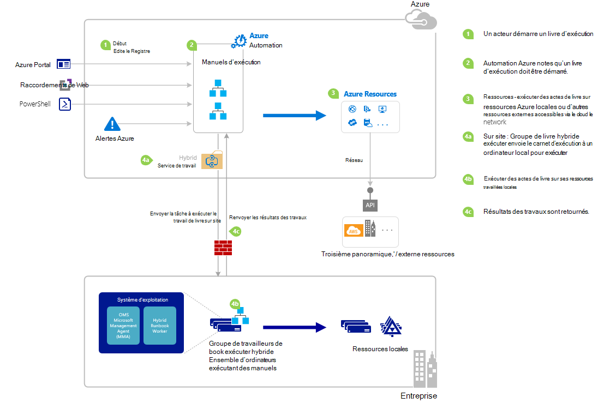

<properties
   pageTitle="Démarrage d’une procédure opérationnelle dans Azure Automation | Microsoft Azure"
   description="Résume les différentes méthodes que peuvent être utilisés pour démarrer une procédure opérationnelle dans Azure Automation et fournit des détails sur l’utilisation de Windows PowerShell et Azure portal."
   services="automation"
   documentationCenter=""
   authors="mgoedtel"
   manager="jwhit"
   editor="tysonn" />
<tags
   ms.service="automation"
   ms.devlang="na"
   ms.topic="article"
   ms.tgt_pltfrm="na"
   ms.workload="infrastructure-services"
   ms.date="10/08/2016"
   ms.author="magoedte;bwren"/>

# <a name="starting-a-runbook-in-azure-automation"></a>Démarrage d’une procédure opérationnelle dans Azure Automation

Le tableau suivant vous aidera à déterminer la méthode pour démarrer une procédure opérationnelle dans Azure Automation qui convient le mieux à votre scénario particulier. Cet article contient des informations sur le démarrage d’une procédure opérationnelle avec le portail Azure et Windows PowerShell. Pour plus d’informations sur les autres méthodes sont fournies dans les autres documentations auquel vous pouvez accéder à partir des liens ci-dessous.

| **MÉTHODE**                                                                    | **CARACTÉRISTIQUES**                                                                                                                                                                                                                                                                                                                                                |
|-------------------------------------------------------------------------------|--------------------------------------------------------------------------------------------------------------------------------------------------------------------------------------------------------------------------------------------------------------------------------------------------------------------------------------------------------------------|
| [Azure Portal](#starting-a-runbook-with-the-azure-portal)                     | <li>Méthode la plus simple avec une interface utilisateur interactive.<br> <li>Formulaire pour fournir des valeurs de paramètres simples.<br> <li>Suivre facilement l’état de la tâche.<br> <li>Accès authentifié avec Azure d’ouverture de session.                                                                                                                                                                               |
| [Windows PowerShell](https://msdn.microsoft.com/library/dn690259.aspx)        | <li>Appeler à partir de la ligne de commande avec les applets de commande Windows PowerShell.<br> <li>Peut être inclus dans la solution automatisée avec plusieurs étapes.<br> <li>Demande est authentifié avec un certificat ou OAuth utilisateur principal ou le service principal.<br> <li>Fournir des valeurs de paramètre simples et complexes.<br> <li>Suivre l’état de la tâche.<br> <li>Client doit prendre en charge les applets de commande PowerShell. |
| [API d’automatisation d’Azure](https://msdn.microsoft.com/library/azure/mt662285.aspx) | <li>Méthode la plus souple, mais également plus complexes.<br> <li>Appeler à partir de n’importe quel code personnalisé qui peut effectuer des demandes HTTP.<br> <li>Demande d’authentification avec certificat, ou un utilisateur Oauth principal ou le service principal.<br> <li>Fournir des valeurs de paramètre simples et complexes.<br> <li>Suivre l’état de la tâche.                                                                          |
| [Webhooks](automation-webhooks.md)                                            | <li>Démarrez la procédure opérationnelle à partir de la requête HTTP unique.<br> <li>Authentification avec jeton de sécurité dans l’URL.<br> <li>Client ne peut pas substituer les valeurs de paramètre spécifiées lors de la création de webhook. Procédure opérationnelle peut définir un paramètre unique qui est rempli avec les détails de la demande HTTP.<br> <li>Aucune possibilité de suivre l’état de travail via les URL webhook.                                      |
| [Répondre à une alerte Azure](../log-analytics/log-analytics-alerts.md)               | <li>Démarrer une procédure opérationnelle en réponse à une alerte Azure.<br> <li>Configurer webhook de procédure opérationnelle et le lien de l’alerte.<br> <li>Authentification avec jeton de sécurité dans l’URL.<br> <li>Prend actuellement en charge alerte de mesures uniquement.                                                                                                                                                       |
| [Planification](automation-schedules.md)                                | <li>Démarrer automatiquement la procédure opérationnelle de planification horaire, quotidienne ou hebdomadaire.<br> <li>Manipuler la planification grâce à Azure portal, les applets de commande PowerShell ou les API d’Azure.<br> <li>Fournir des valeurs de paramètre à utiliser avec la planification.                                                                                                                                               |
| [À partir d’une autre procédure d’opérationnelle](automation-child-runbooks.md)                          | <li>Utilisez une procédure opérationnelle en tant qu’activité dans une autre procédure d’opérationnelle.<br> <li>Utile pour les fonctionnalités utilisées par les procédures opérationnelles multiples.<br> <li>Fournir des valeurs de paramètre de procédure opérationnelle des enfants et utilisez le résultat dans une procédure opérationnelle du parent.                                                                                                                                                               |

L’image suivante illustre le processus pas à pas détaillé dans le cycle de vie d’une procédure opérationnelle. Il inclut une procédure opérationnelle est démarré dans Azure Automation, composants requis pour le travail de procédure opérationnelle hybride pour exécuter des procédures opérationnelles d’Azure Automation et des interactions entre les différents composants de différentes manières. Pour en savoir plus sur l’exécution des procédures opérationnelles d’Automation dans votre centre de données, reportez-vous aux [travailleurs de procédure opérationnelle hybride](automation-hybrid-runbook-worker.md)



## <a name="starting-a-runbook-with-the-azure-portal"></a>Une procédure opérationnelle à partir du portail Azure

1.  Dans le portail Azure, sélectionnez **Automation** et puis cliquez sur le nom d’un compte d’automation.
2.  Sélectionnez l’onglet **procédures opérationnelles** .
3.  Sélectionnez une procédure opérationnelle et puis cliquez sur **Démarrer**.
4.  Si la procédure opérationnelle possède des paramètres, vous êtes invité à fournir des valeurs pour chaque paramètre avec une zone de texte. Pour plus d’informations sur les paramètres, reportez-vous à la section [Paramètres de procédure opérationnelle](#Runbook-parameters) ci-dessous.
5.  Cliquez sur **Afficher la tâche** en regard du message de procédure opérationnelle de **départ** ou sélectionnez l’onglet **tâches** pour la procédure opérationnelle afficher le statut de la tâche de la procédure opérationnelle.

## <a name="starting-a-runbook-with-the-azure-portal"></a>Une procédure opérationnelle à partir du portail Azure

1.  À partir de votre compte d’automation, cliquez sur le cadre de **procédures opérationnelles** pour ouvrir la lame de **procédures opérationnelles** .
2.  Cliquez sur une procédure opérationnelle pour ouvrir son lame de **procédure opérationnelle** .
3.  Cliquez sur **Démarrer**.
4.  Si la procédure opérationnelle n’a aucun paramètre, le système vous demandera de confirmer si vous souhaitez démarrer. Si la procédure opérationnelle possède des paramètres, la lame de **Démarrer la procédure opérationnelle** s’ouvre pour vous permettre de valeurs de paramètre. Pour plus d’informations sur les paramètres, reportez-vous à la section [Paramètres de procédure opérationnelle](#Runbook-parameters) ci-dessous.
5.  La lame de **travail** est ouvert afin que vous pouvez suivre le statut de la tâche.

## <a name="starting-a-runbook-with-windows-powershell"></a>Une procédure opérationnelle à partir de Windows PowerShell

[Début-AzureRmAutomationRunbook](https://msdn.microsoft.com/library/mt603661.aspx) vous permet de démarrer une procédure opérationnelle avec Windows PowerShell. L’exemple de code suivant démarre une procédure opérationnelle appelée Test-procédure opérationnelle.

```
Start-AzureRmAutomationRunbook -AutomationAccountName "MyAutomationAccount" -Name "Test-Runbook" -ResourceGroupName "ResourceGroup01"
```

Démarrer-AzureRmAutomationRunbook retourne un objet de travail que vous pouvez utiliser pour effectuer le suivi de l’état une fois la procédure opérationnelle est démarré. Vous pouvez ensuite utiliser cet objet travail avec [Get-AzureRmAutomationJob](https://msdn.microsoft.com/library/mt619440.aspx) pour déterminer l’état de la tâche et [Get-AzureRmAutomationJobOutput](https://msdn.microsoft.com/library/mt603476.aspx) pour obtenir sa sortie. L’exemple de code suivant démarre une procédure opérationnelle appelée Test-procédure opérationnelle, attend qu’il a terminé et ensuite affiche sa sortie.

```
$runbookName = "Test-Runbook"
$ResourceGroup = "ResourceGroup01"
$AutomationAcct = "MyAutomationAccount"

$job = Start-AzureRmAutomationRunbook –AutomationAccountName $AutomationAcct -Name $runbookName -ResourceGroupName $ResourceGroup

$doLoop = $true
While ($doLoop) {
   $job = Get-AzureRmAutomationJob –AutomationAccountName $AutomationAcct -Id $job.JobId -ResourceGroupName $ResourceGroup
   $status = $job.Status
   $doLoop = (($status -ne "Completed") -and ($status -ne "Failed") -and ($status -ne "Suspended") -and ($status -ne "Stopped"))
}

Get-AzureRmAutomationJobOutput –AutomationAccountName $AutomationAcct -Id $job.JobId -ResourceGroupName $ResourceGroup –Stream Output
```

Si la procédure opérationnelle nécessite des paramètres, vous devez les fournir sous la forme d’une [table de hachage](http://technet.microsoft.com/library/hh847780.aspx) dans laquelle la clé de la table de hachage correspond au nom de paramètre et la valeur est la valeur du paramètre. L’exemple suivant montre comment démarrer une procédure opérationnelle avec deux paramètres de chaîne nommés FirstName et LastName, un entier nommé RepeatCount et un paramètre boolean nommé Show. Pour plus d’informations sur les paramètres, consultez [Paramètres de procédure opérationnelle](#Runbook-parameters) ci-dessous.

```
$params = @{"FirstName"="Joe";"LastName"="Smith";"RepeatCount"=2;"Show"=$true}
Start-AzureRmAutomationRunbook –AutomationAccountName "MyAutomationAccount" –Name "Test-Runbook" -ResourceGroupName "ResourceGroup01" –Parameters $params
```

## <a name="runbook-parameters"></a>Paramètres de procédure opérationnelle

Lorsque vous démarrez une procédure opérationnelle à partir de Windows PowerShell ou Azure Portal, l’instruction est envoyée via le service web Azure Automation. Ce service ne gère pas les paramètres avec des types de données complexes. Si vous devez fournir une valeur pour un paramètre complexe, puis vous devez l’appeler en ligne à partir d’une autre procédure d’opérationnelle comme décrit dans les [procédures opérationnelles des enfants dans Azure Automation](automation-child-runbooks.md).

Le service web de Azure Automation fournit des fonctionnalités spéciales pour des paramètres à l’aide de certains types de données, comme décrit dans les sections suivantes.

### <a name="named-values"></a>Valeurs nommées

Si le paramètre est le type de données (objet), vous pouvez ensuite utiliser le format JSON suivant pour l’envoyer à une liste de valeurs nommées : *{nom1 : 'Valeur1', nom2 : 'Value2', Name3 : 'Value3'}*. Ces valeurs doivent être des types simples. La procédure opérationnelle recevra le paramètre sous la forme d’un [PSCustomObject](https://msdn.microsoft.com/library/system.management.automation.pscustomobject%28v=vs.85%29.aspx) avec des propriétés qui correspondent à chaque valeur nommé.

Prendre en compte la procédure opérationnelle test suivant qui accepte un paramètre appelé utilisateur.

```
Workflow Test-Parameters
{
   param (
      [Parameter(Mandatory=$true)][object]$user
   )
    $userObject = $user | ConvertFrom-JSON
    if ($userObject.Show) {
        foreach ($i in 1..$userObject.RepeatCount) {
            $userObject.FirstName
            $userObject.LastName
        }
    }
}
```

Le texte suivant peut être utilisé pour le paramètre de l’utilisateur.

```
{FirstName:'Joe',LastName:'Smith',RepeatCount:'2',Show:'True'}
```

Ainsi, la sortie suivante.

```
Joe
Smith
Joe
Smith
```

### <a name="arrays"></a>Tableaux

Si le paramètre est un tableau, par exemple [tableau] ou [string []], vous pouvez utiliser le format JSON suivant pour l’envoyer à une liste de valeurs : *[valeur1, valeur2, valeur3]*. Ces valeurs doivent être des types simples.

Prendre en compte la procédure opérationnelle test suivant qui accepte un paramètre appelé *utilisateur*.

```
Workflow Test-Parameters
{
   param (
      [Parameter(Mandatory=$true)][array]$user
   )
    if ($user[3]) {
        foreach ($i in 1..$user[2]) {
            $ user[0]
            $ user[1]
        }
    }
}
```

Le texte suivant peut être utilisé pour le paramètre de l’utilisateur.

```
["Joe","Smith",2,true]
```

Ainsi, la sortie suivante.

```
Joe
Smith
Joe
Smith
```

### <a name="credentials"></a>Informations d’identification

Si le paramètre est un type de données **PSCredential**, vous pouvez fournir le nom d’une automatisation d’Azure [actif d’informations d’identification](automation-credentials.md). La procédure opérationnelle permettra d’extraire les informations d’identification avec le nom que vous spécifiez.

Prendre en compte la procédure opérationnelle test suivant qui accepte un paramètre d’informations d’identification.

```
Workflow Test-Parameters
{
   param (
      [Parameter(Mandatory=$true)][PSCredential]$credential
   )
   $credential.UserName
}
```

Le texte suivant peut être utilisé pour le paramètre utilisateur en supposant qu’il y a une ressource d’informations d’identification appelée *Mes informations d’identification de*.

```
My Credential
```

En supposant que le nom d’utilisateur dans les informations d’identification a été *jsmith*, cela entraîne la sortie suivante.

```
jsmith
```

## <a name="next-steps"></a>Étapes suivantes

-   L’architecture de procédure opérationnelle dans l’article en cours fournit une vue d’ensemble des procédures opérationnelles de gestion de ressources dans Azure et sur site avec le travailleur de procédure opérationnelle hybride.  Pour en savoir plus sur l’exécution des procédures opérationnelles d’Automation dans votre centre de données, reportez-vous aux [Travailleurs de procédure opérationnelle hybride](automation-hybrid-runbook-worker.md).
-   Pour en savoir plus sur les procédures opérationnelles modulaire création pour être utilisé par d’autres procédures opérationnelles pour des fonctions spécifiques ou courantes, reportez-vous à des [Procédures opérationnelles des enfants](automation-child-runbooks.md).
