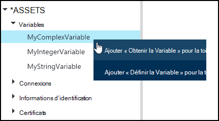
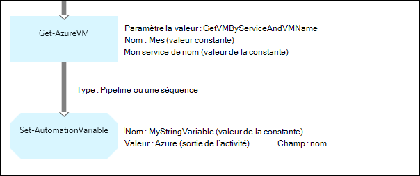
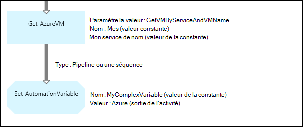
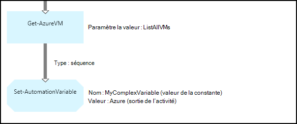
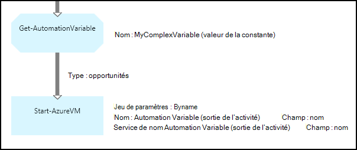
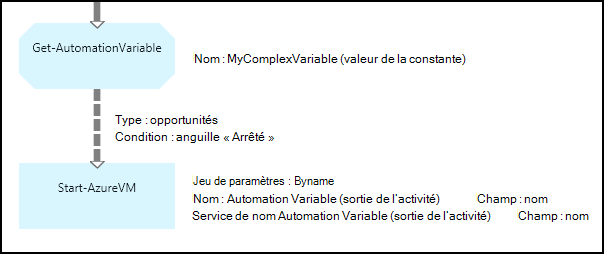

<properties 
   pageTitle="Variables actifs dans Azure automatisation | Microsoft Azure"
   description="Variables actifs sont des valeurs qui sont disponibles pour toutes les procédures opérationnelles et des configurations de DSC dans Azure Automation.  Cet article explique comment les variables et comment les utiliser lors de la création de texte et de graphiques."
   services="automation"
   documentationCenter=""
   authors="mgoedtel"
   manager="jwhit"
   editor="tysonn" />
<tags 
   ms.service="automation"
   ms.devlang="na"
   ms.topic="article"
   ms.tgt_pltfrm="na"
   ms.workload="infrastructure-services"
   ms.date="05/24/2016"
   ms.author="magoedte;bwren" />

# Variables actifs dans Azure Automation

Variables actifs sont des valeurs qui sont disponibles pour toutes les procédures opérationnelles et des configurations de DSC dans votre compte d’automation. Ils peuvent être créés, modifiés et récupérés à partir du portail Azure, Windows PowerShell et à partir d’une procédure opérationnelle ou la configuration de DSC. Automation variables sont utiles pour les scénarios suivants :

- Partager une valeur comprise entre plusieurs procédures opérationnelles ou configurations de DSC.

- Partager une valeur comprise entre plusieurs projets à partir de la procédure opérationnelle même ou de la configuration de DSC.

- Gérer une valeur à partir du portail ou à partir de la ligne de commande de Windows PowerShell qui est utilisée par les procédures opérationnelles ou de configurations de DSC.

Variables d’Automation sont conservées afin qu’ils continuent à être disponibles, même si la procédure opérationnelle ou une configuration de DSC échoue.  Cela permet également une valeur à définir en une seule procédure opérationnelle le qui est ensuite utilisé par un autre, ou qui est utilisée par la procédure opérationnelle même ou de la configuration de DSC la prochaine fois qu’elle est exécutée.

Lorsqu’une variable est créée, vous pouvez spécifier qu’elles être stockées cryptées.  Lorsqu’une variable est cryptée, il est stocké en toute sécurité dans Azure Automation, et sa valeur ne peut pas être récupérée à partir de l’applet de commande [Get-AzureAutomationVariable](http://msdn.microsoft.com/library/dn913772.aspx) fourni dans le cadre du module PowerShell de Azure.  Le seul moyen qu’une valeur chiffrée peut être récupérée est de l’activité de **Get-AutomationVariable** dans une procédure opérationnelle ou une configuration de DSC.

>[AZURE.NOTE]Sécurisation des ressources dans Azure Automation incluent les informations d’identification, des certificats, des connexions et des variables cryptés. Ces actifs sont chiffrées et stockées dans l’automatisation d’Azure à l’aide d’une clé unique qui est générée pour chaque compte d’automation. Cette clé est cryptée par un certificat-maître et stockée dans Azure Automation. Avant de stocker un actif sécurisé, la clé pour le compte de l’automatisation est décryptée à l’aide du certificat master et ensuite utilisée pour crypter l’actif.

## Types de variable

Lorsque vous créez une variable avec le portail Azure, vous devez spécifier un type de données dans la liste déroulante pour le portail puisse afficher le contrôle approprié pour la saisie de la valeur de la variable. La variable n’est pas limitée à ce type de données, mais vous devez définir la variable à l’aide de Windows PowerShell si vous souhaitez spécifier une valeur d’un type différent. Si vous spécifiez **non défini**, puis la valeur de la variable va être définie sur **$null**, et vous devez définir la valeur avec l’activité de **Jeu-AutomationVariable** ou l’applet de commande [Set-AzureAutomationVariable](http://msdn.microsoft.com/library/dn913767.aspx) .  Impossible de créer ou de modifier la valeur d’un type complexe variable dans le portail, mais vous pouvez fournir une valeur d’un type à l’aide de Windows PowerShell. Les types complexes seront retournés comme un [PSCustomObject](http://msdn.microsoft.com/library/system.management.automation.pscustomobject.aspx).

Vous pouvez stocker plusieurs valeurs à une seule variable par la création d’un tableau ou une table de hachage et de l’enregistrer à la variable.

## Applets de commande et des activités

Les applets de commande dans le tableau suivant sont utilisées pour créer et gérer les variables de l’Automation avec Windows PowerShell. Ils sont fournis dans le cadre du [module PowerShell de Azure](../powershell-install-configure.md) qui est disponible pour une utilisation dans des procédures opérationnelles d’automatisation et de la configuration de DSC.

|Applets de commande|Description|
|:---|:---|
|[Get-AzureAutomationVariable](http://msdn.microsoft.com/library/dn913772.aspx)|Récupère la valeur d’une variable existante.|
|[Nouvelle-AzureAutomationVariable](http://msdn.microsoft.com/library/dn913771.aspx)|Crée une nouvelle variable et définit sa valeur.|
|[Supprimer-AzureAutomationVariable](http://msdn.microsoft.com/library/dn913775.aspx)|Supprime une variable existante.|
|[Ensemble-AzureAutomationVariable](http://msdn.microsoft.com/library/dn913767.aspx)|Définit la valeur d’une variable existante.|

Les activités de flux de travail dans le tableau suivant sont utilisées pour accéder aux variables de l’Automation dans une procédure opérationnelle. Ils sont uniquement disponibles pour les utiliser dans une configuration de DSC ou une procédure opérationnelle et ne sont pas fournis dans le cadre du module PowerShell de Azure.

|Activités de flux de travail|Description|
|:---|:---|
|Get-AutomationVariable|Récupère la valeur d’une variable existante.|
|Ensemble-AutomationVariable|Définit la valeur d’une variable existante.|

>[AZURE.NOTE] Vous devez éviter d’utiliser des variables dans le nom du paramètre – de **Get-AutomationVariable** dans une procédure opérationnelle ou une configuration DSC car cela risque de compliquer la découverte des dépendances entre les procédures opérationnelles ou de configuration de DSC et variables d’automatisation au moment du design.

## Création d’une nouvelle variable Automation

### Pour créer une nouvelle variable avec le portail Azure

1. À partir de votre compte d’automation, cliquez sur **ressources** en haut de la fenêtre.
1. En bas de la fenêtre, cliquez sur **Ajouter un paramètre**.
1. Cliquez sur **Ajouter une Variable**.
1. Terminez l’Assistant et cliquez sur la case à cocher pour enregistrer la nouvelle variable.

### Pour créer une nouvelle variable avec le portail Azure

1. À partir de votre compte d’automation, cliquez sur la partie de **ressources** pour ouvrir la blade **d’actifs** .
1. Cliquez sur la partie de **Variables** pour ouvrir la lame de **Variables** .
1. Cliquez sur **Ajouter une variable** dans la partie supérieure de la lame.
1. Remplissez le formulaire et cliquez sur **créer** pour enregistrer la nouvelle variable.

### Pour créer une nouvelle variable avec Windows PowerShell

L’applet de commande [New-AzureAutomationVariable](http://msdn.microsoft.com/library/dn913771.aspx) crée une nouvelle variable et définit sa valeur initiale. Vous pouvez récupérer la valeur à l’aide de [Get-AzureAutomationVariable](http://msdn.microsoft.com/library/dn913772.aspx). Si la valeur est un type simple, ce même type est retourné. S’il s’agit d’un type complexe, un **PSCustomObject** est retourné.

Les exemples de commandes suivants montrent comment créer une variable de type chaîne et de puis de retourner sa valeur.

    New-AzureAutomationVariable –AutomationAccountName "MyAutomationAccount" –Name 'MyStringVariable' –Encrypted $false –Value 'My String'
    $string = (Get-AzureAutomationVariable –AutomationAccountName "MyAutomationAccount" –Name 'MyStringVariable').Value

Les exemples de commandes suivants montrent comment créer une variable avec un type complexe et de puis retourner ses propriétés. Dans ce cas, un objet ordinateur virtuel de **Get-AzureVM** est utilisé.

    $vm = Get-AzureVM –ServiceName "MyVM" –Name "MyVM"
    New-AzureAutomationVariable –AutomationAccountName "MyAutomationAccount" –Name "MyComplexVariable" –Encrypted $false –Value $vm
    
    $vmValue = (Get-AzureAutomationVariable –AutomationAccountName "MyAutomationAccount" –Name "MyComplexVariable").Value
    $vmName = $vmValue.Name
    $vmIpAddress = $vmValue.IpAddress

## À l’aide d’une variable dans une procédure opérationnelle ou la configuration de DSC

Utilisez l’activité de la **AutomationVariable de l’ensemble** pour définir la valeur d’une variable de l’Automation dans une procédure opérationnelle ou configuration de DSC et **Get-AutomationVariable** pour le récupérer.  Vous n’utilisez pas les applets de commande **Set-AzureAutomationVariable** ou **Get-AzureAutomationVariable** dans une procédure opérationnelle ou une configuration de DSC car elles sont moins efficaces que les activités de flux de travail.  Vous ne pouvez pas également récupérer la valeur des variables sécurisés avec **Get-AzureAutomationVariable**.  La seule façon de créer une variable à partir d’une procédure opérationnelle ou la configuration de DSC est d’utiliser l’applet de commande [New-AzureAutomationVariable](http://msdn.microsoft.com/library/dn913771.aspx) .

### Exemples de procédure opérationnelle textuelle

#### Définition et récupération d’une simple valeur d’une variable

Les exemples de commandes suivants illustrent le définir et récupérer une variable dans une procédure opérationnelle textuelle. Dans cet exemple, il est supposé que les variables de type entier nommé *NumberOfIterations* et *NumberOfRunnings* et une variable de type chaîne nommée *SampleMessage* ont déjà été créées.

    $NumberOfIterations = Get-AutomationVariable -Name 'NumberOfIterations'
    $NumberOfRunnings = Get-AutomationVariable -Name 'NumberOfRunnings'
    $SampleMessage = Get-AutomationVariable -Name 'SampleMessage'
    
    Write-Output "Runbook has been run $NumberOfRunnings times."
    
    for ($i = 1; $i -le $NumberOfIterations; $i++) {
       Write-Output "$i`: $SampleMessage"
    }
    Set-AutomationVariable –Name NumberOfRunnings –Value ($NumberOfRunnings += 1)

#### Définition et récupération d’un objet complexe dans une variable

L’exemple de code suivant montre comment mettre à jour une variable avec une valeur complexe dans une procédure opérationnelle textuelle. Dans cet exemple, une machine virtuelle Azure est récupérée avec **Get-AzureVM** et enregistrée dans une variable Automation existante.  Comme expliqué dans les [types de variables](#variable-types), il est stocké comme un PSCustomObject.

    $vm = Get-AzureVM -ServiceName "MyVM" -Name "MyVM"
    Set-AutomationVariable -Name "MyComplexVariable" -Value $vm

Dans le code suivant, la valeur est extraite de la variable et utilisée pour démarrer l’ordinateur virtuel.

    $vmObject = Get-AutomationVariable -Name "MyComplexVariable"
    if ($vmObject.PowerState -eq 'Stopped') {
       Start-AzureVM -ServiceName $vmObject.ServiceName -Name $vmObject.Name
    }

#### Définition et récupération d’une collection dans une variable

L’exemple de code suivant montre comment utiliser une variable avec une collection de valeurs complexes dans une procédure opérationnelle textuelle. Dans cet exemple, plusieurs machines virtuelles Azure sont récupérées avec **Get-AzureVM** et enregistrées dans une variable Automation existante.  Comme expliqué dans les [types de variables](#variable-types), il est stocké comme une collection de PSCustomObjects.

    $vms = Get-AzureVM | Where -FilterScript {$_.Name -match "my"}     
    Set-AutomationVariable -Name 'MyComplexVariable' -Value $vms

Dans le code suivant, la collection est extraite de la variable et utilisée pour démarrer chaque ordinateur virtuel.

    $vmValues = Get-AutomationVariable -Name "MyComplexVariable"
    ForEach ($vmValue in $vmValues)
    {
       if ($vmValue.PowerState -eq 'Stopped') {
          Start-AzureVM -ServiceName $vmValue.ServiceName -Name $vmValue.Name
       }
    }

### Exemples de procédure opérationnelle graphique

Dans une procédure opérationnelle graphique, vous ajoutez le **Get-AutomationVariable** ou le **AutomationVariable de l’ensemble** par clic droit sur la variable dans le volet Bibliothèque de l’éditeur de graphique et sélectionnez l’activité souhaitée.

#### Valeurs de paramètre dans une variable

L’image suivante montre des exemples d’activité pour mettre à jour une variable contenant une valeur simple dans une procédure opérationnelle graphique. Dans cet exemple, une seule machine virtuelle Azure est récupérée avec **Get-AzureVM** et le nom de l’ordinateur est enregistré dans une variable Automation existante avec un type de chaîne.  Il n’a aucune importance si [lien est un tuyau ou une séquence](automation-graphical-authoring-intro.md#links-and-workflow) dans la mesure où nous n'attendent qu’un seul objet dans la sortie.

L’image suivante montre les activités utilisées pour mettre à jour une variable avec une valeur complexe dans une procédure opérationnelle graphique. La seule modification à partir de l’exemple précédent est spécifiez pas un **chemin d’accès de champ** pour la **sortie de l’activité** sur l’activité de la **AutomationVariable de l’ensemble** afin que l’objet est stocké et non simplement à une propriété de l’objet.  Comme expliqué dans les [types de variables](#variable-types), il est stocké comme un PSCustomObject.

L’image suivante montre que l’exemple précédent, une fonctionnalité similaire avec plusieurs machines virtuelles enregistrées à la variable.  Un [lien de la séquence](automation-graphical-authoring-intro.md#links-and-workflow) doit être utilisé ici, afin que l’activité de **AutomationVariable-ensemble** reçoit l’ensemble des machines virtuelles sous la forme d’une collection.  Si un [lien de pipeline](automation-graphical-authoring-intro.md#links-and-workflow) a été utilisé, puis l’activité **AutomationVariable de l’ensemble** s’exécute séparément pour chaque objet avec le résultat que la dernière machine virtuelle dans la collection sont enregistrée.  Comme expliqué dans les [types de variables](#variable-types), il est stocké comme une collection de PSCustomObjects.

#### Lors de la récupération des valeurs d’une variable

L’image suivante montre des exemples d’activité qui récupèrent et d’utilisent une variable dans une procédure opérationnelle graphique.  La première activité récupère les ordinateurs virtuels qui ont été enregistrés dans la variable dans l’exemple précédent.  Le lien doit être un [tuyau](automation-graphical-authoring-intro.md#links-and-workflow) afin que l’activité **Début-AzureVM** s’exécute une fois pour chaque objet envoyé à partir de l’activité de **Get-AutomationVariable** .  Cela fonctionnera le même si un un objet unique ou plusieurs objets sont stockés dans la variable.  L’activité **Début-AzureVM** utilise les propriétés de la PSCustomObject qui représente chaque machine virtuelle. 

L’image suivante indique comment filtrer les objets qui sont stockés à une variable dans une procédure opérationnelle graphique.  Une [condition](automation-graphical-authoring-intro.md#links-and-workflow) est ajoutée à la liaison dans l’exemple précédent pour filtrer uniquement les ordinateurs virtuels qui ont été arrêtés lorsque la valeur de la variable.

## Étapes suivantes

- Pour en savoir plus sur la connexion des activités de création de graphiques, voir les [liens lors de la création de graphiques](automation-graphical-authoring-intro.md#links-and-workflow)
- Pour vous familiariser avec les procédures opérationnelles de graphiques, voir [Ma première procédure de opérationnelle graphique](automation-first-runbook-graphical.md) 
