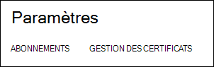
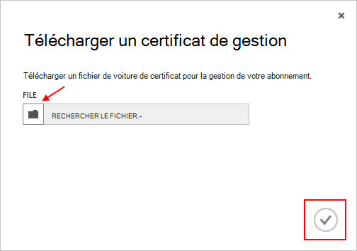

<properties 
    pageTitle="Télécharger un certificat d’API de gestion Azure | Microsoft Azure" 
    description="Apprenez à télécharger un certificat d’API de gestion d’athe pour le portail classique d’Azure." 
    services="cloud-services" 
    documentationCenter=".net" 
    authors="Thraka" 
    manager="timlt" 
    editor=""/>

<tags 
    ms.service="na" 
    ms.workload="tbd" 
    ms.tgt_pltfrm="na" 
    ms.devlang="na" 
    ms.topic="article" 
    ms.date="04/18/2016"
    ms.author="adegeo"/>

# Télécharger un certificat de gestion de gestion Azure API

Les certificats de gestion permettent de s’authentifier avec l’API de gestion de Service fournie par Azure. De nombreux programmes et des outils (tels que Visual Studio ou le Kit de développement Azure) utilise ces certificats afin d’automatiser la configuration et le déploiement des divers services Azure. **Cela s’applique uniquement au portail Azure classique**. 

>[AZURE.WARNING] Fais attention ! Ces types de certificats permettent à tout utilisateur qui s’authentifie avec eux pour gérer l’abonnement qu'auquel elles sont associées. 

Plus d’informations sur les certificats Azure (y compris la création d’un certificat auto-signé) est [disponible](cloud-services/cloud-services-certs-create.md#what-are-management-certificates) pour vous si vous en avez besoin.

Vous pouvez également utiliser [Azure Active Directory](/services/active-directory/) pour authentifier le code client à des fins d’automatisation.

## Télécharger un certificat de gestion

Une fois que vous avez un (fichier .cer avec uniquement la clé publique), un certificat de gestion créé, vous pouvez la télécharger dans le portail. Lorsque le certificat est disponible sur le portail, toute personne disposant d’un certficiate correspondant (clé privée) peut se connecter par le biais de l’API de gestion et accéder aux ressources de l’abonnement associé.

1. Ouvrez une session dans [Azure portal classique](http://manage.windowsazure.com).

2. Veillez à sélectionner l’abonnement approprié que vous souhaitez associer un certificat. Appuyez sur le texte **d’abonnements** en haut à droite du portail.

    

3. Une fois que l’abonnement approprié sélectionné, appuyez sur **paramètres** , sur le côté gauche du portail (vous devrez peut-être faire défiler l’écran vers le bas). 
    
    

4. Appuyez sur l’onglet de **Gestion des certificats** .

    
    
5. Appuyez sur le bouton **Télécharger** .

    
    
6. Complétez la boîte de dialogue, puis appuyez sur la **coche**de terminé.

    

## Étapes suivantes

Maintenant que vous disposez d’un certificat de gestion associé à un abonnement, vous pouvez (après avoir installé le certificat correspondant localement) par programmation de se connecter à l' [API REST de gestion Service](https://msdn.microsoft.com/library/azure/mt420159.aspx) et automatiser diverses ressources Azure qui sont également associés à cet abonnement. 