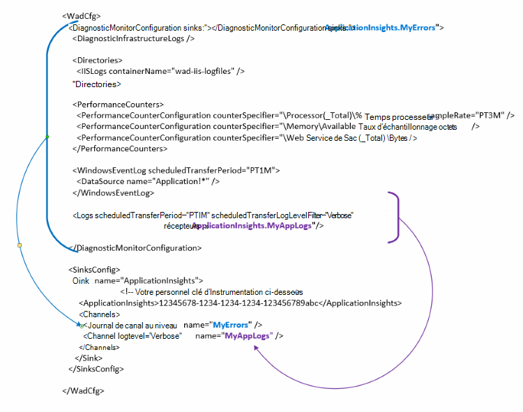

<properties
   pageTitle="Configurer des Diagnostics pour envoyer des données aux analyses d’Application Azure | Microsoft Azure"
   description="Mettre à jour la configuration de public Azure Diagnostics pour envoyer des données aux analyses de l’Application."
   services="multiple"
   documentationCenter=".net"
   authors="sbtron"
   manager="douge"
   editor="" />
<tags
   ms.service="application-insights"
   ms.devlang="na"
   ms.topic="article"
   ms.tgt_pltfrm="na"
   ms.workload="na"
   ms.date="12/15/2015"
   ms.author="saurabh" />

# Configurer les Diagnostics Azure pour envoyer des données aux analyses de l’Application

Diagnostics de Windows Azure stocke les données dans les tables de stockage Azure.  Toutefois, vous pouvez également tuyau tous ou un sous-ensemble des données pour les analyses de l’Application en configurant des « récepteurs » et les « canaux » dans votre configuration lors de l’utilisation d’extension de Diagnostics d’Azure 1.5 ou version ultérieure.

Cet article explique comment créer la configuration publique pour l’extension de Diagnostics d’Azure afin que son configuré pour envoyer des données aux analyses de l’Application.

## Configuration des perspectives d’Application sous la forme d’un récepteur

L’extension de diagnostics de Windows Azure 1.5 introduit la **<SinksConfig>** élément dans la configuration de publique. Cette opération définit le supplémentaires *récepteur* où les données de diagnostic Azure peuvent être envoyées. Vous pouvez spécifier les détails de la ressource de perspectives de l’Application dans laquelle vous souhaitez envoyer les données de diagnostics de Windows Azure dans le cadre de cette **<SinksConfig>**.
Un exemple de la **SinksConfig** se présente comme suit :  

    <SinksConfig>
        <Sink name="ApplicationInsights">
          <ApplicationInsights>{Insert InstrumentationKey}</ApplicationInsights>
          <Channels>
            <Channel logLevel="Error" name="MyTopDiagData"  />
            <Channel logLevel="Verbose" name="MyLogData"  />
          </Channels>
        </Sink>
      </SinksConfig>

Pour l’élément **récepteur de** l’attribut *name* spécifie une valeur de chaîne qui sera utilisée pour désigner le récepteur unique.
L’élément **ApplicationInsights** spécifie la clé de l’instrumentation de la ressource de perspectives d’Application où seront envoyées les données diagnostics de Windows Azure. Si vous n’avez pas une ressource d’idées d’Application existante, voir [Création d’une nouvelle ressource de perspectives de l’Application](./application-insights/app-insights-create-new-resource.md) pour plus d’informations sur la création d’une ressource et l’obtention de la clé de l’instrumentation.

Si vous développez un projet de Service Cloud avec Azure SDK 2.8 cette clé d’instrumentation est remplie automatiquement dans la configuration public en fonction du paramètre de configuration du service **APPINSIGHTS_INSTRUMENTATIONKEY** lors de la compression du projet de service cloud. Reportez-vous à la section [Utilisation des analyses de Application avec Diagnostics Azure pour résoudre les problèmes de Service Cloud](./cloud-services/cloud-services-dotnet-diagnostics-applicationinsights.md).

L’élément de **canaux** permet de définir un ou plusieurs éléments de **canal** pour les données qui seront envoyées au récepteur. Le canal agit comme un filtre et vous pouvez sélectionner les niveaux de journal spécifique que vous ne souhaitez pas envoyer au récepteur. Par exemple vous pouvez collecter des journaux détaillés et les envoyer vers le stockage, mais vous pouvez choisir de définir un canal avec un niveau de journal d’erreur, et lorsque vous envoyez des journaux que les erreurs seulement canal seront envoyés à ce récepteur.
Pour un **canal** de l’attribut *name* est utilisé pour faire référence de manière unique à ce canal.
L’attribut *loglevel* vous permet de spécifier le niveau de journalisation qui permettre du canal. Les niveaux du journal disponible dans l’ordre des informations plus au moins sont
 - Commentaires
 - Informations
 - Avertissement
 - Erreur
 - Critique

## Envoyer des données vers le récepteur de perspectives de l’Application
Une fois que le récepteur d’idées d’Application a été défini vous pouvez envoyer des données à ce récepteur en ajoutant l’attribut *récepteur* aux éléments sous le nœud **DiagnosticMonitorConfiguration** . Ajout de l’élément de *récepteurs* à chaque nœud Spécifie que les données collectées à partir de ce nœud et de n’importe quel nœud sous celui-ci à envoyer au récepteur spécifié.

Par exemple, si vous souhaitez envoyer toutes les données collectées par les diagnostics de Windows Azure vous pouvez ajouter l’attribut *récepteur* directement au nœud **DiagnosticMonitorConfiguration** . La valeur des *récepteurs* sur le nom de récepteur qui a été spécifié dans le **SinkConfig**.

    <DiagnosticMonitorConfiguration overallQuotaInMB="4096" sinks="ApplicationInsights">

Si vous souhaitez envoyer les journaux d’erreurs uniquement pour les analyses de l’Application de récepteur puis vous pouvez définir la valeur de *récepteurs* au récepteur nom suivi du nom de canal séparé par un point («. »). Par exemple, pour envoyer des journaux d’erreurs uniquement pour les analyses d’Application récepteur utilise le canal de MyTopDiagdata qui a été défini dans le SinksConfig ci-dessus.  

    <DiagnosticMonitorConfiguration overallQuotaInMB="4096" sinks="ApplicationInsights.MyTopDiagdata">

Si vous souhaitez uniquement envoyer les journaux d’application détaillé aux analyses d’Application vous ajouteriez puis l’attribut *récepteurs* pour le nœud **journaux** .

    <Logs scheduledTransferPeriod="PT1M" scheduledTransferLogLevelFilter="Verbose" sinks="ApplicationInsights.MyLogData"/>

Vous pouvez également inclure plusieurs récepteurs dans la configuration à différents niveaux dans la hiérarchie. Dans ce cas le récepteur spécifié au niveau supérieur de la hiérarchie joue un paramètre global et celui spécifié à l’élément individuel élément actes comme une substitution de paramètre global.    

Voici un exemple complet de fichier de configuration publics qui envoie toutes les erreurs d’idées d’Application (spécifiée au niveau du nœud de **DiagnosticMonitorConfiguration** ) et les journaux de niveau de plus détaillés pour les journaux de l’Application (spécifié dans le nœud **journaux** ).

    <WadCfg>
      <DiagnosticMonitorConfiguration overallQuotaInMB="4096"
           sinks="ApplicationInsights.MyTopDiagData"> <!-- All info below sent to this channel -->
        <DiagnosticInfrastructureLogs />
        <PerformanceCounters>
          <PerformanceCounterConfiguration counterSpecifier="\Processor(_Total)\% Processor Time" sampleRate="PT3M" sinks="ApplicationInsights.MyLogData/>
          <PerformanceCounterConfiguration counterSpecifier="\Memory\Available MBytes" sampleRate="PT3M" />
          <PerformanceCounterConfiguration counterSpecifier="\Web Service(_Total)\Bytes Total/Sec" sampleRate="PT3M" />
        </PerformanceCounters>
        <WindowsEventLog scheduledTransferPeriod="PT1M">
          <DataSource name="Application!*" />
        </WindowsEventLog>
        <Logs scheduledTransferPeriod="PT1M" scheduledTransferLogLevelFilter="Verbose"
                sinks="ApplicationInsights.MyLogData"/> <!-- This specific info sent to this channel -->
      </DiagnosticMonitorConfiguration>

    <SinksConfig>
        <Sink name="ApplicationInsights">
          <ApplicationInsights>{Insert InstrumentationKey}</ApplicationInsights>
          <Channels>
            <Channel logLevel="Error" name="MyTopDiagData"  />
            <Channel logLevel="Verbose" name="MyLogData"  />
          </Channels>
        </Sink>
      </SinksConfig>
    </WadCfg>

Il existe certaines limitations à être conscient de cette fonctionnalité

- Les canaux sont uniquement destinés à fonctionner avec le type de journal et pas les compteurs de performance. Si vous spécifiez un canal avec un élément de compteur de performance, il sera ignoré.
- Le niveau de journalisation pour un canal ne peut pas dépasser le niveau de journalisation pour ce qui est collecté par les diagnostics de Windows Azure. Par exemple : vous ne peut pas collecter les erreurs dans le journal d’Application dans l’élément de journaux et essayez d’envoyer des commentaires journaux au récepteur d’Application Insight. L’attribut *scheduledTransferLogLevelFilter* doit collecter toujours égal ou plus de journaux que les journaux que vous essayez d’envoyer à un récepteur.
- Impossible d’envoyer des données blob collectées par extension de diagnostics de Windows Azure pour les perspectives de l’Application. Par exemple quoi que ce soit spécifié sous le nœud de *répertoires* . Pour les vidages sur incident le vidage sur incident réel continuera d’être envoyé au stockage blob et uniquement une notification que le vidage sur incident a été généré sera envoyée aux analyses de l’Application.

## Étapes suivantes

- Utilisation de [PowerShell](./cloud-services/cloud-services-diagnostics-powershell.md) pour activer l’extension de diagnostics de Windows Azure pour votre application. 
- Utilisez [Visual Studio](vs-azure-tools-diagnostics-for-cloud-services-and-virtual-machines.md) pour activer l’extension de diagnostics de Windows Azure pour votre application
