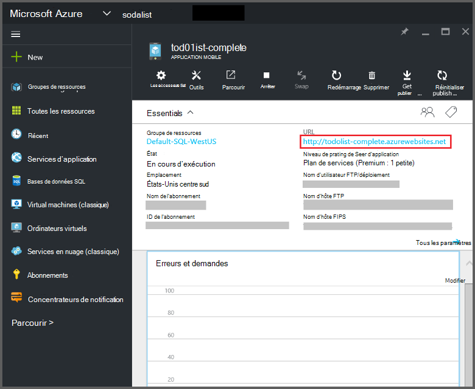
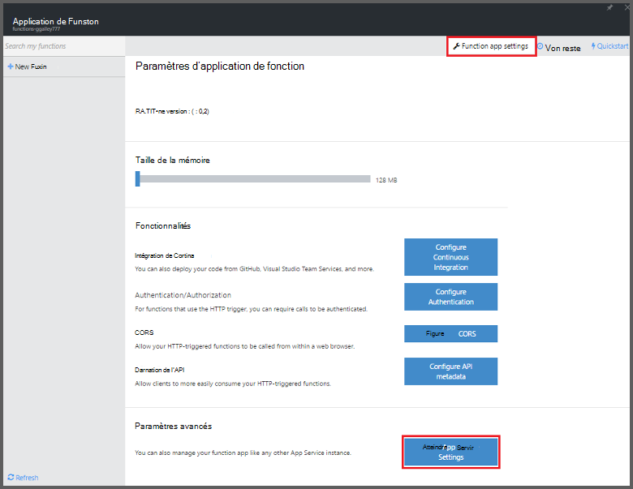
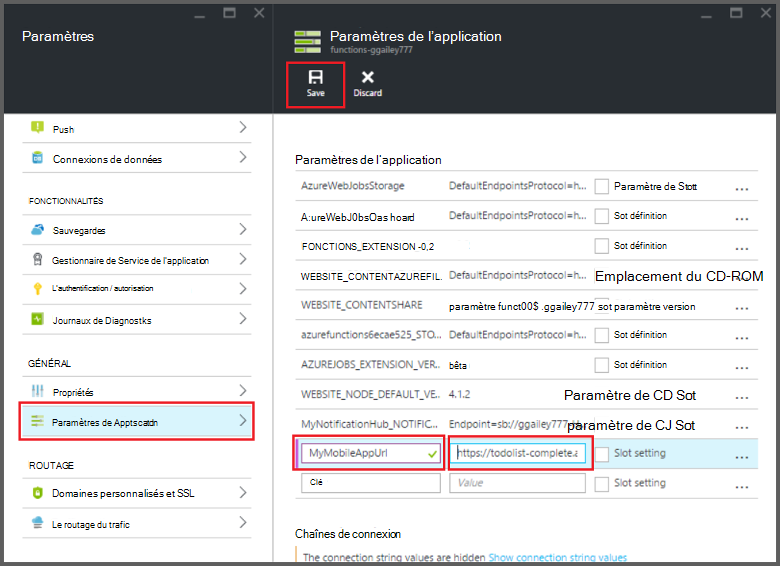

<properties
    pageTitle="Les liaisons de fonctions Mobile applications Azure | Microsoft Azure"
    description="Comprendre l’utilisation des liaisons d’applications Mobile de Azure dans les fonctions d’Azure."
    services="functions"
    documentationCenter="na"
    authors="ggailey777"
    manager="erikre"
    editor=""
    tags=""
    keywords="fonctions Azure, fonctions, traitement de l’événement, calcul dynamique, architecture sans serveur"/>

<tags
    ms.service="functions"
    ms.devlang="multiple"
    ms.topic="reference"
    ms.tgt_pltfrm="multiple"
    ms.workload="na"
    ms.date="08/30/2016"
    ms.author="glenga"/>

# Liaisons de fonctions Mobile applications Azure

[AZURE.INCLUDE [functions-selector-bindings](../../includes/functions-selector-bindings.md)]

Cet article explique comment configurer et liaisons d’Azure Mobile Apps de code dans des fonctions d’Azure. 

[AZURE.INCLUDE [intro](../../includes/functions-bindings-intro.md)] 

Azure App Service Mobile Apps vous permet d’exposer les données de point de terminaison de table pour les clients mobiles. Ces mêmes données sous forme de tableau peuvent être utilisées à la fois d’entrée et de sortie des liaisons dans les fonctions d’Azure. Parce qu’il prend en charge le schéma dynamique, une application mobile du back-end Node.js est idéale pour exposer les données sous forme de tableau à utiliser avec vos fonctions. Schéma dynamique est activée par défaut et doit être désactivé dans une application de production mobile. Pour plus d’informations sur les points de terminaison de table dans un back-end Node.js, consultez [Overview : opérations sur la table](../app-service-mobile/app-service-mobile-node-backend-how-to-use-server-sdk.md#TableOperations). Dans les applications mobiles, le back-end Node.js prend en charge le portail de navigation et la modification de tables. Pour plus d’informations, consultez [dans portail d’édition](../app-service-mobile/app-service-mobile-node-backend-how-to-use-server-sdk.md#in-portal-editing) dans la rubrique du Kit de développement logiciel Node.js. Lorsque vous utilisez une application mobile du back-end .NET avec des fonctions d’Azure, vous devez manuellement mettre à jour votre modèle de données requis par votre fonction. Pour plus d’informations sur les points de terminaison de table dans une application mobile back-end de .NET, consultez [Comment : définir un contrôleur de la table](../app-service-mobile/app-service-mobile-dotnet-backend-how-to-use-server-sdk.md#define-table-controller) dans la rubrique de kit de développement .NET back-end. 

## Créer une variable d’environnement pour l’URL de votre application mobile back-end

Liaisons d’applications Mobile requièrent actuellement vous permet de créer une variable d’environnement qui renvoie l’URL de la principale application mobile lui-même. Cette URL peut trouver dans [Azure portal](https://portal.azure.com) par la localisation de votre application mobile et l’ouverture de la lame.

Pour définir cette URL comme une variable d’environnement dans votre application de fonction :

1. Dans votre application de la fonction dans les [fonctions d’Azure portal](https://functions.azure.com/signin), cliquez sur **paramètres de l’application fonction** > **accéder aux paramètres du Service de l’application**. 

    

2. Dans votre application de la fonction, cliquez sur **tous les paramètres**, faites défiler jusqu'à de **paramètres d’Application**, puis sous type de **paramètres d’application** d’un nouveau **nom** pour la variable d’environnement, collez l’URL dans la **valeur**, pensez à utiliser le schéma HTTPS, puis cliquez sur **Enregistrer** et fermez la blade d’application de fonction pour retourner sur le portail de fonctions.   

    

Vous pouvez maintenant définir cette variable d’environnement que le champ de *connexion* dans vos liaisons.

## Utiliser une clé d’API pour sécuriser l’accès à vos points de terminaison de table applications Mobile.

Dans les fonctions d’Azure, liaisons de la table mobile vous permettent de spécifier une clé d’API, qui est un secret partagé qui peut être utilisé pour empêcher les accès indésirables à partir d’applications de vos fonctions. Applications Mobile n’est pas prise en charge intégrée pour l’authentification par clé API. Toutefois, vous pouvez implémenter une clé API dans votre application mobile du back-end Node.js en suivant les exemples de [back-end le Service Azure App Apps Mobile mise en œuvre d’une clé d’API](https://github.com/Azure/azure-mobile-apps-node/tree/master/samples/api-key). Vous pouvez de même implémenter une clé API dans une [application mobile du back-end .NET](https://github.com/Azure/azure-mobile-apps-net-server/wiki/Implementing-Application-Key).

>[AZURE.IMPORTANT] Cette clé API ne doit pas être distribuée avec vos clients de l’application mobile, il doit uniquement être distribuée en toute sécurité aux clients côté service, comme les fonctions d’Azure. 

## Les applications Azure Mobile d’entrée de liaison

Les liaisons d’entrée peuvent charger un enregistrement à partir d’un point de terminaison de table mobile et passer directement à votre liaison. L’enregistrement de QU'ID est déterminé selon le déclencheur qui a appelé la fonction. Dans une fonction C#, toutes les modifications apportées à l’enregistrement sont automatiquement envoyées à la table, lorsque la fonction se termine avec succès.

#### Function.JSON pour la liaison d’entrée des applications Mobile

Le fichier *function.json* prend en charge les propriétés suivantes :

- `name`: Nom variable utilisée dans le code de la fonction pour le nouvel enregistrement.
- `type`: Salle de type doit avoir la valeur *mobileTable*.
- `tableName`: La table où sera créé le nouvel enregistrement.
- `id`: L’ID de l’enregistrement à récupérer. Cette propriété prend en charge les liaisons semblables à `{queueTrigger}`, qui utilise la valeur de la chaîne de message de la file d’attente comme enregistrement ID.
- `apiKey`: Chaîne qui est le paramètre d’application qui spécifie la clé API facultative pour l’application mobile. Cela est nécessaire lorsque votre application mobile utilise une clé d’API pour restreindre l’accès du client.
- `connection`: Chaîne qui est le nom de la variable d’environnement dans les paramètres de l’application qui spécifie l’URL de votre back-end de l’application mobile.
- `direction`: Direction, qui doit être définie *pour*la liaison.

Exemple de fichier *function.json* :

    {
      "bindings": [
        {
          "name": "record",
          "type": "mobileTable",
          "tableName": "MyTable",
          "id" : "{queueTrigger}",
          "connection": "My_MobileApp_Url",
          "apiKey": "My_MobileApp_Key",
          "direction": "in"
        }
      ],
      "disabled": false
    }

#### Exemple de code Mobile applications Azure d’un déclencheur de file d’attente de C#

Basé sur le function.json d’exemple ci-dessus, le récupère de liaison d’entrée que l’enregistrement à partir d’un Apps Mobile table de point de terminaison avec l’ID qui correspond à la chaîne de message de file d’attente et le passe à *l’enregistrement* de paramètre. Lorsque l’enregistrement est introuvable, le paramètre est null. L’enregistrement est ensuite mis à jour avec la nouvelle valeur de *texte* lorsque la fonction s’arrête.

    #r "Newtonsoft.Json"    
    using Newtonsoft.Json.Linq;
    
    public static void Run(string myQueueItem, JObject record)
    {
        if (record != null)
        {
            record["Text"] = "This has changed.";
        }    
    }

#### Exemple de code Mobile applications Azure d’un déclencheur de la file d’attente Node.js

Basé sur le function.json d’exemple ci-dessus, le récupère de liaison d’entrée que l’enregistrement à partir d’un Apps Mobile table de point de terminaison avec l’ID qui correspond à la chaîne de message de file d’attente et le passe à *l’enregistrement* de paramètre. Dans les fonctions Node.js, les enregistrements mis à jour ne sont pas envoyés à la table. Cet exemple de code écrit l’enregistrement récupéré dans le journal.

    module.exports = function (context, input) {    
        context.log(context.bindings.record);
        context.done();
    };

## Liaison de sortie des applications Mobile Azure

Votre fonction peut écrire un enregistrement à un point de terminaison du tableau applications Mobile à l’aide d’une liaison de sortie. 

#### liaison de sortie Function.JSON pour les applications mobiles

Le fichier function.json prend en charge les propriétés suivantes :

- `name`: Nom variable utilisée dans le code de la fonction pour le nouvel enregistrement.
- `type`: Type de liaison qui doit être définie sur *mobileTable*.
- `tableName`: La table dans laquelle le nouvel enregistrement est créé.
- `apiKey`: Chaîne qui est le paramètre d’application qui spécifie la clé API facultative pour l’application mobile. Cela est nécessaire lorsque votre application mobile utilise une clé d’API pour restreindre l’accès du client.
- `connection`: Chaîne qui est le nom de la variable d’environnement dans les paramètres de l’application qui spécifie l’URL de votre back-end de l’application mobile.
- `direction`: Direction, qui doit être définie pour *les*de liaison.

Function.json de l’exemple :

    {
      "bindings": [
        {
          "name": "record",
          "type": "mobileTable",
          "tableName": "MyTable",
          "connection": "My_MobileApp_Url",
          "apiKey": "My_MobileApp_Key",
          "direction": "out"
        }
      ],
      "disabled": false
    }

#### Exemple de code Mobile applications Azure d’un déclencheur de file d’attente de C#

Cet exemple de code C# insère un nouvel enregistrement dans un point de terminaison du tableau applications Mobile avec une propriété *Text* dans la table spécifiée dans la liaison ci-dessus.

    public static void Run(string myQueueItem, out object record)
    {
        record = new {
            Text = $"I'm running in a C# function! {myQueueItem}"
        };
    }

#### Exemple de code Mobile applications Azure d’un déclencheur de la file d’attente Node.js

Cet exemple de code Node.js insère un nouvel enregistrement dans un point de terminaison du tableau applications Mobile avec une propriété *text* dans la table spécifiée dans la liaison ci-dessus.

    module.exports = function (context, input) {
    
        context.bindings.record = {
            text : "I'm running in a Node function! Data: '" + input + "'"
        }   
    
        context.done();
    };

## Étapes suivantes

[AZURE.INCLUDE [next steps](../../includes/functions-bindings-next-steps.md)]
