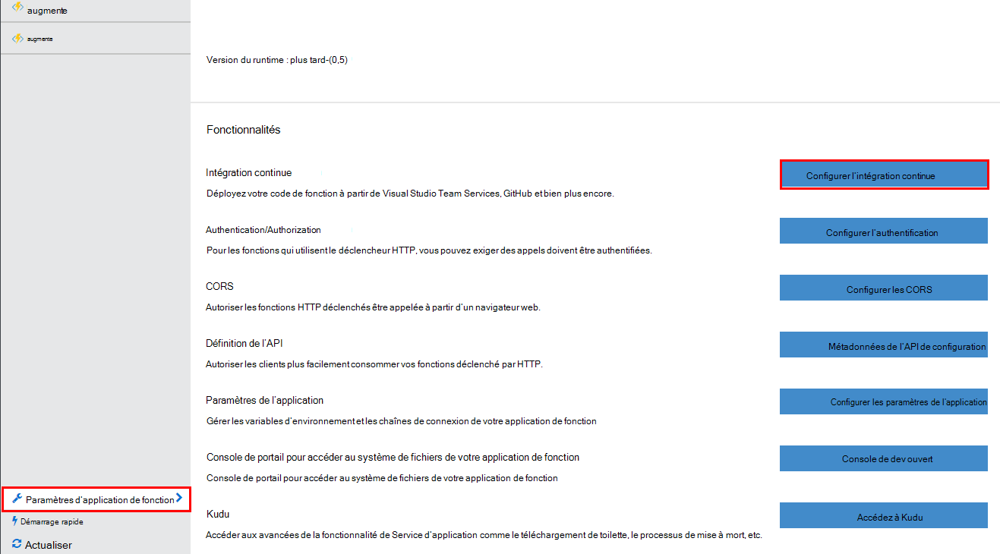
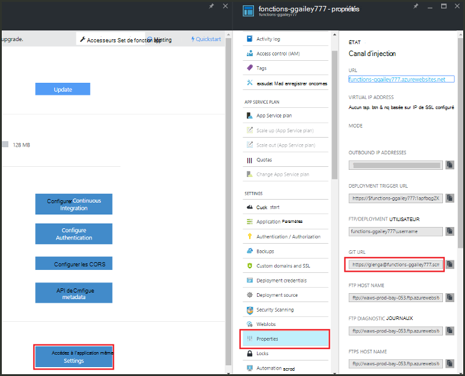

<properties
   pageTitle="Déploiement en continu pour les fonctions d’Azure | Microsoft Azure"
   description="Installations de DEPLOIEMENT continu de Service d’application Azure permet de publier vos fonctions Azure."
   services="functions"
   documentationCenter="na"
   authors="ggailey777"
   manager="erikre"
   editor=""
   tags=""
   />

<tags
   ms.service="functions"
   ms.devlang="multiple"
   ms.topic="article"
   ms.tgt_pltfrm="multiple"
   ms.workload="na"
   ms.date="09/25/2016"
   ms.author="glenga"/>

# Déploiement en continu pour les fonctions d’Azure 

Fonctions Azure facilite la configuration d’un déploiement continu pour votre application de la fonction. Fonctions s’appuie sur l’intégration du Service d’application Azure avec BitBucket, échange, GitHub et Visual Studio Team Services (VSTS) pour permettre un flux de travail de déploiement continu où Azure extrait les mises à jour à votre code de fonctions lorsqu’ils sont publiés à l’un de ces services. Si vous ne connaissez pas les fonctions Azure, démarrez avec une [Vue d’ensemble des fonctions Azure](functions-overview.md).

DEPLOIEMENT continu est une option intéressante pour les projets où plusieurs et fréquentes contributions sont intégrées. Il vous permet également de mettre à jour le contrôle de code source sur votre code de fonctions. Les sources de déploiement suivantes sont actuellement prises en charge :

+ [Bitbucket](https://bitbucket.org/)
+ [Boîte de dépôt](https://bitbucket.org/)
+ [Local mis en pension de GIT](../app-service-web/app-service-deploy-local-git.md)
+ Mis en pension externe de GIT
+ [GitHub]
+ Mercurienne emprunteuses externes
+ [OneDrive](https://onedrive.live.com/)
+ Visual Studio Team Services

Les déploiements sont configurés sur une base par-fonction-app. Après déploiement en continu est activée, l’accès au code de la fonction dans le portail est défini *en lecture seule*.

## Exigences de déploiement en continu

Vous devez disposer de votre source de déploiement configurée et votre code de fonctions dans la source de déploiement avant de vous déploiement continu configuration. Dans un déploiement d’application de fonction donnée, chaque fonction se trouve dans un sous-répertoire nommé, le nom du répertoire est le nom de la fonction. Cette structure de dossiers est essentiellement le code de votre site. 

[AZURE.INCLUDE [functions-folder-structure](../../includes/functions-folder-structure.md)]

## DEPLOIEMENT continu de mise en place

Utilisez la procédure suivante pour configurer le déploiement en continu pour une application de fonction existants :

1. Dans votre application de la fonction dans les [fonctions d’Azure portal](https://functions.azure.com/signin), cliquez sur **paramètres de l’application fonction** > **configurer l’intégration continue** > **le programme d’installation**.

    
    
    
    
    Vous pouvez également accéder à la lame de déploiements dans le démarrage rapide de fonctions en cliquant sur **Démarrer à partir du contrôle de code source**.

2. De la lame de déploiements, cliquez sur **Choisir les sources**, puis remplir les informations de votre source de déploiement choisie, puis cliquez sur **OK**.

    

Une fois le déploiement continue est configuré, tous les fichiers de modifications dans la source de déploiement sont copiés à l’application de la fonction et un déploiement de site complet est déclenché. Le site est redéployé lors de la mise à jour des fichiers de la source.

##Options de déploiement

Certains scénarios de déploiement classiques sont les suivantes :

+ 

###Création d’un déploiement de test

Fonction d’applications ne prend en charge les emplacements de déploiement. Toutefois, vous pouvez toujours gérer des déploiements de reclassement et de production distincts à l’aide de l’intégration continue.

Le processus pour configurer et utiliser un déploiement intermédiaire ressemble généralement à ceci :

1. Créer deux applications de fonction dans votre abonnement, un pour le code de production et un pour la mise en attente. 

2. Créer une source de déploiement, si vous n’en avez pas déjà. Nous allons utiliser [GitHub].
 
3. Pour votre application de fonction de fabrication, suivez les étapes ci-dessus de **DEPLOIEMENT continu de mise en place** et définir la branche du déploiement à la branche principale de votre mis en pension GitHub.

    

4. Répétez cette étape pour l’application de fonction intermédiaire, mais cette fois-ci Choisissez la branche intermédiaire dans votre mis en pension GitHub. Si votre source de déploiement ne prend pas en charge le branchement, utiliser un autre dossier.
 
5. Mettre à jour votre code dans la branche ou le dossier intermédiaire, puis vérifiez que ces modifications sont répercutées dans le déploiement de zone de transit.

6. Après le test, fusion remplace la branche intermédiaire dans la branche principale. Cela déclenche le déploiement de l’application de la fonction production. Si votre source de déploiement ne prend pas en charge les branches, remplacer les fichiers dans le dossier de production avec les fichiers du dossier intermédiaire.

###Déplacer des fonctions existantes au déploiement en continu

Lorsque vous avez des fonctions existantes que vous avez créé et mis à jour dans le portail, vous devez télécharger vos fichiers de code de fonction existants à l’aide de FTP ou le référentiel Git local avant de vous pouvez déploiement continue de configuration tel que décrit ci-dessus. Vous pouvez pour cela dans les paramètres du Service d’application pour votre application de la fonction. Une fois les fichiers téléchargés, vous pouvez les télécharger vers votre source choisi déploiement continue.

>[AZURE.NOTE]Après avoir configuré l’intégration continue, vous ne serez n’est plus en mesure de modifier vos fichiers source dans le portail de fonctions.

####Comment : configurer des informations d’identification de déploiement
Vous pouvez télécharger des fichiers à partir de votre application de fonction, vous devez configurer vos informations d’identification pour accéder au site, vous pouvez le faire à partir du portail. Informations d’identification sont définies au niveau de l’application de fonction.

1. Dans votre application de la fonction dans les [fonctions d’Azure portal](https://functions.azure.com/signin), cliquez sur **paramètres de l’application fonction** > **accéder aux paramètres de l’application de Service** > **les informations d’identification de déploiement**.

    

2. Tapez un nom d’utilisateur et le mot de passe, puis cliquez sur **Enregistrer**. Vous pouvez désormais utiliser ces informations d’identification pour accéder à votre application de la fonction de FTP ou le mis en pension Git intégré.

####Comment : télécharger des fichiers à l’aide de FTP

1. Dans votre application de la fonction dans les [fonctions d’Azure portal](https://functions.azure.com/signin), cliquez sur **paramètres de l’application fonction** > **accéder aux paramètres de l’application de Service** > **Propriétés** et copier les valeurs **d’Utilisateur FTP/déploiement**, **Nom d’hôte FTP**et **FTPS nom d’hôte**.  
**Utilisateur FTP/déploiement** doit être entré tel qu’il apparaît dans le portail, y compris le nom de l’application afin de fournir le contexte approprié pour le serveur FTP.

    
    
2. À partir de votre client FTP, utilisez les informations de connexion réunies pour se connecter à votre application et de télécharger les fichiers sources de vos fonctions.

####Comment : télécharger des fichiers à l’aide du référentiel local Git

1. Dans votre application de la fonction dans les [fonctions d’Azure portal](https://functions.azure.com/signin), cliquez sur **paramètres de l’application fonction** > **configurer l’intégration continue** > **le programme d’installation**.

2. Dans la lame de déploiements, cliquez sur **Choisir les sources**, **référentiel de Git Local**, puis cliquez sur **OK**.
 
3. Cliquez sur **accéder aux paramètres de l’application de Service** > **Propriétés** et notez la valeur de l’URL de Git. 
    
    

4. Cloner le mis en pension sur votre ordinateur local à l’aide d’une ligne de commande prenant en charge Git ou votre outil Git favori. La commande de clone Git ressemble à ceci :

        git clone https://username@my-function-app.scm.azurewebsites.net:443/my-function-app.git

5. Récupérer des fichiers à partir de votre application de fonction sur le clone sur votre ordinateur local, comme dans l’exemple suivant :

        git pull origin master

    Si nécessaire, fournissez le nom d’utilisateur et le mot de passe pour votre déploiement d’application de fonction.  

[GitHub]: https://github.com/
