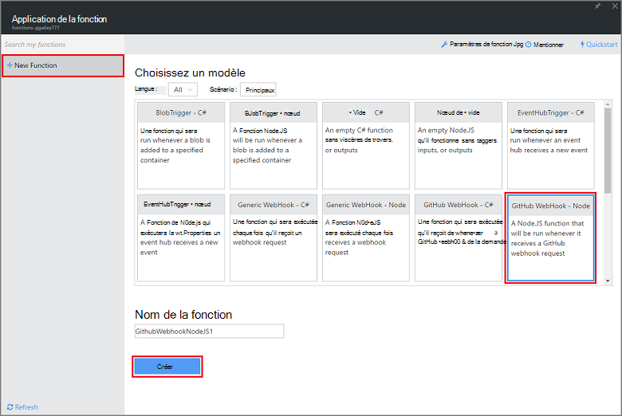
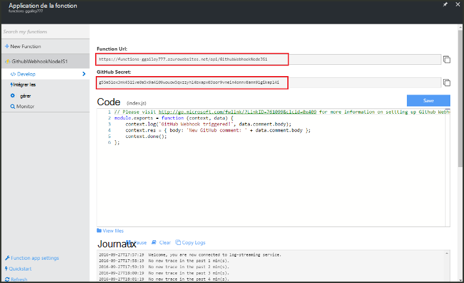
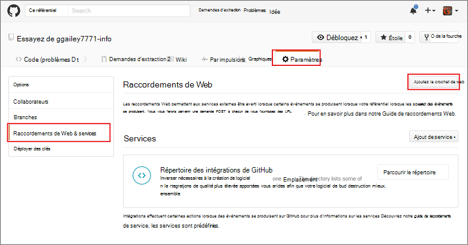
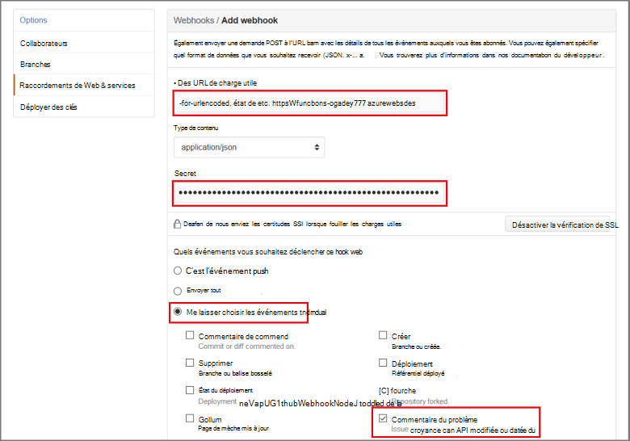

<properties
   pageTitle="Créer un hook de web ou d’une fonction d’API Azure | Microsoft Azure"
   description="Utilisation des fonctions de Azure pour créer une fonction qui est appelée par un WebHook ou les API à appeler."
   services="azure-functions"
   documentationCenter="na"
   authors="ggailey777"
   manager="erikre"
   editor=""
   tags=""
   />

<tags
   ms.service="functions"
   ms.devlang="multiple"
   ms.topic="get-started-article"
   ms.tgt_pltfrm="multiple"
   ms.workload="na"
   ms.date="08/30/2016"
   ms.author="glenga"/>
   
# Créer un webhook ou une fonction d’API Azure

Fonctions Azure est une expérience pilotées par événements, compute-à la demande qui permet de vous permet de créer planifiée ou déclenchée des unités de code implémenté dans une variété de langages de programmation. Pour en savoir plus sur les fonctions d’Azure, consultez la [Vue d’ensemble des fonctions Azure](functions-overview.md).

Cette rubrique vous indique comment créer une nouvelle fonction Node.js qui est appelée par un webhook de GitHub. La nouvelle fonction est créée selon un modèle prédéfini dans le portail de fonctions d’Azure. Vous pouvez également visionner une courte vidéo pour voir comment ces étapes sont effectuées dans le portail.

## Regarder la vidéo

La vidéo suivante montrent comment effectuer les étapes de base dans ce didacticiel 

[AZURE.VIDEO create-a-web-hook-or-api-azure-function]

##Créer une fonction de déclenchement-webhook à partir du modèle

Une application de fonction héberge l’exécution de vos fonctions dans Azure. Avant de créer une fonction, vous devez disposer d’un compte Azure actif. Si vous ne disposez pas d’un compte Azure, [comptes gratuits sont disponibles](https://azure.microsoft.com/free/). 

1. Accédez au [portail de fonctions d’Azure](https://functions.azure.com/signin) et reconnectez-vous avec votre compte Azure.

2. Si vous disposez d’une application existante de la fonction à utiliser, sélectionnez-le à partir de **vos applications de fonction** puis cliquez sur **Ouvrir**. Pour créer une nouvelle application de fonction, un unique **nom** pour votre nouvelle application de fonction ou accepter celui généré, sélectionnez votre préférence **région**, puis cliquez sur **créer + mise en route**. 

3. Dans votre application de la fonction, cliquez sur **nouvelle fonction +** > **GitHub Webhook - nœud** > **créer**. Cela crée une fonction avec un nom par défaut basé sur le modèle spécifié. 

     

4. De **développer**, notez l’exemple de fonction express.js dans la fenêtre de **Code** . Cette fonction reçoit une demande de GitHub d’un webhook de commentaire du problème, enregistre le texte du problème et envoie une réponse à la webhook en tant que `New GitHub comment: <Your issue comment text>`.

     

5. Copier les valeurs de **l’URL de la fonction** et le **Secret de GitHub** . Vous en aurez besoin lorsque vous créez le webhook dans GitHub. 

6. Faites défiler jusqu'à **l’exécution**, notez le corps JSON prédéfini d’un commentaire de problème dans le corps de la demande, puis cliquez sur **exécuter**. 
 
    Vous pouvez toujours tester une nouvelle fonction basée sur un modèle prévu de droite dans l’onglet **développer** en fournissant un corps de données JSON et en cliquant sur le bouton **exécuter** . Dans ce cas, le modèle a un corps prédéfini pour un commentaire de problème. 
 
Ensuite, vous allez créer le webhook réel dans votre référentiel de GitHub.

##Configurer la webhook

1. Dans GitHub, accédez à un référentiel dont vous êtes le propriétaire ; Cela inclut tous les référentiels que vous avez dupliquée.
 
2. Cliquez sur **paramètres** > **services et Webhooks** > **webhook d’ajouter**.

       

3. Coller l’URL de votre fonction et le code secret dans **l’URL de la charge utile** et de **Secret**, puis cliquez sur **me laisser sélectionner des événements individuels**, **commentaire du problème** et cliquez sur **Add webhook**.

     

À ce stade, le webhook de GitHub est configuré pour déclencher votre fonction lors de l’ajout d’un nouveau commentaire de problème.  
Maintenant, il est temps pour le tester.

##Test de la fonction

1. Dans votre mis en pension GitHub, ouvrez l’onglet **problèmes** dans une nouvelle fenêtre de navigateur, cliquez sur **Nouveau problème**, tapez un titre puis cliquez sur **soumettre un nouveau problème**. Vous pouvez également ouvrir un problème existant.

2. Dans ce problème, tapez un commentaire, puis cliquez sur **commentaire**. À ce stade, vous pouvez revenir à votre nouvelle webhook dans GitHub sous les **Dernières livraisons** voir envoyé une demande de webhook et que le corps de réponse est `New GitHub comment: <Your issue comment text>`.

3. Dans le portail de fonctions, faites défiler les journaux et de voir que la fonction a été déclenchée et de la valeur `New GitHub comment: <Your issue comment text>` est écrit dans les journaux de transmission en continu.

##Étapes suivantes

Consultez ces rubriques pour plus d’informations sur les fonctions d’Azure.

+ [Référence du développeur de fonctions Azure](functions-reference.md)  
Référence du programmeur pour les fonctions de codage.
+ [Test des fonctions Azure](functions-test-a-function.md)  
Décrit les divers outils et techniques pour le test de vos fonctions.
+ [Comment faire évoluer les fonctions Azure](functions-scale.md)  
Décrit des plans de service disponibles avec fonctions d’Azure, y compris le plan de service dynamique et comment choisir la solution adaptée.  

[AZURE.INCLUDE [Getting Started Note](../../includes/functions-get-help.md)]
