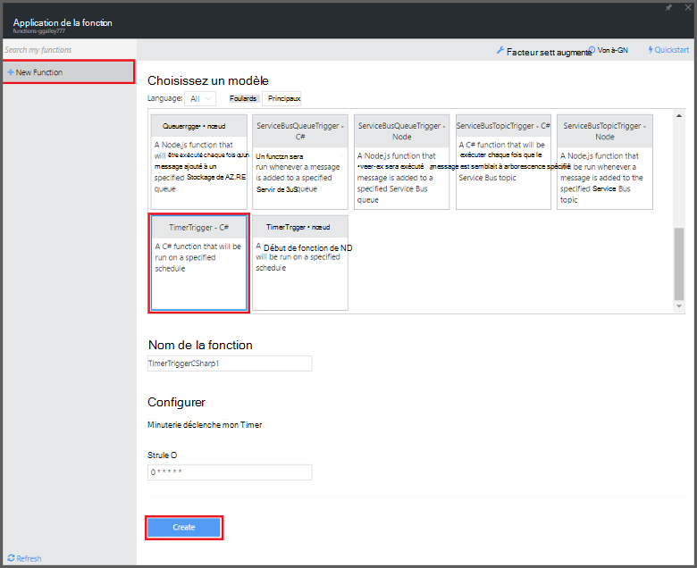
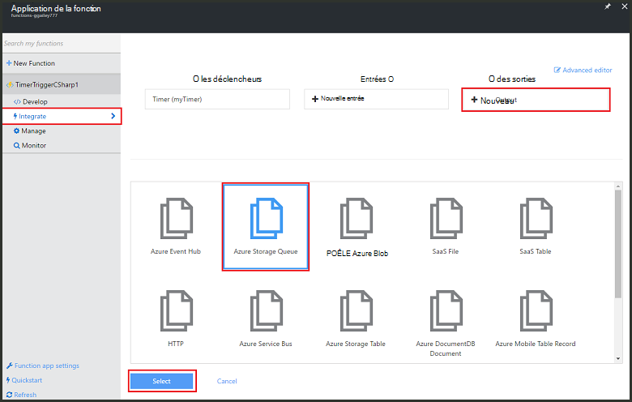
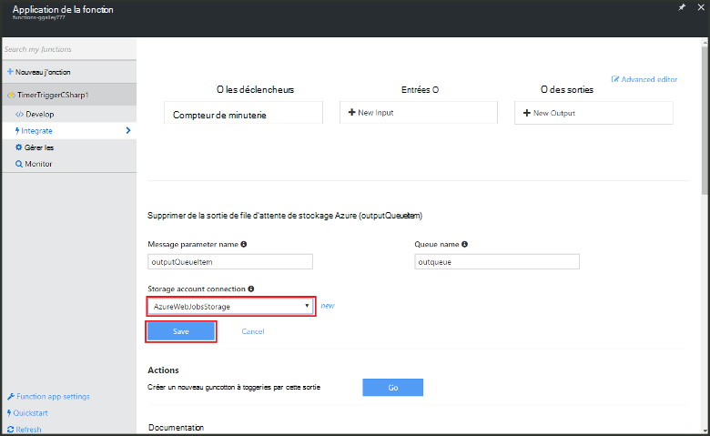

<properties
   pageTitle="Créer une fonction de traitement des événements | Microsoft Azure"
   description="Utiliser des fonctions Azure créer une fonction C# qui s’exécute selon un timer de l’événement."
   services="functions"
   documentationCenter="na"
   authors="ggailey777"
   manager="erikre"
   editor=""
   tags=""
   />

<tags
   ms.service="functions"
   ms.devlang="multiple"
   ms.topic="get-started-article"
   ms.tgt_pltfrm="multiple"
   ms.workload="na"
   ms.date="09/25/2016"
   ms.author="glenga"/>
   
# Créer une fonction d’Azure de traitement d’événement

Fonctions Azure est une expérience pilotées par événements, compute-à la demande qui permet de vous permet de créer planifiée ou déclenchée des unités de code implémenté dans une variété de langages de programmation. Pour en savoir plus sur les fonctions d’Azure, consultez la [Vue d’ensemble des fonctions Azure](functions-overview.md).

Cette rubrique vous indique comment créer une nouvelle fonction dans C# qui s’exécute selon un compteur d’événement pour ajouter des messages à une file d’attente de stockage. 

## Conditions préalables 

Avant de créer une fonction, vous devez disposer d’un compte Azure actif. Si vous ne disposez pas d’un compte Azure, [comptes gratuits sont disponibles](https://azure.microsoft.com/free/).

## Créer une fonction timer déclenchées à partir du modèle

Une application de fonction héberge l’exécution de vos fonctions dans Azure. Avant de créer une fonction, vous devez disposer d’un compte Azure actif. Si vous ne disposez pas d’un compte Azure, [comptes gratuits sont disponibles](https://azure.microsoft.com/free/). 

1. Accédez au [portail de fonctions d’Azure](https://functions.azure.com/signin) et reconnectez-vous avec votre compte Azure.

2. Si vous disposez d’une application existante de la fonction à utiliser, sélectionnez-le à partir de **vos applications de fonction** puis cliquez sur **Ouvrir**. Pour créer une nouvelle application de fonction, un unique **nom** pour votre nouvelle application de fonction ou accepter celui généré, sélectionnez votre préférence **région**, puis cliquez sur **créer + mise en route**. 

3. Dans votre application de la fonction, cliquez sur **nouvelle fonction +** > **TimerTrigger - C#** > **créer**. Cela crée une fonction avec un nom par défaut qui est exécuté sur la planification par défaut de toutes les minutes. 

    

4. Dans votre fonction de nouveau, cliquez sur l’onglet **intégration** > **Nouvelle sortie** > **File d’attente de stockage Azure** > **Sélectionner**.

    

5. Dans la **sortie de la file d’attente de stockage Azure**, sélectionnez une **connexion de compte de stockage**existante, ou créer un nouveau, puis cliquez sur **Enregistrer**. 

    

6. Dans l’onglet **développer** , remplacez le script C# existant dans la fenêtre de **Code** par le code suivant :

        using System;
        
        public static void Run(TimerInfo myTimer, out string outputQueueItem, TraceWriter log)
        {
            // Add a new scheduled message to the queue.
            outputQueueItem = $"Ping message added to the queue at: {DateTime.Now}.";
            
            // Also write the message to the logs.
            log.Info(outputQueueItem);
        }

    Ce code ajoute un nouveau message à la file d’attente avec la date et l’heure lorsque la fonction est exécutée.

7. Cliquez sur **Enregistrer** et surveiller les **journaux** windows pour la prochaine exécution de la fonction.

8. (Facultatif) Naviguez vers le compte de stockage et vérifiez que les messages sont ajoutés à la file d’attente.

9. Revenez à l’onglet **d’intégrer** et de modifier le champ de planning de `0 0 * * * *`. La fonction exécute maintenant une fois par heure. 

Il s’agit d’un très simplifié liaison de sortie de l’exemple d’un déclencheur de minuterie et d’une file d’attente de stockage. Pour plus d’informations, consultez le [déclencheur de minuterie de fonctions d’Azure](functions-bindings-timer.md) et les rubriques [des déclencheurs de fonctions d’Azure et les liaisons pour le stockage Azure](functions-bindings-storage.md) .

##Étapes suivantes

Consultez ces rubriques pour plus d’informations sur les fonctions d’Azure.

+ [Référence du développeur de fonctions Azure](functions-reference.md)  
Référence du programmeur pour les fonctions de codage et de définition des déclencheurs et des liaisons.
+ [Test des fonctions Azure](functions-test-a-function.md)  
Décrit les divers outils et techniques pour le test de vos fonctions.
+ [Comment faire évoluer les fonctions Azure](functions-scale.md)  
Décrit des plans de service disponibles avec fonctions d’Azure, y compris le plan de service dynamique et comment choisir la solution adaptée.  

[AZURE.INCLUDE [Getting Started Note](../../includes/functions-get-help.md)]
