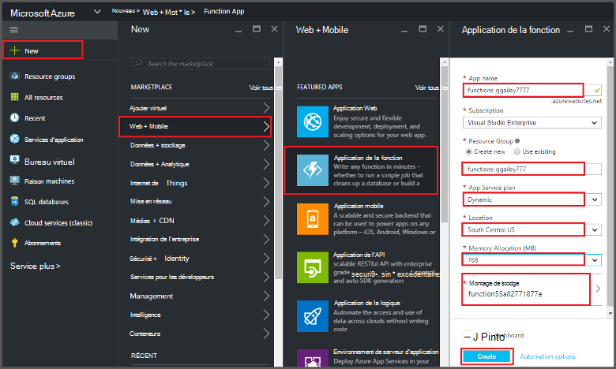
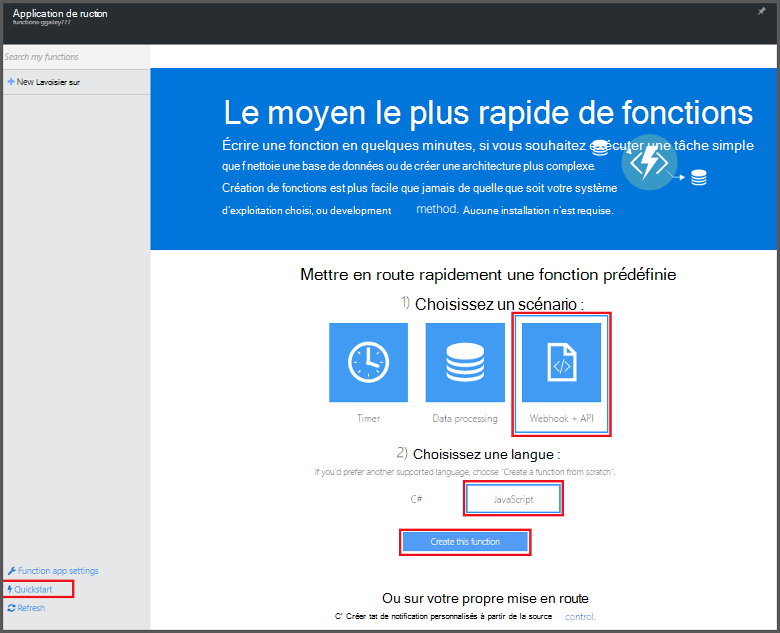
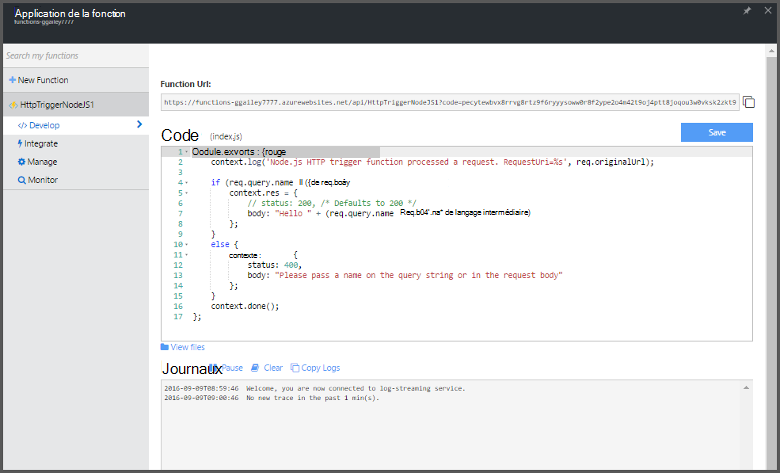

<properties
   pageTitle="Créez une fonction à partir du portail Azure | Microsoft Azure"
   description="Créer votre première fonction d’Azure, une application sans serveur, en moins de deux minutes."
   services="functions"
   documentationCenter="na"
   authors="ggailey777"
   manager="erikre"
   editor=""
   tags=""
/>

<tags
   ms.service="functions"
   ms.devlang="multiple"
   ms.topic="article"
   ms.tgt_pltfrm="multiple"
   ms.workload="na"
   ms.date="09/08/2016"
   ms.author="glenga"/>

#Créez une fonction à partir du portail Azure

##Vue d’ensemble
Fonctions Azure est une expérience pilotées par événements, compute-à la demande qui s’étend de la plate-forme d’application Azure existante avec les fonctionnalités à implémenter le code déclenchée par des événements se produisant dans d’autres services Azure, produits de SaaS et les systèmes sur site. Avec des fonctions d’Azure, vos applications mise à l’échelle en fonction de la demande et que vous payez uniquement pour les ressources que vous utilisez. Azure permet de fonctions vous permet de créer planifiée ou déclenchée des unités de code implémenté dans différents langages de programmation. Pour en savoir plus sur les fonctions d’Azure, consultez la [Vue d’ensemble des fonctions Azure](functions-overview.md).

Cette rubrique vous indique comment utiliser le portail Azure pour créer un simple « hello world » Node.js Azure fonction qui est appelée par un déclencheur de HTTP. Avant de créer une fonction dans le portail Azure, vous devez créer explicitement une application de la fonction dans le Service d’application Azure. Pour que l’application de la fonction créée automatiquement pour vous, consultez [le didacticiel de démarrage rapide de fonctions d’Azure autres](functions-create-first-azure-function.md), qui est une expérience quickstart plus simple et inclut une vidéo.

##Créer une application de fonction

Une application de fonction héberge l’exécution de vos fonctions dans Azure. Suivez ces étapes pour créer une application de la fonction dans le portail Azure.

Avant de créer votre première fonction, vous devez disposer d’un compte Azure actif. Si vous ne disposez pas d’un compte Azure, [comptes gratuits sont disponibles](https://azure.microsoft.com/free/).

1. Accédez au [portail Azure](https://portal.azure.com) et reconnectez-vous avec votre compte Azure.

2. Cliquez sur **+ Nouveau** > **Web + Mobile** > **Fonction App**, activez votre **abonnement**, tapez un **nom** unique qui identifie votre application de la fonction, puis spécifiez les paramètres suivants :

    + **[Groupe de ressources](../azure-portal/resource-group-portal.md/)**: sélectionnez **Créer nouveau** et entrez un nom pour votre nouveau groupe de ressources. Vous pouvez également choisir un groupe de ressources existant, mais vous ne serez peut-être pas en mesure de créer un plan de Service d’application dynamique pour votre application de la fonction.
    + **[Plan de Service d’application](../app-service/azure-web-sites-web-hosting-plans-in-depth-overview.md)**: choisissez *dynamique* ou *classique*. 
        + **Dynamic**: le type de plan par défaut pour les fonctions d’Azure. Lorsque vous choisissez un plan dynamique, vous devez également choisir l' **emplacement** et la valeur de l' **Allocation de mémoire** (en Mo). Pour plus d’informations sur l’allocation de mémoire sur les coûts, consultez [tarification des fonctions d’Azure](https://azure.microsoft.com/pricing/details/functions/). 
        + **Classique**: un plan de Service d’application classique, vous devez créer un **plan de Service d’application/emplacement** ou sélectionnez-en une existante. Ces paramètres déterminent l' [emplacement, de fonctionnalités, de coûts et les ressources de calcul](https://azure.microsoft.com/pricing/details/app-service/) associés à votre application.  
    + **Compte de stockage**: chaque application de fonction requiert un compte de stockage. Vous pouvez choisir un compte de stockage existant ou en créer un. 

    

3. Cliquez sur **créer** pour la fourniture et le déploiement de la nouvelle application de la fonction.  

Maintenant que l’application de la fonction est mis en service, vous pouvez créer votre première fonction.

## Créer une fonction

Ces étapes créent une fonction de démarrage rapide les fonctions Azure.

1. Dans l’onglet **démarrage rapide** , cliquez sur **WebHook + API** **JavaScript**, puis cliquez sur **créer une fonction**. Une nouvelle fonction Node.js prédéfinie est créée. 

    

2. (Facultatif) À ce stade dans le démarrage rapide, vous pouvez choisir d’afficher une présentation rapide des fonctionnalités des fonctions d’Azure dans le portail.   Une fois que vous avez terminé ou ignoré la visite guidée, vous pouvez tester votre nouvelle fonction à l’aide du déclencheur HTTP.

##Test de la fonction

Étant donné que les Démarrages rapides d’Azure fonctions contient le code fonctionnel, vous pouvez tester immédiatement votre nouvelle fonction.

1. Dans l’onglet **développer** , examinez la fenêtre **Code** et notez que ce code Node.js attend une demande HTTP avec une valeur de *nom* passée dans le corps du message ou dans une chaîne de requête. Lorsque la fonction s’exécute, cette valeur est retournée dans le message de réponse.

    

2. Faites défiler jusqu'à la zone de texte **corps de requête** , modifiez la valeur de la propriété de *nom* à votre nom, puis sur **exécuter**. Vous voyez que l’exécution est déclenchée par une requête HTTP de test, les informations sont écrites dans les journaux de diffusion en continu et la réponse « hello » est affichée dans la **sortie**. 

3. Pour déclencher l’exécution de la même fonction à partir d’une autre fenêtre de navigateur ou un autre onglet, copier la valeur de **l’URL de la fonction** à partir de l’onglet **développer** et collez-le dans une barre d’adresse du navigateur, puis ajoutez la valeur de chaîne de requête `&name=yourname` et appuyez sur ENTRÉE. Les mêmes informations sont écrites dans les journaux et le navigateur affiche la réponse « hello » comme avant.

##Étapes suivantes

Ce démarrage rapide montre une exécution très simple d’une fonction déclenché par HTTP de base. Consultez ces rubriques pour plus d’informations sur l’utilisation de la puissance des fonctions d’Azure dans vos applications.

+ [Référence du développeur de fonctions Azure](functions-reference.md)  
Référence du programmeur pour les fonctions de codage et de définition des déclencheurs et des liaisons.
+ [Test des fonctions Azure](functions-test-a-function.md)  
Décrit les divers outils et techniques pour le test de vos fonctions.
+ [Comment faire évoluer les fonctions Azure](functions-scale.md)  
Décrit des plans de service disponibles avec fonctions d’Azure, y compris le plan de service dynamique et comment choisir la solution adaptée. 
+ [Quel est le Service d’application Azure ?](../app-service/app-service-value-prop-what-is.md)  
Fonctions Azure utilise la plate-forme de services d’application Azure pour les fonctionnalités principales telles que les déploiements, les variables d’environnement et les tests de diagnostic. 

[AZURE.INCLUDE [Getting Started Note](../../includes/functions-get-help.md)]
