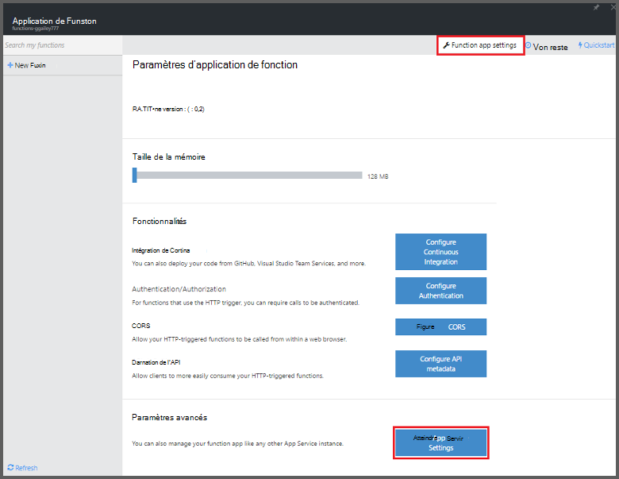
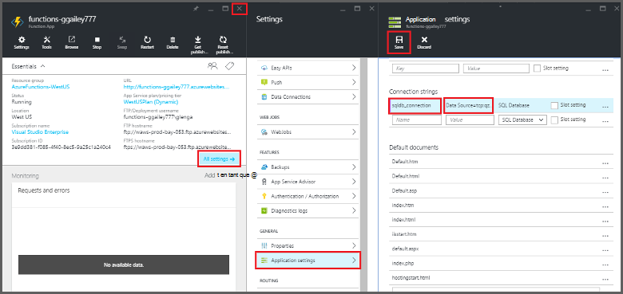

<properties
   pageTitle="Fonctions d’Azure permet d’effectuer une tâche de nettoyage | Microsoft Azure"
   description="Utiliser des fonctions Azure créer une fonction C# qui s’exécute selon un timer de l’événement."
   services="functions"
   documentationCenter="na"
   authors="ggailey777"
   manager="erikre"
   editor=""
   tags=""
   />

<tags
   ms.service="functions"
   ms.devlang="multiple"
   ms.topic="article"
   ms.tgt_pltfrm="multiple"
   ms.workload="na"
   ms.date="09/26/2016"
   ms.author="glenga"/>
   
# Fonctions d’Azure permet d’effectuer une tâche de nettoyage

Cette rubrique vous indique comment utiliser les fonctions d’Azure pour créer une nouvelle fonction dans C# qui s’exécute selon un timer de l’événement pour nettoyer les lignes d’une table de base de données. La nouvelle fonction est créée selon un modèle prédéfini dans le portail de fonctions d’Azure. Pour prendre en charge ce scénario, vous devez également définir une chaîne de connexion de base de données sous la forme d’un Service d’application de l’application de la fonction. 

## Conditions préalables 

Avant de créer une fonction, vous devez disposer d’un compte Azure actif. Si vous ne disposez pas d’un compte Azure, [comptes gratuits sont disponibles](https://azure.microsoft.com/free/).

Cette rubrique montre une commande Transact-SQL qui exécute une opération de nettoyage en bloc dans une table nommée *TodoItems* dans une base de données SQL. Cette même table TodoItems est créée lorsque vous terminez le [didacticiel de démarrage rapide d’Azure App Service Mobile Apps](../app-service-mobile/app-service-mobile-ios-get-started.md). Vous pouvez également utiliser une base de données exemple si vous choisissez d’utiliser une autre table, vous devez modifier la commande.

Vous pouvez obtenir la chaîne de connexion utilisée par un back-end de l’application Mobile dans le portail avec **tous les paramètres** > **paramètres de l’Application** > **les chaînes de connexion** > **Afficher les valeurs de chaîne de connexion** > **MS_TableConnectionString**. Vous pouvez également obtenir la chaîne de connexion directe à partir d’une base de données SQL dans le portail avec **tous les paramètres** > **Propriétés** > **afficher des chaînes de connexion de base de données** > **ADO.NET (authentification SQL)**.

Ce scénario utilise une opération en bloc par rapport à la base de données. Pour que votre fonction processus des opérations dans une table d’applications Mobile, vous devez utiliser la liaison de Table Mobile.

## Définir une chaîne de connexion de base de données SQL dans l’application de la fonction

Une application de fonction héberge l’exécution de vos fonctions dans Azure. Il est recommandé de stocker les chaînes de connexion et autres secrets dans vos paramètres d’application de fonction. Cela empêche la divulgation accidentelle lorsque votre code de fonction se termine à distance dans un mis en pension quelque part. 

1. Accédez au [portail de fonctions d’Azure](https://functions.azure.com/signin) et reconnectez-vous avec votre compte Azure.

2. Si vous disposez d’une application existante de la fonction à utiliser, sélectionnez-le à partir de **vos applications de fonction** puis cliquez sur **Ouvrir**. Pour créer une nouvelle application de fonction, un unique **nom** pour votre nouvelle application de fonction ou accepter celui généré, sélectionnez votre préférence **région**, puis cliquez sur **créer + mise en route**. 

3. Dans votre application de la fonction, cliquez sur **paramètres de l’application fonction** > **accéder aux paramètres du Service de l’application**. 

    

4. Dans votre application de la fonction, cliquez sur **tous les paramètres**, accédez à **paramètres de l’Application**, puis sous type de **chaînes de connexion** `sqldb_connection` **nom**, coller la chaîne de connexion de la **valeur**, cliquez sur **Enregistrer**, puis fermez la lame app de fonction pour retourner sur le portail de fonctions.

    

Maintenant, vous pouvez ajouter le code de fonction C# qui se connecte à votre base de données SQL.

## Créer une fonction timer déclenchées à partir du modèle

1. Dans votre application de la fonction, cliquez sur **nouvelle fonction +** > **TimerTrigger - C#** > **créer**. Cela crée une fonction avec un nom par défaut qui est exécuté sur la planification par défaut de toutes les minutes. 

    

2. Dans le volet de **Code** dans l’onglet **développer** , ajouter les références d’assembly suivant en haut du code de fonction existants :

        #r "System.Configuration"
        #r "System.Data"

3. Ajoutez le code suivant `using` instructions à la fonction :

        using System.Configuration;
        using System.Data.SqlClient;
        using System.Threading.Tasks; 

4. Remplacez la fonction **Run** existante par le code suivant :

        public static async Task Run(TimerInfo myTimer, TraceWriter log)
        {
            var str = ConfigurationManager.ConnectionStrings["sqldb_connection"].ConnectionString;
            using (SqlConnection conn = new SqlConnection(str))
            {
                conn.Open();
                var text = "DELETE from dbo.TodoItems WHERE Complete='True'";
                using (SqlCommand cmd = new SqlCommand(text, conn))
                {
                    // Execute the command and log the # rows deleted.
                    var rows = await cmd.ExecuteNonQueryAsync();
                    log.Info($"{rows} rows were deleted");
                }
            }
        }

5. Cliquez sur **Enregistrer**, regarder les fenêtres de **journaux** pour la prochaine exécution de la fonction, puis notez le nombre de lignes supprimées de la table TodoItems.

6. (Facultatif) À l’aide de l' [application de démarrage rapide d’applications Mobile](../app-service-mobile/app-service-mobile-ios-get-started.md), de marquer les éléments supplémentaires comme « terminé » puis revenez à la fenêtre **journaux** et suivre le même nombre de lignes supprimées par la fonction au cours de la prochaine exécution. 

##Étapes suivantes

Consultez ces rubriques pour plus d’informations sur les fonctions d’Azure.

+ [Référence du développeur de fonctions Azure](functions-reference.md)  
Référence du programmeur pour les fonctions de codage et de définition des déclencheurs et des liaisons.
+ [Test des fonctions Azure](functions-test-a-function.md)  
Décrit les divers outils et techniques pour le test de vos fonctions.
+ [Comment faire évoluer les fonctions Azure](functions-scale.md)  
Décrit des plans de service disponibles avec fonctions d’Azure, y compris le plan de service dynamique et comment choisir la solution adaptée.  

[AZURE.INCLUDE [Getting Started Note](../../includes/functions-get-help.md)]