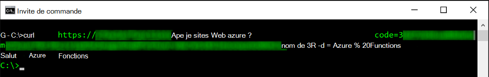
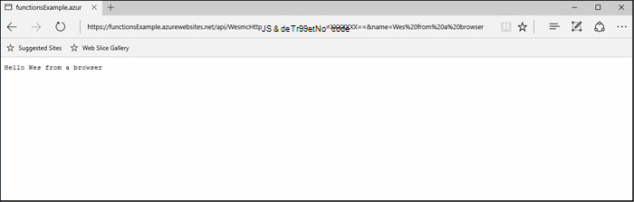
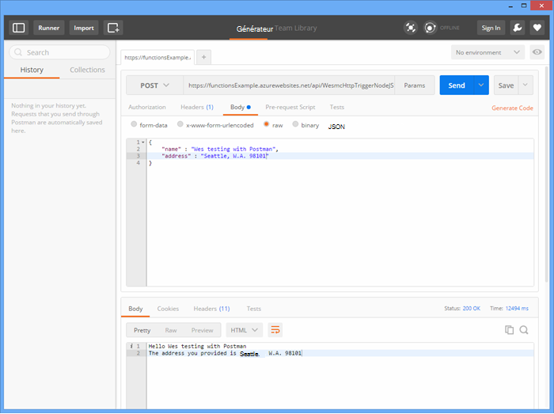
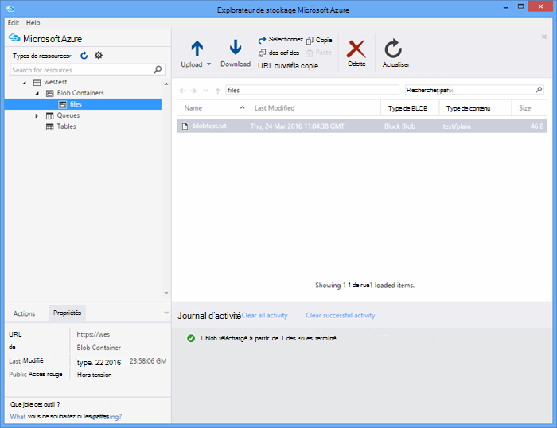

<properties
   pageTitle="Test des fonctions Azure | Microsoft Azure"
   description="Testez vos fonctions Azure à l’aide de Postman, ourlée et Node.js."
   services="functions"
   documentationCenter="na"
   authors="wesmc7777"
   manager="erikre"
   editor=""
   tags=""
   keywords="Azure fonctions, fonctions, traitement de l’événement, webhooks, calcul dynamique, sans serveur architecture, test"/>

<tags
   ms.service="functions"
   ms.devlang="multiple"
   ms.topic="article"
   ms.tgt_pltfrm="multiple"
   ms.workload="na"
   ms.date="08/19/2016"
   ms.author="wesmc"/>

# Test des fonctions Azure

## Vue d’ensemble

Dans ce didacticiel, nous allons découvrir les différentes approches pour les fonctions de test. Nous allons définir une fonction de déclenchement http qui accepte l’entrée d’un paramètre de chaîne de requête ou le corps de la demande. Le code du modèle par défaut **HttpTrigger Node.js fonction** prend en charge une `name` paramètre de chaîne de requête. Vous ajoutez également du code pour prendre en charge ce paramètre avec `address` les informations de l’utilisateur dans le corps de la demande.

## Créer une fonction de test

Pour la plupart de ce didacticiel, nous allons utiliser une version légèrement modifiée du modèle de **Fonction de Nodejs de HttpTrigger** qui est disponible lors de la création d’une nouvelle fonction.  Vous pouvez vérifier la [Création de votre premier didacticiel Azure fonction](functions-create-first-azure-function.md) si vous avez besoin d’aide pour créer une nouvelle fonction.  Choisissez le modèle de **Fonction de Nodejs HttpTrigger** lors de la création de la fonction de test dans le [Portail Azure].

Le modèle de fonction par défaut est essentiellement une fonction hello world qui renvoie le nom du paramètre de chaîne de demande corps ou une requête, `name=<your name>`.  Nous mettrons à jour le code pour vous permettent également de fournir le nom et une adresse en tant que contenu JSON dans le corps de la demande. Puis, la fonction renverra ces arrière au client lorsqu’il est disponible.   

Mise à jour de la fonction avec le code suivant que nous utiliserons pour le test :

    module.exports = function(context, req) {
        context.log("Node.js HTTP trigger function processed a request. RequestUri=%s", req.originalUrl);
        context.log("Request Headers = " + JSON.stringify(req.headers));    
    
        if (req.query.name || (req.body && req.body.name)) {
            if (typeof req.query.name != "undefined") {
                context.log("Name was provided as a query string param..."); 
                ProcessNewUserInformation(context, req.query.name);
            }
            else {
                context.log("Processing user info from request body..."); 
                ProcessNewUserInformation(context, req.body.name, req.body.address);
            }
        }
        else {
            context.res = {
                status: 400,
                body: "Please pass a name on the query string or in the request body"
            };
        }
        context.done();
    };
    
    function ProcessNewUserInformation(context, name, address)
    {    
        context.log("Processing User Information...");            
        context.log("name = " + name);            
        echoString = "Hello " + name;
        
        if (typeof address != "undefined")
        {
            echoString += "\n" + "The address you provided is " + address;
            context.log("address = " + address);            
        }
        
        context.res = {
                // status: 200, /* Defaults to 200 */
                body: echoString
            };
    }

## Une fonction avec des outils de test

### Test bouclé

Souvent lorsque le test de logiciels, il n’est pas nécessaire de les rechercher plus loin que la ligne de commande pour aider à déboguer votre application, ce n’est pas différent des fonctions.

Pour tester la fonction ci-dessus, copiez l' **Url de la fonction** à partir du portail. Il aura la forme suivante : 

    https://<Your Function App>.azurewebsites.net/api/<Your Function Name>?code=<your access code>
    
Il s’agit de l’Url de votre fonction de déclenchement, nous pouvons tester cela à l’aide de la commande cURL sur la ligne de commande pour effectuer une opération d’obtention (`-G` ou `--get`) demande par rapport à notre fonction :

    curl -G https://<Your Function App>.azurewebsites.net/api/<Your Function Name>?code=<your access code>
    
Cet exemple ci-dessus nécessite un paramètre de chaîne de requête qui peut être passé en tant que données (`-d`) dans la commande cURL :

    curl -G https://<Your Function App>.azurewebsites.net/api/<Your Function Name>?code=<your access code> -d name=<Enter a name here>
    
Appuyez sur entrée et vous verrez la sortie de la fonction sur la ligne de commande.

Dans la fenêtre **journaux de** portail, une sortie similaire à ce qui suit est enregistrée lors de l’exécution de la fonction :

    2016-04-05T21:55:09  Welcome, you are now connected to log-streaming service.
    2016-04-05T21:55:30.738 Function started (Id=ae6955da-29db-401a-b706-482fcd1b8f7a)
    2016-04-05T21:55:30.738 Node.js HTTP trigger function processed a request. RequestUri=https://functionsExample.azurewebsites.net/api/HttpTriggerNodeJS1?code=XXXXXXX&name=Azure Functions
    2016-04-05T21:55:30.738 Function completed (Success, Id=ae6955da-29db-401a-b706-482fcd1b8f7a)

### Effectuez un test avec un navigateur

Les fonctions qui ne requièrent pas les paramètres, ou uniquement besoin de paramètres de chaîne de requête, peuvent être testées à l’aide d’un navigateur.

Pour tester la fonction que nous avons définies ci-dessus, copiez l' **Url de la fonction** à partir du portail. Il aura la forme suivante :

    https://<Your Function App>.azurewebsites.net/api/<Your Function Name>?code=<your access code>

Ajouter le `name` paramètre de chaîne de requête, comme suit, à l’aide d’un nom réel de le `<Enter a name here>` espace réservé.

    https://<Your Function App>.azurewebsites.net/api/<Your Function Name>?code=<your access code>&name=<Enter a name here>

Collez l’URL dans votre navigateur et vous devriez recevoir une réponse semblable à la suivante.

Dans la fenêtre **journaux de** portail, une sortie similaire à ce qui suit est enregistrée lors de l’exécution de la fonction :

    2016-03-23T07:34:59  Welcome, you are now connected to log-streaming service.
    2016-03-23T07:35:09.195 Function started (Id=61a8c5a9-5e44-4da0-909d-91d293f20445)
    2016-03-23T07:35:10.338 Node.js HTTP trigger function processed a request. RequestUri=https://functionsExample.azurewebsites.net/api/WesmcHttpTriggerNodeJS1?code=XXXXXXXXXX==&name=Wes from a browser
    2016-03-23T07:35:10.338 Request Headers = {"cache-control":"max-age=0","connection":"Keep-Alive","accept":"text/html","accept-encoding":"gzip","accept-language":"en-US"}
    2016-03-23T07:35:10.338 Name was provided as a query string param.
    2016-03-23T07:35:10.338 Processing User Information...
    2016-03-23T07:35:10.369 Function completed (Success, Id=61a8c5a9-5e44-4da0-909d-91d293f20445)

### Test de Postman

L’outil recommandé pour la plupart de vos fonctions de test est Postman. Pour installer Postman, consultez [Obtenir les Postman](https://www.getpostman.com/). Postman permet de contrôler de nombreux attributs de plus d’une demande HTTP.

> [AZURE.TIP] Utilisez le Client reste dans lequel vous êtes à l’aise. Voici quelques alternatives à Postman :  
> 
> * [Fiddler](http://www.telerik.com/fiddler)  
> * [Patte](https://luckymarmot.com/paw)  

Pour tester la fonction avec un corps de demande dans Postman : 

1. Lancer Postman à partir du bouton **d’applications** dans le coin supérieur gauche de l’angle d’une fenêtre de navigateur Chrome.
2. Votre **Url de la fonction** de copier et coller dans Postman. Il inclut le paramètre de chaîne de requête de code d’accès.
3. Remplacez la méthode HTTP **POST**.
4. Cliquez sur le **corps** > **brut** et ajouter le corps de la demande JSON similaire à la suivante :

        {
            "name" : "Wes testing with Postman",
            "address" : "Seattle, W.A. 98101"
        }

5. Cliquez sur **Envoyer**.

L’image suivante affiche l’exemple de fonction simple écho de test dans ce didacticiel. 

Dans la fenêtre **journaux de** portail, une sortie similaire à ce qui suit est enregistrée lors de l’exécution de la fonction :

    2016-03-23T08:04:51  Welcome, you are now connected to log-streaming service.
    2016-03-23T08:04:57.107 Function started (Id=dc5db8b1-6f1c-4117-b5c4-f6b602d538f7)
    2016-03-23T08:04:57.763 Node.js HTTP trigger function processed a request. RequestUri=https://functions841def78.azurewebsites.net/api/WesmcHttpTriggerNodeJS1?code=XXXXXXXXXX==
    2016-03-23T08:04:57.763 Request Headers = {"cache-control":"no-cache","connection":"Keep-Alive","accept":"*/*","accept-encoding":"gzip","accept-language":"en-US"}
    2016-03-23T08:04:57.763 Processing user info from request body...
    2016-03-23T08:04:57.763 Processing User Information...
    2016-03-23T08:04:57.763 name = Wes testing with Postman
    2016-03-23T08:04:57.763 address = Seattle, W.A. 98101
    2016-03-23T08:04:57.795 Function completed (Success, Id=dc5db8b1-6f1c-4117-b5c4-f6b602d538f7)
    
### Test d’un déclencheur de blob à l’aide d’Explorateur de stockage

Vous pouvez tester une fonction de déclenchement de blob à l’aide de [Microsoft Azure Storage Explorer](http://storageexplorer.com/).

1. Dans le [Portail Azure] pour votre application de fonctions, créer une fonction de déclencheur blob C#, F# ou nœud de nouveau. Définir le chemin d’accès pour contrôler le nom de votre conteneur blob. Par exemple :

        files

2. Cliquez sur le **+** bouton pour sélectionner ou créer le compte de stockage que vous souhaitez utiliser. Puis cliquez sur **créer**.

3. Créez un fichier texte avec le texte suivant et enregistrez-le :

        A text file for blob trigger function testing.

4. Exécuter [Microsoft Azure Storage Explorer](http://storageexplorer.com/) et connectez-vous au conteneur blob dans le compte de stockage surveillé.

5. Cliquez sur le bouton **charger** et télécharger le fichier texte.

    

    Le code de fonction de déclenchement de blob par défaut signale le traitement de l’objet blob dans les journaux :

        2016-03-24T11:30:10  Welcome, you are now connected to log-streaming service.
        2016-03-24T11:30:34.472 Function started (Id=739ebc07-ff9e-4ec4-a444-e479cec2e460)
        2016-03-24T11:30:34.472 C# Blob trigger function processed: A text file for blob trigger function testing.
        2016-03-24T11:30:34.472 Function completed (Success, Id=739ebc07-ff9e-4ec4-a444-e479cec2e460)

## Test d’une fonction à l’intérieur de fonctions

### Test avec le portail de fonctions bouton Exécuter

Le portail fournit un bouton **exécuter** qui vous permet de procéder à des tests limités. Vous pouvez fournir un corps de demande l’aide du bouton d’exécution mais ne peut pas fournir les paramètres de chaîne de requête ou de mettre à jour les en-têtes de demande.

Tester la fonction de déclenchement HTTP créé plus haut en ajoutant une chaîne JSON semblable au suivant dans le champ **corps de requête** , puis cliquez sur le bouton **exécuter** .

    {
        "name" : "Wes testing Run button",
        "address" : "USA"
    } 

Dans la fenêtre **journaux de** portail, une sortie similaire à ce qui suit est enregistrée lors de l’exécution de la fonction :

    2016-03-23T08:03:12  Welcome, you are now connected to log-streaming service.
    2016-03-23T08:03:17.357 Function started (Id=753a01b0-45a8-4125-a030-3ad543a89409)
    2016-03-23T08:03:18.697 Node.js HTTP trigger function processed a request. RequestUri=https://functions841def78.azurewebsites.net/api/wesmchttptriggernodejs1
    2016-03-23T08:03:18.697 Request Headers = {"connection":"Keep-Alive","accept":"*/*","accept-encoding":"gzip","accept-language":"en-US"}
    2016-03-23T08:03:18.697 Processing user info from request body...
    2016-03-23T08:03:18.697 Processing User Information...
    2016-03-23T08:03:18.697 name = Wes testing Run button
    2016-03-23T08:03:18.697 address = USA
    2016-03-23T08:03:18.744 Function completed (Success, Id=753a01b0-45a8-4125-a030-3ad543a89409)

### Test avec un déclencheur de minuterie

Certaines fonctions, ne peut pas être réellement testée avec les outils mentionnés précédemment. Par exemple, une file d’attente déclencheur fonction qui s’exécute lorsqu’un message est déposé dans la [File d’attente le stockage Azure](../storage/storage-dotnet-how-to-use-queues.md). Vous pouvez toujours écrire du code pour supprimer un message dans la file d’attente et un exemple de ceci dans un projet console est fourni ci-dessous. Toutefois, est une autre approche, que vous pouvez utiliser pour tester des fonctions directement.  

Vous pouvez utiliser un déclencheur de minuteur configuré avec une file d’attente de liaison de sortie. Ce code de déclenchement du minuteur peut ensuite écrire les messages de test à la file d’attente. Cette section vous guidera à travers via un exemple. 

Pour plus d’informations sur l’utilisation des liaisons avec les fonctions d’Azure, consultez la [référence du développeur les fonctions Azure](functions-reference.md). 

#### Créer déclencheur de file d’attente de test

Pour illustrer cette approche, nous allez d’abord créer une fonction de déclenchement de file d’attente que nous voulons tester pour une file d’attente nommée `queue-newusers`. Cette fonction traite les informations de nom et l’adresse d’un nouvel utilisateur abandonné dans le stockage de la file d’attente Azure. 

> [AZURE.NOTE] Si vous utilisez un nom de file d’attente différente, vérifiez que le nom que vous utilisez est conforme aux règles [d’affectation de noms des files d’attente et les métadonnées](https://msdn.microsoft.com/library/dd179349.aspx) .  Sinon, vous obtiendrez un code d’état HTTP 400 : demande incorrecte. 

1. Dans le [Portail Azure] pour votre application de fonctions, cliquez sur **Nouvelle fonction** > **QueueTrigger - C#**.
2. Entrez le nom de la file d’attente pour être surveillé par la fonction de file d’attente 

        queue-newusers 

3. Cliquez sur le **+** (Ajouter) un bouton pour sélectionner ou créer le compte de stockage que vous souhaitez utiliser. Puis cliquez sur **créer**.
4. Laissez cette fenêtre de navigateur portail ouverte afin de surveiller les entrées du journal pour le code de modèle de fonction de file d’attente par défaut.

#### Créer un déclencheur de minuteur pour supprimer un message dans la file d’attente

1. Ouvrez le [Portail Azure] dans une nouvelle fenêtre de navigateur et accédez à votre application de la fonction.
2. Cliquez sur **nouvelle fonction** > **TimerTrigger - C#**. Saisissez une expression cron pour définir la fréquence à laquelle le code du minuteur s’exécutera à votre fonction de file d’attente de test. Puis cliquez sur **créer**. Si vous souhaitez que le test s’exécute toutes les 30 secondes, vous pouvez utiliser [l’expression CRON](https://wikipedia.org/wiki/Cron#CRON_expression)suivante :

        */30 * * * * *

2. Cliquez sur l’onglet **intégration** de votre nouveau déclencheur de minuterie.
3. Sous **sortie**, cliquez sur le bouton **+ nouvelle sortie** . Puis cliquez sur **file d’attente** et le bouton **Sélectionner** .
4. Notez que le nom que vous utilisez pour l' **objet message de file d’attente** que vous utiliserez dans le code de la fonction timer.

        myQueue

4. Entrez le nom de la file d’attente où le message est envoyé : 

        queue-newusers 

3. Cliquez sur le **+** (Ajouter) un bouton pour sélectionner le compte de stockage que vous avez utilisé précédemment avec le déclencheur de la file d’attente. Puis cliquez sur **Enregistrer**.
4. Cliquez sur l’onglet **développer** pour votre déclencheur de minuterie.
5. Dans la mesure où vous avez utilisé le même nom d’objet file d’attente message ci-dessus, vous pouvez utiliser le code suivant pour la fonction timer en C#. Puis cliquez sur **Enregistrer**

        using System;
        
        public static void Run(TimerInfo myTimer, out String myQueue, TraceWriter log)
        {
            String newUser = 
            "{\"name\":\"User testing from C# timer function\",\"address\":\"XYZ\"}";
        
            log.Verbose($"C# Timer trigger function executed at: {DateTime.Now}");   
            log.Verbose($"{newUser}");   
            
            myQueue = newUser;
        }

À ce stade, la fonction temporisateur C# exécutera toutes les 30 secondes si vous avez utilisé l’exemple d’expression cron. Les journaux de la fonction timer signale chaque exécution :

    2016-03-24T10:27:02  Welcome, you are now connected to log-streaming service.
    2016-03-24T10:27:30.004 Function started (Id=04061790-974f-4043-b851-48bd4ac424d1)
    2016-03-24T10:27:30.004 C# Timer trigger function executed at: 3/24/2016 10:27:30 AM
    2016-03-24T10:27:30.004 {"name":"User testing from C# timer function","address":"XYZ"}
    2016-03-24T10:27:30.004 Function completed (Success, Id=04061790-974f-4043-b851-48bd4ac424d1)

Dans la fenêtre du navigateur pour la fonction de file d’attente, vous verrez le chaque message en cours de traitement :

    2016-03-24T10:27:06  Welcome, you are now connected to log-streaming service.
    2016-03-24T10:27:30.607 Function started (Id=e304450c-ff48-44dc-ba2e-1df7209a9d22)
    2016-03-24T10:27:30.607 C# Queue trigger function processed: {"name":"User testing from C# timer function","address":"XYZ"}
    2016-03-24T10:27:30.607 Function completed (Success, Id=e304450c-ff48-44dc-ba2e-1df7209a9d22)
    
## Test d’une fonction avec Code

### Une fonction de déclenchement HTTP avec le Code de test : Node.js

Node.js code vous permet d’exécuter une demande http pour tester votre fonction Azure. 

Veillez à définir :

- La `host` dans les options de la demande à l’hôte d’application de fonction
- Le nom de votre fonction dans le `path`.
- Votre code d’accès (`<your code>`) dans le `path`.

Exemple de code :

    var http = require("http");
    
    var nameQueryString = "name=Wes%20Query%20String%20Test%20From%20Node.js";
    
    var nameBodyJSON = {
        name : "Wes testing with Node.JS code",
        address : "Dallas, T.X. 75201"
    };
    
    var bodyString = JSON.stringify(nameBodyJSON);
    
    var options = {
      host: "functions841def78.azurewebsites.net",
      //path: "/api/HttpTriggerNodeJS2?code=sc1wt62opn7k9buhrm8jpds4ikxvvj42m5ojdt0p91lz5jnhfr2c74ipoujyq26wab3wk5gkfbt9&" + nameQueryString,
      path: "/api/HttpTriggerNodeJS2?code=sc1wt62opn7k9buhrm8jpds4ikxvvj42m5ojdt0p91lz5jnhfr2c74ipoujyq26wab3wk5gkfbt9",
      method: "POST",
      headers : {
          "Content-Type":"application/json",
          "Content-Length": Buffer.byteLength(bodyString)
        }    
    };
    
    callback = function(response) {
      var str = ""
      response.on("data", function (chunk) {
        str += chunk;
      });
    
      response.on("end", function () {
        console.log(str);
      });
    }
    
    var req = http.request(options, callback);
    console.log("*** Sending name and address in body ***");
    console.log(bodyString);
    req.end(bodyString);

Sortie :

    C:\Users\Wesley\testing\Node.js>node testHttpTriggerExample.js
    *** Sending name and address in body ***
    {"name" : "Wes testing with Node.JS code","address" : "Dallas, T.X. 75201"}
    Hello Wes testing with Node.JS code
    The address you provided is Dallas, T.X. 75201
        
Dans la fenêtre **journaux de** portail, une sortie similaire à ce qui suit est enregistrée lors de l’exécution de la fonction :

    2016-03-23T08:08:55  Welcome, you are now connected to log-streaming service.
    2016-03-23T08:08:59.736 Function started (Id=607b891c-08a1-427f-910c-af64ae4f7f9c)
    2016-03-23T08:09:01.153 Node.js HTTP trigger function processed a request. RequestUri=http://functionsExample.azurewebsites.net/api/WesmcHttpTriggerNodeJS1/?code=XXXXXXXXXX==
    2016-03-23T08:09:01.153 Request Headers = {"connection":"Keep-Alive","host":"functionsExample.azurewebsites.net"}
    2016-03-23T08:09:01.153 Name not provided as query string param. Checking body...
    2016-03-23T08:09:01.153 Request Body Type = object
    2016-03-23T08:09:01.153 Request Body = [object Object]
    2016-03-23T08:09:01.153 Processing User Information...
    2016-03-23T08:09:01.215 Function completed (Success, Id=607b891c-08a1-427f-910c-af64ae4f7f9c)
    

### Une fonction de déclenchement de file d’attente avec le Code de test : C# #

Nous avons pu tester un déclencheur de la file d’attente à l’aide de code pour déplacer un message dans la file d’attente. L’exemple de code suivant est basé sur le code C# présenté dans le didacticiel [mise en route avec stockage de la file d’attente d’Azure](../storage/storage-dotnet-how-to-use-queues.md) . Code pour d’autres langues est également disponible à partir de ce lien.

Pour tester ce code dans une application de console que vous devez :

- [Configurer votre chaîne de connexion de stockage dans le fichier app.config](../storage/storage-dotnet-how-to-use-queues.md#setup-a-storage-connection-string).
- Ce code accepte le nom et l’adresse d’un nouvel utilisateur en tant qu’arguments de ligne de commande lors de l’exécution. Passez un `name` et `address` en tant que paramètres à l’application. Par exemple,`C:\myQueueConsoleApp\test.exe "Wes testing queues" "in a console app"`

Code de l’exemple C# :

    static void Main(string[] args)
    {
        string name = null;
        string address = null;
        string queueName = "queue-newusers";
        string JSON = null;

        if (args.Length > 0)
        {
            name = args[0];
        }
        if (args.Length > 1)
        {
            address = args[1];
        }

        // Retrieve storage account from connection string
        CloudStorageAccount storageAccount = CloudStorageAccount.Parse(ConfigurationManager.AppSettings["StorageConnectionString"]);

        // Create the queue client
        CloudQueueClient queueClient = storageAccount.CreateCloudQueueClient();

        // Retrieve a reference to a queue
        CloudQueue queue = queueClient.GetQueueReference(queueName);

        // Create the queue if it doesn't already exist
        queue.CreateIfNotExists();

        // Create a message and add it to the queue.
        if (name != null)
        {
            if (address != null)
                JSON = String.Format("{{\"name\":\"{0}\",\"address\":\"{1}\"}}", name, address);
            else
                JSON = String.Format("{{\"name\":\"{0}\"}}", name);
        }

        Console.WriteLine("Adding message to " + queueName + "...");
        Console.WriteLine(JSON);

        CloudQueueMessage message = new CloudQueueMessage(JSON);
        queue.AddMessage(message);
    }

Dans la fenêtre du navigateur pour la fonction de file d’attente, vous verrez le chaque message en cours de traitement :

    2016-03-24T10:27:06  Welcome, you are now connected to log-streaming service.
    2016-03-24T10:27:30.607 Function started (Id=e304450c-ff48-44dc-ba2e-1df7209a9d22)
    2016-03-24T10:27:30.607 C# Queue trigger function processed: {"name":"Wes testing queues","address":"in a console app"}
    2016-03-24T10:27:30.607 Function completed (Success, Id=e304450c-ff48-44dc-ba2e-1df7209a9d22)

<!-- URLs. -->

[Azure Portal]: https://portal.azure.com
