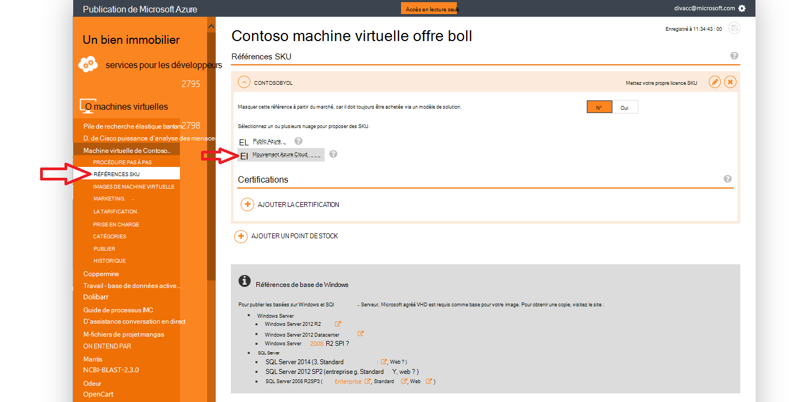
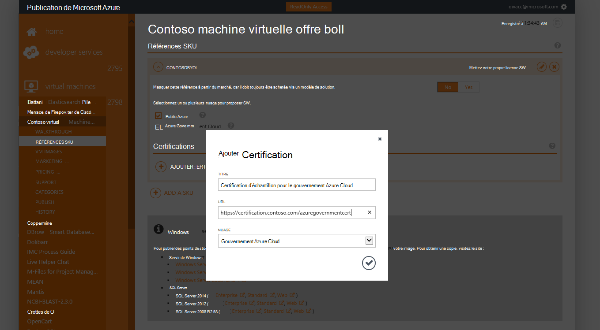
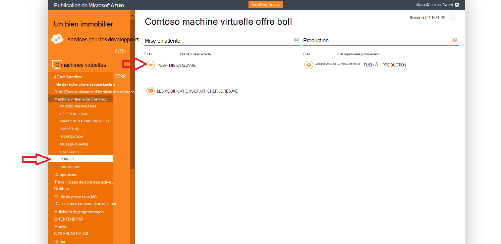
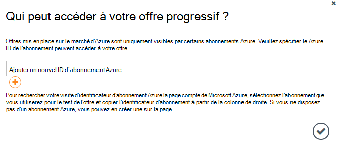
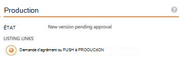

<properties
            pageTitle="Documentation de gouvernement Azure | Microsoft Azure"
            description="Cela fournit une comparaison des fonctionnalités et des conseils sur le développement d’applications pour Azure gouvernement."
            services="Azure-Government"
            cloud="gov"
            documentationCenter=""
            authors="tsingh"
            manager="asimm"
            editor=""/>
 
<tags    ms.service="multiple"
            ms.devlang="na"
            ms.topic="article"
            ms.tgt_pltfrm="na"
            ms.workload="azure-government"
            ms.date="10/20/2016"
            ms.author="zakramer;tsingh;divacc"/> 

# Gouvernement Azure Marketplace
Pour les partenaires intéressés par la publication de vos offres sur le marché d’Azure pour gouvernement, rechercher les détails ci-dessous.

## Publication
>[AZURE.NOTE] Si vous n’êtes pas un partenaire Azure certifié Marketplace existant, suivez les étapes [ici](../marketplace-publishing/marketplace-publishing-getting-started.md) avant de continuer.

### Étape 1  
Ouvrez une session sur [https://publish.windowsazure.com](https://publish.windowsazure.com)

### Étape 2
Cliquez sur l’offre que vous souhaitez publier

### Étape 3
Cliquez sur **références** , puis cliquez sur la zone de nuage de gouvernement Azure

>[AZURE.NOTE] Uniquement les références de mettre votre propre licence (BYOL) sont pris en charge.  Cette option n’est pas disponible pour les éditions de paiement (retenues à la source).

### Étape 4
Cliquez sur le + lien Ajouter Certification pour ajouter des liens à des certifications pour votre offre.

### Étape 5
Demande d’un compte d’évaluation dans le cloud de Microsoft Azure gouvernement d’activation vous permet de tester votre image dans le portail de publication : [https://azuregov.microsoft.com/trial/azuregovtrial](https://azuregov.microsoft.com/trial/azuregovtrial)

Vos droits en tant que partenaire qui sert aux États-Unis fédérales, national, locales ou tribales auprès des entités sont vérifiés et confirmation sera fournie par courrier électronique.  Votre compte d’évaluation seront disponibles est dans les 3 à 5 jours ouvrables.

### Étape 6
Cliquez sur Publier, puis cliquez sur Push mis en œuvre. 

Vous devrez entrer un abonnement de liste d’autorisation qui a accès à l’intermédiaire offre. Permet d’entrer l’ID d’abonnement à partir de votre compte d’évaluation Azure gouvernement récemment acquise.

### Étape 7
Une fois que l’offre est transférée avec succès, vous pouvez tester votre image en vous connectant à [https://portal.azure.us](https://portal.azure.us) à l’aide de votre compte d’évaluation du gouvernement Azure.

### Étape 8
Une fois que vous avez validé votre image à l’aide de l’abonnement d’évaluation, vous pouvez rendre l’offre disponible direct en cliquant sur Publier et demande d’approbation pour accéder à la production. 

## Étapes suivantes

Pour des informations supplémentaires et des mises à jour, abonnez-vous au [Blog de gouvernement Microsoft Azure](https://blogs.msdn.microsoft.com/azuregov/).
