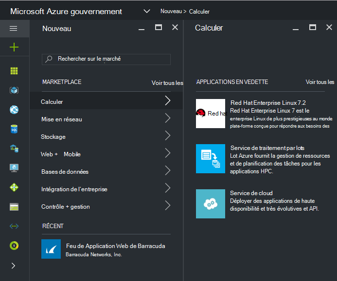
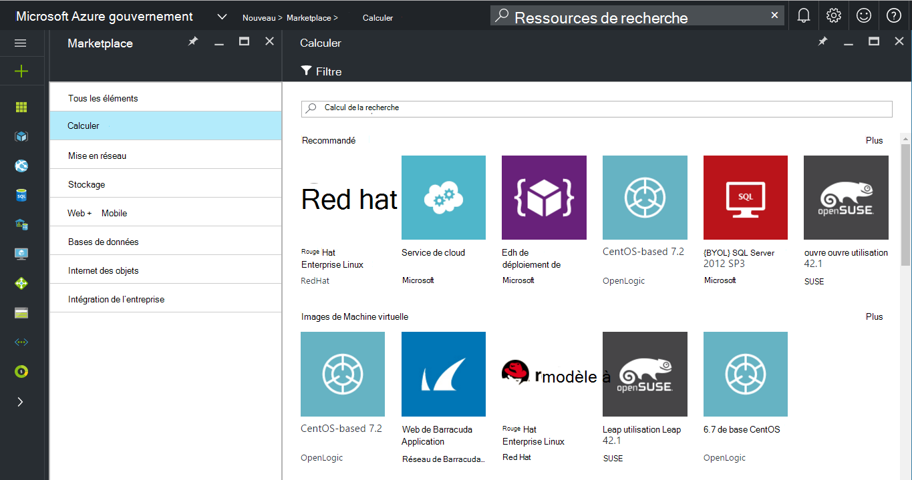
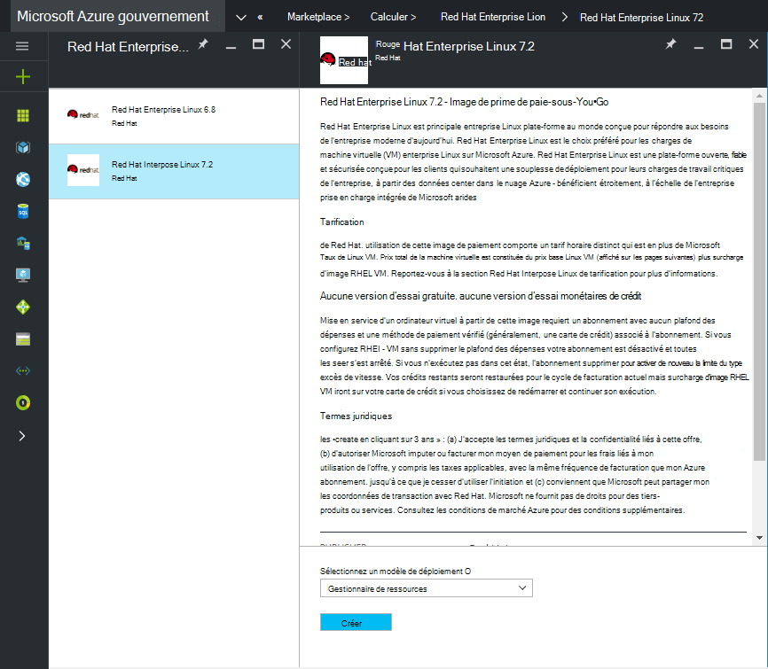
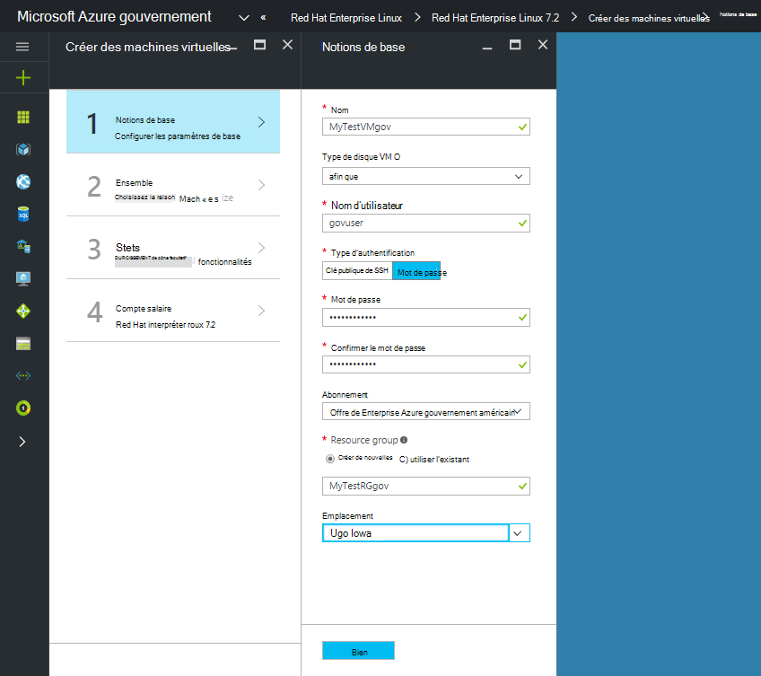
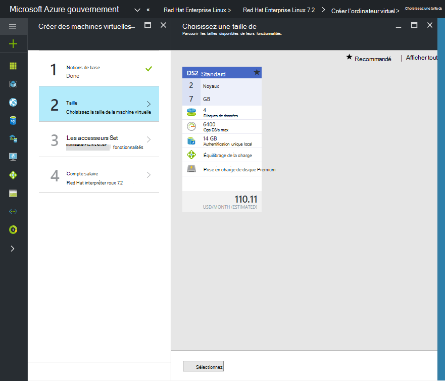

 <properties
    pageTitle="Documentation de gouvernement Azure | Microsoft Azure"
    description="Cela fournit une comparaison des fonctionnalités et des conseils sur le développement d’applications pour Azure gouvernement."
    services="Azure-Government"
    cloud="gov"
    documentationCenter=""
    authors="VybavaRamadoss"
    manager="asimm"
    editor=""/>

<tags   ms.service="multiple"
    ms.devlang="na"
    ms.topic="article"
    ms.tgt_pltfrm="na"
    ms.workload="azure-government"
    ms.date="10/20/2016"
    ms.author="zakramer;vybavar"/>

# Azure Marketplace pour le gouvernement
Le marché Azure est disponible pour Azure gouvernement avec une liste à jour des images à partir de nos éditeurs marketplace. 

## Variations
Voici quelques considérations lors de l’utilisation d’Azure Marketplace pour les administrations publiques :

- Seules les images de mettre votre propre licence (BYOL) sont disponibles. Vous ne pouvez pas accéder à toutes les images nécessitant une transaction d’achat par le biais de Azure Marketplace
- Seul un sous-ensemble des images est actuellement disponible que sur le marché public. Vous trouverez la liste des images disponibles [ici](../azure-government-image-gallery.md) 
- Avant mise en service d’une image, votre administrateur d’entreprise doit permettre des achats Marketplace pour votre abonnement Azure
  - Ouvrez une session sur le portail en tant qu’administrateur de l’entreprise
  - Accédez à *Gérer*
  - Sous *Détails de l’inscription* , cliquez sur l’icône crayon en regard de la ligne de facturation *Azure Marketplace*
  - Activer/désactiver *Activé/désactivé* selon le cas
  - Cliquez sur *Enregistrer*

>[AZURE.NOTE] Si vous êtes intéressé par la fabrication vos images disponibles dans Azure gouvernement, veuillez vous reporter aux [instructions d’intégration partenaire](documentation-government-manage-marketplace-partners.md) pour plus d’informations.

### Étape 1
Lancement sur le marché

  

### Étape 2
Parcourir les différents produits pour trouver celle de droite.

L’éditeur de marché fournit une liste des certifications dans le cadre de la description de produit pour vous aider à faire le bon choix. 

### Étape 3
Choisir une product\image

### Étape 4
Lancer le flux de la créer et entrer les paramètres requis pour le déploiement

>[AZURE.NOTE] Dans la liste déroulante emplacement, seuls les emplacements de gouvernement d’Azure sont visibles

### Étape 5
Observez la tarification

### Étape 6
Effectuez toutes les étapes, puis cliquez sur Ok pour démarrer le processus de déploiement

## Étapes suivantes

Pour des informations supplémentaires et des mises à jour, abonnez-vous au [Blog de gouvernement Microsoft Azure](https://blogs.msdn.microsoft.com/azuregov/).
