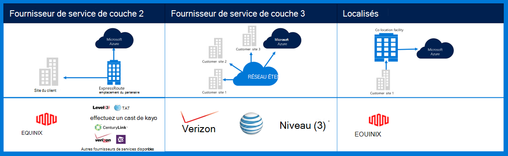
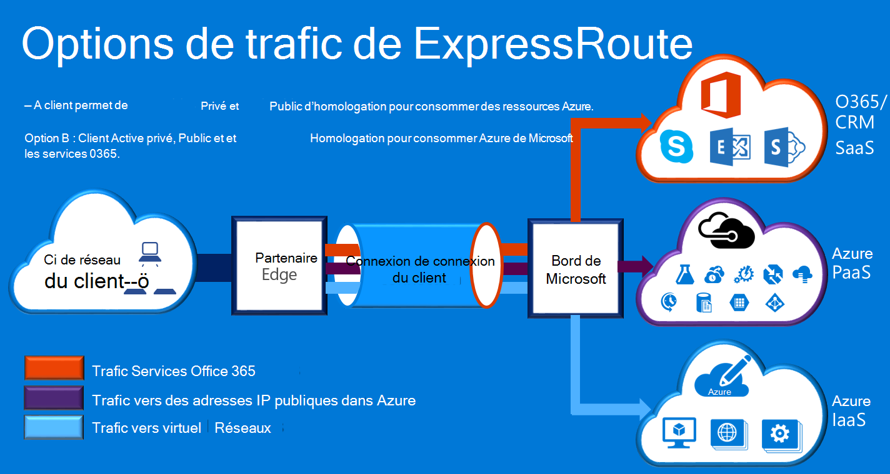

<properties
    pageTitle="Documentation de Governmenmt Azure | Microsoft Azure"
    description="Cela fournit une comparaison des fonctionnalités et des conseils pour une connectivité privée e gouvernement"
    services="Azure-Government"
    cloud="gov" 
    documentationCenter=""
    authors="ryansoc"
    manager="zakramer"
    editor=""/>

<tags
    ms.service="multiple"
    ms.devlang="na"
    ms.topic="article"
    ms.tgt_pltfrm="na"
    ms.workload="azure-government"
    ms.date="09/28/2016"
    ms.author="ryansoc"/>

#  Mise en réseau du gouvernement Azure

##  ExpressRoute (connectivité privée)

ExpressRoute est généralement disponible dans Azure. Pour plus d’informations (y compris les partenaires et homologation des emplacements), consultez la <a href="https://azure.microsoft.com/en-us/documentation/services/expressroute/">documentation de public ExpressRoute </a>.

###  Variations

ExpressRoute est généralement disponible (GA) dans Azure. 

- Les clients du gouvernement se connectent à une capacité physiquement isolée via une connexion ExpressRoute du gouvernement d’Azure (Gov) (ER) dédié

- Gov Azure assure une disponibilité accrue et durabilité en tirant parti de plusieurs paires de région trouve un minimum de 500 miles séparés 

- Par défaut, toute la connectivité Azure Gov ER est configuré actif redondants avec prise en charge de rupture et offre une capacité de circuit jusqu'à 10 G (plus faible est de 50 Mo)

- Les emplacements Gov ER Azure fournissent des voies optimisés (sauts le plus court, faible temps de latence, hautes performances, etc.) pour les clients et les régions geo redondant Azure Gov

- La connexion privée Azure Gov ER n’utilise pas, de traverser ou dépendent d’Internet

- Azure Gov physique et logique de l’infrastructure est physiquement dédié séparé et l’accès est restreint aux personnes des États-Unis

- Microsoft possède et opère toutes les infrastructure de fibre optique entre régions de Gov Azure et d’Azure Gov ER atteindre-Me emplacements

- Azure Gov ER assure la connectivité aux services de cloud Microsoft Azure, O365 et CRM

### Considérations relatives à la

Il existe deux services de base qui fournissent la connectivité réseau privé dans Azure gouvernement : VPN (-sites pour une organisation typique) et ExpressRoute.

ExpressRoute Azure permet de créer des connexions entre les centres de données Azure gouvernement et votre infrastructure sur site ou dans un environnement de colocation. ExpressRoute les connexions ne passent pas sur l’Internet public — ils offrent plus de fiabilité, de vitesses plus rapides et de latences inférieurs à des connexions Internet classiques. Dans certains cas, à l’aide de connexions de ExpressRoute pour transférer des données entre sur les systèmes de site et des rendements Azure significatifs économiques.   

Avec ExpressRoute, vous établissez des connexions vers Azure à un emplacement de ExpressRoute (par exemple, un site de fournisseur Exchange), ou vous connecter directement pour Azure à partir de votre réseau WAN existant (comme un multiprotocole étiquette commutation VPN (MPLS), fourni par un fournisseur de services réseau).

    

Pour les services de réseau prendre en charge des solutions et applications de client de gouvernement d’Azure, il est fortement recommandé que ExpressRoute (connectivité privée) est mis en œuvre pour vous connecter au gouvernement d’Azure. Si les connexions VPN sont utilisées, doivent être considérés :

- Les clients doivent contacter leur autorisation officielle/de l’organisme pour déterminer si la connectivité privée ou un autre mécanisme de connexion sécurisée est requise et à identifier des restrictions supplémentaires à prendre en compte.

- Les clients doivent décider à imposer que la connexion VPN de site à site est acheminé à travers une zone privée de connectivité.

- Les clients doivent obtenir un circuit MPLS ou VPN auprès d’un fournisseur d’accès sous licence connectivité privé.

Tous les clients qui utilisent une architecture de connectivité privé doivent valider qu’une implémentation appropriée est établie et maintenue pour la connexion client à passerelle réseau/Internet (GN / I) bord du point de démarcation de routeur pour Azure gouvernement. De même, votre organisation doit établir la connectivité réseau entre votre environnement sur site et d’un point de démarcation de routeur de côté passerelle réseau/client (GN/C) pour Azure gouvernement.

## Étapes suivantes

Pour des informations supplémentaires et des mises à jour, veuillez vous inscrire à la <a href="https://blogs.msdn.microsoft.com/azuregov/">Microsoft Azure gouvernement Blog.</a>
